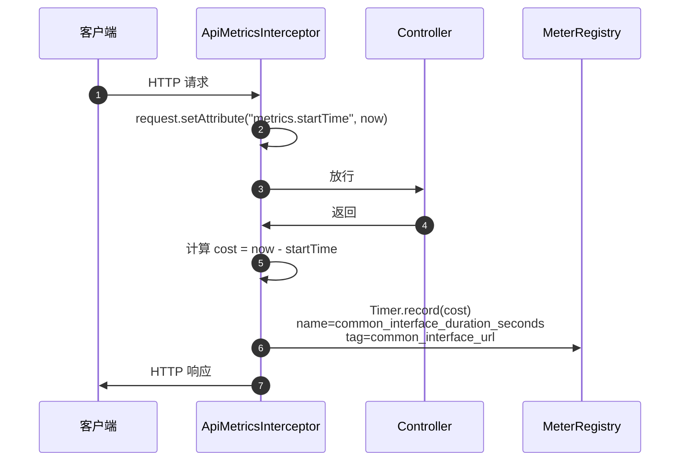
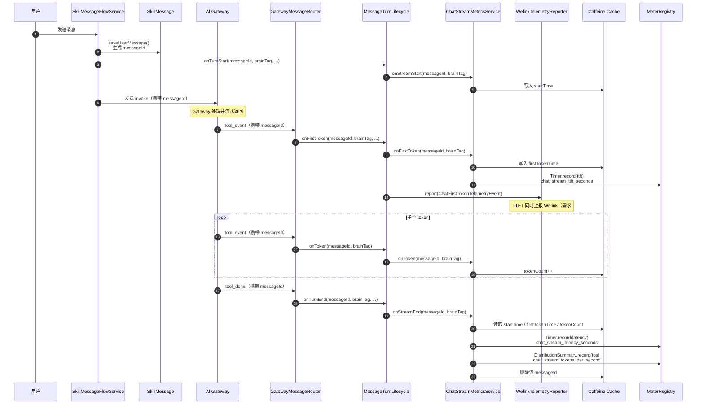
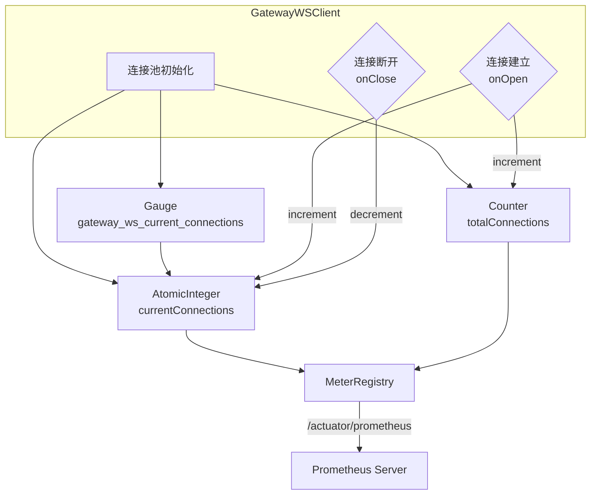
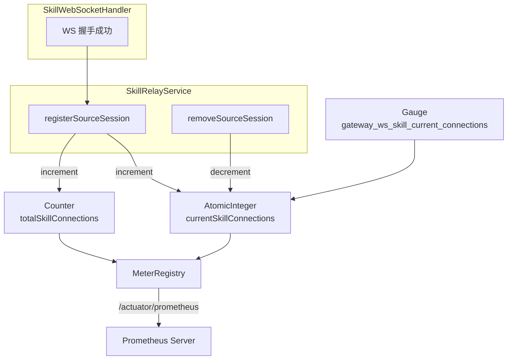

# 运维埋码 — 需求分析与设计

> 基于 `docs/human-docs/001运维埋码.md`
> 日期：2026-06-08（初稿）/ 2026-06-18（补齐 6 个缺口）
> 状态：设计阶段

---

## 一、背景与目标

当前 skill-server 和 ai-gateway 均**未接入 Prometheus/Micrometer 监控体系**。skill-server 仅有一套 WeLink 事件上报（`telemetry.welink`），用于 chat 对话的请求/回复事件追踪；ai-gateway 仅有手动 `AtomicLong` 计数器 + 60 秒日志输出。

本次需求目标：为 skill-server 和 ai-gateway 接入 **Prometheus（普罗米修斯）指标上报**，覆盖第三方接口调用、对外 API 调用、流式对话效率、WS 连接数四个维度。

---

## 二、现状梳理

### 2.1 skill-server 现状

| 维度 | 现状 |
|------|------|
| **Prometheus/Micrometer** | 无依赖、无配置、无端点 |
| **Actuator** | 无依赖、无 `/actuator/prometheus` 端点 |
| **现有 telemetry** | `telemetry.welink` 体系（WeLink 事件上报），含 ChatRequest/ChatReply 两个事件 |
| **现有 recordApiCall** | 不存在 |
| **现有 API interceptor** | 仅 `MdcRequestInterceptor`（MDC 日志）和 `ImTokenAuthInterceptor`（认证），无统计拦截器 |
| **WS 客户端** | `GatewayWSClient`（连接池，默认 8 连接），无连接数指标 |
| **外部调用** | `GatewayRelayService`、`ImMessageService`、`AssistantInfoService` 等，仅通过 `LogTimer` 记录耗时日志 |
| **Spring Boot 版本** | 3.4.6 |

### 2.2 ai-gateway 现状

| 维度 | 现状 |
|------|------|
| **Prometheus/Micrometer** | 无依赖、无配置、无端点 |
| **Actuator** | 无依赖 |
| **现有 metrics** | 手动 `AtomicLong` 计数器（relayLocal/relayPubsub/relayPending/routingHit/routingRedisL2），60 秒日志输出 |
| **WS Server** | `/ws/agent`（Agent 端）+ `/ws/skill`（Skill Server 端），含完整握手认证 |
| **连接统计** | `EventRelayService.getActiveSessionCount()`、`SkillRelayService.getActiveSourceConnectionCount()` |
| **Spring Boot 版本** | 3.4.6 |

---

## 三、技术选型

| 组件 | 选型 | 理由 |
|------|------|------|
| **指标采集** | Micrometer | Spring Boot 3.x 原生集成，标准 facade |
| **指标暴露** | Prometheus Registry | 通过 `/actuator/prometheus` 端点暴露 |
| **端点** | Spring Boot Actuator | 标准 `/actuator/prometheus`，无需自建 |
| **WS 连接数** | Micrometer Gauge | 实时反映当前值，适合连接数场景 |
| **API 调用** | Micrometer Counter + Timer | 标准调用次数 + 耗时分布 |
| **流式效率** | Micrometer Timer + DistributionSummary | TTFT/TPOT/Latency 用 Timer，token/s 用 DistributionSummary |

---

## 四、skill-server 详细设计

### 4.1 依赖变更

`pom.xml` 新增：

```xml
<!-- Actuator + Prometheus -->
<dependency>
    <groupId>org.springframework.boot</groupId>
    <artifactId>spring-boot-starter-actuator</artifactId>
</dependency>
<dependency>
    <groupId>io.micrometer</groupId>
    <artifactId>micrometer-registry-prometheus</artifactId>
</dependency>
```

### 4.2 配置变更

`application.yml` 新增：

```yaml
management:
  endpoints:
    web:
      exposure:
        include: health,prometheus
      base-path: /actuator
  metrics:
    export:
      prometheus:
        enabled: true
    tags:
      application: skill-server
```

### 4.3 需求 1：第三方接口调用情况埋码

#### 4.3.1 枚举定义

新增 `MetricServiceEnum` 枚举，位于 `com.opencode.cui.skill.telemetry.metrics` 包。**按具体接口枚举（非服务粗粒度）**，仅枚举当前实际调用的接口；未来接入 contact / search / auth / card / tiny / onebox / assistant_plaza 等接口时再追加对应枚举值。

**IM（3 个端点）**：

| 枚举值 | id | comment |
|--------|-----|---------|
| IM_GROUP_CHAT | im_group_chat | 群聊消息发送 |
| IM_DIRECT_CHAT | im_direct_chat | 单聊消息发送 |
| IM_MESSAGE_SEND | im_message_send | IM 消息发送 |

**Gateway（6 个端点：3 REST + 3 WS）**：

| 枚举值 | id | comment |
|--------|-----|---------|
| GATEWAY_AGENTS_LIST | gateway_agents_list | 查询在线 Agent 列表 |
| GATEWAY_AGENTS_BY_AK | gateway_agents_by_ak | 按 AK 查询 Agent |
| GATEWAY_AGENT_AVAILABILITY | gateway_agent_availability | 查询 Agent 可及性 |
| GATEWAY_WS_INVOKE | gateway_ws_invoke | Gateway WS invoke 指令 |
| GATEWAY_WS_ROUTE_CONFIRM | gateway_ws_route_confirm | Gateway WS 路由确认 |
| GATEWAY_WS_ROUTE_REJECT | gateway_ws_route_reject | Gateway WS 路由拒绝 |

**业务中心（3 个端点）**：

| 枚举值 | id | comment |
|--------|-----|---------|
| BUSINESS_CENTER_ASSISTANT_INFO | business_center_assistant_info | 查询助手信息 |
| BUSINESS_CENTER_INSTANCE_QUERY | business_center_instance_query | 查询助手实例 |
| BUSINESS_CENTER_PERSONA_QUERY | business_center_persona_query | 查询 Persona |

**埋码上报（1 个端点）**：

| 枚举值 | id | comment |
|--------|-----|---------|
| TELEMETRY_WELINK_UPLOAD | telemetry_welink_upload | WeLink 埋码上报 |

> **占位枚举说明**：需求 #2 列出的 contact / search / auth / card / tiny / onebox / assistant_plaza 当前代码无直接调用（assistant_plaza 仅构建 payload，HTTP 由 gateway 发出），暂不加入枚举，待真正接入时追加。

#### 4.3.2 recordApiCall 方法

新增 `ApiCallMetricsService`，注入 `MeterRegistry`，提供：

```java
public void recordApiCall(MetricServiceEnum service, String url, boolean success, long durationMs)
```

**URL 模板化规则（需求 #4）**：
- 调用方传**模板化 URL**（如 `/v1/messages/{messageId}`），动态路径段用 `{xxx}` 表示
- `recordApiCall` 内部**去除 query 参数**：截掉 `?` 及之后部分，只保留 path
- 模板原样保留，不做正则替换、不检测 ID 段

```java
// 去 query 参数
String cleanUrl = url;
int q = cleanUrl.indexOf('?');
if (q >= 0) {
    cleanUrl = cleanUrl.substring(0, q);
}
```

内部实现：
1. 去 query 参数，得到 `cleanUrl`
2. 定义 3 个 tag：`serviceId`、`serviceComment`、`url`（值为 `cleanUrl`）
3. Counter `external_api_call_total` — 总调用次数
4. Counter `external_api_call_success_total` / `external_api_call_failure_total` — 成功/失败次数
5. Timer `external_api_call_duration_seconds` — 耗时（`TimeUnit.MILLISECONDS` 传入，Micrometer 自动转秒）

```java
public void recordApiCall(MetricServiceEnum service, String url, boolean success, long durationMs) {
    String cleanUrl = url;
    int q = cleanUrl.indexOf('?');
    if (q >= 0) {
        cleanUrl = cleanUrl.substring(0, q);
    }
    Tags tags = Tags.of(
        "serviceId", service.getId(),
        "serviceComment", service.getComment(),
        "url", cleanUrl
    );
    meterRegistry.counter("external_api_call_total", tags).increment();
    meterRegistry.counter(success
        ? "external_api_call_success_total"
        : "external_api_call_failure_total", tags).increment();
    meterRegistry.timer("external_api_call_duration_seconds", tags)
        .record(durationMs, TimeUnit.MILLISECONDS);
    // 失败时同步写 ERROR 日志，与慧眼告警语法对齐（见 §4.7）
    if (!success) {
        log.error("[EXT_CALL] {} failed: durationMs={}", service.getId(), durationMs);
    }
}
```

#### 4.3.3 接入点

实际调用点从原设计的 5 个扩展为 13 个（侵入式注入，需求 #7 探讨后决定保持侵入式）：

**IM（3 个）**：

| 调用方 | 文件 | 枚举值 | URL 模板 |
|--------|------|--------|----------|
| `ImOutboundService.sendTextToIm` (群聊) | ImOutboundService.java | IM_GROUP_CHAT | `/v1/welinkim/im-service/chat/app-group-chat` |
| `ImOutboundService.sendTextToIm` (单聊) | ImOutboundService.java | IM_DIRECT_CHAT | `/v1/welinkim/im-service/chat/app-user-chat` |
| `ImMessageService.sendMessage` | ImMessageService.java | IM_MESSAGE_SEND | `/messages/send` |

**Gateway REST（3 个）**：

| 调用方 | 文件 | 枚举值 | URL 模板 |
|--------|------|--------|----------|
| `GatewayApiClient.getOnlineAgentsByUserId` | GatewayApiClient.java | GATEWAY_AGENTS_LIST | `/api/gateway/agents?userId={userId}` |
| `GatewayApiClient.getAgentByAk` | GatewayApiClient.java | GATEWAY_AGENTS_BY_AK | `/api/gateway/agents?ak={ak}` |
| `GatewayApiClient.getAvailability` | GatewayApiClient.java | GATEWAY_AGENT_AVAILABILITY | `/api/gateway/internal/agent/availability` |

**Gateway WS（3 个）**：

| 调用方 | 文件 | 枚举值 | URL 模板 |
|--------|------|--------|----------|
| `GatewayRelayService.sendInvokeToGateway` | GatewayRelayService.java | GATEWAY_WS_INVOKE | `ws://gateway/ws/skill` (type=invoke) |
| `GatewayRelayService.sendRouteConfirm` | GatewayRelayService.java | GATEWAY_WS_ROUTE_CONFIRM | `ws://gateway/ws/skill` (type=route_confirm) |
| `GatewayRelayService.sendRouteReject` | GatewayRelayService.java | GATEWAY_WS_ROUTE_REJECT | `ws://gateway/ws/skill` (type=route_reject) |

**业务中心（3 个）**：

| 调用方 | 文件 | 枚举值 | URL 模板 |
|--------|------|--------|----------|
| `AssistantInfoService.fetchFromUpstream` | AssistantInfoService.java | BUSINESS_CENTER_ASSISTANT_INFO | `/appstore/wecodeapi/open/ak/info` |
| `AssistantInstanceInfoService.lookup` | AssistantInstanceInfoService.java | BUSINESS_CENTER_INSTANCE_QUERY | `/assistant-api/integration/v4-1/we-crew/instance/query?partnerAccount={account}` |
| `AssistantIdResolverService.fetchFromPersonaApi` | AssistantIdResolverService.java | BUSINESS_CENTER_PERSONA_QUERY | `/welink-persona-settings/persona-new?personaWelinkId={account}` |

**埋码上报（1 个）**：

| 调用方 | 文件 | 枚举值 | URL 模板 |
|--------|------|--------|----------|
| `WelinkTelemetryClient.send` | WelinkTelemetryClient.java | TELEMETRY_WELINK_UPLOAD | `{telemetry.welink.url}` |

> **注**：原设计中的 `AssistantAvailabilityService` 改为调用 `GatewayApiClient.getAvailability()`，埋码点落在 `GatewayApiClient` 内，`AssistantAvailabilityService` 不再单独埋码。

#### 4.3.4 流程图

```mermaid
graph TD
    subgraph 调用方_13个接入点
        IM["IM (3)<br/>ImOutboundService<br/>ImMessageService"]
        GW["Gateway (6)<br/>GatewayApiClient (REST×3)<br/>GatewayRelayService (WS×3)"]
        BC["业务中心 (3)<br/>AssistantInfoService<br/>AssistantInstanceInfoService<br/>AssistantIdResolverService"]
        TM["埋码上报 (1)<br/>WelinkTelemetryClient"]
    end

    B[ApiCallMetricsService<br/>recordApiCall]
    C[MeterRegistry]

    IM -->|recordApiCall<br/>IM_GROUP_CHAT 等| B
    GW -->|recordApiCall<br/>GATEWAY_AGENTS_LIST 等| B
    BC -->|recordApiCall<br/>BUSINESS_CENTER_* 等| B
    TM -->|recordApiCall<br/>TELEMETRY_WELINK_UPLOAD| B

    B -->|Counter<br/>external_api_call_total| C
    B -->|Counter<br/>external_api_call_success_total<br/>external_api_call_failure_total| C
    B -->|Timer<br/>external_api_call_duration_seconds| C
    B -->|失败时 ERROR 日志<br/>[EXT_CALL] + serviceId| D[慧眼告警]

    C -->|/actuator/prometheus| E[Prometheus Server]
```

> 完整接入点清单见 §4.3.3。流程图按业务域分组示意，实际 13 个调用点各自独立调用 `recordApiCall`。

#### 4.4.1 拦截器设计

新增 `ApiMetricsInterceptor`，实现 `HandlerInterceptor`：

- `preHandle`: 记录 `request.setAttribute("metrics.startTime", System.currentTimeMillis())`
- `postHandle`: 计算 cost，使用 `Timer` 记录 `common_interface_duration_seconds`，tag 为 `common_interface_url`

在 `WebMvcConfig` 中注册，拦截 `/api/**` 路径。

#### 4.4.2 流程图



#### 4.5.1 指标定义

| 指标名 | 类型 | 说明 |
|--------|------|------|
| `chat_stream_ttft_seconds` | Timer | 首 token 延迟（TTFT） |
| `chat_stream_tpot_seconds` | Timer | 每 token 输出延迟（TPOT） |
| `chat_stream_latency_seconds` | Timer | 端到端延迟 |
| `chat_stream_tokens_per_second` | DistributionSummary | 每秒输出 token 数 |

#### 4.5.2 Tag 设计

所有指标仅携带一个 tag：

| Tag | 来源 | 说明 |
|-----|------|------|
| `brain_tag` | `AssistantInfo.businessTag` | 大脑标签，不存在则 `UNKNOWN` |

#### 4.5.3 实现方式

**维度确认**：一问一答的统计维度为 `messageId`（`SkillMessage.messageId`，即用户消息入库后生成的 ID，同时作为 gateway payload 中的 `messageId` 下发和回传）。`messageId` 缺失时直接跳过该轮次，不统计。

新增 `ChatStreamMetricsService`，使用 **Caffeine Cache**（size-limited，容量可配置）按 `messageId` 维护每轮问答的状态，防止 map 爆炸：

- `sessionStartTimes`: 轮次开始时间（key = `messageId`，`Cache<String, Long>`）
- `firstTokenTimestamps`: 首 token 到达时间（key = `messageId`，`Cache<String, Long>`）
- `tokenCounts`: token 计数（key = `messageId`，`Cache<String, AtomicInteger>`）

Caffeine Cache 配置：
- `maximumSize`: 通过 `skill.metrics.stream.max-sessions` 配置，默认 10000
- `expireAfterWrite`: 通过 `skill.metrics.stream.session-ttl` 配置，默认 30 分钟（兜底清理异常轮次）

提供 4 个生命周期方法（`messageId` 为 null 时直接 return，不做任何统计）：
- `onStreamStart(messageId, brainTag)`: 记录开始时间
- `onFirstToken(messageId, brainTag)`: 计算并记录 TTFT
- `onToken(messageId, brainTag)`: 递增 token 计数
- `onStreamEnd(messageId, brainTag)`: 计算 Latency + tokensPerSecond，清理状态

配置项（`application.yml`）：

```yaml
skill:
  metrics:
    stream:
      max-sessions: ${SKILL_METRICS_STREAM_MAX_SESSIONS:10000}
      session-ttl: ${SKILL_METRICS_STREAM_SESSION_TTL:30m}
```

> **生命周期抽象说明（需求 #6/#8）**：流式指标的 4 个接入点不再由业务代码直接调用 `ChatStreamMetricsService`，而是通过 `MessageTurnLifecycle` 编排器间接调用。详见 §4.8 消息生命周期抽象。

#### 4.5.4 接入点

`messageId` 的流转路径：用户发消息 → `saveUserMessage()` 生成 `messageId` → 随 payload 发往 gateway → gateway 回传事件带回同一 `messageId`。

业务代码注入 `MessageTurnLifecycle`（而非 `ChatStreamMetricsService`）：

- `onTurnStart`: `SkillMessageFlowService.sendMessage()` 中，用户消息入库后调用，参数取 `message.getMessageId()`
- `onFirstToken`: `GatewayMessageRouter.handleToolEvent()` 中，收到该 `messageId` 的首个 text.delta 时调用
- `onToken`: `GatewayMessageRouter.handleToolEvent()` 中，每收到一个 text.delta 时调用
- `onTurnEnd`: `GatewayMessageRouter.handleToolDone()` 中，收到该 `messageId` 的完成事件时调用

#### 4.5.4a 时序图



```promql
# TTFT P50/P95/P99
histogram_quantile(0.50, rate(chat_stream_ttft_seconds_bucket[5m]))
histogram_quantile(0.95, rate(chat_stream_ttft_seconds_bucket[5m]))
histogram_quantile(0.99, rate(chat_stream_ttft_seconds_bucket[5m]))

# Latency P50/P95/P99
histogram_quantile(0.50, rate(chat_stream_latency_seconds_bucket[5m]))
histogram_quantile(0.95, rate(chat_stream_latency_seconds_bucket[5m]))
histogram_quantile(0.99, rate(chat_stream_latency_seconds_bucket[5m]))

# 按大脑标签分组
histogram_quantile(0.95, rate(chat_stream_ttft_seconds_bucket[5m])) by (brain_tag)

# 每秒 token 数平均值
rate(chat_stream_tokens_per_second_sum[5m]) / rate(chat_stream_tokens_per_second_count[5m])
```

### 4.6 需求 4：Gateway WS Client 连接情况

#### 4.6.1 指标定义

| 指标名 | 类型 | 说明 |
|--------|------|------|
| `gateway_ws_current_connections` | Gauge | 当前已连接的 gateway 数 |
| `gateway_ws_total_connections` | Counter | 总共连接次数（累计） |

#### 4.6.2 实现方式

在 `GatewayWSClient` 中注入 `MeterRegistry`：
- `AtomicInteger currentConnections`: 当前连接数
- `Counter totalConnections`: 累计连接次数
- `Gauge` 绑定 `currentConnections` 到 `gateway_ws_current_connections`
- 在 `onOpen` 回调中 `currentConnections++`、`totalConnections++`
- 在 `onClose` 回调中 `currentConnections--`

#### 4.6.3 流程图



### 4.7 慧眼告警（需求 #3）

慧眼是基于日志关键词搜索触发告警的系统（如 `loglevel:"ERROR" AND message:"im"`）。本节解决"能够具体到哪些业务出了问题"的诉求。

#### 4.7.1 代码改动：新增 MDC 字段 `businessDomain`

当前日志格式（`log4j2-spring.xml`）已有 5 个 MDC 字段（traceId / sessionId / ak / userId / scenario），但**缺少业务域标识**，慧眼无法精确定位是哪个业务出错。

**改动 1 — `logging/MdcConstants.java`** 新增常量：
```java
public static final String BUSINESS_DOMAIN = "businessDomain";
```

**改动 2 — `log4j2-spring.xml`** pattern 新增占位符：
```
... [%X{scenario}] [%X{businessDomain}] %-5level ...
```
未设置时渲染为空 `[]`。

**改动 3 — 在 13 个第三方调用入口设置 `businessDomain`**：

`businessDomain` 取值用**接口级粒度**（等于 `MetricServiceEnum.getId()`），而非服务级。这样慧眼语法能精确定位到具体接口：

| 入口 | businessDomain 值 |
|------|-------------------|
| `ImOutboundService.sendTextToIm` (群聊) | `im_group_chat` |
| `ImOutboundService.sendTextToIm` (单聊) | `im_direct_chat` |
| `ImMessageService.sendMessage` | `im_message_send` |
| `GatewayApiClient.getOnlineAgentsByUserId` | `gateway_agents_list` |
| `GatewayApiClient.getAgentByAk` | `gateway_agents_by_ak` |
| `GatewayApiClient.getAvailability` | `gateway_agent_availability` |
| `GatewayRelayService.sendInvokeToGateway` | `gateway_ws_invoke` |
| `GatewayRelayService.sendRouteConfirm` | `gateway_ws_route_confirm` |
| `GatewayRelayService.sendRouteReject` | `gateway_ws_route_reject` |
| `AssistantInfoService.fetchFromUpstream` | `business_center_assistant_info` |
| `AssistantInstanceInfoService.lookup` | `business_center_instance_query` |
| `AssistantIdResolverService.fetchFromPersonaApi` | `business_center_persona_query` |
| `WelinkTelemetryClient.send` | `telemetry_welink_upload` |

设置方式遵循现有 `MdcHelper` 模式（put + finally clear）。

#### 4.7.2 recordApiCall 与慧眼协同

`recordApiCall` 在记录失败时，除了更新 Prometheus counter，还写一条 ERROR 日志，格式与慧眼语法对齐（见 §4.3.2 代码）：

```java
if (!success) {
    log.error("[EXT_CALL] {} failed: durationMs={}", service.getId(), durationMs);
}
```

普罗的 `external_api_call_failure_total` 指标和慧眼的 `[EXT_CALL]` 日志告警是同一个失败事件的两个观测面——普罗看趋势，慧眼看具体堆栈和上下文。

#### 4.7.3 错误语法清单文档

独立的错误语法清单交付文档见 `.trellis/human-docs/001运维埋码-慧眼告警语法清单.md`，覆盖业务异常 vs 第三方接口异常的场景映射。

### 4.8 消息生命周期抽象（需求 #5/#6/#8）

需求 #6/#8 要求"抽象和消息相关的生命周期，在该生命周期内进行埋码和上报"。现有 `ChatStreamMetricsService` 只管 Prometheus 流式指标。需求 #5 要求 TTFT 同时上报 WelinkTelemetryClient。

**设计决策**：新建独立生命周期抽象 `MessageTurnLifecycle`，委托给现有服务，不重写。

#### 4.8.1 MessageTurnLifecycle 编排器

位于 `telemetry/metrics/` 包，职责：在一个消息轮次内，按生命周期阶段调度多个埋码/上报后端。

```java
@Component
public class MessageTurnLifecycle {
    private final ChatStreamMetricsService streamMetrics;  // 现有，委托
    private final WelinkTelemetryReporter welinkReporter;  // 现有，委托
    private final boolean welinkEnabled;                   // telemetry.welink.enabled

    // 阶段1：用户消息入库后，发往 gateway 前
    public void onTurnStart(String messageId, String brainTag, String sessionId,
                            String senderUserAccount, String businessTag) {
        streamMetrics.onStreamStart(messageId, brainTag);
        // 不上报 Welink request 事件 —— 现有 ChatRequestTelemetryEvent 已在
        // SkillMessageController.routeToGateway() 末尾 publish，职责不重复
    }

    // 阶段2：收到该 messageId 的首个 text.delta
    public void onFirstToken(String messageId, String brainTag, String sessionId,
                             String assistantAccount) {
        streamMetrics.onFirstToken(messageId, brainTag);
        // TTFT 同时上报 Welink（需求 #5）
        if (welinkEnabled) {
            welinkReporter.report(new ChatFirstTokenTelemetryEvent(
                sessionId, assistantAccount, brainTag, messageId));
        }
    }

    // 阶段3：每收到一个 text.delta
    public void onToken(String messageId, String brainTag) {
        streamMetrics.onToken(messageId, brainTag);
        // 不上报 Welink —— 逐 token 上报量太大，无业务价值
    }

    // 阶段4：收到该 messageId 的完成事件
    public void onTurnEnd(String messageId, String brainTag, String sessionId,
                          String assistantAccount) {
        streamMetrics.onStreamEnd(messageId, brainTag);
        // 不上报 Welink reply 事件 —— 现有 ChatReplyAspect 切面已 publish
        // ChatReplyTelemetryEvent，职责不重复
    }
}
```

**关键设计决策**：
1. **委托不重写** — `MessageTurnLifecycle` 不复制 `ChatStreamMetricsService` 的 Caffeine 缓存逻辑，只转发调用。现有 Prometheus 指标逻辑零改动。
2. **Welink 只报 TTFT** — 需求 #5 明确说"首 token 上报到普罗的指标，也要上报到另一个平台"。逐 token 上报 Welink 量太大且无业务价值；Latency/TPS 是衍生指标，Welink 侧不需要。
3. **不接管现有 Welink chat 事件** — `ChatRequestTelemetryEvent`（request）和 `ChatReplyTelemetryEvent`（reply）的 publish 时机已有明确归属（controller 末尾 + AOP 切面），生命周期不重复接管，避免双重上报。

#### 4.8.2 ChatFirstTokenTelemetryEvent

实现现有 `TelemetryEvent` 接口，位于 `telemetry/chat/` 包：

```java
public record ChatFirstTokenTelemetryEvent(
        String sessionId,
        String assistantAccount,    // → userId 字段
        String businessTag,         // → extendData
        String messageId            // → extendData
) implements TelemetryEvent {

    @Override public String eventId()     { return "skill_chat_first_token"; }
    @Override public String eventLabel()  { return "首token到达"; }
    @Override public String sessionId()   { return sessionId; }
    @Override public String userId()      { return assistantAccount; }

    @Override
    public Map<String, Object> extendData() {
        return Map.of(
            "businessTag", businessTag != null ? businessTag : "UNKNOWN",
            "messageId", messageId,
            "ttftReportedAt", System.currentTimeMillis()
        );
    }
}
```

`eventId` 用 `skill_chat_first_token`，与现有 `skill_chat_request` / `skill_chat_response` 命名一致。`extendData` 带 `businessTag`（兜底 `UNKNOWN`，与 Prometheus 的 `brain_tag` 兜底逻辑一致）和 `messageId`（用于和 request/reply 事件关联）。

#### 4.8.3 接入点

`SkillMessageFlowService` 和 `GatewayMessageRouter` 注入 `MessageTurnLifecycle` 而非 `ChatStreamMetricsService`。`ChatStreamMetricsService` 降级为 `MessageTurnLifecycle` 的内部依赖，不再被业务代码直接引用。

## 五、ai-gateway 详细设计

### 5.1 依赖变更

同 skill-server，`pom.xml` 新增 `spring-boot-starter-actuator` + `micrometer-registry-prometheus`。

### 5.2 配置变更

同 skill-server，`application.yml` 新增 `management` 配置段（`application: ai-gateway`）。

### 5.3 需求：Gateway WS 被连接情况

#### 5.3.1 指标定义

| 指标名 | 类型 | 说明 |
|--------|------|------|
| `gateway_ws_skill_current_connections` | Gauge | 当前被多少个 skill 连接 |
| `gateway_ws_skill_total_connections` | Counter | 总共被 skill 连接次数（累计） |

#### 5.3.2 实现方式

在 `SkillRelayService` 中注入 `MeterRegistry`：
- `AtomicInteger currentSkillConnections`: 当前 skill 连接数
- `Counter totalSkillConnections`: 累计 skill 连接次数
- `Gauge` 绑定 `currentSkillConnections` 到 `gateway_ws_skill_current_connections`
- 在 `registerSourceSession()` 中 `currentSkillConnections++`、`totalSkillConnections++`
- 在 `removeSourceSession()` 中 `currentSkillConnections--`

#### 5.3.3 流程图



## 六、文件变更清单

### 6.1 skill-server

**基础设施**：

| 操作 | 文件 | 说明 |
|------|------|------|
| **修改** | `pom.xml` | 新增 actuator + micrometer-registry-prometheus 依赖 |
| **修改** | `application.yml` | 新增 management 配置段 |

**第三方接口埋码（需求 #1/#2/#4，13 个接入点）**：

| 操作 | 文件 | 说明 |
|------|------|------|
| **新增** | `telemetry/metrics/MetricServiceEnum.java` | 第三方服务枚举（13 个接口级枚举值） |
| **新增** | `telemetry/metrics/ApiCallMetricsService.java` | recordApiCall 实现（含 URL 去 query） |
| **修改** | `service/ImOutboundService.java` | 注入 ApiCallMetricsService（IM_GROUP_CHAT / IM_DIRECT_CHAT） |
| **修改** | `service/ImMessageService.java` | 注入 ApiCallMetricsService（IM_MESSAGE_SEND） |
| **修改** | `service/GatewayApiClient.java` | 注入 ApiCallMetricsService（3 个 REST 枚举） |
| **修改** | `service/GatewayRelayService.java` | 注入 ApiCallMetricsService（3 个 WS 枚举） |
| **修改** | `service/AssistantInfoService.java` | 注入 ApiCallMetricsService（BUSINESS_CENTER_ASSISTANT_INFO） |
| **修改** | `service/AssistantInstanceInfoService.java` | 注入 ApiCallMetricsService（BUSINESS_CENTER_INSTANCE_QUERY） |
| **修改** | `service/AssistantIdResolverService.java` | 注入 ApiCallMetricsService（BUSINESS_CENTER_PERSONA_QUERY） |
| **修改** | `telemetry/client/WelinkTelemetryClient.java` | 注入 ApiCallMetricsService（TELEMETRY_WELINK_UPLOAD） |

**对外 API 拦截器**：

| 操作 | 文件 | 说明 |
|------|------|------|
| **新增** | `telemetry/metrics/ApiMetricsInterceptor.java` | 对外 API 拦截器 |
| **修改** | `config/WebMvcConfig.java` | 注册 ApiMetricsInterceptor |

**流式效率指标 + 消息生命周期（需求 #5/#6/#8）**：

| 操作 | 文件 | 说明 |
|------|------|------|
| **新增** | `telemetry/metrics/ChatStreamMetricsService.java` | 流式效率指标（Caffeine Cache，委托目标） |
| **新增** | `telemetry/metrics/MessageTurnLifecycle.java` | 消息轮次生命周期编排器 |
| **新增** | `telemetry/chat/ChatFirstTokenTelemetryEvent.java` | TTFT 上报 Welink 的事件 |
| **修改** | `service/SkillMessageFlowService.java` | 注入 MessageTurnLifecycle，onTurnStart |
| **修改** | `ws/GatewayMessageRouter.java`（或对应 router 类） | 注入 MessageTurnLifecycle，onFirstToken/onToken/onTurnEnd |

**Gateway WS Client 连接数（需求 #4）**：

| 操作 | 文件 | 说明 |
|------|------|------|
| **修改** | `ws/GatewayWSClient.java` | 注入 MeterRegistry，WS 连接数指标 |

**慧眼告警（需求 #3）**：

| 操作 | 文件 | 说明 |
|------|------|------|
| **修改** | `logging/MdcConstants.java` | 新增 BUSINESS_DOMAIN 常量 |
| **修改** | `logging/MdcHelper.java` | 新增 businessDomain put/clear 辅助方法 |
| **修改** | `src/main/resources/log4j2-spring.xml` | pattern 新增 `[%X{businessDomain}]` 占位符 |
| **修改** | 上述 13 个第三方调用入口 | 方法入口设置 businessDomain（MdcHelper.put + finally clear） |
| **新增** | `.trellis/human-docs/001运维埋码-慧眼告警语法清单.md` | 错误语法清单文档 |

### 6.2 ai-gateway

| 操作 | 文件 | 说明 |
|------|------|------|
| **修改** | `pom.xml` | 新增 actuator + micrometer-registry-prometheus 依赖 |
| **修改** | `application.yml` | 新增 management 配置段 |
| **修改** | `service/SkillRelayService.java` | 注入 MeterRegistry，WS 连接数指标 |

---

## 七、风险与注意事项

1. **内存泄漏**：`ChatStreamMetricsService` 使用 Caffeine Cache（size-limited + TTL），自动淘汰过期条目，防止异常 session 永不清理
2. **性能影响**：Micrometer Counter/Timer 基于 `ConcurrentHashMap` + `AtomicLong`，性能开销极小（纳秒级），不会影响主链路
3. **端点安全**：`/actuator/prometheus` 应配置内网访问限制或 Spring Security 保护
4. **与现有 WeLink telemetry 的关系**：新增的 Prometheus 指标与现有 WeLink 事件上报**独立共存**；TTFT 通过 `MessageTurnLifecycle` 同时上报两个平台，但 request/reply 事件仍由现有 controller + AOP 切面负责，生命周期不重复接管，避免双重上报
5. **MDC 泄漏**：`businessDomain` 必须在 13 个调用入口的 finally 块中 clear，否则会泄漏到后续请求的日志行；遵循现有 `MdcHelper` 的 put/clear 模式
6. **URL 模板化依赖开发者**：调用方传错模板（如传了实际 ID 而非 `{messageId}`）会导致 Prometheus 产生过多时间序列；需在 code review 中检查
7. **枚举扩展纪律**：当前只枚举 13 个实际调用的接口；未来接入 contact/search/auth 等时需同步追加枚举值并补慧眼语法清单

---

## 八、待确认事项

1. `chat_stream_tpot_seconds`（TPOT）的接入点：当前流式处理路径中是否已有"每个 token 到达"的回调？需确认 `GatewayMessageRouter` 的流式处理细节——`onToken` 已在 `MessageTurnLifecycle` 中定义，但 TPOT 的计算（第二个 token 开始每个 token 的间隔）需要在 `ChatStreamMetricsService` 内部用 firstTokenTime 做差值
2. Grafana 面板由开发手工添加，是否需要在文档中提供完整的 Dashboard JSON？
3. `MessageTurnLifecycle` 的 `welinkEnabled` 取值：直接复用 `WelinkTelemetryProperties.isEnabled()` + `WelinkTelemetryReporter.isEffectiveEnabled()`，还是单独配置开关？建议复用现有 reporter 的 enabled 状态，不新增配置项
