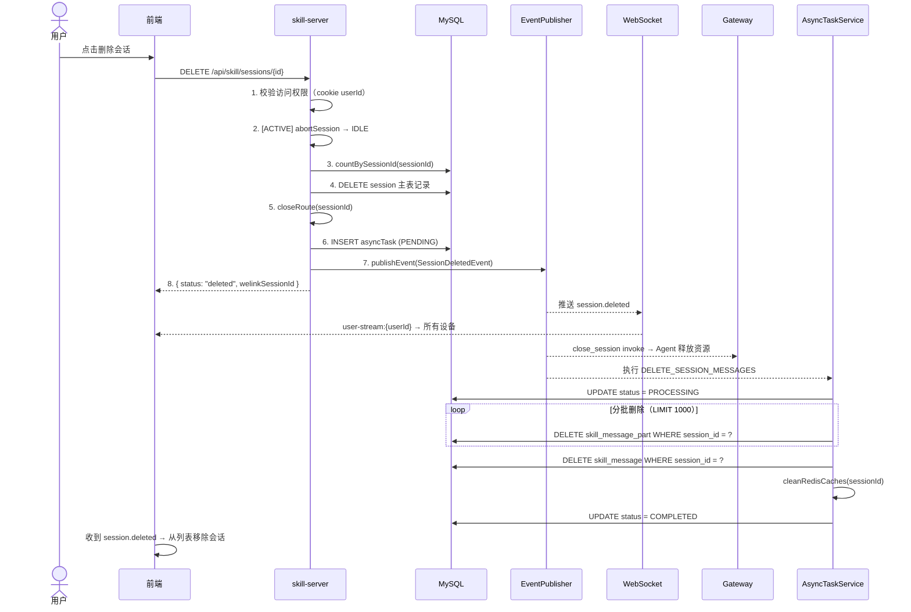
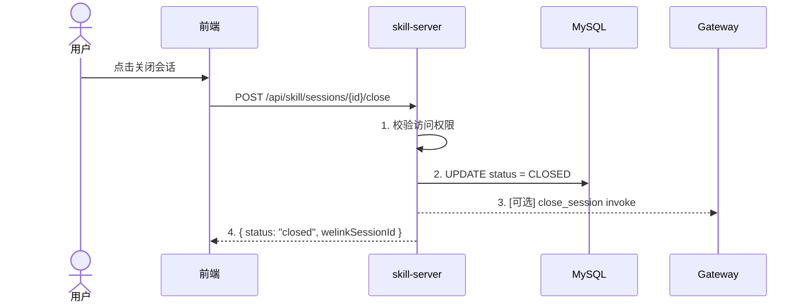
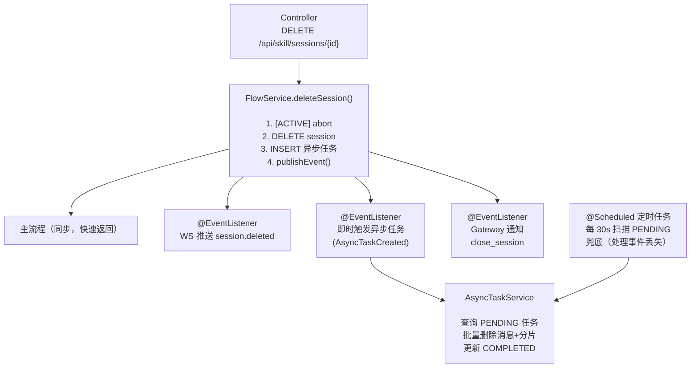
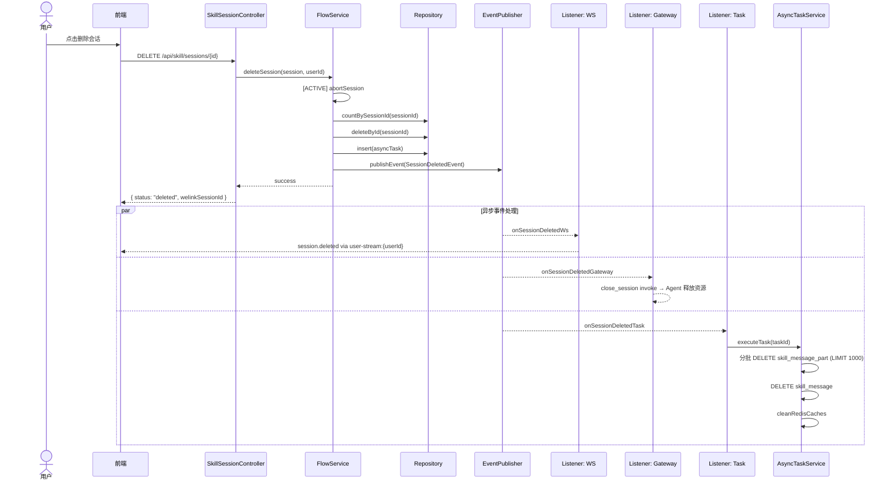

# 1 需求价值和概述

当前 `DELETE /api/skill/sessions/{id}` 为"关闭"操作（soft close，status=CLOSED，数据保留），且关闭后无 WebSocket 推送，其他设备无法实时感知。用户需要彻底删除会话的能力，并且删除后所有设备能实时同步、Agent 能及时释放资源。

本次改造目标：
1. **关闭接口迁移**：原 `DELETE /{id}` → `POST /{id}/close`，腾出 DELETE 语义
2. **新增硬删除接口**：`DELETE /{id}` 物理删除会话及所有关联数据
3. **多端同步**：删除后通过 WebSocket 实时同步到所有设备，并通知 Agent 释放资源

# 2 上下文分析

## 2.1 现有架构

- **关闭流程**：`SkillSessionFlowService.closeSession()` → DB status=CLOSED → [可选] Gateway close_session
- **关闭流程不推送 WS 事件**给客户端
- **多端推送基础设施已具备**：`user-stream:{userId}` Redis pub/sub + `StreamMessageEmitter.emitToClient()`
- **StreamMessage 类型命名规范**：`session.status`、`session.title`、`session.error`，新增类型应为 `session.deleted`
- **访问控制**：`SessionAccessControlService.requireSessionAccess` 校验 cookie userId

## 2.2 需删除的数据范围

- MySQL：skill_session、skill_message、skill_message_part
- Session route（`SessionRouteService`）
- Redis：`ss:tool-session:{toolSessionId}`、`ss:stream-seq:{sessionId}`、`skill:history:latest:{sessionId}:{size}`、stream buffer

# 3 初始需求分析

## 3.1 API 端点变更

| 操作 | 旧端点 | 新端点 |
|------|--------|--------|
| 关闭会话 | `DELETE /api/skill/sessions/{id}` | `POST /api/skill/sessions/{id}/close` |
| 删除会话 | —（新增） | `DELETE /api/skill/sessions/{id}` |

## 3.2 核心需求

1. **新增删除 API**：`DELETE /api/skill/sessions/{id}` — 硬删除会话及所有关联数据
2. **多端同步**：删除后推送 `session.deleted` WS 事件到用户所有设备（通过 `user-stream:{userId}`）
3. **Gateway 通知**：发送 `close_session` invoke，Agent 释放资源
4. **ACTIVE 会话处理**：先 abort（持久化缓冲 → IDLE），再执行硬删除
5. **close 接口迁移**：原 `DELETE /{id}` → `POST /{id}/close`

## 3.3 范围外

- abort 操作的多端同步
- 批量删除会话
- 会话恢复（回收站）

# 4 需求影响分析

## 4.1 涉及模块

| 模块 | 影响类型 | 说明 |
|------|----------|------|
| skill-server | 修改 + 新增 | Controller/Service/Repository/Model/事件/异步任务 |
| skill-miniapp | 修改 | api.ts close 路径 + 新增 delete + WS 事件处理 |
| AI-Gateway | 无改动 | 复用现有 close_session invoke |

## 4.2 兼容性分析

- `DELETE /api/skill/sessions/{id}` 行为变更：关闭 → 硬删除（breaking change）
- 前端需同步上线
- Gateway 无改动

# 5 系统用例分析

## 5.1 用例清单

| 编号 | 用例名称 | 说明 |
|------|----------|------|
| UC-01 | 删除会话 | 用户删除指定会话，数据库物理删除所有关联数据，WS 推送多端同步 |
| UC-02 | 关闭会话 | 用户关闭指定会话，DB status=CLOSED，数据保留 |

## 5.2 删除会话 用例分析

### 5.2.1 用例概述

用户通过前端发起删除会话请求，系统硬删除会话主表记录，异步批量清理关联的 message 和 part 数据，通过 WebSocket 推送 `session.deleted` 事件到用户所有设备，并通知 Gateway 释放 Agent 资源。

### 5.2.2 用例流程

**正常流程**：



**异常流程**：

| 异常 | 处理 |
|------|------|
| 会话不存在 | 返回 400 |
| 无权限访问 | 返回 403 |
| 异步任务执行失败 | status=FAILED + retry_count，定时任务下一轮重试 |
| 事件丢失 | @Scheduled 每 30s 扫描 PENDING 任务兜底 |
| WS 推送失败 | listener 顶层 try-catch，不影响主流程 |
| Gateway 通知失败 | listener 顶层 try-catch，Agent 侧有超时释放兜底 |

### 5.2.3 影响的功能列表和需求分析

| 影响功能 | 说明 |
|----------|------|
| 会话列表查询 | 删除后会话从列表中消失；listSessions 默认排除 CLOSED |
| 会话详情查看 | 已删除会话不可访问（findByIdSafe 排除 CLOSED） |
| WebSocket 连接 | 新增 session.deleted 事件类型 |
| Gateway Agent 管理 | 收到 close_session invoke 后释放资源 |

## 5.3 关闭会话 用例分析

### 5.3.1 用例概述

用户关闭指定会话，DB status 更新为 CLOSED，数据保留。此用例为已有功能，本次仅迁移 API 路径。

### 5.3.2 用例流程



### 5.3.3 影响的功能列表和需求分析

无新增功能影响。原有行为完全保留，仅 API 路径变更。

# 6 功能设计

## 6.1 业界实现方案分析

| 方案 | 描述 | 适用场景 |
|------|------|----------|
| 同步全量删除 | 在请求线程中删除所有关联数据 | 数据量小（<1000条） |
| 异步任务删除 | 主表同步删除 + 关联数据异步批量清理 | 关联数据量大，主流程需快速返回 |
| 软删除 + 定时清理 | 标记 deleted 字段，定时任务物理删除 | 需要回收站/恢复功能 |

本方案选择 **异步任务删除**：主流程快速返回，message/part 数据量可能很大（每个消息多个 part），走异步任务分批删除，避免阻塞用户请求。同时通过事件驱动 + 定时兜底保证任务必然执行。

## 6.2 功能实现整体设计方案

核心设计原则：**主流程快速返回，大数据量删除异步化；分支逻辑事件驱动，与主流程解耦。**



## 6.3 删除会话 功能实现

### 6.3.1 实现思路

1. **关闭接口迁移**：原 `DELETE /{id}` → `POST /{id}/close`，腾出 DELETE 语义
2. **新增删除接口**：`DELETE /{id}` 硬删除会话，skill_session 主流程同步删除，message/part 走异步任务批量删除
3. **多端同步**：删除后通过 `user-stream:{userId}` Redis pub/sub 推送 `session.deleted` 事件到所有设备，并通知 Gateway 释放资源
4. **内部查询优化**：skill_session 查询方法默认排除 CLOSED 状态，避免已关闭会话污染活跃会话列表

### 6.3.2 实现设计

**主流程（SkillSessionFlowService.deleteSession）**：

```
deleteSession(session, userId):
  1. if session.status == ACTIVE → abortSession(session)
  2. int messageCount = messageRepository.countBySessionId(sessionId)
  3. sessionRepository.deleteById(sessionId)                     // 仅删主表
  4. sessionRouteService.closeRoute(sessionId)
  5. asyncTaskRepository.insert(AsyncTask.builder()              // 创建异步任务
         .taskType("DELETE_SESSION_MESSAGES")
         .payload(JSON: sessionId, messageCount)
         .status(PENDING)
         .build())
  6. eventPublisher.publishEvent(new SessionDeletedEvent(        // 发布事件
         session, userId, Instant.now(), messageCount))
  7. return success
```

**分支逻辑（事件驱动 + 定时兜底）**：

SessionDeletedEvent 发布后，三个 @EventListener 异步响应。



**异步任务执行（AsyncTaskEventListener + @Scheduled 兜底）**：

```
executeDeleteSessionMessages(task):
  1. UPDATE status = PROCESSING
  2. 分批删除 part：
     LOOP: DELETE FROM skill_message_part WHERE session_id = ? LIMIT 1000
           → 直到 affected_rows = 0
  3. DELETE FROM skill_message WHERE session_id = ?
  4. cleanRedisCaches(sessionId)
  5. UPDATE status = COMPLETED

@Scheduled(fixedDelay = 30_000) processPendingTasks():
  → 查询 status=PENDING 的 DELETE_SESSION_MESSAGES 任务
  → 逐一执行（兜底事件丢失的情况）
```

### 6.3.3 功能可靠性分析

| 风险 | 缓解措施 |
|------|----------|
| 异步任务执行失败 | status=FAILED + retry_count，定时任务下一轮重试 |
| 事件丢失导致任务不执行 | @Scheduled 每 30s 扫描 PENDING 任务兜底 |
| part 表数据量大，单次删除超时 | LIMIT 1000 分批删除，每批独立事务 |
| WS 推送失败 | listener 顶层 try-catch，不影响主流程 |
| Gateway 通知失败 | listener 顶层 try-catch，Agent 侧有超时释放兜底 |
| 并发删除同一会话 | AsyncTask status=PENDING 乐观锁，执行前 UPDATE PROCESSING WHERE status=PENDING |

### 6.3.4 功能安全分析

| 安全点 | 措施 |
|--------|------|
| 访问控制 | 复用 `SessionAccessControlService.requireSessionAccess`，校验 cookie userId |
| 越权删除 | 仅会话所有者可删除自己的会话 |
| SQL 注入 | MyBatis `#{}` 参数化查询 |
| 敏感数据残留 | 硬删除，不留数据 |

### 6.3.5 架构元素影响列表

| 架构元素 | 影响类型 | 说明 |
|----------|----------|------|
| skill-server | 修改 + 新增 | Controller/Service/Repository/Model/事件/异步任务 |
| skill-miniapp | 修改 | api.ts close 路径 + 新增 delete + WS 事件处理 |
| AI-Gateway | 无改动 | 复用现有 close_session invoke |

**skill-server 新增文件**：

| 文件 | 说明 |
|------|------|
| `db/migration/V16__async_task.sql` | 异步任务表 DDL |
| `model/AsyncTask.java` | 任务实体 |
| `model/enums/AsyncTaskStatus.java` | PENDING/PROCESSING/COMPLETED/FAILED |
| `model/enums/AsyncTaskType.java` | DELETE_SESSION_MESSAGES |
| `model/event/SessionDeletedEvent.java` | 会话删除事件 record |
| `model/event/AsyncTaskCreatedEvent.java` | 异步任务创建事件 record |
| `repository/AsyncTaskRepository.java` + XML | 任务 CRUD |
| `service/AsyncTaskService.java` | 任务创建 + 执行 + 查询 |
| `service/SessionDeletedEventListener.java` | WS/Gateway/Task 三个 listener |
| `service/AsyncTaskEventListener.java` | 即时触发异步任务执行 |

**skill-server 修改文件**：

| 文件 | 改动 |
|------|------|
| `StreamMessage.java` | 新增 `SESSION_DELETED` 类型 + 工厂方法 |
| `SkillSessionRepository.java` + XML | 新增 `deleteById` |
| `SkillMessagePartRepository.java` + XML | 新增 `deleteBySessionId`（批量删除用） |
| `SkillMessageRepository.java` + XML | 新增 `deleteBySessionId` |
| `SkillSessionService.java` | 新增 `deleteSession(sessionId)`；查询方法默认排除 CLOSED |
| `SkillSessionFlowService.java` | 新增 `deleteSession(session)` |
| `SkillSessionController.java` | close 迁 `POST /{id}/close` + 新增 `DELETE /{id}` |

### 6.3.6 skill-server 实现设计

#### 6.3.6.1 接口设计

**关闭会话（迁移）**：

```
POST /api/skill/sessions/{id}/close

Request:  无 body
Response: {
  "code": 0,
  "data": { "status": "closed", "welinkSessionId": "{id}" }
}
Errors:   400（无效 ID）、403（无权限）
```

原有行为不变：DB status=CLOSED，可选通知 Gateway。

**删除会话（新增）**：

```
DELETE /api/skill/sessions/{id}

Request:  无 body
Response: {
  "code": 0,
  "data": { "status": "deleted", "welinkSessionId": "{id}" }
}
Errors:   400（无效 ID）、403（无权限）
```

主表立即删除，消息数据异步清理，WS 推送 `session.deleted`。

**WebSocket 事件（新增）**：

```
type: "session.deleted"
{
  "type": "session.deleted",
  "welinkSessionId": "{sessionId}",
  "emittedAt": "2026-06-03T..."
}
```

通过 `user-stream:{userId}` Redis channel 推送到用户所有 WebSocket 连接。

**查询会话列表（优化）**：

```
GET /api/skill/sessions

现有行为：无 status 参数时，返回该用户全部会话（含 CLOSED）
优化行为：无 status 参数时，默认只返回 ACTIVE + IDLE 的会话（排除 CLOSED）
          传 status=CLOSED 仍可查询已关闭会话
```

改动点：`SkillSessionService.listSessions()` 中，当 `status` 参数为空时，`statusNames` 默认设为 `[ACTIVE, IDLE]`，走 `findByUserIdAndStatusIn` 路径。

**内部 session 查询统一过滤（优化）**：

```diff
- SkillSessionService.findByIdSafe(id)    → 返回任意状态的 session
+ → 只返回 ACTIVE / IDLE 的 session，CLOSED 返回 null

- SkillSessionService.getSession(id)       → findByIdSafe 后 null 抛异常
+ → findByIdSafe 排除 CLOSED → null 抛异常（与已有行为一致）

- SkillSessionService.findByBusinessSession*(...) → 返回任何状态的匹配会话
+ → 只返回 ACTIVE / IDLE（CLOSED 会话不可复用）

- SkillSessionService.findByAk(ak)         → 返回该 AK 的全部会话
+ → 只返回 ACTIVE / IDLE

- SkillSessionService.findByToolSessionId(id) → 返回任意状态的会话
+ → 只返回 ACTIVE / IDLE
```

维护类方法（`findByStatus`、`findIdleSessionIds`、`updateStatus` 等）不变，按需指定状态。

#### 6.3.6.2 数据模型设计

##### 6.3.6.2.1 关系型数据库设计

**新增表：skill_async_task**（迁移 V16__async_task.sql）

```sql
CREATE TABLE skill_async_task (
    id           BIGINT PRIMARY KEY COMMENT 'Snowflake ID',
    task_type    VARCHAR(64) NOT NULL COMMENT '任务类型：DELETE_SESSION_MESSAGES',
    payload      JSON NOT NULL COMMENT '任务参数，如 {"sessionId":123,"messageCount":50}',
    status       VARCHAR(16) NOT NULL DEFAULT 'PENDING' COMMENT 'PENDING/PROCESSING/COMPLETED/FAILED',
    retry_count  INT DEFAULT 0 COMMENT '重试次数',
    error_msg    VARCHAR(512) COMMENT '失败原因',
    created_at   DATETIME NOT NULL,
    updated_at   DATETIME
);

CREATE INDEX idx_async_task_status_created
    ON skill_async_task(status, created_at);
```

**已有表改动**：无 DDL 变更，skill_session / skill_message / skill_message_part 表结构不变。

**SQL 新增**：

| Repository 方法 | SQL |
|-----------------|-----|
| `SkillSessionRepository.deleteById(id)` | `DELETE FROM skill_session WHERE id = #{id}` |
| `SkillMessageRepository.deleteBySessionId(sessionId)` | `DELETE FROM skill_message WHERE session_id = #{sessionId}` |
| `SkillMessagePartRepository.deleteBySessionId(sessionId)` | `DELETE FROM skill_message_part WHERE session_id = #{sessionId} LIMIT #{limit}` |

##### 6.3.6.2.2 Redis 缓存设计

异步任务执行完成后清理以下 key：

| Key 模式 | 清理方式 |
|----------|----------|
| `ss:tool-session:{toolSessionId}` | DEL |
| `ss:stream-seq:{sessionId}` | DEL |
| `skill:history:latest:{sessionId}:*` | SCAN + DEL（pattern） |
| Stream buffer（`PartBufferService`） | 调用 `clear(sessionId)` |

这些 Redis 操作放在异步任务中执行（与 message/part 删除同批），失败不影响核心功能。

##### 6.3.6.2.3 配置项设计

无新增配置项。定时任务间隔硬编码 30s，后续可按需抽取为配置。

**事件定义**：

```java
// SessionDeletedEvent — 会话已删除，主流程发布
public record SessionDeletedEvent(
    SkillSession session,      // 会话完整快照
    String deletedBy,          // 操作者 cookie userId
    Instant deletedAt,         // 删除时间
    int messageCount           // 被删消息数量
) {}

// AsyncTaskCreatedEvent — 异步任务已创建，AsyncTaskService 发布
public record AsyncTaskCreatedEvent(
    Long taskId,               // 任务 ID
    String taskType,           // DELETE_SESSION_MESSAGES / ...
    String payload             // JSON
) {}
```

### 6.3.7 skill-miniapp 实现设计

#### 6.3.7.1 api.ts 改动

```typescript
// 修改：关闭路径
export function closeSession(id: string | number): Promise<void> {
    return request('POST', `/api/skill/sessions/${id}/close`);
}

// 新增：删除会话
export function deleteSession(id: string | number): Promise<void> {
    return request('DELETE', `/api/skill/sessions/${id}`);
}
```

#### 6.3.7.2 useSkillSession.ts 改动

暴露 `deleteSession` 方法，调用 `api.deleteSession()`。

#### 6.3.7.3 WebSocket 事件处理

监听 `type === "session.deleted"` 的消息，根据 `welinkSessionId` 从会话列表中移除对应项。
