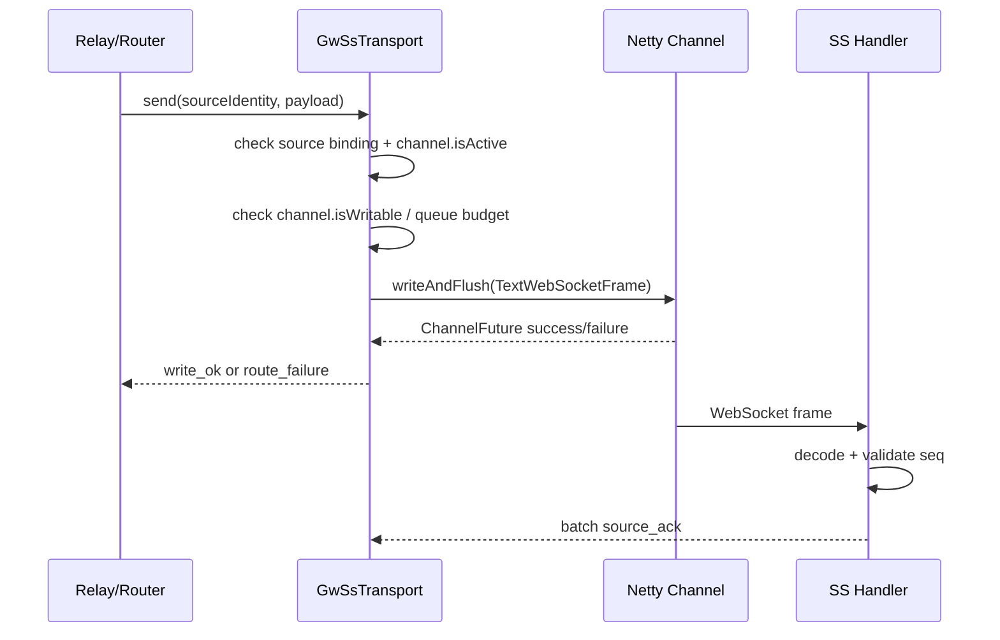
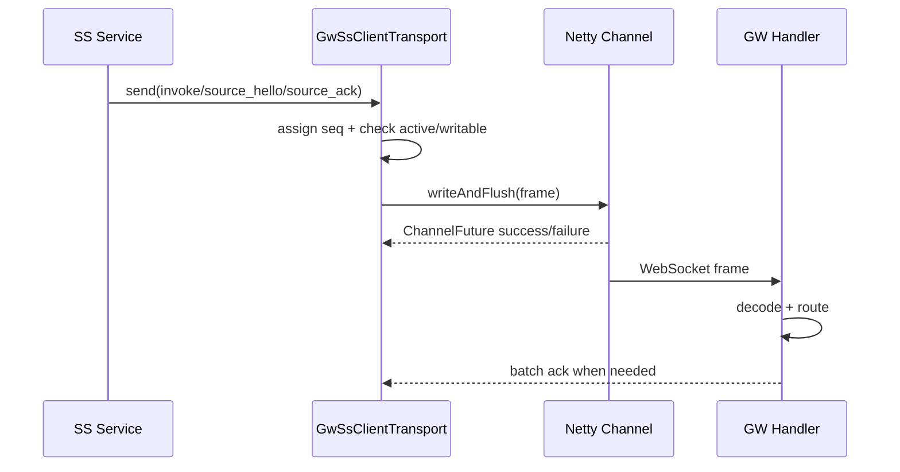

# 制定 GW-SS Netty WebSocket 传输规范

## Goal

制定一套 Netty WebSocket 传输规范，用于后续替换 GW 与 SS 之间当前受限的 WebSocket 二方包。

这个任务不是直接拍脑袋重写代码，而是先把行业/成熟项目里的 Netty WS 使用方式沉淀成项目规范，再按规范推进实现，避免在当前不稳定地基上继续叠补丁。

## Background

线上 trace 显示：

- agent/GW 侧已经产生 `tool_event` / `tool_done`；
- 目标 GW 打出 `Delivered to-source relay: sourceType=skill-server`；
- SS 侧没有后续 `GatewayRelayService.handleGatewayMessage`、`handleToolEvent`、`handleToolDone`、miniapp 流式推送日志。

当前代码里的风险点是：`Delivered` 类日志只证明消息进入了 GW 本地 async sender 队列，不证明 WebSocket 真实写出，更不证明 SS 已收到。高并发、连接假活、sender 停止、写失败没有反向清理 source session 时，都可能形成"GW 以为送了，SS 根本没收到"。

## Research Summary

调研文件：`research/netty-websocket-practices.md`

核心结论：

- Netty 官方把 I/O 明确定义为异步操作，`writeAndFlush` 返回 `ChannelFuture`，必须通过 listener 判断成功/失败。
- Netty/Vert.x/Reactor Netty/Armeria 都把连接生命周期、写水位、drain/backpressure、close/idle 作为一等语义。
- 成熟做法不会把"本地入队"叫"交付完成"；至少要区分 accepted、queued、write_ok、remote_received/acked。
- GW-SS 需要一个统一 transport owner，不能再让多个 service 各自维护 sender map、各自往同一类 WS session 写。

## Transport Architecture Decision

采用 Netty 原生 WebSocket 作为 GW-SS 内部传输层。

### Server / Client Roles

| 组件 | 角色 | 说明 |
|---|---|---|
| GW | WebSocket server | 接受 SS source connection，负责 source registry、agent 事件回传、to-source relay |
| SS | WebSocket client | 主动连接一个或多个 GW endpoint，发送 invoke，接收 tool_event/tool_done/question/error |

### Pipeline Standard

GW server pipeline 推荐顺序：

```text
SslHandler? 
HttpServerCodec
HttpObjectAggregator(handshakeMaxContentLength)
IdleStateHandler(readerIdle, writerIdle, allIdle)
WebSocketServerProtocolHandler(WebSocketServerProtocolConfig:
  path, subprotocol, allowExtensions=false, maxFramePayloadLength,
  allowMaskMismatch=false, dropPongFrames=false)
GwSsFrameCodec
GwSsServerHandler
```

SS client pipeline 推荐顺序：

```text
SslHandler?
HttpClientCodec
HttpObjectAggregator(handshakeMaxContentLength)
IdleStateHandler(readerIdle, writerIdle, allIdle)
WebSocketClientProtocolHandler(WebSocketClientProtocolConfig:
  uri, V13, subprotocol, allowExtensions=false, headers,
  maxFramePayloadLength, handleCloseFrames=true, dropPongFrames=false)
GwSsFrameCodec
GwSsClientHandler
```

规范要求：

- internal transport 默认不启用 WebSocket compression；需要压缩时必须有压测和 CPU/延迟指标。
- 默认使用 `TextWebSocketFrame` 承载现有 JSON envelope；后续可演进为 binary codec，但必须保持同一 envelope 语义。
- `IdleStateHandler` 必须能观察 Ping/Pong/Close 等控制帧带来的读写活动；心跳处理不能只靠业务 JSON。
- 若需要记录 Pong RTT 或 pong-lag，`dropPongFrames=false`，并在 app handler 里消费后显式释放/透传对应 frame。

## Message Envelope

每个 GW-SS frame 必须有 transport envelope：

| 字段 | 必填 | 说明 |
|---|---|---|
| `version` | 是 | 协议版本，如 `gwss.v1` |
| `connectionId` | 是 | 当前 WS 连接唯一 ID |
| `sourceType` | 是 | `skill-server` 等 |
| `sourceInstanceId` | 是 | SS 实例 ID |
| `sourceBootId` | 是 | SS 进程启动 ID，避免滚动升级复用实例名导致误判 |
| `seq` | 是 | 单连接单调递增序号 |
| `type` | 是 | `source_hello` / `invoke` / `tool_event` / `tool_done` / `source_ack` 等 |
| `traceId` | 否 | 业务 trace，可空但应尽力透传 |
| `toolSessionId` | 否 | 路由 key |
| `payload` | 是 | 业务 payload |

## Connection Lifecycle

### Connect

1. SS 建立 TCP/TLS 连接，发起 WebSocket handshake。
2. GW `HandshakeComplete` 后只创建 channel context，不立即注册为可投递 source。
3. SS 发送 `source_hello`，携带 `sourceType/sourceInstanceId/sourceBootId/poolSlot/capabilities`。
4. GW 校验通过后绑定 source identity，写入本地 channel registry 和 Redis presence。
5. GW 返回 `source_registered`，SS 收到后该连接进入 ACTIVE。

### Disconnect / Cleanup

以下任一事件必须进入同一 cleanup path：

- `channelInactive`
- `exceptionCaught`
- 收到 `CloseWebSocketFrame`
- reader idle 超时
- `writeAndFlush` future failure
- duplicate newer `sourceBootId/connectionId` 替换旧连接
- graceful drain / shutdown

cleanup path 必须：

- 从本地 source registry 删除 channel；
- 删除或刷新 Redis source presence；
- fail 掉该 channel 上未完成的 pending write/ack；
- 关闭 channel；
- 打一条结构化日志：`gwss_channel_closed`，包含 reason/source/connectionId/lastSeq/pendingCount。

## Send Semantics

严禁把本地入队叫 `Delivered`。日志语义必须固定：

| 日志事件 | 含义 |
|---|---|
| `gwss_send_accepted` | 调用方把消息交给 transport |
| `gwss_send_queued` | 因 channel 暂不可写，消息进入 bounded queue |
| `gwss_send_write_ok` | `writeAndFlush` future success |
| `gwss_send_write_failed` | `writeAndFlush` future failure |
| `gwss_frame_received` | 对端 Netty handler 已解码 frame |
| `gwss_frame_acked` | 对端业务层返回 batch ack |

### GW -> SS 发包顺序



### SS -> GW 发包顺序



## Backpressure Policy

配置项：

| 配置 | 默认建议 | 说明 |
|---|---:|---|
| `writeBufferLowWaterMark` | 512 KiB | Netty channel writable 恢复水位 |
| `writeBufferHighWaterMark` | 2 MiB | Netty channel writable 关闭水位 |
| `maxPendingMessagesPerChannel` | 10000 | bounded queue 条数上限 |
| `maxPendingBytesPerChannel` | 16 MiB | bounded queue 字节上限 |
| `nonWritableCloseAfterMs` | 30000 | 长时间不可写则关闭并重连 |
| `terminalEventPriority` | true | `tool_done/error/question` 优先保留，普通 `tool_event` 可降级 |

行为要求：

- `channel.isWritable=false` 时，不能无限写入 Netty outbound buffer。
- pending queue 满时必须打 `gwss_send_overflow`，并执行明确策略：drop low-priority streaming chunk、fail route、或 close channel。
- `channelWritabilityChanged` 必须驱动 queue drain。
- overflow/drop 必须带 `traceId/toolSessionId/source/seq`，不能静默。

## Heartbeat

采用双层心跳：

| 层级 | 机制 | 目的 |
|---|---|---|
| transport | `IdleStateHandler` + WebSocket Ping/Pong | 检测 TCP/WS 半开、LB idle、对端进程卡死 |
| application | `source_hello/source_ack/source_leave` | 证明连接绑定的 source identity 仍可处理 GW-SS 业务帧 |

建议参数：

- writer idle：15s，发送 Ping。
- reader idle：45s，关闭 channel。
- source ack：每 64 条或 100ms batch 一次，取先到者。
- reconnect：指数退避 + jitter，初始 1s，上限 30s。

## Rolling Upgrade / Drain

### GW drain

1. preStop 或应用 shutdown hook 先把 readiness 置 false。
2. 停止接受新的 SS source connection。
3. 向已连接 SS 发送 `goaway`，包含 `reason=gw_draining` 和建议 reconnect endpoint。
4. 等待 `drainGraceMs`，期间只处理已在途消息和 ack。
5. 未完成连接强制 close，cleanup source registry。

### SS drain

1. readiness false，停止新会话入口或新 invoke 入口。
2. 发 `source_leave` 到 GW。
3. 等待 pending write/ack 到达上限时间。
4. close channel；GW `channelInactive` 清理 source。

## Observability Requirements

必须新增或改造这些日志/指标：

- active GW-SS channel count by `sourceType/sourceInstanceId`.
- per-channel pending messages/bytes.
- write future success/failure count.
- non-writable duration histogram.
- idle close count.
- source registry add/remove reason.
- frame received count by type.
- ack lag by seq/time.

日志必须包含：

- `traceId`（若业务有）
- `toolSessionId`（若业务有）
- `sourceType/sourceInstanceId/sourceBootId/connectionId`
- `seq`
- `messageType`
- send stage
- failure reason

## Implementation Requirements

### MUST

- 使用一个统一的 `GwSsTransport` 管理 channel registry、write、cleanup、metrics/logs。
- 所有写操作使用 `writeAndFlush(...).addListener(...)`。
- 任何写失败都必须触发 source unregister + channel close。
- `Delivered` 只能用于 remote ack 或明确改名为 `write_ok`；不能用于本地 enqueue。
- 不能出现两个 service 各自维护 sender map 往同一类 SS WebSocket session 写。
- 所有连接状态变更必须在 Netty event loop 或受控 executor 下串行化。
- event loop 里不能做阻塞 Redis/DB/HTTP 调用。

### SHOULD

- 使用 `sourceBootId` 避免滚动升级期间旧连接和新连接共用实例名。
- 使用 batch ack 而不是每条消息同步阻塞等待 ack。
- 保留现有 JSON payload 以降低迁移风险。
- 先灰度引入 Netty transport，按 sourceType 或配置开关切流。

### MUST NOT

- 不允许无界 queue。
- 不允许 write failure 只打日志不清理 source registry。
- 不允许在 channel inactive 后继续使用旧 source mapping。
- 不允许把 Redis registry alive 当作本地 channel alive。
- 不允许依赖 shutdown 后 TTL 自然过期作为主要清理机制。

## Acceptance Criteria

- [ ] 规范文档完成，并包含行业/官方资料来源。
- [ ] 后续实现中，GW 打出 `gwss_send_write_ok` 后，能在 SS 找到对应 `gwss_frame_received` 或超时/失败/ack-lag 日志。
- [ ] 模拟 SS 断网/kill -9，GW 在 reader idle 或 write failure 后清理本地 source，不能继续出现假活 channel。
- [ ] 模拟高频 `tool_event`，触发 backpressure 时有明确 `nonWritable/queued/overflow/drain` 日志，无静默丢弃。
- [ ] 模拟 GW rolling restart，SS 能收到 goaway 或 close 后重连，新老 `sourceBootId/connectionId` 不混用。
- [ ] 单元测试覆盖 channel active/inactive、write success/failure、idle close、backpressure overflow、duplicate connection replacement。
- [ ] 集成测试覆盖 GW -> SS `tool_event/tool_done` 端到端到达 SS handler。

## Out of Scope

- 本任务不直接实现 Netty transport。
- 不改变上层 `tool_event/tool_done/question` 业务 payload。
- 不在本任务里决定 exactly-once 可靠投递；当前目标是 no silent local-drop + observable at-least-write + app receipt/ack。
- 不引入 etcd/StatefulSet/pod 直连等更大规模服务发现改造。

## Source Links

- Netty `WebSocketServerProtocolHandler`: https://netty.io/4.1/api/io/netty/handler/codec/http/websocketx/WebSocketServerProtocolHandler.html
- Netty WebSocket server example: https://netty.io/4.1/xref/io/netty/example/http/websocketx/server/WebSocketServerInitializer.html
- Netty WebSocket client example: https://netty.io/4.1/xref/io/netty/example/http/websocketx/client/WebSocketClient.html
- Netty `ChannelFuture`: https://netty.io/4.2/api/io/netty/channel/ChannelFuture.html
- Netty `WriteBufferWaterMark`: https://netty.io/4.1/api/io/netty/channel/WriteBufferWaterMark.html
- Netty `IdleStateHandler`: https://netty.io/4.1/api/io/netty/handler/timeout/IdleStateHandler.html
- Reactor Netty `WebsocketSpec`: https://docs.spring.io/projectreactor/reactor-netty/docs/current/api/reactor/netty/http/websocket/WebsocketSpec.html
- Spring WebFlux WebSocket docs: https://docs.spring.io/spring-framework/reference/web/webflux-websocket.html
- Vert.x WebSocket API: https://vertx.io/docs/apidocs/io/vertx/core/http/WebSocket.html
- Armeria threading/backpressure: https://armeria.dev/docs/advanced/threading-model/ and https://armeria.dev/docs/advanced/streaming-backpressure/
- RFC 6455: https://www.rfc-editor.org/rfc/rfc6455
