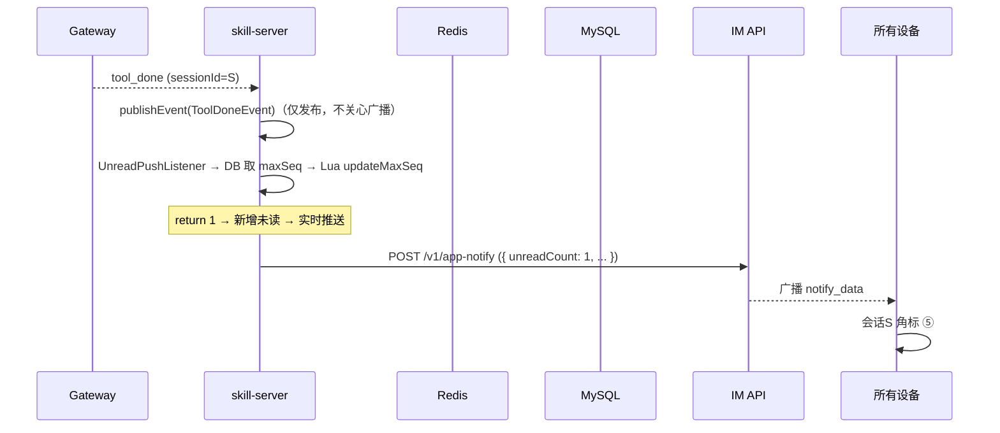
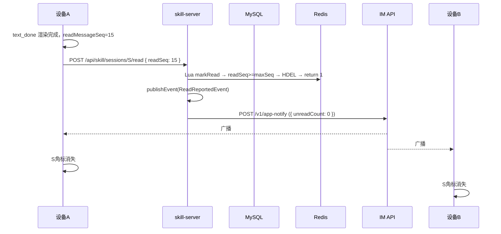
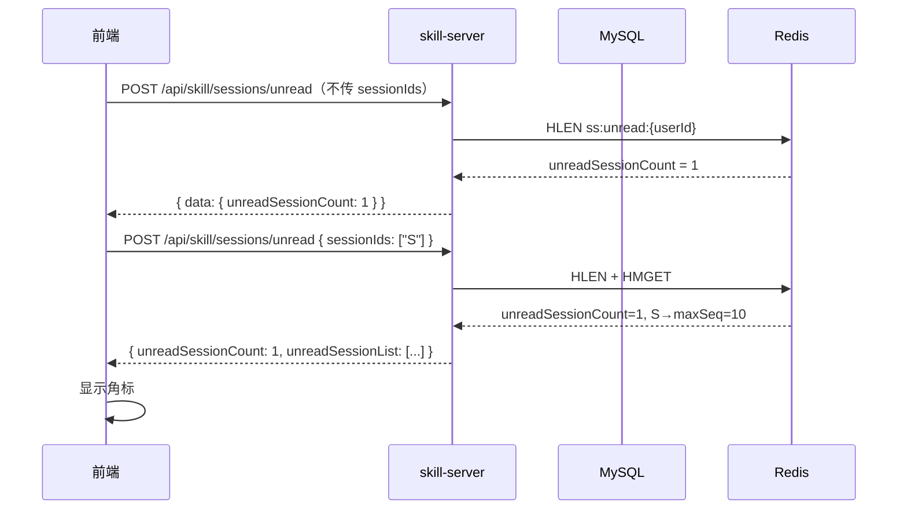

# Design (Inner): 未读消息小红点提醒与已读多端同步

## 1 需求价值和概述

skill-miniapp 会话列表侧边栏中展示未读消息数字角标，前端追踪已渲染的最大 `message_seq` 并上报已读，已读状态通过 IM API `/v1/app-notify` 跨设备实时同步。

**同步模式**：`unread.sync-mode=im`，多端同步走 IM API 通道。通过复合 `MultiDeviceSyncService` 按配置路由，无需 `@ConditionalOnProperty`。

## 2 上下文分析

### 2.1 现有架构

- `skill_message.seq`：会话内严格递增序号（`uk_skill_message_session_seq`），天然适合做已读游标
- `ImOutboundService`：已有 `RestTemplate` 调 IM REST API 的基础设施
- `StreamMessageEmitter`：统一出站入口
- `ApplicationEventPublisher`：Spring 事件发布机制，可零侵入扩展现有逻辑
- 前端 `SessionSidebar` 已有渲染结构，扩展角标只需加 `unreadCount` 展示

### 2.2 需新增的能力

- `POST /unread`（sessionIds 可选）+ `POST /{id}/read` 端点（正式接口规格见 6.5.1）
- Lua `updateMaxSeq` + `markRead` 脚本（Redis Hash `ss:unread:{userId}` TTL 7d）
- `POST /{id}/read` 端点（REST，已读上报唯一通道）
- `MultiDeviceSyncService` 接口 + `CompositeMultiDeviceSyncService`（按 `unread.sync-mode` 路由）+ `ImMultiDeviceSyncService` + `WsMultiDeviceSyncService`
- `ToolDoneEvent` / `ReadReportedEvent` 事件 + 对应 Listener
- 前端 `readMessageSeq` 追踪 + 角标渲染

## 3 初始需求分析

### 3.1 初始化需求场景分析

| 场景 | 说明 |
|------|------|
| 用户不在看会话 S，S 收到新消息 | S 出现数字角标（所有设备） |
| 用户正在看会话 Y，Y 收到新消息 | 前端自行判断不显示角标（服务端照推） |
| 用户切换到会话 S | 前端渲染完成后上报 readSeq，角标消失 |
| 设备 A 上报已读 | 通过 IM API 广播，设备 B 角标同步消失 |
| 离线后打开应用 | `POST /unread` 拉取未读，前端 readMessageSeq 自行维护 |
| 流式进行中消息未渲染完成 | 不推进 readMessageSeq |
| 回到前台 / WS 重连 | 重新拉取 `POST /unread` |

### 3.2 结构化 IR

- **用户可见**：会话列表数字角标（>99 显示 99+）
- **系统行为**：事件驱动推送、Lua 原子操作、IM API 多端同步
- **约束**：仅 miniapp 场景、im 模式走 IM API、不改动现有会话列表接口

## 4 需求影响分析

### 4.1 特性影响分析

| 模块 | 影响类型 | 说明 |
|------|----------|------|
| skill-server | 修改 + 新增 | Redis Lua、Controller、Event、Listener、IM API client（无 DB 变更、无 WS 改动） |
| skill-miniapp | 修改 | 类型、API、SessionSidebar、useSkillSession、useSkillStream |
| ai-gateway | 无改动 | — |

## 5 系统用例分析

### 5.1 用例清单

| 编号 | 用例名称 | 说明 |
|------|----------|------|
| UC-01 | 未读角标展示 | 消息到达后，非活跃会话出现数字角标 |
| UC-02 | 端侧已读上报 | 前端渲染完成后 POST 上报 readSeq，Lua markRead 原子判断+清除 |
| UC-03 | 离线后恢复未读状态 | `POST /unread` 返回 unreadSessionCount + 详情列表 |
| UC-04 | 多端同步（inner） | IM API `/v1/app-notify` 广播未读变更 |

### 5.2 UC-01 未读角标展示

#### 5.2.1 用例概述

用户不在看会话 S，S 收到新消息后，所有设备上 S 出现数字角标。

#### 5.2.2 用例流程



#### 5.2.3 影响的功能列表和需求分析

| 影响功能 | 说明 |
|----------|------|
| GatewayMessageRouter.handleToolDone | 末尾发布 ToolDoneEvent（+1 行） |
| UnreadPushListener | 新文件，监听 ToolDoneEvent，计算并推送 |
| ImMultiDeviceSyncService | 新文件，调用 IM API |
| 前端 SessionSidebar | 渲染角标 |

### 5.3 UC-02 端侧已读上报

#### 5.3.1 用例概述

前端消息完整渲染后，`readMessageSeq` 变化，debounce 500ms 后 POST 上报，服务端 Lua markRead 判断并清除。

#### 5.3.2 用例流程



#### 5.3.3 影响的功能列表和需求分析

| 影响功能 | 说明 |
|----------|------|
| 前端 useSkillSession | 维护 readMessageSeq，debounce 500ms → POST /{id}/read |
| SkillSessionController | 新增 `POST /{id}/read`（已读上报唯一通道） |
| SkillSessionService.reportRead | Lua markRead + 条件发布 ReadReportedEvent |
| ReadReportedListener | 监听事件，立即推送 unreadCount=0 |

### 5.4 UC-03 离线后恢复已读状态

#### 5.4.1 用例概述

用户离线后重新进入应用，通过 `POST /unread`（不传 sessionIds→总数，传 sessionIds→详情列表）恢复未读状态。

#### 5.4.2 用例流程



### 5.5 UC-04 多端同步（inner）

#### 5.5.1 用例概述

im 模式下，多端同步通过 IM API `/v1/app-notify` 完成。

#### 5.5.2 用例流程

```
skill-server → POST /v1/app-notify
{
  "client_notify_id": "<UUID>",
  "notify_scope": 2,
  "notify_tenant": "${skill.im.app-notify.tenant}",
  "notify_accounts": ["{userId}"],
  "notify_module": "${skill.im.app-notify.module}",
  "notify_data": "{\"notify_type\":\"session.unread\",\"notify_content\":{\"welinkSessionId\":\"S\",\"unreadCount\":0,\"assistantAccount\":\"...\"}}"
}
→ IM 平台广播 → 各设备前端收到 → 更新角标
```

## 6 功能设计

### 6.1 业界实现方案分析

会话级已读游标 + 事件驱动推送是业界常规方案（Slack、Discord、微信均采用会话级 last_read_id 模式）。miniapp 场景无需消息级已读追踪，会话级足够。

### 6.2 功能实现整体设计方案

```
┌──────────────────────────────────────────────────────────────┐
│                    事件驱动架构                                │
├──────────────────────────────────────────────────────────────┤
│                                                              │
│  handleToolDone ──→ ToolDoneEvent ──→ UnreadPushListener     │
│       (+1 行)                      │ DB maxSeq → Lua          │
│                                    │ updateMaxSeq → 决定推送   │
│                                    ↓ (return 1)              │
│                              ImMultiDeviceSyncSvc             │
│                                └── POST /v1/app-notify       │
│                                                              │
│  reportRead ──→ Lua markRead ──→ return 1?                   │
│  (新方法)          │  return 0 → 不发布                       │
│                    ↓ return 1                                 │
│              ReadReportedEvent ──→ Listener                  │
│                                    ↓ 立即推送                 │
│                              push(unreadCount=0)              │
│                                                              │
└──────────────────────────────────────────────────────────────┘
```

### 6.3 已读游标功能实现

#### 6.3.1 实现思路

前端自行追踪 `readMessageSeq`（内存变量），服务端不存储已读游标。已读判断完全由 Lua `markRead`（readSeq vs Hash maxSeq）原子完成。

#### 6.3.2 实现设计

- **游标来源**：前端 `readMessageSeq = max(已渲染完成的消息 seq)`
- **上报时机**：`readMessageSeq` 变化 → debounce 500ms → POST /api/skill/sessions/{id}/read
- **流式保护**：消息未完整渲染不推进
- **已读判断**：Lua `markRead` 原子比较 readSeq vs Hash maxSeq，readSeq >= maxSeq 则 HDEL 并发布清除事件
- **未读追踪**：Redis Hash `ss:unread:{userId}` 通过 Lua `updateMaxSeq`/`markRead` 原子维护，TTL 7d
- **推送决策**：`handleToolDone` 始终发布 `ToolDoneEvent`（不关心广播）；`UnreadPushListener` 内部 Lua `updateMaxSeq=1` 才推送；`reportRead` 内部 Lua `markRead=1` 才发布 `ReadReportedEvent`。实时推送

#### 6.3.3 功能可靠性分析

| 风险 | 缓解 |
|------|------|
| Redis 完全不可用/flush | Hash 为空 → EXISTS 降级 DB 子查询；新消息到达后 Lua 重建 |
| REST 调用失败 | 前端重试 / 下次 debounce 自然重试 |
| 前端 debounce 窗口内多次变化 | 最后一次覆盖 |
| 重复推送未读 | `updateMaxSeq=2` 不发布事件 |
| 无效已读清除 | `markRead=0`（readSeq < maxSeq）不发布事件 |

#### 6.3.4 功能安全分析

| 安全点 | 措施 |
|--------|------|
| 越权修改已读游标 | `requireSessionAccess` 校验 cookie userId == session.userId |
| Redis 注入 | sessionId 为服务端 Long 值，无注入风险 |
| 未读信息泄漏 | 查询按 userId 隔离 |

### 6.4 架构元素影响列表

| 架构元素 | 影响 |
|----------|------|
| 数据流 | 新增 3 条：消息 → 推送 / 上报 → 同步 / 拉取 → 角标 |
| 接口 | 新增 `POST /unread`（sessionIds 可选）+ `POST /{id}/read` |
| 事件 | 新增 `ToolDoneEvent` + `ReadReportedEvent` |
| 外部依赖 | 新增 IM API `/v1/app-notify` |
| 数据存储 | Redis Hash `ss:unread:{userId}`（无 DB 变更） |

### 6.5 skill-server 架构元素实现设计

#### 6.5.1 接口设计

##### 6.5.1.1 REST API

###### 6.5.1.1.1 未读信息查询（sessionIds 可选）

```
POST /api/skill/sessions/unread
```

**请求体**（`sessionIds` 可选）:

| 属性名 | 类型 | 必填 | 说明 |
|--------|------|------|------|
| sessionIds | List\<String\> | N | 不传仅返总数；传入返详情列表 |

**响应体 — 不传 sessionIds**:

| 属性名 | 类型 | 说明 |
|--------|------|------|
| data.unreadSessionCount | int | 有未读的会话总数 |

```json
{ "code": 0, "data": { "unreadSessionCount": 2 } }
```

**响应体 — 传 sessionIds**:

| 属性名 | 类型 | 说明 |
|--------|------|------|
| data.unreadSessionCount | int | 有未读的会话总数 |
| data.unreadSessionList[].sessionId | String | 会话 ID |
| data.unreadSessionList[].unreadCount | int | 0=已读，>0=有未读 |
| data.unreadSessionList[].maxSeq | int | 当前最大 seq |

```json
{
  "code": 0,
  "data": {
    "unreadSessionCount": 2,
    "unreadSessionList": [
      { "sessionId": "123", "unreadCount": 1, "maxSeq": 15 },
      { "sessionId": "456", "unreadCount": 0, "maxSeq": 0 }
    ]
  }
}
```

###### 6.5.1.1.2 已读上报（唯一通道）

```
POST /api/skill/sessions/{id}/read
```

**请求体**:

| 属性名 | 类型 | 必填 | 说明 |
|--------|------|------|------|
| readSeq | int | Y | 前端已渲染的最大 message_seq |

**响应体**:

| 属性名 | 类型 | 说明 |
|--------|------|------|
| code | int | 0=成功 |
| data.welinkSessionId | String | 会话 ID |
| data.unreadCount | int | readSeq >= maxSeq 后为 0 |

```json
{ "code": 0, "data": { "welinkSessionId": "123", "unreadCount": 0 } }
```

**错误码**:

| HTTP Status | error.error_code | 说明 |
|-------------|------------------|------|
| 400 | BAD_REQUEST | readSeq 参数缺失或无效 |
| 401 | UNAUTHORIZED | 未登录或 cookie 失效 |
| 403 | FORBIDDEN | session 不属于当前用户 |
| 404 | NOT_FOUND | sessionId 不存在 |
| 500 | INTERNAL_ERROR | 服务内部异常 |

##### 6.5.1.2 WebSocket 协议

**客户端 → 服务端**：已读上报统一走 REST（见 6.5.1.1.2），不走 WS

**服务端 → 客户端：未读推送**:

```json
{
  "type": "session.unread",
  "welinkSessionId": "123456789",
  "unreadCount": 1,
  "maxSeq": 15,
  "assistantAccount": "assistant_xxx",
  "emittedAt": "2026-06-12T10:30:00"
}
```

| 属性名 | 类型 | 说明 |
|--------|------|------|
| type | string | 固定 `"session.unread"` |
| welinkSessionId | string | 会话 ID |
| unreadCount | int | 0=已读，>0=有未读（当前 1，预留计数扩展） |
| maxSeq | int | 当前会话最大 seq |
| assistantAccount | string | 助手账号（nullable） |
| emittedAt | ISO-8601 | 推送时间 |

##### 6.5.1.3 IM AppNotify 接口（im 模式）

```
POST /v1/app-notify
```

**请求体**:

| 属性名 | 类型 | 必填 | 说明 |
|--------|------|------|------|
| client_notify_id | string | Y | 通知唯一标识（UUID） |
| notify_scope | int | Y | 接收者模式，固定 2 |
| notify_tenant | string | Y | 企业标识，配置项 |
| notify_accounts | List\<String\> | N | 接收通知的账号 |
| notify_module | string | Y | 归属应用模块，配置项 |
| notify_data | string | Y | JSON 字符串 |

`notify_data` 结构：

```json
{
  "notify_type": "session.unread",
  "notify_content": {
    "welinkSessionId": "...",
    "unreadCount": 1,
    "maxSeq": 15,
    "assistantAccount": "..."
  }
}
```

**响应体**:

| 属性名 | 类型 | 说明 |
|--------|------|------|
| error | ErrorInfo | 错误信息 |
| client_notify_id | string | 请求携带的 ID |
| server_notify_id | long | 服务端分配的 ID |
| Invalid_account | List\<String\> | 无效账号列表 |

#### 6.5.2 数据模型设计

##### 6.5.2.1 关系型数据库设计

无 DDL 变更。`last_read_seq` 和 `max_seq` 均不入库，由 Redis Hash `ss:unread:{userId}` 全权维护（见 6.5.2.2）。

##### 6.5.2.2 Redis 缓存设计

**未读追踪 Hash**（唯一存储）:
```
Key: ss:unread:{userId}  TTL: 7d
Type: Hash
Field: sessionId → maxSeq (int)
```

> **淘汰/过期自愈**：无需 DB 兜底。`updateMaxSeq` 若 key 不存在→创建+HSET return 1；`markRead` 若 key 不存在→创建空 key return 1。

**Lua 脚本：updateMaxSeq**（消息落库时，原子更新 + 自愈创建）:
```lua
-- KEYS[1]=ss:unread:{userId}, ARGV[1]=sessionId, ARGV[2]=newSeq, ARGV[3]=ttlSeconds
local field, newSeq, ttl = ARGV[1], tonumber(ARGV[2]), tonumber(ARGV[3])
local exists = redis.call('EXISTS', KEYS[1])
local current = redis.call('HGET', KEYS[1], field)
if not current then
    redis.call('HSET', KEYS[1], field, newSeq)
    if exists == 0 then redis.call('EXPIRE', KEYS[1], ttl) end
    return 1   -- 新增未读
end
if newSeq > tonumber(current) then
    redis.call('HSET', KEYS[1], field, newSeq)
    redis.call('EXPIRE', KEYS[1], ttl)
    return 2   -- 已处未读态
end
return 0
```

**Lua 脚本：markRead**（前端上报已读时，原子判断 + 自愈创建）:
```lua
-- KEYS[1]=ss:unread:{userId}, ARGV[1]=sessionId, ARGV[2]=readSeq, ARGV[3]=ttlSeconds
local field, readSeq, ttl = ARGV[1], tonumber(ARGV[2]), tonumber(ARGV[3])
local exists = redis.call('EXISTS', KEYS[1])
local current = redis.call('HGET', KEYS[1], field)
if not current then
    if exists == 0 then redis.call('EXPIRE', KEYS[1], ttl) end
    return 1   -- 无记录=已读，发布清除事件
end
if readSeq >= tonumber(current) then
    redis.call('HDEL', KEYS[1], field)
    redis.call('EXPIRE', KEYS[1], ttl)
    return 1
end
return 0
```

**返回决策矩阵**:

| Lua return | 发布事件? | 说明 |
|------------|-----------|------|
| updateMaxSeq=1 | Y | 新增未读 |
| updateMaxSeq=2 | N | 已处未读态 |
| updateMaxSeq=0 | N | 无变更 |
| markRead=1 | Y | 全部已读 |
| markRead=0 | N | 仍有未读 |

##### 6.5.2.3 配置项设计

```yaml
unread:
  sync-mode: im  # im | ws，默认 ws
im:
  api-url: ${IM_API_URL}
  token: ${IM_TOKEN}
  app-notify:
    tenant: ${IM_APP_NOTIFY_TENANT}
    module: ${IM_APP_NOTIFY_MODULE}
    scope: 2
```

### 6.6 skill-miniapp 架构元素实现设计

| 文件 | 改动 |
|------|------|
| `protocol/types.ts` | `UnreadInfo { sessionId, unreadCount, maxSeq }`；`StreamMessageType` 新增 `session.unread` |
| `utils/api.ts` | `fetchUnreadSessions(sessionIds?)` + `reportRead(sessionId, readSeq)` |
| `hooks/useSkillSession.ts` | 维护 `readMessageSeq`（前端自行记录），变化时 debounce 上报；启动/前台/重连+侧边栏渲染时调 `unread` |
| `hooks/useSkillStream.ts` | 处理 `session.unread`；追踪流式状态 |
| `components/SessionSidebar.tsx` | 数字角标（>99 显示 99+） |
| `index.css` | `.session-badge` 样式 |

## 7 系统级非功能性设计

### 7.1 系统级的 FMEA 影响分析

| 故障模式 | 影响 | 检测 | 缓解 |
|----------|------|------|------|
| IM API 不可用 | 多端同步中断，本端角标不受影响 | 日志告警 + 调用方 catch `Exception` | IM API 恢复后下次推送自愈 |
| Redis 不可用 | Lua 执行失败，未读状态不可用 | Redis 连接异常日志 | 恢复后 Lua 自愈重建 |
| MySQL 不可用 | 消息持久化受阻 | 异常日志 | 等待恢复后重试 |
| ToolDoneEvent 丢失 | 该次推送遗漏 | — | 前端 `POST /unread` 定时/前台拉取兜底 |

### 7.2 系统级安全影响分析

- 未读信息按 `userId` 隔离，不跨用户泄漏
- 已读上报需 `requireSessionAccess` 校验
- IM API 调用使用现有 IM token 鉴权

### 7.3 兼容性

#### 7.3.1 后向兼容性确认

- 无 DB 变更，存量会话无影响
- 现有会话列表 API 不受影响，未读独立查询

#### 7.3.2 前向兼容性确认

- `StreamMessage.SESSION_UNREAD` 为新增类型，旧客户端忽略即可
- `POST /unread`（sessionIds 可选）为全新端点

### 7.4 可运维

- `unread.sync-mode` 控制同步方式，复合 service 按配置路由，无需条件注入
- 新增配置项均有默认值
- `client_notify_id` 使用 UUID，可追踪链路

### 7.5 资料

- IM API 文档：`.trellis/tasks/06-10-skill-session-unread-badge/im-mulit-client-sync-api.md`

## 8 CheckList

### 8.1 设计自检清单

- [ ] `UnreadRedisService`：封装 Lua `updateMaxSeq` + `markRead`，Hash 操作
- [ ] `MultiDeviceSyncService` 接口 + `CompositeMultiDeviceSyncService`（按 `unread.sync-mode` 路由）+ `ImMultiDeviceSyncService` + `WsMultiDeviceSyncService`
- [ ] `ToolDoneEvent` + `UnreadPushListener`（内部 Lua updateMaxSeq 决定是否推送 `unreadCount=1`）
- [ ] `ReadReportedEvent` + `ReadReportedListener`（推送 `unreadCount=0` 清除）
- [ ] `SkillSessionService.reportRead`（Lua markRead）
- [ ] `GatewayMessageRouter.handleToolDone` 末尾：发布 ToolDoneEvent（+1 行，不关心广播）
- [ ] `SkillSessionController` 新增 `POST /unread`（sessionIds 可选）+ `POST /{id}/read`
- [ ] `StreamMessage.SESSION_UNREAD` 类型 + `sessionUnread(unreadCount, maxSeq, assistantAccount)` 工厂方法
- [ ] IM AppNotify 配置项
- [ ] 前端 UnreadInfo 类型 + fetchUnreadSessions + reportRead + readMessageSeq 追踪
- [ ] SessionSidebar 角标 + CSS 样式
- [ ] 边缘情况覆盖：流式保护、离线恢复、防降级、IM API 失败
