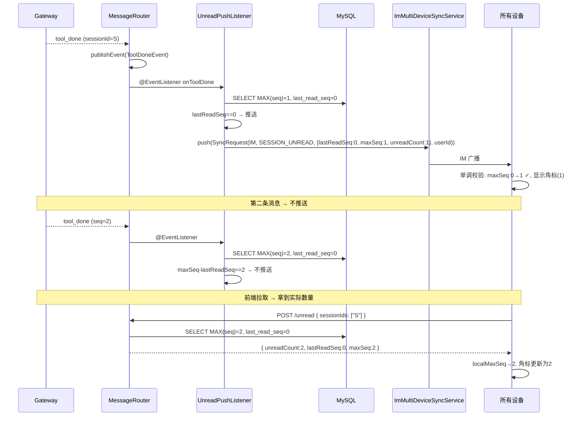
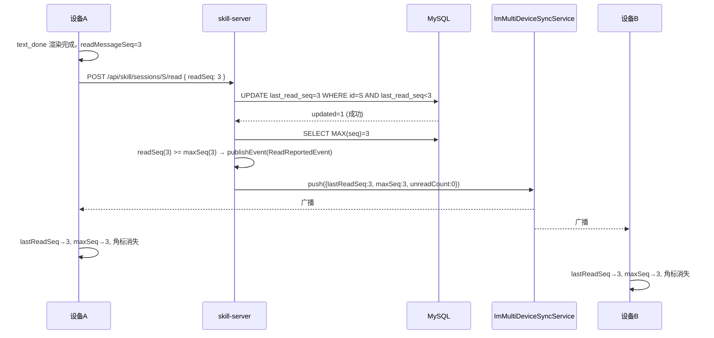
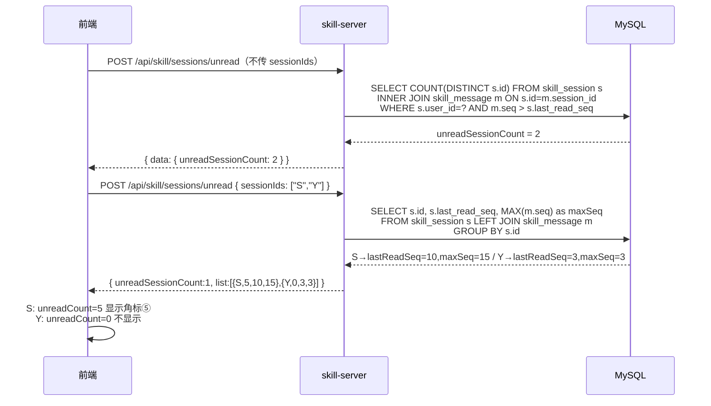

# Design (Inner Bak): 基于 lastReadSeq 持久化的未读消息方案

## 1 需求价值和概述

skill-miniapp 会话列表侧边栏中展示未读消息数字角标，前端追踪已渲染的最大 `message_seq` 并上报已读。服务端 MySQL 持久化 `lastReadSeq`，仅在首条未读时通过 IM API `/v1/app-notify` 跨设备推送通知，前端基于单调递增的 `lastReadSeq`/`maxSeq` 本地判断未读状态，彻底规避 IM 通知乱序导致的前端渲染错误。

**同步模式**：`skill.sync.mode=im`，多端同步走 IM API 通道。复用现有 `MultiDeviceSyncService` 通用基础设施（`06-15-multi-device-sync` 已构建），通过 `SyncRequest.syncMode` 路由。

**核心思路**：IM 通道无法保证消息有序到达。V2 方案每条消息都推送通知，若 IM 乱序（清除先于未读到达），前端会看到错误状态。本方案仅在"首条未读"时推送一次，前端按单调递增规则校验 `{lastReadSeq, maxSeq}`，自动拒绝乱序降级数据。

## 2 上下文分析

### 2.1 现有架构

- `skill_message.seq`：会话内严格递增序号（`uk_skill_message_session_seq`），天然适合做已读游标
- `skill_session` 表：会话主表，已有 CRUD + access control
- `ImMultiDeviceSyncService`：已存在，`AppNotifyRequest` 类型化调用 `/v1/app-notify`
- `CompositeMultiDeviceSyncService`：已存在，`getSyncMode()` 自注册路由
- `ApplicationEventPublisher`：Spring 事件发布机制
- 前端 `SessionSidebar` 已有渲染结构

### 2.2 需新增的能力

- MySQL DDL：`ALTER TABLE skill_session ADD COLUMN last_read_seq INT NOT NULL DEFAULT 0`
- `SkillSessionRepository.updateLastReadSeq(sessionId, readSeq)`：CAS 更新 SQL
- `ToolDoneEvent` / `ReadReportedEvent` 事件 + `UnreadPushListener` / `ReadReportedListener`
- `SkillSessionService.reportRead()`（CAS 更新 + 全读判断）+ `getUnreadSessions()`（纯 SQL）
- `SkillSessionController`：`POST /unread`（sessionIds 可选）+ `POST /{id}/read`
- 前端 `SessionUnreadState`（含单调校验）+ `readMessageSeq` 追踪 + 角标渲染

> **移除项**（相对 V2）：`UnreadRedisService.java`、Lua 脚本 `updateMaxSeq`/`markRead`——本方案不需要 Redis。

## 3 初始需求分析

### 3.1 初始化需求场景分析

| 场景 | 说明 |
|------|------|
| 用户不在看会话 S，S 收到首条新消息 | S 出现数字角标（所有设备），推送 `{lastReadSeq, maxSeq}` |
| S 收到第二条新消息（未读周期内） | 不推送，前端通过 `POST /unread` 拉取时获取实际未读数 |
| 用户切换到会话 S | 前端渲染完成后上报 readSeq → CAS 更新 lastReadSeq |
| 用户上报已读且 readSeq >= maxSeq | 发布 ReadReportedEvent → 推送 `{lastReadSeq=maxSeq, unreadCount=0}` → 多端角标清除 |
| IM 通知乱序（新数据先到，旧数据后到） | 前端单调校验拒绝旧数据，最终状态正确 |
| 离线后打开应用 | `POST /unread` 拉取，返回 lastReadSeq + maxSeq，本地计算未读数 |
| 流式进行中消息未渲染完成 | 不推进 readMessageSeq |

### 3.2 结构化 IR

- **用户可见**：会话列表数字角标（实际未读数，>99 显示 99+）
- **系统行为**：首条未读推送 + CAS 已读更新 + 前端单调校验
- **约束**：仅 miniapp 场景、im 模式走 IM API、lastReadSeq 持久化到 MySQL、不依赖 Redis

## 4 需求影响分析

### 4.1 特性影响分析

| 模块 | 影响类型 | 说明 |
|------|----------|------|
| skill-server | 修改 + 新增 | DDL（`skill_session.last_read_seq`）、Controller、Event、Listener、Service（无 Redis 变更） |
| skill-miniapp | 修改 | 类型、API、SessionSidebar、useSkillSession（单调校验）、useSkillStream |
| ai-gateway | 无改动 | — |

## 5 系统用例分析

### 5.1 用例清单

| 编号 | 用例名称 | 说明 |
|------|----------|------|
| UC-01 | 首条未读推送 | 消息到达后，`maxSeq - lastReadSeq == 1` 或 `lastReadSeq == 0` 时推送通知 |
| UC-02 | 端侧已读上报 | 前端渲染完成后 POST 上报 readSeq，CAS 更新 lastReadSeq |
| UC-03 | 全部已读多端同步 | readSeq >= maxSeq 时发布 ReadReportedEvent → IM 广播清除 |
| UC-04 | 离线后恢复未读状态 | `POST /unread` 返回 lastReadSeq + maxSeq，前端本地计算 |
| UC-05 | IM 乱序容忍 | 前端单调校验拒绝旧数据 |

### 5.2 UC-01 首条未读推送

#### 5.2.1 用例概述

消息落库后，UnreadPushListener 比较 `maxSeq` 与 `lastReadSeq`。仅在首条未读（`maxSeq - lastReadSeq == 1`）或用户从未读过（`lastReadSeq == 0`）时推送通知。已处未读态（差值 > 1）不推送，避免 IM 重复通知和乱序问题。

#### 5.2.2 用例流程



#### 5.2.3 影响的功能列表和需求分析

| 影响功能 | 说明 |
|----------|------|
| GatewayMessageRouter.handleToolDone | 末尾发布 ToolDoneEvent（+1 行） |
| UnreadPushListener | 新文件，`lastReadSeq == 0 \|\| maxSeq - lastReadSeq == 1` 判断 |
| ImMultiDeviceSyncService | 已存在，复用 |
| 前端 useSkillStream | 处理 `session.unread` → 单调校验 |

### 5.3 UC-02 端侧已读上报

#### 5.3.1 用例概述

前端消息完整渲染后，`readMessageSeq` 变化，debounce 500ms 后 POST 上报。服务端 CAS 更新 `lastReadSeq`（仅当 `readSeq > lastReadSeq`），并发冲突时返回当前值。更新后比较 `readSeq >= maxSeq`，决定是否发布全读事件。

#### 5.3.2 用例流程



#### 5.3.3 影响的功能列表和需求分析

| 影响功能 | 说明 |
|----------|------|
| 前端 useSkillSession | 维护 readMessageSeq，debounce 500ms → POST /{id}/read |
| SkillSessionController | 新增 `POST /{id}/read` |
| SkillSessionService.reportRead | CAS 更新 + 全读判断 + 条件发布 ReadReportedEvent |
| ReadReportedListener | 监听事件，推送 unreadCount=0 |

### 5.4 UC-03 全部已读多端同步

#### 5.4.1 用例概述

设备 A 上报已读且 `readSeq >= maxSeq` 后，通过 IM API 广播清除通知到所有设备。前端收到后单调校验更新本地状态，角标消失。

#### 5.4.2 用例流程

同 UC-02 流程中 `readSeq >= maxSeq` 分支。ReadReportedListener 构建 `SyncRequest(unreadCount=0, lastReadSeq=maxSeq)` → `ImMultiDeviceSyncService.push()` → IM 广播。

### 5.5 UC-04 离线后恢复未读状态

#### 5.5.1 用例概述

用户离线后重新进入应用，通过 `POST /unread` 拉取。返回每个会话的 `lastReadSeq` + `maxSeq`，前端本地计算 `unreadCount = maxSeq - lastReadSeq`。

#### 5.5.2 用例流程



### 5.6 UC-05 IM 乱序容忍

#### 5.6.1 用例概述

IM 通道可能乱序到达。本方案通过两项机制保障正确性：(1) 仅首条未读推送，减少通知数量降低乱序概率；(2) 前端单调校验 `maxSeq`/`lastReadSeq` 只允许递增，拒绝降级数据。

#### 5.6.2 用例流程

```
正常时序:  推送A(maxSeq=5,lastReadSeq=0) → 推送B(maxSeq=5,lastReadSeq=5,清除)
IM 乱序:   推送B 先到 → 推送A 后到

前端处理:
  收到 B: maxSeq=5≥0✓, lastReadSeq=5≥0✓ → 接受 → 角标消失(5-5=0)
  收到 A: maxSeq=5≥5✓, lastReadSeq=0<5✗ → 拒绝(lastReadSeq 不递增)
  
最终状态: 角标消失 ✓
```

## 6 功能设计

### 6.1 业界实现方案分析

| 方案 | 推送策略 | 乱序容忍 | 复杂度 |
|------|---------|---------|--------|
| 每条消息推送 + 前端直接渲染（V2） | 每次 | 无保护 | 低 |
| Seq 号推送 + 前端单调校验（Slack/微信） | 每次 | 单调递增保护 | 中 |
| **首条未读推送 + 单调校验（本方案）** | 仅首条 | 单调递增 + 少推送 = 低乱序概率 | 中 |
| 已读/未读全量快照推送 | 每次 | 天然幂等 | 高（数据量大） |

本方案在 Slack/微信的单调递增基础上，进一步减少推送频率（仅首条），将 IM 乱序概率降到最低。

### 6.2 功能实现整体设计方案

```
┌──────────────────────────────────────────────────────────────┐
│                    事件驱动 + 单调递增                          │
├──────────────────────────────────────────────────────────────┤
│                                                              │
│  handleToolDone ──→ ToolDoneEvent ──→ UnreadPushListener     │
│       (+1 行)                      │ DB maxSeq + lastReadSeq  │
│                                    │ 首条未读? → 决定推送       │
│                                    ↓ (是)                     │
│                              build SyncRequest               │
│                                → CompositeMultiDeviceSyncSvc  │
│                                  → ImMultiDeviceSyncSvc(已存在)│
│                                    └── POST /v1/app-notify   │
│                                                              │
│  reportRead ──→ CAS UPDATE lastReadSeq                       │
│  (新方法)          │  readSeq > lastReadSeq?                  │
│                    │  updated=0 → 返回当前值                   │
│                    ↓ updated=1                                │
│              readSeq >= maxSeq?                               │
│                    ↓ yes                                      │
│              ReadReportedEvent ──→ Listener                  │
│                                    ↓ push(unreadCount=0)      │
│                                                              │
│  前端收到推送:                                                │
│    if (newMaxSeq>=local && newLastReadSeq>=local) accept      │
│    else discard (乱序降级数据)                                 │
│    unreadCount = localMaxSeq - localLastReadSeq               │
│                                                              │
└──────────────────────────────────────────────────────────────┘
```

### 6.3 lastReadSeq 持久化与推送决策

#### 6.3.1 实现思路

MySQL `skill_session.last_read_seq` 作为权威数据源，单调递增。推送决策在 UnreadPushListener 中完成：比较 `maxSeq`（从 `skill_message` 表查询）和 `lastReadSeq`，仅首条未读时推送。不需要 Redis。

#### 6.3.2 实现设计

**推送决策**：

```java
int maxSeq = skillMessageRepository.findMaxSeqBySessionId(sessionId);
int lastReadSeq = session.getLastReadSeq();

// 仅首条未读推送
if (lastReadSeq == 0 || maxSeq - lastReadSeq == 1) {
    multiDeviceSyncService.push(buildUnreadRequest(sessionId, userId, lastReadSeq, maxSeq, session));
}
```

**决策表**：

| lastReadSeq | maxSeq | 差值 | 推送? | 说明 |
|-------------|--------|------|-------|------|
| 0 | 1 | 1 | ✅ | 首条消息，初始态 |
| 0 | 5 | 5 | ✅ | 批量消息但从未读过 |
| 3 | 4 | 1 | ✅ | 读到#3，新消息#4 是首条未读 |
| 3 | 5 | 2 | ❌ | #4 已是未读（可能推送过），#5 不推送 |
| 5 | 5 | 0 | ❌ | 全部已读 |

**CAS 已读更新**：

```sql
UPDATE skill_session
SET last_read_seq = #{readSeq}
WHERE id = #{sessionId}
  AND last_read_seq < #{readSeq}
```

Java 侧：

```java
int updated = skillSessionRepository.updateLastReadSeq(sessionId, readSeq);
if (updated > 0) {
    int maxSeq = skillMessageRepository.findMaxSeqBySessionId(sessionId);
    if (readSeq >= maxSeq) {
        applicationEventPublisher.publishEvent(
            new ReadReportedEvent(sessionId, userId, readSeq, maxSeq));
    }
}
```

#### 6.3.3 功能可靠性分析

| 风险 | 缓解 |
|------|------|
| `lastReadSeq == 0` + 批量消息导致重复推送 | 每条消息均满足条件，推送频率＝消息频率。IM 模式可增加 Redis `ss:notified:{userId}:{sessionId}` 去重标记（TTL 30s） |
| 并发已读上报（两设备同时 POST 不同 readSeq） | CAS `WHERE last_read_seq < #{readSeq}` 确保只有更大的值写入成功 |
| 已读上报后 MySQL 主从延迟 | `POST /unread` 读主库，推送数据来自写入后的当前事务 |
| `POST /unread` 查询性能 | `skill_message` 已有 `(session_id, seq)` 索引，单用户会话数 < 100，JOIN + GROUP BY 性能可接受 |

#### 6.3.4 功能安全分析

| 安全点 | 措施 |
|--------|------|
| 越权修改已读游标 | `requireSessionAccess` 校验 cookie userId == session.userId |
| CAS 条件保证只增不减 | `WHERE last_read_seq < #{readSeq}` 防止恶意降低 |
| 未读信息泄漏 | 查询按 `s.user_id = #{userId}` 隔离 |

#### 6.3.5 架构元素影响列表

| 架构元素 | 影响 |
|----------|------|
| 数据流 | 新增 3 条：消息 → 首条推送 / 上报 → CAS 更新 → 全读?→ 清除推送 / 拉取 → 本地计算 |
| 接口 | 新增 `POST /unread`（sessionIds 可选）+ `POST /{id}/read` |
| 事件 | 新增 `ToolDoneEvent` + `ReadReportedEvent` |
| 数据存储 | DDL：`skill_session.last_read_seq`（MySQL），移除 Redis Hash 依赖 |
| 外部依赖 | `ImMultiDeviceSyncService`（已存在）调用 IM API `/v1/app-notify` |

#### 6.3.6 skill-server 架构元素实现设计

##### 6.3.6.1 接口设计

###### REST API — 已读上报

```
POST /api/skill/sessions/{id}/read
```

**请求体**:

| 属性名 | 类型 | 必填 | 说明 |
|--------|------|------|------|
| readSeq | int | Y | 前端已渲染的最大 message_seq |

**响应体**:

| 属性名 | 类型 | 说明 |
|--------|------|------|
| code | int | 0=成功 |
| data.welinkSessionId | String | 会话 ID |
| data.lastReadSeq | int | 更新后的已读游标 |
| data.maxSeq | int | 当前会话最大 seq |
| data.unreadCount | int | 剩余未读数 |

```json
{ "code": 0, "data": { "welinkSessionId": "123", "lastReadSeq": 15, "maxSeq": 18, "unreadCount": 3 } }
```

###### REST API — 未读查询

```
POST /api/skill/sessions/unread
```

**请求体**（`sessionIds` 可选）:

| 属性名 | 类型 | 必填 | 说明 |
|--------|------|------|------|
| sessionIds | List\<String\> | N | 不传仅返总数；传入返详情 |

**响应体 — 不传 sessionIds**:

```json
{ "code": 0, "data": { "unreadSessionCount": 2 } }
```

**响应体 — 传 sessionIds**:

```json
{
  "code": 0,
  "data": {
    "unreadSessionCount": 2,
    "unreadSessionList": [
      { "sessionId": "123", "unreadCount": 5, "lastReadSeq": 10, "maxSeq": 15 },
      { "sessionId": "456", "unreadCount": 0, "lastReadSeq": 3, "maxSeq": 3 }
    ]
  }
}
```

###### WebSocket / IM 推送协议

```json
{
  "type": "session.unread",
  "welinkSessionId": "123456789",
  "lastReadSeq": 10,
  "maxSeq": 15,
  "unreadCount": 5,
  "assistantAccount": "assistant_xxx",
  "emittedAt": "2026-06-15T10:30:00"
}
```

##### 6.3.6.2 数据模型设计

###### 6.3.6.2.1 关系型数据库设计

**DDL**（V17 migration）:

```sql
ALTER TABLE skill_session ADD COLUMN last_read_seq INT NOT NULL DEFAULT 0
  COMMENT '用户最后已读的 message_seq，单调递增';
```

**CAS 更新 SQL**（SkillSessionMapper.xml）:

```xml
<update id="updateLastReadSeq">
    UPDATE skill_session
    SET last_read_seq = #{readSeq}
    WHERE id = #{sessionId}
      AND last_read_seq &lt; #{readSeq}
</update>
```

**未读查询 SQL**:

```sql
-- 不传 sessionIds：未读会话计数
SELECT COUNT(DISTINCT s.id)
FROM skill_session s
INNER JOIN skill_message m ON s.id = m.session_id
WHERE s.user_id = #{userId}
  AND m.seq > s.last_read_seq;

-- 传 sessionIds：详情列表
SELECT s.id AS sessionId,
       s.last_read_seq AS lastReadSeq,
       COALESCE(MAX(m.seq), 0) AS maxSeq
FROM skill_session s
LEFT JOIN skill_message m ON s.id = m.session_id
WHERE s.user_id = #{userId}
  AND s.id IN
  <foreach collection="sessionIds" item="id" open="(" close=")" separator=",">
    #{id}
  </foreach>
GROUP BY s.id;
```

应用层计算：`unreadCount = maxSeq - lastReadSeq`，`hasUnread = unreadCount > 0`。

###### 6.3.6.2.2 Redis 缓存设计

不需要。未读状态完全由 MySQL 维护。

###### 6.3.6.2.3 配置项设计

```yaml
skill:
  sync:
    mode: im  # im | ws（SyncProperties 已存在）
    im:
      app-notify:
        tenant: ${IM_APP_NOTIFY_TENANT}
        module: ${IM_APP_NOTIFY_MODULE}
        scope: 2
```

无新增配置项。相对 V2 移除了 `unread.sync-mode` 等独立配置。

#### 6.3.7 skill-miniapp 架构元素实现设计

| 文件 | 改动 |
|------|------|
| `protocol/types.ts` | `SessionUnread { sessionId, lastReadSeq, maxSeq, unreadCount }`；`SessionUnreadState { localLastReadSeq, localMaxSeq, readMessageSeq }` |
| `utils/api.ts` | `fetchUnreadSessions(sessionIds?)` + `reportRead(sessionId, readSeq)` |
| `hooks/useSkillSession.ts` | 维护 `SessionUnreadState`（含 `applyServerState()` 单调校验）+ `readMessageSeq` 追踪 + debounce 上报 |
| `hooks/useSkillStream.ts` | 处理 `session.unread` → `applyServerState()`；流式状态追踪 |
| `components/SessionSidebar.tsx` | 数字角标（`unreadCount()`，>99 显示 99+） |
| `index.css` | `.session-badge` 样式 |

**前端单调校验核心逻辑**：

```typescript
function applyServerState(server: { lastReadSeq: number; maxSeq: number }) {
  // 单调递增校验：两个值都只允许增大
  if (server.maxSeq >= localMaxSeq && server.lastReadSeq >= localLastReadSeq) {
    localMaxSeq = server.maxSeq;
    localLastReadSeq = server.lastReadSeq;
    return true;
  }
  return false; // 乱序降级数据，丢弃
}

function unreadCount(): number {
  return Math.max(0, localMaxSeq - localLastReadSeq);
}
```

## 7 系统级非功能性设计

### 7.1 系统级的 FMEA 影响分析

| 故障模式 | 影响 | 检测 | 缓解 |
|----------|------|------|------|
| IM API 不可用 | 多端同步中断，本端角标不受影响 | `[EXT_CALL]` 错误日志 | IM API 恢复后下次推送自愈 |
| MySQL 不可用 | 已读上报 + 未读查询均失败 | SQL 异常日志 | 恢复后重试；前端 `POST /unread` 返回空降级 |
| CAS 更新冲突（两设备同时上报） | 仅更大的 readSeq 生效，另一方返回当前值 | 返回值 = 0 | 前端读取响应中的最新 lastReadSeq |
| IM 通知乱序 | 前端角标错误（概率低） | 无法主动检测 | 单调校验拒绝旧数据 |
| `lastReadSeq == 0` 批量消息推送风暴 | IM 通知频率 = 消息频率 | IM 调用量监控 | 可增加 Redis `ss:notified:{userId}:{sessionId}` 去重标记（TTL 30s） |
| 会话硬删除 | `skill_session` 行删除，lastReadSeq 随之清除 | — | 无影响 |

### 7.2 系统级安全影响分析

- 未读信息按 `userId` 隔离（SQL `WHERE s.user_id = #{userId}`）
- 已读上报需 `requireSessionAccess` 校验
- CAS `WHERE last_read_seq < #{readSeq}` 防止恶意降低已读游标
- IM API 调用使用现有 IM token 鉴权

### 7.3 兼容性

#### 7.3.1 后向兼容性确认

- DDL 新增列含 `DEFAULT 0`，存量会话自动初始化为 0（未读状态：全部消息均为未读）
- `POST /unread` 为全新端点，不影响现有会话列表 API
- `POST /{id}/read` 为全新端点

#### 7.3.2 前向兼容性确认

- `StreamMessage.SESSION_UNREAD` 为新增类型，旧客户端忽略即可
- `lastReadSeq` + `maxSeq` 字段均为追加，前端可渐进升级
- 后续可扩展为消息级已读（`lastReadSeq` 改为 `lastReadMessageId`）

### 7.4 可运维

- 无 Redis 依赖，减少运维组件
- `skill.sync.mode`（SyncProperties 已存在）控制同步方式
- `POST /unread` 纯 SQL 查询，可通过慢查询日志监控
- CAS 更新返回值可监控冲突率

### 7.5 资料

- IM API 文档：`.trellis/tasks/06-10-skill-session-unread-badge/im-mulit-client-sync-api.md`
- V2 方案对比：`备份设计方案.md`
- MultiDeviceSyncService 基础设施：`.trellis/tasks/archive/2026-06/06-15-multi-device-sync/design.md`

## 8 CheckList

### 8.1 设计自检清单

- [ ] MySQL DDL：`ALTER TABLE skill_session ADD COLUMN last_read_seq INT NOT NULL DEFAULT 0`
- [ ] `SkillSessionMapper.xml`：`updateLastReadSeq` CAS SQL（`WHERE last_read_seq < #{readSeq}`）
- [ ] `SkillSessionRepository.updateLastReadSeq(sessionId, readSeq)` 返回 affected rows
- [ ] `ToolDoneEvent` record + `ReadReportedEvent` record（含 lastReadSeq, maxSeq）
- [ ] `UnreadPushListener`：`lastReadSeq == 0 || maxSeq - lastReadSeq == 1` 推送决策
- [ ] `ReadReportedListener`：推送 `{lastReadSeq, maxSeq, unreadCount: 0}`
- [ ] `SkillSessionService.reportRead`：CAS 更新 + `readSeq >= maxSeq` 判断
- [ ] `SkillSessionService.getUnreadSessions`：纯 SQL 查询 + 应用层 unreadCount 计算
- [ ] `SkillSessionController`：`POST /unread`（sessionIds 可选）+ `POST /{id}/read`
- [ ] `StreamMessage.SESSION_UNREAD` + `sessionUnread(lastReadSeq, maxSeq, unreadCount, ...)` 工厂方法
- [x] `MultiDeviceSyncService` + `CompositeMultiDeviceSyncService` + `ImMultiDeviceSyncService`（已存在）
- [x] `SyncType.SESSION_UNREAD("session.unread")`（已存在）
- [x] `SyncProperties` 配置（`skill.sync.mode`，已存在）
- [ ] 前端 `SessionUnreadState` + `applyServerState()` 单调校验
- [ ] 前端 `readMessageSeq` 追踪 + debounce 500ms + 流式保护
- [ ] 前端 SessionSidebar 数字角标（`localMaxSeq - localLastReadSeq`）
- [ ] `lastReadSeq == 0` 批量消息推送风暴评估（可选 Redis 去重）
