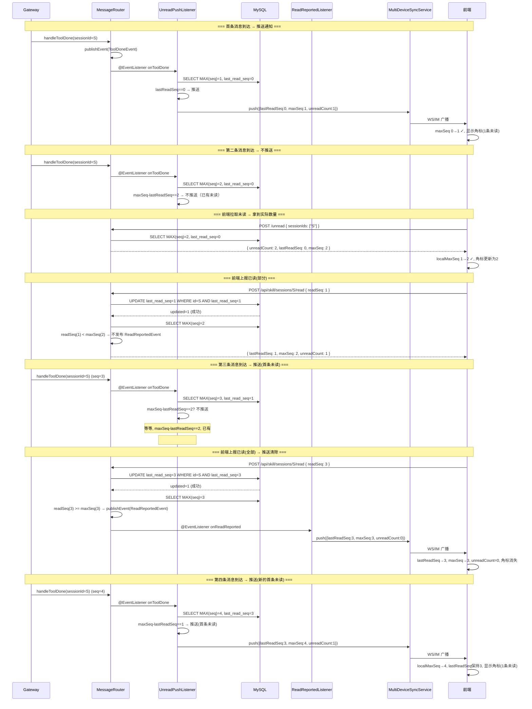

# Design (备份): 基于 lastReadSeq 持久化的未读消息方案

> 从 V2 方案分支，核心差异：**服务端 MySQL 持久化 `lastReadSeq`**，仅在首条未读时推送通知，前端基于单调递增的 `lastReadSeq`/`maxSeq` 本地判断未读，彻底规避 IM 通知乱序导致的前端渲染错误。

## 1 与 V2 方案的核心差异

| 维度 | V2 方案 | 本方案 |
|------|---------|--------|
| 已读游标存储 | 纯 Redis Hash `ss:unread:{userId}`，TTL 7d | MySQL `skill_session.last_read_seq`，持久化 |
| 推送时机 | 每条新消息到达都推送（Lua return 1） | 仅首条未读时推送（`maxSeq - lastReadSeq == 1` 或 `lastReadSeq == 0`） |
| 已读判断 | Lua `markRead` 原子 HDEL | `UPDATE last_read_seq WHERE last_read_seq < readSeq` CAS 更新 |
| 未读查询 | Redis HLEN + HMGET | MySQL 纯查询（`MAX(seq) - last_read_seq`） |
| 未读计数 | 二态（0 或 1） | 实际未读数 = `maxSeq - lastReadSeq` |
| Redis 依赖 | Hash 存储 + 2 个 Lua 脚本 | 无（不需要 Redis） |
| 前端状态 | 收到推送即更新 | 基于 `lastReadSeq`/`maxSeq` 单调递增校验后更新 |
| IM 乱序容忍 | 无保护 | 单调递增校验 + 仅首条推送，天然防乱序 |

### 1.1 为什么 IM 通知会乱序

```
时序:  消息1到达(seq=10) → 推送A(unreadCount=1) → 前端立即上报已读(readSeq=10)
       → 推送B(unreadCount=0,清除) → 消息2到达(seq=11) → 推送C(unreadCount=1)

IM 通道乱序到达:  推送C → 推送A → 推送B
前端看到:  unreadCount=1 → unreadCount=1 → unreadCount=0
结果:     角标出现      角标仍是1      角标消失  ❌ 但实际 seq=11 未读!
```

**本方案解法**：仅首条未读推送 (seq=10 时推一次)，前端每次收到 `{lastReadSeq, maxSeq}` 时做单调校验，`maxSeq` 和 `lastReadSeq` 只允许递增：

```
推送: {lastReadSeq: 0, maxSeq: 10} → 前端接受 (maxSeq 0→10 ✓)
推送: {lastReadSeq: 10, maxSeq: 10} → 前端接受 (lastReadSeq 0→10 ✓)
推送: {lastReadSeq: 10, maxSeq: 11} → 前端接受 (maxSeq 10→11 ✓)
```

即使乱序到达，单调校验确保最终状态正确。

## 2 数据模型

### 2.1 MySQL

**DDL 变更**（V17 migration）:

```sql
ALTER TABLE skill_session ADD COLUMN last_read_seq INT NOT NULL DEFAULT 0
  COMMENT '用户最后已读的 message_seq，单调递增';
```

| 列 | 类型 | 说明 |
|----|------|------|
| `last_read_seq` | INT NOT NULL DEFAULT 0 | 单调递增，仅在 `readSeq > last_read_seq` 时更新 |

**更新约束**（应用层 CAS）:

```sql
UPDATE skill_session
SET last_read_seq = #{readSeq}
WHERE id = #{sessionId}
  AND last_read_seq < #{readSeq}
```

返回值 > 0 表示更新成功（readSeq 严格大于当前值），= 0 表示并发冲突或重复上报，忽略即可。

### 2.2 Redis

**不需要 Redis**。未读状态完全由 MySQL 维护：
- `maxSeq` = `SELECT MAX(seq) FROM skill_message WHERE session_id = ?`（已有索引）
- `lastReadSeq` = `skill_session.last_read_seq`
- 未读数 = `maxSeq - lastReadSeq`

### 2.3 未读判断公式

```
unreadCount(sessionId) = MAX(skill_message.seq) - skill_session.last_read_seq
```

- `unreadCount > 0`：有未读
- `unreadCount == 0` 或 `MAX(seq) IS NULL`：无未读
- `lastReadSeq == 0`：用户从未读过此会话（初始态）

### 2.4 推送决策公式

```
shouldPush = (lastReadSeq == 0) || (maxSeq - lastReadSeq == 1)
```

| lastReadSeq | maxSeq | maxSeq - lastReadSeq | shouldPush | 说明 |
|-------------|--------|---------------------|------------|------|
| 0 | 1 | 1 | ✅ true | 首条消息到达，初始态 |
| 0 | 5 | 5 | ✅ true | 批量消息到达但用户从未读过 |
| 3 | 4 | 1 | ✅ true | 上次读到 seq=3，新消息 seq=4，首条未读 |
| 3 | 5 | 2 | ❌ false | 已有未读 seq=4，seq=5 是第二条未读，不推送 |
| 5 | 5 | 0 | ❌ false | 无新消息 |
| 3 | 3 | 0 | ❌ false | 全部已读 |

**关键行为**：每个"未读周期"只推送一次——在 0→1 未读的转换点。后续未读消息只在 `POST /unread` 拉取时体现。

## 3 接口设计

### 3.1 前端 → 服务端：已读上报

**REST 接口**：

```
POST /api/skill/sessions/{id}/read
```

| 属性名 | 类型 | 必填 | 说明 |
|--------|------|------|------|
| Cookie: userId | string | Y | 用户身份 |
| body.readSeq | int | Y | 前端已渲染的最大 message_seq |

**响应体**（新增 `lastReadSeq` 字段）:

| 属性名 | 类型 | 说明 |
|--------|------|------|
| code | int | 0=成功 |
| data.welinkSessionId | String | 会话 ID |
| data.lastReadSeq | int | 更新后的 lastReadSeq |
| data.maxSeq | int | 当前会话最大 seq |
| data.unreadCount | int | 剩余未读数 |

```json
{ "code": 0, "data": { "welinkSessionId": "123", "lastReadSeq": 15, "maxSeq": 18, "unreadCount": 3 } }
```

**核心处理**：

```java
@Transactional
public ReadReportResponse reportRead(Long sessionId, String userId, int readSeq) {
    accessControl.requireSessionAccess(sessionId, userId);

    // 1. CAS 更新 lastReadSeq（仅当 readSeq > lastReadSeq）
    int updated = skillSessionRepository.updateLastReadSeq(sessionId, readSeq);
    if (updated == 0) {
        // 并发冲突或重复上报，读取当前值返回
        SkillSession session = skillSessionRepository.findById(sessionId);
        int maxSeq = skillMessageRepository.findMaxSeqBySessionId(sessionId);
        return new ReadReportResponse(sessionId, session.getLastReadSeq(), maxSeq);
    }

    // 2. 读取 maxSeq
    int maxSeq = skillMessageRepository.findMaxSeqBySessionId(sessionId);
    int unreadCount = maxSeq - readSeq; // readSeq 即为新的 lastReadSeq

    // 3. 判断是否全部已读
    if (readSeq >= maxSeq) {
        applicationEventPublisher.publishEvent(
            new ReadReportedEvent(sessionId, userId, readSeq, maxSeq));
    }

    return new ReadReportResponse(sessionId, readSeq, maxSeq, unreadCount);
}
```

### 3.2 前端拉取：未读信息查询

```
POST /api/skill/sessions/unread
```

**请求体**（`sessionIds` 可选）:

| 属性名 | 类型 | 必填 | 说明 |
|--------|------|------|------|
| sessionIds | List\<String\> | N | 不传仅返总数；传入返详情 |

**响应体 — 不传 sessionIds**:

```json
{ "code": 0, "data": { "unreadSessionCount": 2 } }
```

**响应体 — 传 sessionIds**:

```json
{
  "code": 0,
  "data": {
    "unreadSessionCount": 2,
    "unreadSessionList": [
      { "sessionId": "123", "unreadCount": 5, "lastReadSeq": 10, "maxSeq": 15 },
      { "sessionId": "456", "unreadCount": 1, "lastReadSeq": 3, "maxSeq": 4 }
    ]
  }
}
```

| 属性名 | 类型 | 说明 |
|--------|------|------|
| data.unreadSessionCount | int | 有未读的会话总数 |
| data.unreadSessionList[].sessionId | String | 会话 ID |
| data.unreadSessionList[].unreadCount | int | `maxSeq - lastReadSeq` |
| data.unreadSessionList[].lastReadSeq | int | 服务端持久化的已读游标 |
| data.unreadSessionList[].maxSeq | int | 当前会话最大 seq |

**实现**（纯 SQL）:

```sql
-- 不传 sessionIds：未读会话计数
SELECT COUNT(DISTINCT s.id)
FROM skill_session s
INNER JOIN skill_message m ON s.id = m.session_id
WHERE s.user_id = #{userId}
  AND m.seq > s.last_read_seq;

-- 传 sessionIds：详情列表
SELECT s.id AS sessionId,
       s.last_read_seq AS lastReadSeq,
       COALESCE(MAX(m.seq), 0) AS maxSeq
FROM skill_session s
LEFT JOIN skill_message m ON s.id = m.session_id
WHERE s.user_id = #{userId}
  AND s.id IN
  <foreach collection="sessionIds" item="id" open="(" close=")" separator=",">
    #{id}
  </foreach>
GROUP BY s.id;
```

应用层计算：`unreadCount = maxSeq - lastReadSeq`，`hasUnread = unreadCount > 0`。

### 3.3 服务端 → 前端：未读推送

```json
{
  "type": "session.unread",
  "welinkSessionId": "123456789",
  "lastReadSeq": 10,
  "maxSeq": 15,
  "unreadCount": 5,
  "assistantAccount": "assistant_xxx",
  "emittedAt": "2026-06-15T10:30:00"
}
```

| 属性名 | 类型 | 说明 |
|--------|------|------|
| type | string | 固定 `"session.unread"` |
| welinkSessionId | string | 会话 ID |
| lastReadSeq | int | 服务端当前已读游标 |
| maxSeq | int | 当前会话最大 seq |
| unreadCount | int | `maxSeq - lastReadSeq`（实际未读数） |
| assistantAccount | string | 助手账号（nullable） |
| emittedAt | ISO-8601 | 推送时间 |

前端收到后做单调校验：
```
if (newMaxSeq >= localMaxSeq && newLastReadSeq >= localLastReadSeq) {
    localMaxSeq = newMaxSeq;
    localLastReadSeq = newLastReadSeq;
    unread = localMaxSeq > localLastReadSeq;
}
```

## 4 MultiDeviceSyncService（复用现有基础设施）

同 V2 方案，未读场景构建 `SyncRequest` 并调用 `push()`。

### 4.1 未读推送调用方式

```java
SyncRequest request = new SyncRequest(
    syncProperties.getMode(),
    SyncType.SESSION_UNREAD,
    Map.of(
        "welinkSessionId", sessionId.toString(),
        "lastReadSeq", lastReadSeq,
        "maxSeq", maxSeq,
        "unreadCount", maxSeq - lastReadSeq,
        "assistantAccount", assistantAccount != null ? assistantAccount : ""
    ),
    userId
);
multiDeviceSyncService.push(request);
```

## 5 事件驱动架构

### 5.1 事件定义

```java
public record ToolDoneEvent(Long sessionId, String userId, SkillSession session, String traceId) {}

public record ReadReportedEvent(Long sessionId, String userId, int lastReadSeq, int maxSeq) {}
```

### 5.2 发布点

**`GatewayMessageRouter.handleToolDone`** 末尾追加一行（同 V2）：

```java
applicationEventPublisher.publishEvent(new ToolDoneEvent(numericId, userId, session, traceId));
```

**`SkillSessionService.reportRead`**（见 3.1）：CAS 更新成功后，若 `readSeq >= maxSeq` 则发布 `ReadReportedEvent`。

### 5.3 新增监听器

```java
@Component
public class UnreadPushListener {

    @EventListener
    public void onToolDone(ToolDoneEvent event) {
        Long sessionId = event.sessionId();
        String userId = event.userId();
        SkillSession session = event.session();

        // 1. 读取 maxSeq 和 lastReadSeq
        int maxSeq = skillMessageRepository.findMaxSeqBySessionId(sessionId);
        int lastReadSeq = session.getLastReadSeq();

        // 2. 推送决策：仅首条未读时推送
        if (lastReadSeq == 0 || maxSeq - lastReadSeq == 1) {
            multiDeviceSyncService.push(new SyncRequest(
                syncProperties.getMode(),
                SyncType.SESSION_UNREAD,
                Map.of(
                    "welinkSessionId", sessionId.toString(),
                    "lastReadSeq", lastReadSeq,
                    "maxSeq", maxSeq,
                    "unreadCount", maxSeq - lastReadSeq,
                    "assistantAccount", session.getAssistantAccount() != null
                        ? session.getAssistantAccount() : ""
                ),
                userId));
        }
    }
}

@Component
public class ReadReportedListener {
    @EventListener
    public void onReadReported(ReadReportedEvent event) {
        multiDeviceSyncService.push(new SyncRequest(
            syncProperties.getMode(),
            SyncType.SESSION_UNREAD,
            Map.of(
                "welinkSessionId", event.sessionId().toString(),
                "lastReadSeq", event.lastReadSeq(),
                "maxSeq", event.maxSeq(),
                "unreadCount", 0,
                "assistantAccount", ""
            ),
            event.userId()));
    }
}
```

**推送决策矩阵**:

| 条件 | 推送? | unreadCount | 说明 |
|------|-------|-------------|------|
| `lastReadSeq == 0` | ✅ 推送 | maxSeq | 初始态，用户从未读过 |
| `maxSeq - lastReadSeq == 1` | ✅ 推送 | 1 | 首条未读消息 |
| `maxSeq - lastReadSeq > 1` | ❌ 不推送 | — | 已有未读，等待 `POST /unread` 拉取 |
| `maxSeq - lastReadSeq == 0` | ❌ 不推送 | — | 全部已读 |
| `readSeq >= maxSeq` | ✅ 推送 ReadReportedEvent | 0 | 已读上报后全部清除 |

**push/unread 协同流程**:



## 6 前端

### 6.1 本地状态模型

```typescript
// 每个会话维护的本地未读状态（单调递增）
interface SessionUnreadState {
  localLastReadSeq: number;  // 单调递增，来自服务端推送 / POST /unread
  localMaxSeq: number;       // 单调递增，来自服务端推送 / POST /unread
  readMessageSeq: number;    // 前端已渲染的最大 seq（用于上报）
}
```

**单调校验规则**：

```typescript
function applyServerState(server: { lastReadSeq: number; maxSeq: number }) {
  if (server.maxSeq >= local.localMaxSeq && server.lastReadSeq >= local.localLastReadSeq) {
    local.localMaxSeq = server.maxSeq;
    local.localLastReadSeq = server.lastReadSeq;
  }
  // 否则丢弃（乱序到达的旧数据）
}

function hasUnread(): boolean {
  return local.localMaxSeq > local.localLastReadSeq;
}

function unreadCount(): number {
  return local.localMaxSeq - local.localLastReadSeq;
}
```

### 6.2 已读上报逻辑

同 V2，`readMessageSeq` 仅在消息完整渲染后推进（流式保护），debounce 500ms 后 POST。

### 6.3 未读信息拉取

```
进入应用 / 回到前台 / WS 重连
  → POST /api/skill/sessions/unread（不传 sessionIds）
  → 返回 lastReadSeq + maxSeq → applyServerState()

侧边栏渲染
  → POST /api/skill/sessions/unread { sessionIds: [...] }
  → 各会话 applyServerState()
```

### 6.4 角标显示

```
unreadCount = localMaxSeq - localLastReadSeq
unreadCount > 0 → 显示数字角标
unreadCount > 99 → 显示 99+
当前正查看该会话 → 不显示角标
```

### 6.5 改动清单

| 文件 | 改动 |
|------|------|
| `protocol/types.ts` | `SessionUnread { sessionId, lastReadSeq, maxSeq, unreadCount }`；`SessionUnreadState` 本地状态 |
| `utils/api.ts` | `fetchUnreadSessions(sessionIds?)` + `reportRead(sessionId, readSeq)` |
| `hooks/useSkillSession.ts` | 维护 `SessionUnreadState`（含单调校验）+ `readMessageSeq` 追踪 + debounce 上报 |
| `hooks/useSkillStream.ts` | 处理 `session.unread` → `applyServerState()` |
| `components/SessionSidebar.tsx` | 数字角标（`unreadCount()`） |
| `index.css` | `.session-badge` 样式 |

## 7 skill-server 改动清单

| 层 | 文件 | 改动 | 侵入程度 |
|----|------|------|----------|
| DB | `V17__add_last_read_seq.sql` | `ALTER TABLE skill_session ADD last_read_seq` | DDL |
| Mapper | `SkillSessionMapper.xml` | `updateLastReadSeq` CAS SQL | 新 SQL |
| Repository | `SkillSessionRepository.java` | `updateLastReadSeq(sessionId, readSeq)` | 新方法 |
| Event | `ToolDoneEvent.java` | 新增 record | 新文件 |
| Event | `ReadReportedEvent.java` | 新增 record（含 lastReadSeq, maxSeq） | 新文件 |
| Listener | `UnreadPushListener.java` | 新增，`lastReadSeq == 0 \|\| maxSeq - lastReadSeq == 1` 判断 | 新文件 |
| Listener | `ReadReportedListener.java` | 新增，推送 lastReadSeq + maxSeq | 新文件 |
| Service | `SkillSessionService.java` | `reportRead()`（CAS 更新 + 全读判断）+ `getUnreadSessions()`（纯 SQL） | 新方法 |
| Controller | `SkillSessionController.java` | `POST /unread`（sessionIds 可选）+ `POST /{id}/read` | 新端点 |
| Model | `StreamMessage.java` | `SESSION_UNREAD` + 含 lastReadSeq/maxSeq 的工厂方法 | 最小 |
| Service | `GatewayMessageRouter.java` | `handleToolDone` 末尾发布 ToolDoneEvent（1 行） | **极轻** |
| Service | `MultiDeviceSyncService.java` 等 sync 文件 | 复用，不改动 | 已存在 |

**移除的文件**（相对 V2）:
| 文件 | 原因 |
|------|------|
| `UnreadRedisService.java` | 不需要 Redis Hash + Lua |
| Lua 脚本 `updateMaxSeq` / `markRead` | 不需要 Redis 操作 |

## 8 边缘情况

| 场景 | 处理 |
|------|------|
| `lastReadSeq == 0` + 批量消息（如 10 条同时到达） | 每条消息都满足 `lastReadSeq == 0` 条件，均推送。前端单调校验：`maxSeq` 递增接受，最终状态正确（10 条未读）。服务端仅无谓推送 |
| 并发已读上报（两个设备同时上报不同 readSeq） | CAS `WHERE last_read_seq < #{readSeq}` 确保只有更大的 readSeq 更新成功，冲突方返回当前值 |
| 已读上报 readSeq 小于当前 lastReadSeq | CAS 条件不满足，updated=0，返回当前 lastReadSeq + maxSeq |
| 会话无任何消息 | `MAX(seq) IS NULL` → maxSeq=0，lastReadSeq=0 → unreadCount=0 |
| 用户从未读过某会话 | `lastReadSeq == 0`，unreadCount = maxSeq - 0 = maxSeq |
| IM 通知乱序（新数据先到，旧数据后到） | 前端单调校验拒绝旧数据（`maxSeq` 或 `lastReadSeq` 不递增） |
| 推送丢失（网络问题） | 前端 `POST /unread` 定时/前台拉取兜底，拿到最新 lastReadSeq + maxSeq |
| `lastReadSeq == 0` 导致的重复推送 | 见第 1 行，每条消息均推送，频率同消息到达频率。IM 模式下可能造成通知风暴。**改进方向**：增加 Redis `ss:notified:{userId}:{sessionId}` TTL 30s 的去重标记 |
| 会话硬删除 | `skill_session` 行删除，lastReadSeq 随之清除 |

## 9 验证

1. **单设备角标**：消息到达 → 首条推送 → 前端拉取确认未读数 → 渲染完成后上报已读 → CAS 更新 lastReadSeq → 角标更新
2. **多端同步**：设备 A 上报已读 → CAS 更新 lastReadSeq → 若 readSeq >= maxSeq 则推送清除 → 设备 B 收到推送 → 单调校验通过 → 角标消失
3. **IM 乱序容忍**：推送 A(maxSeq=5) → 推送 B(maxSeq=3) → 前端接受 A(5≥0✓) → 拒绝 B(3<5✗) → 最终状态正确
4. **流式保护**：流式进行中不推进 readMessageSeq，不上报
5. **并发已读上报**：两个设备同时 POST read，CAS 确保最终 lastReadSeq = max(readSeq)
6. **离线恢复**：进入应用 → `POST /unread` → 返回 lastReadSeq + maxSeq → 本地计算未读数
