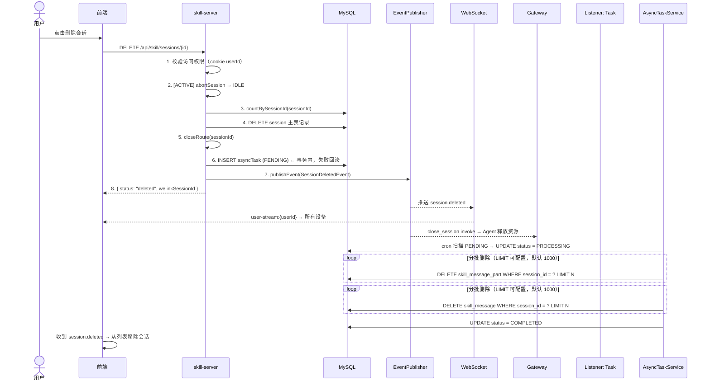
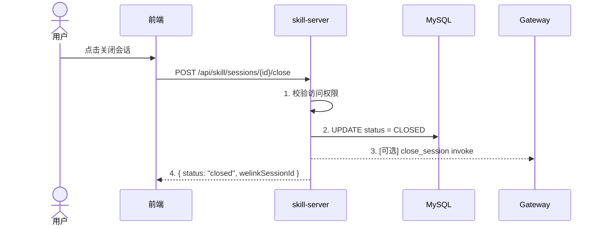
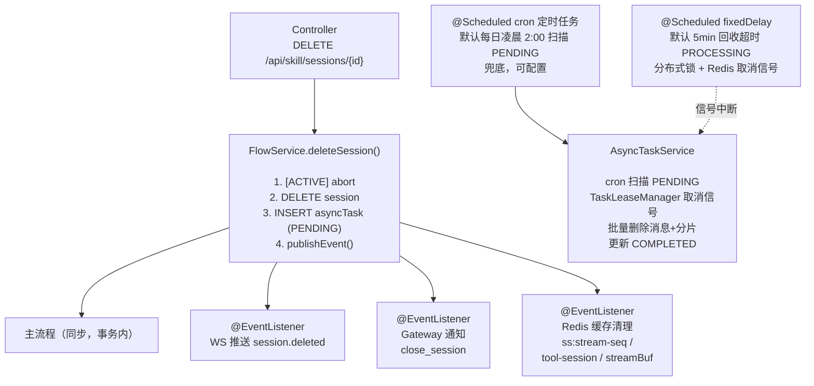
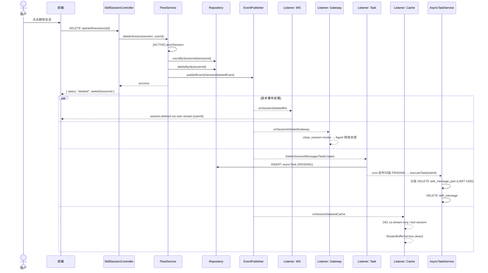

# 1 需求价值和概述

当前 `DELETE /api/skill/sessions/{id}` 为"关闭"操作（soft close，status=CLOSED，数据保留），且关闭后无 WebSocket 推送，其他设备无法实时感知。用户需要彻底删除会话的能力，并且删除后所有设备能实时同步、Agent 能及时释放资源。

本次改造目标：
1. **关闭接口迁移**：原 `DELETE /{id}` → `POST /{id}/close`，腾出 DELETE 语义
2. **新增硬删除接口**：`DELETE /{id}` 物理删除会话及所有关联数据
3. **多端同步**：删除后通过 WebSocket 实时同步到所有设备，并通知 Agent 释放资源

# 2 上下文分析

## 2.1 现有架构

- **关闭流程**：`SkillSessionFlowService.closeSession()` → DB status=CLOSED → [可选] Gateway close_session
- **关闭流程不推送 WS 事件**给客户端
- **多端推送基础设施已具备**：`MultiDeviceSyncService`（`SyncMode.WS` → Redis pub/sub `user-stream:{userId}`；`SyncMode.IM` → `/v1/app-notify`）
- **StreamMessage 类型命名规范**：`session.status`、`session.title`、`session.error`。`session.deleted` 通过 `SyncType.SESSION_DELETED("session.deleted")` 枚举定义，WS 推送走 `MultiDeviceSyncService` ad-hoc 路径
- **访问控制**：`SessionAccessControlService.requireSessionAccess` 校验 cookie userId

## 2.2 需删除的数据范围

- MySQL：skill_session、skill_message、skill_message_part
- Session route（`SessionRouteService`）
- Redis：`ss:tool-session:{toolSessionId}`、`ss:stream-seq:{sessionId}`、`skill:history:latest:{sessionId}:{size}`、stream buffer

# 3 初始需求分析

## 3.1 初始化需求场景分析

用户在使用 Skill 会话功能时存在以下核心场景：

**场景一：彻底删除不需要的会话**
用户完成某个 Skill 对话后，希望彻底删除该会话及其所有关联数据，释放存储空间。当前系统仅支持"关闭"（soft close，status=CLOSED），数据仍保留在数据库中，无法满足彻底清理的需求。典型触发场景：用户在会话列表中左滑或长按，选择"删除"。

**场景二：多设备实时感知会话变更**
用户在设备 A 上删除会话后，设备 B、设备 C 上已打开的会话列表应实时同步移除该会话项。当前关闭操作没有 WebSocket 推送，其他设备无法感知状态变化，导致多设备间会话列表不一致。

**场景三：Agent 计算资源及时释放**
对于 ACTIVE 状态的会话，删除前需先中断正在执行的 Agent 任务，并通知 Gateway 释放 GPU/内存等计算资源，避免资源泄漏。当前关闭流程的 Gateway 通知为可选操作，缺乏强制保障。

**场景四：隐私敏感会话的彻底清除**
用户与 Skill 对话中可能涉及敏感信息，关闭（数据保留）无法满足隐私合规要求，需要硬删除能力确保数据不可恢复。

### API 端点变更

| 操作 | 旧端点 | 新端点 |
|------|--------|--------|
| 关闭会话 | `DELETE /api/skill/sessions/{id}` | `POST /api/skill/sessions/{id}/close` |
| 删除会话 | —（新增） | `DELETE /api/skill/sessions/{id}` |

### 核心需求

1. **新增删除 API**：`DELETE /api/skill/sessions/{id}` — 硬删除会话及所有关联数据
2. **多端同步**：删除后推送 `session.deleted` WS 事件到用户所有设备（通过 `user-stream:{userId}`）
3. **Gateway 通知**：发送 `close_session` invoke，Agent 释放资源
4. **ACTIVE 会话处理**：先 abort（持久化缓冲 → IDLE），再执行硬删除
5. **close 接口迁移**：原 `DELETE /{id}` → `POST /{id}/close`

### 范围外

- abort 操作的多端同步
- 批量删除会话
- 会话恢复（回收站）

## 3.2 结构化IR

| 编号 | 需求项 | 类型 | 优先级 | 输入 | 输出 | 约束 |
|------|--------|------|--------|------|------|------|
| IR-01 | 硬删除会话 | 功能 | P0 | sessionId, userId(cookie) | `{status:"deleted", welinkSessionId}` | 仅会话所有者可操作 |
| IR-02 | 多端同步推送 | 功能 | P0 | SessionDeletedEvent | WS `session.deleted` → user-stream:{userId} | 推送失败不影响主流程 |
| IR-03 | Gateway资源释放 | 功能 | P0 | SessionDeletedEvent | close_session invoke | 通知失败不影响主流程 |
| IR-04 | ACTIVE会话中断 | 功能 | P0 | session.status=ACTIVE | abort→IDLE后删除 | 先持久化缓冲再删 |
| IR-05 | 异步数据清理 | 功能 | P0 | asyncTask(PENDING) | 分批DELETE message/part → COMPLETED | LIMIT 1000/批，分布式锁 |
| IR-06 | close接口迁移 | 功能 | P1 | POST /{id}/close | `{status:"closed", welinkSessionId}` | 保持原有行为不变 |
| IR-07 | 访问控制 | 安全 | P0 | cookie userId | 403/放行 | SessionAccessControlService |
| IR-08 | 会话列表默认过滤 | 体验 | P1 | GET /sessions | 默认排除CLOSED，可传status=CLOSED | 向后兼容查询参数 |
| IR-09 | 任务失败重试 | 可靠性 | P0 | status=FAILED+retry_count | 定时扫描PENDING重试 | 最大重试次数可配置 |
| IR-10 | 分布式锁保护 | 可靠性 | P0 | RLock(sessionId) | tryLock成功/失败 | Redisson看门狗自动续期 |

# 4 需求影响分析

## 4.1 特性影响分析

本次改造涉及会话生命周期管理的三个核心操作——关闭、删除、多端同步——属于会话模块的内部增强，不改变其他业务模块的行为。影响面如下：

- **会话列表**：删除后会话从列表中消失；listSessions 默认排除 CLOSED 状态
- **会话详情**：已删除会话不可访问（findByIdSafe 排除 CLOSED）
- **WebSocket 连接**：新增 session.deleted 事件类型，复用现有 MultiDeviceSyncService 推送通道
- **Gateway Agent**：收到 close_session invoke 后释放 GPU/内存资源
- **会话复用**：CLOSED 会话不可复用（findByBusinessSession 等查询排除 CLOSED）

## 4.2 涉及模块

| 模块 | 影响类型 | 说明 |
|------|----------|------|
| skill-server | 修改 + 新增 | Controller/Service/Repository/Model/事件/异步任务 |
| skill-miniapp | 修改 | api.ts close 路径 + 新增 delete + WS 事件处理 |
| AI-Gateway | 无改动 | 复用现有 close_session invoke |

## 4.3 兼容性分析

- `DELETE /api/skill/sessions/{id}` 行为变更：关闭 → 硬删除（breaking change）
- 前端需同步上线
- Gateway 无改动

# 5 系统用例分析

## 5.1 用例清单

| 编号 | 用例名称 | 说明 |
|------|----------|------|
| UC-01 | 删除会话 | 用户删除指定会话，数据库物理删除所有关联数据，WS 推送多端同步 |
| UC-02 | 关闭会话 | 用户关闭指定会话，DB status=CLOSED，数据保留 |

## 5.2 删除会话 用例分析

### 5.2.1 用例概述

用户通过前端发起删除会话请求，系统硬删除会话主表记录，异步批量清理关联的 message 和 part 数据，通过 WebSocket 推送 `session.deleted` 事件到用户所有设备，并通知 Gateway 释放 Agent 资源。

### 5.2.2 用例流程

**正常流程**：



**异常流程**：

| 异常 | 处理 |
|------|------|
| 会话不存在 | 返回 400 |
| 无权限访问 | 返回 403 |
| 异步任务创建失败 | 异常向上传播，触发 @Transactional 回滚，session 不被删除 |
| 异步任务执行失败 | status=FAILED + retry_count，定时任务下一轮重试 |
| PROCESSING 超时卡死 | 独立 @Scheduled(fixedDelay 5min) 检测 + Redis 取消信号中断 + 重置 PENDING |
| 事件丢失 | @Scheduled cron 定时扫描 PENDING 任务兜底（默认每日凌晨 2:00） |
| WS 推送失败 | listener 顶层 try-catch，不影响主流程 |
| Gateway 通知失败 | listener 顶层 try-catch，Agent 侧有超时释放兜底 |

### 5.2.3 影响的功能列表和需求分析

| 影响功能 | 说明 |
|----------|------|
| 会话列表查询 | 删除后会话从列表中消失；listSessions 默认排除 CLOSED |
| 会话详情查看 | 已删除会话不可访问（findByIdSafe 排除 CLOSED） |
| WebSocket 连接 | 新增 session.deleted 事件类型 |
| Gateway Agent 管理 | 收到 close_session invoke 后释放资源 |

## 5.3 关闭会话 用例分析

### 5.3.1 用例概述

用户关闭指定会话，DB status 更新为 CLOSED，数据保留。此用例为已有功能，本次仅迁移 API 路径。

### 5.3.2 用例流程



### 5.3.3 影响的功能列表和需求分析

无新增功能影响。原有行为完全保留，仅 API 路径变更。

# 6 功能设计

## 6.1 业界实现方案分析

| 方案 | 描述 | 适用场景 |
|------|------|----------|
| 同步全量删除 | 在请求线程中删除所有关联数据 | 数据量小（<1000条） |
| 异步任务删除 | 主表同步删除 + 关联数据异步批量清理 | 关联数据量大，主流程需快速返回 |
| 软删除 + 定时清理 | 标记 deleted 字段，定时任务物理删除 | 需要回收站/恢复功能 |

本方案选择 **异步任务删除**：主流程快速返回，message/part 数据量可能很大（每个消息多个 part），走异步任务分批删除，避免阻塞用户请求。同时通过事件驱动 + 定时兜底保证任务必然执行。

## 6.2 功能实现整体设计方案

核心设计原则：**主流程快速返回，大数据量删除异步化；分支逻辑事件驱动，与主流程解耦。**



## 6.3 删除会话 功能实现

### 6.3.1 实现思路

1. **关闭接口迁移**：原 `DELETE /{id}` → `POST /{id}/close`，腾出 DELETE 语义
2. **新增删除接口**：`DELETE /{id}` 硬删除会话，skill_session 主流程同步删除，message/part 走异步任务批量删除
3. **多端同步**：删除后通过 `user-stream:{userId}` Redis pub/sub 推送 `session.deleted` 事件到所有设备，并通知 Gateway 释放资源
4. **内部查询优化**：skill_session 查询方法默认排除 CLOSED 状态，避免已关闭会话污染活跃会话列表

### 6.3.2 实现设计

**主流程（SkillSessionFlowService.deleteSession）**：

```
deleteSession(session, userId):
  1. if session.status == ACTIVE → abortSession(session)
  2. int messageCount = messageRepository.countBySessionId(sessionId)
  3. sessionRepository.deleteById(sessionId)                     // 仅删主表
  4. sessionRouteService.closeRoute(sessionId)
  5. asyncTaskService.createTask(DELETE_SESSION_MESSAGES,        // 事务内创建，失败回滚
         payload)
  6. eventPublisher.publishEvent(new SessionDeletedEvent(         // 发布事件
         session, userId, Instant.now(), messageCount))
  7. return success
```

> `countBySessionId` 已存在于 `SkillMessageRepository`，无需新增。
>
> 异步任务创建直接在 `deleteSession()` 主流程中调用 `AsyncTaskService.createTask()`，与 session 删除在同一 `@Transactional` 内。任务创建失败则异常向上传播，整个事务回滚，session 不会被删除，保证原子性。

**事件定义**：

```java
// SessionDeletedEvent — 会话已删除，主流程发布
public record SessionDeletedEvent(
    SkillSession session,      // 会话完整快照
    String deletedBy,          // 操作者 cookie userId
    Instant deletedAt,         // 删除时间
    int messageCount           // 被删消息数量
) {}
```

**分支逻辑（事件驱动 + 定时兜底）**：

### 事件监听器（即时触发 + 定时兜底）

**listener/ 目录下两个独立的 @EventListener 组件**（按执行行为拆分，均为非关键旁路逻辑，失败不影响主流程）：
- `SessionDeletedSyncNotifier` — 监听 `SessionDeletedEvent`，调用 `MultiDeviceSyncService.push(SyncMode.WS, SyncType.SESSION_DELETED, ...)` 推送 `session.deleted` 到所有设备
- `SessionDeletedGatewayNotifier` — 监听 `SessionDeletedEvent`，发送 `close_session` invoke 到 Gateway

> 异步任务创建已从监听器中移出，改在 `SkillSessionFlowService.deleteSession()` 主流程中直接调用，与 session 硬删除在同一事务内，保证原子性。

**缓存清理（各 cache owner 自行监听 SessionDeletedEvent）**：
- `RedisMessageBroker.onSessionDeleted` — 清理 `ss:stream-seq:{sessionId}` + `ss:tool-session:{toolSessionId}`
- `StreamBufferService.onSessionDeleted` — 清理 stream buffer
- 历史消息缓存（`skill:history:latest:*`）不清理，避免 SCAN key 风险

### 异步任务执行架构（策略模式 + 分布式锁 + 多线程）

```
AsyncTaskService.createTask(type, payload)
  → INSERT task (PENDING)，不立即执行

@Scheduled cron 定时扫描 PENDING 任务
  → asyncTaskExecutor 多线程提交
    → TaskContainer.process(task)
      → 按 taskType 路由到对应 TaskProcessor

TaskProcessor.process(task):
  1. Redisson RLock.tryLock() — 分布式锁防并发
  2. 乐观锁 PENDING → PROCESSING
  3. 执行业务逻辑
  4. COMPLETED / FAILED
  5. finally unlock()
```

**TaskProcessor 接口**：
```java
public interface TaskProcessor {
    AsyncTaskType getTaskType();
    void process(AsyncTask task);
}
```

**TaskContainer**：收集所有 `TaskProcessor`，`getTaskType()` 自注册路由表。

**DeleteSessionMessagesTaskProcessor**：分批删除 part（LIMIT 1000）→ 删除 message，Redisson RLock 分布式锁。

### 定时任务（ScheduledJob，兜底）

```java
@Scheduled(cron = "${skill.session.cleanup.async-task-cron:0 0 2 * * ?}")  // 默认每日凌晨 2:00
processPendingTasks():
  → 查询 PENDING 任务
  → asyncTaskExecutor 多线程提交到 TaskContainer
```

定时任务兜底，执行时间可通过配置调整。



### 6.3.3 功能可靠性分析

| 风险 | 缓解措施 |
|------|----------|
| 异步任务创建失败导致主表已删但 message/part 残留 | createTask 在 deleteSession @Transactional 内，失败则异常传播回滚，session 不被删除 |
| 异步任务执行失败 | status=FAILED + retry_count（可配置，默认 3），定时任务下一轮重试 |
| PROCESSING 任务 JVM 宕机后永久卡住 | @Scheduled(fixedDelay 5min) 独立高频回收，Redis 取消信号跨 JVM 中断执行线程，超时重置 PENDING |
| 事件丢失导致 PENDING 任务长期不执行 | @Scheduled cron 定时扫描 PENDING 任务兜底（默认每日凌晨 2:00，可配置） |
| 多实例同时执行超时回收 | Redisson 分布式锁 `ss:async-task-stale-recovery-lock` |
| message/part 表数据量大，单次删除超时 | LIMIT 分批删除（默认 1000，可配置），每批独立事务；循环内检查 TaskLeaseManager.isCancelled() 支持中断 |
| WS 推送失败 | listener 顶层 try-catch，不影响主流程 |
| Gateway 通知失败 | listener 顶层 try-catch，Agent 侧有超时释放兜底 |
| 并发删除同一会话 | AsyncTask status=PENDING 乐观锁，执行前 UPDATE PROCESSING WHERE status=PENDING |

### 6.3.4 功能安全分析

| 安全点 | 措施 |
|--------|------|
| 访问控制 | 复用 `SessionAccessControlService.requireSessionAccess`，校验 cookie userId |
| 越权删除 | 仅会话所有者可删除自己的会话 |
| SQL 注入 | MyBatis `#{}` 参数化查询 |
| 敏感数据残留 | 硬删除，不留数据 |

### 6.3.5 架构元素影响列表

| 架构元素 | 影响类型 | 说明 |
|----------|----------|------|
| skill-server | 修改 + 新增 | Controller/Service/Repository/Model/事件/异步任务 |
| skill-miniapp | 修改 | api.ts close 路径 + 新增 delete + WS 事件处理 |
| AI-Gateway | 无改动 | 复用现有 close_session invoke |

**skill-server 新增文件**：

| 文件 | 说明 |
|------|------|
| `db/migration/V16__async_task.sql` | 异步任务表 DDL |
| `model/AsyncTask.java` | 任务实体 |
| `model/enums/AsyncTaskStatus.java` | PENDING/PROCESSING/COMPLETED/FAILED |
| `model/enums/AsyncTaskType.java` | DELETE_SESSION_MESSAGES |
| `model/event/SessionDeletedEvent.java` | 会话删除事件 record |
| `repository/AsyncTaskRepository.java` + XML | 任务 CRUD |
| `service/AsyncTaskService.java` | 任务创建 + 定时扫描 PENDING + 独立高频超时回收 |
| `service/listener/SessionDeletedSyncNotifier.java` | WebSocket 推送 session.deleted（多端同步） |
| `service/task/TaskLeaseManager.java` | Redis 取消信号管理器（跨 JVM 任务中断公共组件） |
| `service/listener/SessionDeletedGatewayNotifier.java` | 通知 Gateway 释放 Agent 资源 |
| `service/listener/SessionDeletedWsNotifier.java` | WebSocket 推送 session.deleted |
| `service/task/TaskProcessor.java` | 异步任务处理器接口（策略模式） |
| `service/task/TaskContainer.java` | 处理器容器，按 AsyncTaskType 路由 |
| `service/task/DeleteSessionMessagesTaskProcessor.java` | 删除消息/分片处理器，Redisson 分布式锁 |
| `config/RedissonConfig.java` | Redisson 客户端配置 |

**skill-server 修改文件**：

| 文件 | 改动 |
|------|------|
| `SyncType.java` | 新增 `SESSION_DELETED("session.deleted")` 枚举项 |
| `SkillSessionRepository.java` + XML | 新增 `deleteById` |
| `SkillMessagePartRepository.java` + XML | 新增 `deleteBySessionId`（批量删除用） |
| `SkillMessageRepository.java` + XML | 新增 `deleteBySessionId` |
| `SkillSessionService.java` | 新增 `deleteSession(sessionId)`；查询方法默认排除 CLOSED |
| `SkillSessionFlowService.java` | 新增 `deleteSession(session)` |
| `SkillSessionController.java` | close 迁 `POST /{id}/close` + 新增 `DELETE /{id}` |

### 6.3.6 skill-server 实现设计

#### 6.3.6.1 接口设计

**关闭会话（迁移）**：

```
POST /api/skill/sessions/{id}/close

Request:  无 body
Response: {
  "code": 0,
  "data": { "status": "closed", "welinkSessionId": "{id}" }
}
Errors:   400（无效 ID）、403（无权限）
```

原有行为不变：DB status=CLOSED，可选通知 Gateway。

**删除会话（新增）**：

```
DELETE /api/skill/sessions/{id}

Request:  无 body
Response: {
  "code": 0,
  "data": { "status": "deleted", "welinkSessionId": "{id}" }
}
Errors:   400（无效 ID）、403（无权限）
```

主表立即删除，消息数据异步清理，WS 推送 `session.deleted`。

**WebSocket 事件（新增）**：

通过 `MultiDeviceSyncService.push(SyncMode.WS, SyncType.SESSION_DELETED, ...)` 推送，复用现有 `handleUserBroadcast` ad-hoc 路径：

```
type: "session.deleted"
{
  "type": "session.deleted",
  "sessionId": "{sessionId}",
  "content": {
    "welinkSessionId": "{sessionId}"
  }
}
```

推送至 `user-stream:{userId}` Redis channel → 用户所有 WebSocket 连接。

**查询会话列表（优化）**：

```
GET /api/skill/sessions

现有行为：无 status 参数时，返回该用户全部会话（含 CLOSED）
优化行为：无 status 参数时，默认只返回 ACTIVE + IDLE 的会话（排除 CLOSED）
          传 status=CLOSED 仍可查询已关闭会话
```

改动点：`SkillSessionService.listSessions()` 中，当 `status` 参数为空时，`statusNames` 默认设为 `[ACTIVE, IDLE]`，走 `findByUserIdAndStatusIn` 路径。

**内部 session 查询统一过滤（优化）**：

```diff
- SkillSessionService.findByIdSafe(id)    → 返回任意状态的 session
+ → 只返回 ACTIVE / IDLE 的 session，CLOSED 返回 null

- SkillSessionService.getSession(id)       → findByIdSafe 后 null 抛异常
+ → findByIdSafe 排除 CLOSED → null 抛异常（与已有行为一致）

- SkillSessionService.findByBusinessSession*(...) → 返回任何状态的匹配会话
+ → 只返回 ACTIVE / IDLE（CLOSED 会话不可复用）

- SkillSessionService.findByAk(ak)         → 返回该 AK 的全部会话
+ → 只返回 ACTIVE / IDLE

- SkillSessionService.findByToolSessionId(id) → 返回任意状态的会话
+ → 只返回 ACTIVE / IDLE
```

维护类方法（`findByStatus`、`findIdleSessionIds`、`updateStatus` 等）不变，按需指定状态。

#### 6.3.6.2 数据模型设计

##### 6.3.6.2.1 关系型数据库设计

**新增表：skill_async_task**（迁移 V16__async_task.sql）

```sql
CREATE TABLE skill_async_task (
    id           BIGINT PRIMARY KEY COMMENT 'Snowflake ID',
    task_type    VARCHAR(64) NOT NULL COMMENT '任务类型：DELETE_SESSION_MESSAGES',
    payload      JSON NOT NULL COMMENT '任务参数，如 {"sessionId":123,"messageCount":50}',
    status       VARCHAR(16) NOT NULL DEFAULT 'PENDING' COMMENT 'PENDING/PROCESSING/COMPLETED/FAILED',
    retry_count  INT DEFAULT 0 COMMENT '重试次数',
    error_msg    VARCHAR(512) COMMENT '失败原因',
    created_at   DATETIME NOT NULL,
    updated_at   DATETIME
);

CREATE INDEX idx_async_task_status_created
    ON skill_async_task(status, created_at);
```

**已有表改动**：无 DDL 变更，skill_session / skill_message / skill_message_part 表结构不变。

**SQL 新增**：

| Repository 方法 | SQL |
|-----------------|-----|
| `SkillSessionRepository.deleteById(id)` | `DELETE FROM skill_session WHERE id = #{id}` |
| `SkillMessageRepository.deleteBySessionId(sessionId)` | `DELETE FROM skill_message WHERE session_id = #{sessionId}` |
| `SkillMessagePartRepository.deleteBySessionId(sessionId)` | `DELETE FROM skill_message_part WHERE session_id = #{sessionId} LIMIT #{limit}` |

##### 6.3.6.2.2 Redis 缓存设计

Redis 缓存由各 cache owner 通过 `@EventListener(SessionDeletedEvent)` 同步自管理，与异步任务解耦：

| Key 模式 | 清理方式 | 负责组件 |
|----------|----------|----------|
| `ss:tool-session:{toolSessionId}` | DEL | `RedisMessageBroker.onSessionDeleted` |
| `ss:stream-seq:{sessionId}` | DEL | `RedisMessageBroker.onSessionDeleted` |
| Stream buffer | `PartBufferService.clear(sessionId)` | `StreamBufferService.onSessionDeleted` |
| `skill:history:latest:{sessionId}:*` | **不清理** | 避免 SCAN key 风险，依赖 TTL 自动过期 |

缓存清理失败不影响核心功能（listener 顶层 try-catch），缓存本身有 TTL 兜底。

##### 6.3.6.2.3 配置项设计

无新增配置项。定时任务 cron 表达式通过 `${skill.session.cleanup.async-task-cron}` 配置，默认每日凌晨 2:00。

### 6.3.7 skill-miniapp 实现设计

#### 6.3.7.1 api.ts 改动

```typescript
// 修改：关闭路径
export function closeSession(id: string | number): Promise<void> {
    return request('POST', `/api/skill/sessions/${id}/close`);
}

// 新增：删除会话
export function deleteSession(id: string | number): Promise<void> {
    return request('DELETE', `/api/skill/sessions/${id}`);
}
```

#### 6.3.7.2 useSkillSession.ts 改动

暴露 `deleteSession` 方法，调用 `api.deleteSession()`。

#### 6.3.7.3 WebSocket 事件处理

监听 `type === "session.deleted"` 的消息，根据 `welinkSessionId` 从会话列表中移除对应项。

# 7 系统级非功能性设计

## 7.1 系统级的FMEA影响分析

| 失效模式 | 影响 | S | 原因 | O | 当前控制 | D | RPN | 改进措施 |
|----------|------|---|------|---|----------|---|-----|----------|
| 主表删除成功但异步任务创建失败 | 消息/分片数据残留 | 5 | DB insert asyncTask 异常 | 3 | 事务回滚机制 | 3 | 45 | 主流程 try-catch + 事务回滚 |
| 异步任务执行失败 | 消息/分片永久残留 | 6 | 网络抖动/DB 超时 | 4 | retry_count + 定时扫描 PENDING 兜底 | 3 | 72 | 定时任务间隔可配置，失败告警 |
| WS 推送失败 | 其他设备不感知删除 | 3 | Redis pub/sub 故障 | 3 | listener 顶层 try-catch | 4 | 36 | WS 重连后全量拉取会话列表 |
| Gateway 通知失败 | Agent 资源不释放 | 5 | 网络不可达 | 3 | Agent 侧超时释放兜底 | 3 | 45 | 通知失败重试 + 监控告警 |
| 并发删除同一会话 | 异步任务重复执行 | 4 | 多设备同时操作 | 2 | RLock 分布式锁 + 乐观锁 PENDING→PROCESSING | 2 | 16 | 无需额外措施 |
| Redis 缓存清理失败 | 缓存脏数据残留 | 2 | Redis 不可用 | 3 | 缓存 TTL 自动过期 | 5 | 30 | 无需额外措施 |
| 分批删除中途中断 | 部分消息残留 | 5 | 服务重启/崩溃 | 2 | 下一轮定时任务继续扫描 PENDING | 3 | 30 | 记录删除进度 checkpoint |
| close 接口幂等性问题 | 重复关闭不报错 | 1 | 前端重复提交 | 5 | 无幂等保护 | 3 | 15 | 无需额外措施（CLOSED→CLOSED 为 no-op） |

> S=严重度(1-10), O=发生频率(1-10), D=可检测度(1-10), RPN=S×O×D。RPN>70 需立即改进，RPN 40-70 需监控。

## 7.2 系统级安全影响分析

| 安全维度 | 风险 | 缓解措施 |
|----------|------|----------|
| 认证 | 未登录用户调用删除 API | API 网关层 JWT/Cookie 校验，未认证拒绝 |
| 授权 | 用户 A 删除用户 B 的会话 | `SessionAccessControlService.requireSessionAccess` 校验 cookie userId == session.userId |
| 数据隔离 | 多租户间数据泄露 | 所有查询均带 userId 过滤条件 |
| 注入攻击 | SQL 注入 | MyBatis `#{}` 参数化查询，禁止 `${}` 拼接 |
| 拒绝服务 | 恶意高频删除请求 | 网关层限流 + 单用户操作频率限制 |
| 数据残留 | 硬删除后数据可恢复 | MySQL 物理 DELETE，无软删除字段残留 |
| 日志泄露 | 日志中打印敏感 session 内容 | 日志仅记录 sessionId/status，不记录消息内容 |

## 7.3 兼容性

### 7.3.1 后向兼容性确认

| 变更项 | 旧行为 | 新行为 | 兼容性 | 风险 |
|--------|--------|--------|--------|------|
| `DELETE /{id}` | 关闭会话（soft close） | 硬删除会话 | **不兼容** | 旧版前端调用此接口将删除而非关闭 |
| `POST /{id}/close` | 不存在 | 关闭会话 | 兼容（新增） | 无 |
| `session.deleted` WS 事件 | 不存在 | 推送删除事件 | 兼容（新增） | 旧版前端忽略未知 type |
| 会话列表默认过滤 | 返回全部（含 CLOSED） | 默认排除 CLOSED | **行为变更** | 依赖旧行为的调用方受影响 |
| Gateway close_session | 可选调用 | 事件驱动调用 | 兼容 | Gateway 接口无变更 |

**上线策略**：前端与后端同步上线，API 路径变更为 breaking change，需协调发布。

### 7.3.2 前向兼容性确认

| 预留项 | 说明 |
|--------|------|
| AsyncTaskType 枚举 | 预留 `CLEANUP_OLD_SESSIONS`、`EXPORT_SESSION` 等类型，扩展时新增枚举项即可 |
| TaskProcessor 接口 | 策略模式，新增任务类型只需实现新 Processor 并注册到 TaskContainer |
| session.deleted 事件字段 | record 类型可扩展新字段，旧消费者忽略未知字段 |
| 异步任务 payload JSON | 新增字段向后兼容，旧任务解析时忽略未知 key |

## 7.4 可运维

### 7.4.1 日志规范

| 日志点 | 级别 | 内容 |
|--------|------|------|
| deleteSession 入口 | INFO | sessionId, userId, status |
| abortSession 执行 | INFO | sessionId, toolSessionId |
| 异步任务创建 | INFO | taskId, taskType, payload |
| 异步任务开始执行 | INFO | taskId, messageCount, batchIndex |
| 异步任务完成 | INFO | taskId, totalDeleted, duration |
| 异步任务失败 | ERROR | taskId, errorMsg, retryCount, stacktrace |
| WS 推送成功 | DEBUG | sessionId, userId |
| WS 推送失败 | WARN | sessionId, error |
| Gateway 通知失败 | WARN | sessionId, error |

### 7.4.2 部署要求

- skill-server 与 skill-miniapp **同步上线**（API 路径变更为 breaking change）
- 数据库迁移 V16__async_task.sql 在应用启动前执行
- Redisson 依赖已在 pom.xml 中配置，无需额外部署
- 无新增环境变量或配置项，定时任务 cron 使用默认值

## 7.5 资料

| 资料 | 链接/路径 |
|------|-----------|
| 需求 PRD | `.trellis/tasks/archive/2026-06/06-03-skill-session-close-sync/prd.md` |
| 设计文档（本文件） | `.trellis/tasks/archive/2026-06/06-03-skill-session-close-sync/design-v2.md` |
| 实现计划 | `.trellis/tasks/archive/2026-06/06-03-skill-session-close-sync/implement.md` |
| 相关提交 | `fe6bff2`（会话硬删除+多端同步+close接口迁移+异步任务策略模式） |
| Redisson 文档 | https://redisson.org/docs/ |
| MultiDeviceSyncService | `skill-server/.../service/MultiDeviceSyncService.java` |
| SessionAccessControlService | `skill-server/.../service/SessionAccessControlService.java` |

# 8 CheckList

## 8.1 设计自检清单要求

| # | 检查项 | 状态 |
|---|--------|------|
| 1 | 需求场景是否完整覆盖？（正常流程 + 异常流程 + 边界条件） | ✅ |
| 2 | API 接口是否定义清晰？（路径、请求、响应、错误码） | ✅ |
| 3 | 数据模型是否完整？（DDL、索引、Redis key、配置项） | ✅ |
| 4 | 可靠性是否充分设计？（FMEA 分析、重试、兜底、分布式锁） | ✅ |
| 5 | 安全性是否覆盖？（认证、授权、注入、数据隔离） | ✅ |
| 6 | 兼容性是否评估？（前向/后向、上线策略） | ✅ |
| 7 | 可运维性是否考虑？（日志、部署顺序） | ✅ |
| 8 | 架构元素影响是否列出？（新增文件、修改文件、模块影响） | ✅ |
| 9 | 前端改动是否对齐？（api.ts、hook、WS 事件处理） | ✅ |
| 10 | 是否有遗漏的 Redis 缓存清理？ | ✅ |
| 11 | 事件定义是否清晰？（SessionDeletedEvent 字段、StreamMessage 格式） | ✅ |
| 12 | 异步任务策略是否完整？（TaskProcessor 接口、TaskContainer 路由、cron 兜底） | ✅ |
