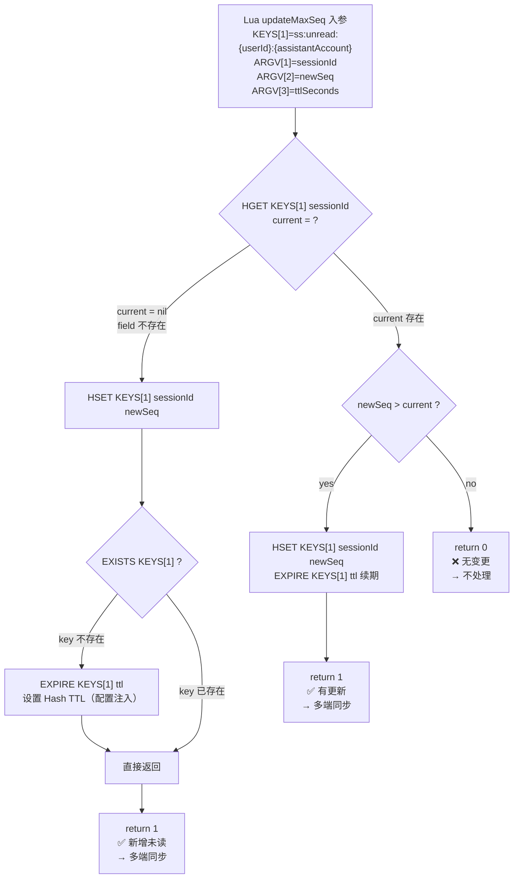
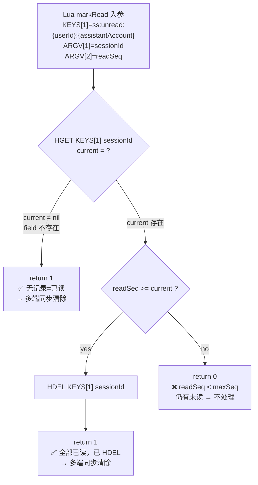
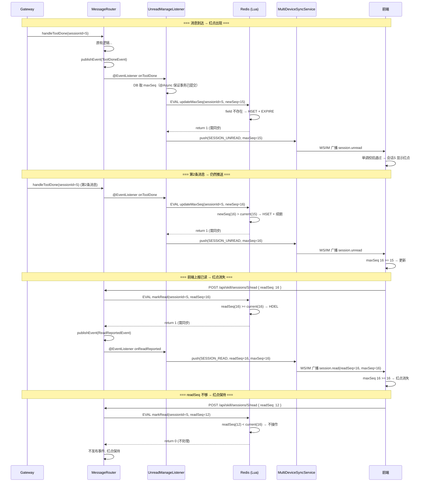

# Design (V2): 未读消息小红点提醒与已读多端同步

## 1 与方案1 的核心差异

| 维度 | 方案1 | 方案2 |
|------|-------|-------|
| 已读触发 | 聚焦时服务端取 MAX(seq) | 前端上报已渲染的最大 message_seq |
| 多端同步 | Redis pub/sub → WS | MultiDeviceSyncService 接口，按 env 注入 |
| 活跃会话追踪 | Redis Hash | 去掉，前端自行判断 |
| 免打扰判断 | 服务端 | 前端 |
| 流式保护 | 无 | 消息未完全渲染不推进已读游标 |

## 2 数据模型

### 2.1 MySQL

无 DDL 变更。`last_read_seq` 和 `max_seq` 均不入库，由 Redis Hash 全权维护。

### 2.2 Redis

**未读追踪 Hash**（唯一存储）:
```
Key: ss:unread:{userId}:{assistantAccount}  TTL: skill.unread.hash-ttl-seconds（默认 7d）
Type: Hash
Field: sessionId → maxSeq (int)
```

按助手账号隔离未读状态，仅 `updateMaxSeq` 维护 TTL。Hash 中存在某 sessionId 即表示该会话有未读。

**淘汰/过期自愈**：无需 DB 兜底，Lua 脚本自行处理 key 不存在：

| 操作 | key 不在时的行为 |
|------|-----------------|
| `updateMaxSeq` | 创建 key（EXPIRE 7d），HSET sessionId→newSeq，return 1 |
| `markRead` | 创建 key（EXPIRE 7d，空 Hash），return 1 |
| `POST /unread`（不传参） | `HGETALL` 返回空（无未读） |
| `POST /unread`（传参） | `HMGET` 均返回 nil |

**Lua 脚本：updateMaxSeq**（消息落库时，原子更新 + 自愈创建）:

```lua
-- KEYS[1] = ss:unread:{userId}:{assistantAccount}
-- ARGV[1] = sessionId, ARGV[2] = newSeq, ARGV[3] = ttlSeconds（由 UnreadProperties.hashTtlSeconds 注入）
-- 返回: 1=需多端同步, 0=不处理
local field, newSeq, ttl = ARGV[1], tonumber(ARGV[2]), tonumber(ARGV[3])
local exists = redis.call('EXISTS', KEYS[1])

local current = redis.call('HGET', KEYS[1], field)
if not current then
    redis.call('HSET', KEYS[1], field, newSeq)
    if exists == 0 then redis.call('EXPIRE', KEYS[1], ttl) end
    return 1   -- field 不存在或 key 新创建 → 同步
end

if newSeq > tonumber(current) then
    redis.call('HSET', KEYS[1], field, newSeq)
    redis.call('EXPIRE', KEYS[1], ttl)  -- 续期
    return 1   -- 有更新 → 同步
end

return 0       -- 无变更 → 不处理
```

**Lua 脚本：markRead**（前端上报已读时，原子判断 + HDEL，不维护 TTL）:

```lua
-- KEYS[1] = ss:unread:{userId}:{assistantAccount}
-- ARGV[1] = sessionId, ARGV[2] = readSeq
-- 返回: 1=已清除(需同步), 0=仍部分未读, -1=readSeq>maxSeq(参数非法)
-- 注意：不维护 key TTL，key 生命周期由 updateMaxSeq 管理
local field, readSeq = ARGV[1], tonumber(ARGV[2])
local current = redis.call('HGET', KEYS[1], field)

if not current then
    return 1   -- field 不存在 = 已读 → 同步清除
end

if readSeq == tonumber(current) then
    redis.call('HDEL', KEYS[1], field)
    return 1   -- 完全已读，已 HDEL → 同步清除
end

if readSeq > tonumber(current) then return -1 end  -- 参数非法

return 0       -- readSeq < maxSeq，仍有未读 → 不处理
```

**updateMaxSeq 执行流程**:



**markRead 执行流程**（不维护 TTL）:



**两脚本协同流程**:



### 2.3 POST /unread 查询设计

不传 `sessionIds`：
```
HGETALL ss:unread:{userId}:{assistantAccount}
```
→ 返回全部未读会话 field-value 对。

传 `sessionIds`：
```
HMGET ss:unread:{userId}:{assistantAccount} id1 id2 ...
```
→ 返回指定 session 的 maxSeq（nil=无记录）。

Hash 中存在即表示有未读。

### 2.4 Listener 中判断

Lua 返回值决定是否推送（见 5.3）。未读推送 `session.unread`，已读推送 `session.read`。

## 3 接口设计

### 3.1 前端 → 服务端：已读上报

**前端追踪**（`useSkillSession`）：

```
readMessageSeq 由前端自行维护（内存变量，不持久化）
消息渲染完成 (text_done / tool completed / error) → readMessageSeq = max(readMessageSeq, seq)
readMessageSeq 变化 → debounce 500ms → POST /api/skill/sessions/{id}/read
流式进行中不推进 readMessageSeq
```

**REST 接口**（唯一通道）：

```
POST /api/skill/sessions/{id}/read
```

| 属性名 | 类型 | 必填 | 说明 |
|--------|------|------|------|
| Cookie: userId | string | Y | 用户身份 |
| body.readSeq | int | Y | 前端已渲染的最大 message_seq |

**响应体**:

| 属性名 | 类型 | 说明 |
|--------|------|------|
| code | int | 0=成功 |
| data.welinkSessionId | String | 会话 ID |
| data.unreadCount | int | readSeq >= maxSeq 后为 0 |

```json
{ "code": 0, "data": { "welinkSessionId": "123", "unreadCount": 0 } }
```

**错误码**:

| HTTP Status | error.error_code | 说明 |
|-------------|------------------|------|
| 400 | BAD_REQUEST | readSeq 参数缺失或无效 |
| 401 | UNAUTHORIZED | 未登录或 cookie 失效 |
| 403 | FORBIDDEN | session 不属于当前用户 |
| 404 | NOT_FOUND | sessionId 不存在 |
| 500 | INTERNAL_ERROR | 服务内部异常 |

**核心处理**（`SkillSessionService.reportRead`，新增方法）：

```java
public void reportRead(Long sessionId, String userId, int readSeq) {
    accessControl.requireSessionAccess(sessionId, userId);
    // 仅处理白名单 domain 的会话
    SkillSession session = sessionRepository.findById(sessionId);
    String domain = session.getBusinessSessionDomain();
    if (domain == null || !unreadProperties.getSessionDomainWhitelist().contains(domain)) {
        return;
    }
    // Lua markRead：原子比较 readSeq >= maxSeq → HDEL（不维护 TTL）
    Long result = unreadRedisService.markRead(userId, sessionId.toString(), readSeq);
    if (result != null && result == 1) {
        String assistantAccount = session.getAssistantAccount();
        applicationEventPublisher.publishEvent(
            new ReadReportedEvent(sessionId, userId, assistantAccount, readSeq));
    }
}
```

### 3.2 前端拉取：未读信息查询（单一接口，sessionIds 可选）

```
POST /api/skill/sessions/unread
```

**请求体**（`assistantAccount` 必填，`sessionIds` 可选）:

| 属性名 | 类型 | 必填 | 说明 |
|--------|------|------|------|
| assistantAccount | String | Y | 助手账号，构造 Redis key `ss:unread:{userId}:{assistantAccount}` |
| sessionIds | List\<String\> | N | 不传则返回所有未读会话详情；传入则仅返回指定会话详情 |

请求示例：
```http
POST /api/skill/sessions/unread
Content-Type: application/json

{ "assistantAccount": "assistant_xxx" }

{ "assistantAccount": "assistant_xxx", "sessionIds": ["123", "456"] }
```

**响应体**（统一格式，不传 sessionIds 时返回全部有未读的会话）:

| 属性名 | 类型 | 说明 |
|--------|------|------|
| data.unreadSessionCount | int | 有未读的会话总数 |
| data.unreadSessionList[].sessionId | String | 会话 ID |
| data.unreadSessionList[].maxSeq | int | 当前最大 seq |

```json
{
  "code": 0,
  "data": {
    "unreadSessionCount": 2,
    "unreadSessionList": [
      { "sessionId": "123", "maxSeq": 15 },
      { "sessionId": "789", "maxSeq": 8 }
    ]
  }
}
```

实现：
- 不传 `sessionIds`：`HGETALL ss:unread:{userId}:{assistantAccount}` 返回所有 field-value 对
- 传 `sessionIds`：`HMGET ss:unread:{userId}:{assistantAccount} id1 id2...` 返回指定 field
Hash 中存在该 sessionId 即表示有未读。

### 3.3 服务端 → 前端：未读推送

未读推送示例：
```json
{
  "type": "session.unread",
  "welinkSessionId": "123456789",
  "maxSeq": 15,
  "readSeq": 0,
  "assistantAccount": "assistant_xxx",
  "emittedAt": "2026-06-12T10:30:00"
}
```

已读清除推送示例：
```json
{
  "type": "session.read",
  "welinkSessionId": "123456789",
  "maxSeq": 15,
  "readSeq": 15,
  "assistantAccount": "assistant_xxx",
  "emittedAt": "2026-06-12T10:30:05"
}
```

| 属性名 | 类型 | 说明 |
|--------|------|------|
| type | string | `"session.unread"`=有未读显示红点，`"session.read"`=已读清除红点 |
| welinkSessionId | string | 会话 ID |
| maxSeq | int | 当前会话最大 seq（unread）或 readSeq（read），前端单调校验用 |
| readSeq | int | 前端上报的已读游标（仅 `session.read` 有意义，`session.unread` 时为 0） |
| assistantAccount | string | 助手账号（nullable） |
| emittedAt | ISO-8601 | 推送时间 |

## 4 MultiDeviceSyncService（复用现有基础设施）

多端同步复用 `skill-server/src/main/java/com/opencode/cui/skill/service/sync/` 下的通用基础设施（已由 `06-15-multi-device-sync` 构建）。未读场景只负责构建 `SyncRequest` 并调用 `push()`。

### 4.1 现有接口与模型

```java
// 通用接口（已存在，不修改）
public interface MultiDeviceSyncService {
    SyncMode getSyncMode();          // WS | IM，自注册
    void push(SyncRequest request);  // 通用推送入口
}

// SyncRequest（已存在）
public record SyncRequest(
    SyncMode syncMode,               // 由 SyncProperties.mode 决定
    SyncType syncType,               // SESSION_UNREAD("session.unread")
    Map<String, Object> syncContent, // 未读推送内容
    String targetAccount             // 目标用户 ID
) {}

// SyncType（已存在，新增 SESSION_READ）
public enum SyncType {
    SESSION_UNREAD("session.unread"),
    SESSION_READ("session.read");
}
```

### 4.2 Composite 自注册路由（已存在）

`CompositeMultiDeviceSyncService` 收集所有 `MultiDeviceSyncService` 实现，通过 `getSyncMode()` 自注册到内部 Map（过滤自身），按 `SyncRequest.syncMode` 路由到对应实现。调用方无需感知具体模式。

### 4.3 未读推送调用方式

```java
SyncRequest request = new SyncRequest(
    unreadProperties.getSyncMode(),       // SyncMode.WS 或 SyncMode.IM
    SyncType.SESSION_UNREAD,
    Map.of(
        "welinkSessionId", sessionId.toString(),
        "maxSeq", maxSeq,
        "assistantAccount", assistantAccount != null ? assistantAccount : ""
    ),
    userId
);
multiDeviceSyncService.push(request);
```

### 4.4 Ws 实现路径（已存在）

```
RedisMessageBroker.publishToUser(userId, envelope)
  → envelope: { type: "session.unread", sessionId: "...", content: {...} }
    → Redis pub/sub user-stream:{userId}
      → SkillStreamHandler.handleUserBroadcast
        → 前端 processStreamMessage 处理
```

### 4.5 Im 实现路径（已存在）

```
ImMultiDeviceSyncService.push(SyncRequest)
  → POST {skill.sync.im.app-notify.api-url}/v1/app-notify
    → AppNotifyRequest/AppNotifyData（已类型化）
```

**IM 调用失败补偿**：Spring Retry 注解驱动，参数可配置。

```java
@Service
public class ImMultiDeviceSyncService implements MultiDeviceSyncService {

    @Override
    @Retryable(
        maxAttemptsExpression = "#{@syncImRetryConfig.maxAttempts()}",
        backoff = @Backoff(
            delayExpression = "#{@syncImRetryConfig.delayMs()}",
            multiplierExpression = "#{@syncImRetryConfig.multiplier()}"
        ),
        retryFor = {RestClientException.class, IOException.class}
    )
    public void push(SyncRequest request) { ... }

    @Recover
    void fallback(Exception e, SyncRequest request) {
        log.warn("IM push exhausted: userId={} sessionId={} type={}",
            request.targetAccount(), request.syncContent().get(WELINK_SESSION_ID), request.syncType());
    }
}
```

`SyncImRetryConfig`：

```java
@ConfigurationProperties(prefix = "skill.sync.im.retry")
public record SyncImRetryConfig(int maxAttempts, long delayMs, int multiplier) {}
```

`@Recover` 熔断时记 WARN 日志，运维可监控 IM API 可用性。离线设备通过 `POST /unread` 前端拉取兜底。

配置（`application.yml`，已存在）：

```yaml
skill:
  sync:
    mode: ws  # ws | im
    im:
      app-notify:
        tenant: ${IM_APP_NOTIFY_TENANT}
        module: ${IM_APP_NOTIFY_MODULE}
        scope: 2
      retry:
        max-attempts: 5             # 最大重试次数
        delay-ms: 1000              # 初始延迟 ms
        multiplier: 2               # 退避乘数（1s→2s→4s→8s→16s）
  unread:
    session-domain-whitelist: miniapp  # 逗号分隔，仅这些 domain 的会话触发未读/已读逻辑
    hash-ttl-seconds: 604800           # ss:unread:{userId}:{assistantAccount} Hash TTL，默认 7d
    async:
      core-pool-size: 2
      max-pool-size: 4
      queue-capacity: 100
```

`UnreadProperties` 配置类：

```java
@ConfigurationProperties(prefix = "skill.unread")
public record UnreadProperties(
    Set<String> sessionDomainWhitelist,
    int hashTtlSeconds
) {
    public UnreadProperties {
        if (sessionDomainWhitelist == null || sessionDomainWhitelist.isEmpty()) {
            sessionDomainWhitelist = Set.of("miniapp");
        }
        if (hashTtlSeconds <= 0) {
            hashTtlSeconds = 7 * 24 * 3600;  // 默认 7d
        }
    }
}
```

### 4.6 IM AppNotify 接口（im 模式）

`ImMultiDeviceSyncService.push()` 调用：

```
POST /v1/app-notify
```

**请求体**:

| 属性名 | 类型 | 必填 | 说明 |
|--------|------|------|------|
| client_notify_id | string | Y | 通知唯一标识（UUID） |
| notify_scope | int | Y | 接收者模式，固定 2 |
| notify_tenant | string | Y | 企业标识，配置项 |
| notify_accounts | List\<String\> | N | 接收通知的账号 |
| notify_module | string | Y | 归属应用模块，配置项 |
| notify_data | string | Y | JSON 字符串 |

`notify_data` 结构：

```json
{
  "notify_type": "session.unread",
  "notify_content": {
    "welinkSessionId": "...",
    "maxSeq": 15,
    "assistantAccount": "..."
  }
}
```

**响应体**:

| 属性名 | 类型 | 说明 |
|--------|------|------|
| error | ErrorInfo | 错误信息 |
| client_notify_id | string | 请求携带的 ID |
| server_notify_id | long | 服务端分配的 ID |
| Invalid_account | List\<String\> | 无效账号列表 |

### 4.7 异步线程池配置

`onToolDone` 监听器异步执行，避免阻塞 Gateway 主线程。

```java
@Configuration
@EnableAsync
public class UnreadAsyncConfig {

    @Bean("unreadExecutor")
    public Executor unreadExecutor(UnreadProperties props) {
        var async = props.async();
        ThreadPoolTaskExecutor executor = new ThreadPoolTaskExecutor();
        executor.setCorePoolSize(async.corePoolSize());
        executor.setMaxPoolSize(async.maxPoolSize());
        executor.setQueueCapacity(async.queueCapacity());
        executor.setThreadNamePrefix("unread-");
        executor.setRejectedExecutionHandler(new ThreadPoolExecutor.DiscardPolicy());
        executor.initialize();
        return executor;
    }
}
```

`UnreadProperties` 追加 `AsyncConfig async()` 子配置（`skill.unread.async.*`）。

## 5 事件驱动架构

遵循开闭原则，现有代码仅发布事件，新增逻辑全部放在监听器中。

### 5.1 事件定义

```java
// 新增：tool_done 完成后发布（handleToolDone 仅发布事件，不关心广播决策）
public record ToolDoneEvent(Long sessionId, String userId, SkillSession session) {}

// 新增：全部已读后发布（markRead return 1 时）
public record ReadReportedEvent(Long sessionId, String userId, String assistantAccount, int readSeq) {}
```

### 5.2 发布点（现有代码最小改动）

**`GatewayMessageRouter.handleToolDone`** 末尾追加一行：

```java
// 原有逻辑保持不变...
rebuildService.clearPendingMessages(sessionId);

// +++ 仅新增这一行（不关心是否广播，由 Listener 内部闭环判断）：
applicationEventPublisher.publishEvent(new ToolDoneEvent(numericId, userId, session));
```

**`SkillSessionService.reportRead`**（新增方法）末尾：Lua markRead（见 3.1），return 1 才发布 `ReadReportedEvent`。

### 5.3 新增监听器（零侵入现有代码）

未读缓存创建/更新/清理由 `UnreadManageListener` 统一管理，一个类监听三种事件：

```java
@Component
public class UnreadManageListener {

    // === 未读创建/更新：消息落库后（异步，不阻塞主线程） ===
    @EventListener
    @Async("unreadExecutor")
    public void onToolDone(ToolDoneEvent event) {
        String domain = event.session().getBusinessSessionDomain();
        if (domain == null || !unreadProperties.sessionDomainWhitelist().contains(domain)) {
            return;
        }

        String assistantAccount = event.session().getAssistantAccount();
        // @Async 保证事务已提交，查 DB 可获取最新 maxSeq
        int maxSeq = skillMessageRepository.findMaxSeqBySessionId(event.sessionId());

        Long result = unreadRedisService.updateMaxSeq(
            event.userId(), assistantAccount, event.sessionId().toString(), maxSeq, unreadProperties.hashTtlSeconds());
        if (result == null || result != 1) return;

        multiDeviceSyncService.push(new SyncRequest(
            unreadProperties.getSyncMode(), SyncType.SESSION_UNREAD,
            Map.of(
                UnreadSyncKeys.WELINK_SESSION_ID, event.sessionId().toString(),
                UnreadSyncKeys.MAX_SEQ, maxSeq,
                UnreadSyncKeys.ASSISTANT_ACCOUNT, assistantAccount != null ? assistantAccount : ""
            ),
            event.userId()));
    }

    // === 已读清除：前端上报已读后 ===
    @EventListener
    public void onReadReported(ReadReportedEvent event) {
        multiDeviceSyncService.push(new SyncRequest(
            unreadProperties.getSyncMode(), SyncType.SESSION_READ,
            Map.of(
                UnreadSyncKeys.WELINK_SESSION_ID, event.sessionId().toString(),
                UnreadSyncKeys.MAX_SEQ, event.readSeq(),
                UnreadSyncKeys.READ_SEQ, event.readSeq(),
                UnreadSyncKeys.ASSISTANT_ACCOUNT, event.assistantAccount() != null ? event.assistantAccount() : ""
            ),
            event.userId()));
    }

    // === 缓存清理：会话硬删除 → HDEL 残留 field ===
    @EventListener
    public void onSessionDeleted(SessionDeletedEvent event) {
        unreadRedisService.removeField(event.userId(), event.assistantAccount(), event.sessionId().toString());
    }
}
```

**广播决策闭环**：

| 位置 | 做什么 | 不做什么 |
|------|--------|---------|
| `handleToolDone` | 发布 ToolDoneEvent（+1 行） | 不调 Lua，不判断 |
| `UnreadManageListener.onToolDone` | `@Async` → DB findMaxSeqBySessionId → Lua updateMaxSeq → return 1 则推送 | 不阻塞主线程，事务已提交 |
| `UnreadManageListener.onReadReported` | 推送 `session.read`，maxSeq=readSeq | — |
| `UnreadManageListener.onSessionDeleted` | HDEL 清理残留 field | — |
| `reportRead` | Lua markRead → return 1 则发布 ReadReportedEvent | — |

**发布决策矩阵**：

| Lua return | 行为 | 推送内容 |
|------------|------|----------|
| updateMaxSeq=1 | 推送 `session.unread` | `maxSeq=<newSeq>` |
| updateMaxSeq=0 | 不处理 | — |
| markRead=1 | 发布 ReadReportedEvent → 推送 `session.read` | `readSeq=<readSeq>, maxSeq=<readSeq>` |
| markRead=0 | 不处理 | — |


## 6 前端

### 6.1 已读上报逻辑

```
每个会话维护 readMessageSeq = max(已渲染完成的消息 seq)
当 readMessageSeq 变化 → debounce 500ms → POST /api/skill/sessions/{id}/read
流式进行中：仅消息完整渲染后更新 readMessageSeq（text_done / tool completed / error）
切换会话：不额外上报，流式未完成不推进 readMessageSeq
```

### 6.2 未读信息拉取

```
进入应用 / 回到前台 / WS 重连 / 侧边栏渲染
  → POST /api/skill/sessions/unread { assistantAccount }
  → 获取全部未读会话列表 → 更新各会话红点
  → 后续增量由 session.unread 推送覆盖
```

### 6.3 角标显示

```
收到 `session.unread` → 显示红点；`session.read` → 清除红点
单调校验通过后才更新（maxSeq >= knownMaxSeq）
若当前正查看该会话 → 不显示红点（前端自行判断）
```

### 6.3 改动清单

| 文件 | 改动 |
|------|------|
| `protocol/types.ts` | `StreamMessageType` 新增 `session.unread` + `session.read` 类型 |
| `utils/api.ts` | `fetchUnreadSessions(assistantAccount, sessionIds?)` + `reportRead(sessionId, readSeq)` |
| `hooks/useReadTracking.ts` | **新文件**：`readMessageSeq` 追踪、debounce 500ms → REST 上报、流式保护 |
| `hooks/useUnreadBadge.ts` | **新文件**：启动/前台/重连拉取 `POST /unread`、侧边栏渲染拉详情、`session.unread` 推送处理 + 单调校验 |
| `hooks/useSkillStream.ts` | 流式状态追踪（供 useReadTracking 判断） |
| `components/SessionSidebar.tsx` | 红点角标渲染 |
| `index.css` | `.session-badge` 样式 |

## 7 skill-server 改动清单

| 层 | 文件 | 改动 | 侵入程度 |
|----|------|------|----------|
| Event | `ToolDoneEvent.java` | 新增 record | 新文件 |
| Event | `ToolErrorEvent.java` | 新增 record（与 ToolDoneEvent 同等处理） | 新文件 |
| Event | `ReadReportedEvent.java` | 新增 record（含 assistantAccount + readSeq） | 新文件 |
| Listener | `UnreadManageListener.java` | 新增，统一监听 ToolDoneEvent/ToolErrorEvent（创建/更新+推送）、ReadReportedEvent（清除推送）、SessionDeletedEvent（HDEL 清理） | 新文件 |
| Redis | `UnreadRedisService.java` | `updateMaxSeq(uid, sid, seq, ttl)` → Lua（自愈创建+续期）+ `markRead(uid, sid, readSeq)` → Lua（HDEL，不维护 TTL）+ `removeField(uid, aa, sid)` → HDEL + `getMaxSeq(uid, aa, sid)` → HGET + `getUnread(uid, aa, sessionIds)` → HGETALL 或 HMGET | 新文件 |
| Const | `UnreadSyncKeys.java` | syncContent Map key 常量 | 新文件 |
| Config | `UnreadProperties.java` | `skill.unread.session-domain-whitelist`（默认 miniapp）+ `hash-ttl-seconds`（默认 7d） | 新文件 |
| Config | `SyncImRetryConfig.java` | `skill.sync.im.retry.*` 配置 | 新文件 |
| Config | `UnreadAsyncConfig.java` | `@EnableAsync` + `unreadExecutor` 线程池，参数由 `skill.unread.async.*` 配置注入 | 新文件 |
| Service | `MultiDeviceSyncService.java` | 通用接口（`getSyncMode()` + `push(SyncRequest)`） | 已存在 |
| Service | `CompositeMultiDeviceSyncService.java` | 复合实现，`getSyncMode()` 自注册路由 | 已存在 |
| Service | `WsMultiDeviceSyncService.java` | ws 实现（RedisMessageBroker → user-stream） | 已存在 |
| Service | `ImMultiDeviceSyncService.java` | im 实现（AppNotifyRequest → /v1/app-notify） | 已存在 |
| Model | `SyncType.java` | `SESSION_UNREAD("session.unread")` 已存在 + 新增 `SESSION_READ("session.read")` | 修改 |
| Service | `SkillSessionService.java` | `reportRead()`（Lua markRead）+ `getUnreadSessions()`（纯 Hash） | 新方法 |
| Controller | `SkillSessionController.java` | `POST /unread`（sessionIds 可选）+ `POST /{id}/read` | 新端点 |
| Model | `StreamMessage.java` | `SESSION_UNREAD` + `SESSION_READ` + `sessionUnread(...)` + `sessionRead(...)` 工厂方法 | 最小 |
| WS | `SkillStreamHandler.java` | 无改动（已读上报统一走 REST） | 无 |
| Service | `GatewayMessageRouter.java` | `handleToolDone` 末尾发布 ToolDoneEvent（1 行），Listener 内 `@Async` + 查 DB maxSeq | **极轻** |

## 8 边缘情况

| 场景 | 处理 |
|------|------|
| Hash key 过期/淘汰（TTL 由配置管理） | `updateMaxSeq`：key 不存在时创建+HSET+EXPIRE return 1；`markRead`：field 不存在直接 return 1，不维护 TTL；查询侧 HGETALL 返回空 / HMGET 返回 nil |
| Redis 完全不可用 | Lua 执行失败，记录日志；`POST /unread` 返回 unreadSessionCount=0；前端进入降级模式 |
| 前端 debounce 窗口内多次上报 | 最后一次覆盖 |
| 角标显示 | 二态：有未读显示红点，无未读不显示 |
| IM API 调用失败 | Spring Retry 自动重试（可配置次数+退避），全部失败后 `@Recover` 记 WARN 日志，离线设备由前端拉取兜底 |
| sync-mode 切换 | 修改 `skill.sync.mode` 重启生效，Composite 按 SyncRequest.syncMode 路由 |
| 离线后进入应用 | `POST /unread` 拉取（不传参→总数，传参→详情） |
| Lua updateMaxSeq=0（无变更） | 不推送 |
| Lua markRead=-1（readSeq > maxSeq） | 抛 ProtocolException(400)，参数非法 |
| Lua markRead=0（readSeq < maxSeq） | 不发布 ReadReportedEvent，红点保持 |
| Lua markRead=1（readSeq == maxSeq） | HDEL + 发布 ReadReportedEvent → 推送 `session.read` |
| 硬删除会话 | `UnreadManageListener.onSessionDeleted` → `HDEL ss:unread:{userId}:{assistantAccount} {sessionId}` |
| IM 推送乱序 | 前端单调校验：仅当 `maxSeq >= 当前已知maxSeq` 时更新，乱序消息自动丢弃 |

### 8.1 硬删除会话 Hash field 清理

`UnreadManageListener.onSessionDeleted`：监听 `SessionDeletedEvent`，调用 `unreadRedisService.removeField(userId, sessionId)` → `HDEL ss:unread:{userId}:{assistantAccount} {sessionId}`。

### 8.2 syncContent Key 常量

避免 `Map<String, Object>` 的 key 拼写错误，定义常量类：

```java
public final class UnreadSyncKeys {
    public static final String WELINK_SESSION_ID = "welinkSessionId";
    public static final String MAX_SEQ = "maxSeq";
    public static final String READ_SEQ = "readSeq";
    public static final String ASSISTANT_ACCOUNT = "assistantAccount";
}
```

所有 Listener 和 Service 统一使用常量，不再直接用字符串。

### 8.3 前端单调校验

防止 IM 通道消息乱序导致红点错误闪烁。前端收到 `session.unread` 推送时：

```
if (push.maxSeq >= sessionKnownMaxSeq) {
    sessionKnownMaxSeq = push.maxSeq;
    showBadge = (push.type == "session.unread");   // session.read → 清除红点
}
// else: 乱序到达的旧消息，丢弃
```

`sessionKnownMaxSeq` 由前端在收到推送时维护，`POST /unread` 拉取时也更新。

### 8.4 前端 Hook 拆分

| Hook | 职责 |
|------|------|
| `useReadTracking` | `readMessageSeq` 追踪（跨消息 max 计算）、debounce 500ms → REST 上报、流式保护（消息未完整渲染不推进） |
| `useUnreadBadge` | 启动/前台/WS 重连 → `POST /unread` 拉取、侧边栏渲染 → `POST /unread(sessionIds)` 拉详情、`session.unread` 推送处理 → 单调校验 + 更新角标状态 |

`SessionSidebar` 从 `useUnreadBadge` 读取角标状态渲染。

## 9 系统级非功能性设计

### 9.1 FMEA 影响分析

| 故障模式 | 影响 | 检测 | 缓解 |
|----------|------|------|------|
| IM API 不可用 | 多端同步中断，本端红点不受影响 | `@Retryable` 重试失败后 `@Recover` 记 WARN 日志 | IM API 恢复后下次推送自愈，前端 `POST /unread` 拉取兜底 |
| Redis 不可用 | Lua 执行失败，未读状态不可用 | Redis 连接异常日志 | 恢复后 Lua 自愈重建 |
| MySQL 不可用 | 消息持久化受阻 | 异常日志 | 等待恢复后重试 |
| ToolDoneEvent 丢失 | 该次推送遗漏 | — | 前端 `POST /unread` 定时/前台拉取兜底 |

### 9.2 安全影响分析

- 未读信息按 `userId` 隔离，不跨用户泄漏
- 已读上报需 `requireSessionAccess` 校验
- IM API 调用使用现有 IM token 鉴权

### 9.3 兼容性

#### 9.3.1 后向兼容

- 无 DB 变更，存量会话无影响
- 现有会话列表 API 不受影响，未读独立查询

#### 9.3.2 前向兼容

- `StreamMessage.SESSION_UNREAD` 为新增类型，旧客户端忽略即可
- `POST /unread`（sessionIds 可选）为全新端点

### 9.4 可运维

- `skill.sync.mode` 控制同步方式，`CompositeMultiDeviceSyncService` 按 `SyncRequest.syncMode` 路由，无需条件注入
- 新增配置项均有默认值
- `client_notify_id` 使用 UUID，可追踪链路

### 9.5 资料

- IM API 文档：`.trellis/tasks/06-10-skill-session-unread-badge/im-mulit-client-sync-api.md`

## 10 验证

1. **单设备红点**：消息到达 → 非活跃会话出现红点 → 前端渲染完成后上报已读 → 红点消失
2. **多端同步**：设备 A 上报已读 → 设备 B 收到 `session.read` 红点消失
3. **流式保护**：流式进行中切换会话 → 前端 readMessageSeq 不推进
4. **IM API 调用**：im 模式 → `/v1/app-notify` 正确调用，`notify_type` 为 `session.unread` 或 `session.read`
5. **WS 广播**：ws 模式 → WS 广播正常
6. **单调校验**：IM 乱序到达的旧推送被前端 maxSeq 单调校验丢弃
7. **硬删除清理**：会话硬删除后，`ss:unread:{userId}:{assistantAccount}` 中对应 field 被 HDEL
8. **前端拆分**：useReadTracking 追踪上报 + useUnreadBadge 拉取推送，职责独立
