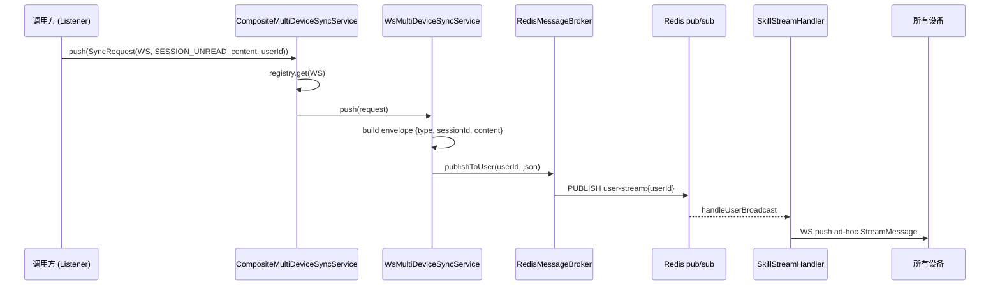
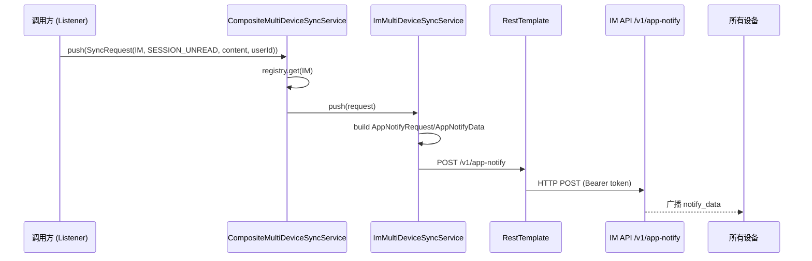

# Design (Inner): 多端同步基础设施服务

## 1 需求价值和概述

构建独立于业务的多端同步基础设施，支持 IM / WS 两种同步通道，以接口 + 枚举 + 复合路由实现可扩展架构。调用方通过 `SyncRequest` 参数对象指定同步模式和类型，无需感知具体通道实现。

**同步模式**：`skill.sync.mode=im`，inner 部署多端同步走 IM API `/v1/app-notify` 通道。Composite 通过 `getSyncMode()` 自注册路由，无需 `@ConditionalOnProperty`。后续新增 `SyncType` 只需加枚举项，新增通道只需加 `@Component` 实现。

从 `06-10-skill-session-unread-badge` 的未读推送需求中抽离，升级为通用基础设施，供未读角标、会话删除等多业务场景复用。

## 2 上下文分析

### 2.1 现有架构

- `RedisMessageBroker.publishToUser(account, message)`：Redis pub/sub `user-stream:{userId}`，现有 WS 广播通道
- `SkillStreamHandler.handleUserBroadcast`：监听 user-stream，构建 ad-hoc `StreamMessage` 推送到 WS 客户端（复用，不修改）
- `RestTemplate`：Spring HTTP 客户端，可独立用于 IM API 调用
- `ObjectMapper`：Jackson JSON 序列化，`createObjectNode()` / `valueToTree()` 构建 envelope
- Spring DI 容器：`List<MultiDeviceSyncService>` 自动收集所有实现
- `@ConfigurationProperties`：类型安全配置绑定

### 2.2 需新增的能力

- `SyncMode` / `SyncType` 枚举（`model` 包）：通道 + 业务类型
- `SyncRequest` record（`model` 包）：统一推送参数对象
- `MultiDeviceSyncService` 接口（`service.sync` 包）：`getSyncMode()` + `push(SyncRequest)`
- `CompositeMultiDeviceSyncService`：自注册路由，按 `request.syncMode` 分发
- `WsMultiDeviceSyncService`：构造 `{type, sessionId, content}` envelope → `RedisMessageBroker.publishToUser()`
- `ImMultiDeviceSyncService`：构造 `AppNotifyRequest` → `RestTemplate` POST `/v1/app-notify`
- `SyncProperties`（`config` 包）：`skill.sync.*` 配置命名空间

## 3 初始需求分析

### 3.1 初始化需求场景分析

| 场景 | 说明 |
|------|------|
| 未读角标多端同步（WS 通道） | 设备 A 收到新消息 → Lua updateMaxSeq=1 → 构建 SyncRequest(WS, SESSION_UNREAD, ...) → Redis pub/sub → 设备 B WS 收到角标更新 |
| 未读角标多端同步（IM 通道） | 同上流程，SyncRequest(IM, SESSION_UNREAD, ...) → POST /v1/app-notify → IM 平台广播 |
| 新增 SyncType（如 SESSION_DELETED） | 只需在 `SyncType` 加枚举项，调用方构建 SyncRequest 时传入新 type，无需改接口和 Composite |
| 新增 SyncMode（如 MQ） | 只需实现 `MultiDeviceSyncService` + `@Component`，Composite 自动收录 |

### 3.2 结构化 IR

- **用户可见**：无（纯基础设施，业务方通过 SyncType 枚举项间接体现）
- **系统行为**：策略模式自注册路由、通道抽象封装、类型化同步事件
- **约束**：纯 Java + Spring DI，无外部 MQ，不改动 `SkillStreamHandler` 和 `ImOutboundService`

## 4 需求影响分析

### 4.1 特性影响分析

| 模块 | 影响类型 | 说明 |
|------|----------|------|
| skill-server | 新增 | `model/SyncMode.java`、`model/SyncType.java`、`model/SyncRequest.java`、`service/sync/` 4 个文件、`config/SyncProperties.java`（无 DB 变更、无 WS handler 改动） |
| skill-miniapp | 无改动 | — |
| ai-gateway | 无改动 | — |

## 5 系统用例分析

### 5.1 用例清单

| 编号 | 用例名称 | 说明 |
|------|----------|------|
| UC-01 | 通用同步推送（WS 通道） | 调用方构建 SyncRequest(WS, ...) → Composite 路由 → WsMultiDeviceSyncService → Redis pub/sub 广播 |
| UC-02 | 通用同步推送（IM 通道） | 调用方构建 SyncRequest(IM, ...) → Composite 路由 → ImMultiDeviceSyncService → IM API /v1/app-notify 广播 |
| UC-03 | 新增业务类型扩展 | 新增 SyncType 枚举项，调用方直接使用，零代码改动 |
| UC-04 | 新增同步通道扩展 | 新增 `@Component` 实现 `MultiDeviceSyncService`，Composite 自动收录 |

### 5.2 UC-01 通用同步推送（WS 通道）

#### 5.2.1 用例概述

调用方（如 uread-badge Listener）构建 `SyncRequest(syncMode=WS, syncType=SESSION_UNREAD, syncContent={welinkSessionId, unreadCount, maxSeq, assistantAccount}, targetAccount=userId)`，经 Composite 路由到 WsMultiDeviceSyncService，通过 Redis pub/sub 广播到同一用户所有 WS 连接。

#### 5.2.2 用例流程



#### 5.2.3 影响的功能列表和需求分析

| 影响功能 | 说明 |
|----------|------|
| `WsMultiDeviceSyncService` | 新文件，构造 `{type, sessionId, content}` envelope，调用 `RedisMessageBroker.publishToUser()` |
| `CompositeMultiDeviceSyncService` | 新文件，收集所有实现 → 按 `getSyncMode()` 自注册 → `push()` 按 `request.syncMode()` 路由 |
| `RedisMessageBroker` | 复用，不改动 |
| `SkillStreamHandler.handleUserBroadcast` | 复用现有 ad-hoc 路径，不改动 |

### 5.3 UC-02 通用同步推送（IM 通道）

#### 5.3.1 用例概述

调用方构建 `SyncRequest(syncMode=IM, syncType=SESSION_UNREAD, syncContent={welinkSessionId, unreadCount, maxSeq, assistantAccount}, targetAccount=userId)`，经 Composite 路由到 ImMultiDeviceSyncService，通过 IM API `/v1/app-notify` 广播到同一用户所有设备。

#### 5.3.2 用例流程



#### 5.3.3 影响的功能列表和需求分析

| 影响功能 | 说明 |
|----------|------|
| `ImMultiDeviceSyncService` | 新文件，构造 `AppNotifyRequest`（类型化 record），`RestTemplate` 调 `/v1/app-notify` |
| `SyncProperties` | 新文件，`@ConfigurationProperties("skill.sync")`，含 `mode` + `im.app-notify.*` |

### 5.4 UC-03 新增业务类型扩展

#### 5.4.1 用例概述

后续新增业务类型（如 `SESSION_DELETED`），只需在 `SyncType` 枚举中追加枚举项，调用方直接使用新 type。`MultiDeviceSyncService` 接口和 `CompositeMultiDeviceSyncService` 均无需修改。

#### 5.4.2 用例流程

```
SyncType 新增 SESSION_DELETED("session.deleted")
  → 调用方: new SyncRequest(syncMode, SyncType.SESSION_DELETED, content, userId)
    → MultiDeviceSyncService.push(request)
      → Composite 路由 → Ws/Im → 推送到端
        → 前端 type 字段 = "session.deleted"
```

### 5.5 UC-04 新增同步通道扩展

#### 5.5.1 用例概述

后续新增同步通道（如 MQ），只需实现 `MultiDeviceSyncService` 接口并标注 `@Component`。`CompositeMultiDeviceSyncService` 通过 `List<MultiDeviceSyncService>` 自动收录。

#### 5.5.2 用例流程

```
新增 MqMultiDeviceSyncService implements MultiDeviceSyncService
  getSyncMode() → SyncMode.MQ（需在 SyncMode 追加）
  push(SyncRequest) → 发送到 MQ

Spring DI: List<MultiDeviceSyncService> 自动包含新实现
  → Composite 构造时 services.stream() 自动收录
    → registry.put(SyncMode.MQ, mqService)
```

## 6 功能设计

### 6.1 业界实现方案分析

多通道路由的常见方案：

| 方案 | 优点 | 缺点 |
|------|------|------|
| `@Qualifier` + `@Value` 条件注入 | 编译期类型安全 | 新增通道需改 Composite 构造器，违反开闭原则 |
| `@ConditionalOnProperty` 条件 Bean | Spring 原生支持 | 配置耦合，多通道并存困难 |
| **策略模式 + `getSyncMode()` 自注册**（采用） | 开闭原则完美，新增实现只需 `@Component` | 需处理 Composite 自引用 |

采用策略模式自注册：每个实现声明 `getSyncMode()`，Composite 通过 `List<MultiDeviceSyncService>` 收集 → `filter(s -> !(s instanceof Composite))` 排除自身 → `Collectors.toMap(getSyncMode, identity)` 构建路由表。

### 6.2 功能实现整体设计方案

```
┌──────────────────────────────────────────────────────────────┐
│ 调用方                                                        │
│   syncService.push(new SyncRequest(mode, type, content, acct))│
└──────────────────────────┬───────────────────────────────────┘
                           │
                           ▼
           CompositeMultiDeviceSyncService (@Primary)
            ┌─── Map<SyncMode, MultiDeviceSyncService> ───┐
            │  IM → ImMultiDeviceSyncService               │
            │  WS → WsMultiDeviceSyncService               │
            └──────────────────────────────────────────────┘
                           │
              ┌────────────┴────────────┐
              ▼                         ▼
   WsMultiDeviceSyncService   ImMultiDeviceSyncService
   RedisMessageBroker          RestTemplate
   .publishToUser()            POST /v1/app-notify
   user-stream:{userId}        AppNotifyRequest (类型化)
   → SkillStreamHandler        → IM 平台 → 多端广播
     → WS push to client
```

无 `@Qualifier`，无 `@Value`，纯基于 `getSyncMode()` 自注册。`@Primary` 解决 3 个 `MultiDeviceSyncService` Bean 的注入歧义。

### 6.3 SyncMode + SyncType 枚举设计

#### 6.3.1 实现思路

`SyncMode` 标识同步通道（WS / IM），`SyncType` 标识业务类型并携带端侧 `type` 字符串。调用方传递枚举而非字符串，编译期类型安全。

#### 6.3.2 实现设计

```java
// SyncMode — 同步通道
public enum SyncMode { WS, IM }

// SyncType — 业务类型，type 属性传递到端侧
public enum SyncType {
    SESSION_UNREAD("session.unread");

    private final String type;
    SyncType(String type) { this.type = type; }
    public String getType() { return type; }
}
```

- `SyncMode`：调用方从 `SyncProperties.mode` 获取当前部署模式
- `SyncType.getType()`：Ws 实现写入 envelope `type` 字段；Im 实现写入 `notify_data.notify_type`

### 6.4 SyncRequest Record 设计

#### 6.4.1 实现思路

统一参数对象，封装同步所需全部信息。`Map<String, Object>` 提供灵活性，不同 SyncType 携带不同字段。

#### 6.4.2 实现设计

```java
public record SyncRequest(
    SyncMode syncMode,               // 通道：由 SyncProperties.mode 决定
    SyncType syncType,               // 业务类型
    Map<String, Object> syncContent, // 推送内容（welinkSessionId, unreadCount, maxSeq, assistantAccount 等）
    String targetAccount             // 目标用户 ID
) {}
```

Ws 通道：`syncContent` → `objectMapper.valueToTree()` 嵌入 envelope `content` 字段
Im 通道：`syncContent` → 整体序列化到 `notify_data.notify_content`

### 6.5 MultiDeviceSyncService 接口设计

#### 6.5.1 实现思路

通用接口，`getSyncMode()` 用于自注册，`push(SyncRequest)` 执行推送。Composite 也实现同一接口，对外表现为统一门面。

#### 6.5.2 实现设计

```java
public interface MultiDeviceSyncService {
    SyncMode getSyncMode();          // 自注册标识
    void push(SyncRequest request);  // 通用推送入口
}
```

调用方只依赖此接口，注入时 Spring 选取 `@Primary` 的 `CompositeMultiDeviceSyncService`。

### 6.6 Composite 自注册路由设计

#### 6.6.1 实现思路

利用 Spring 自动收集 `List<MultiDeviceSyncService>`，过滤自身后按 `getSyncMode()` 构建路由表。新增实现只需 `@Component`。

#### 6.6.2 实现设计

```java
@Component
public class CompositeMultiDeviceSyncService implements MultiDeviceSyncService {

    private final Map<SyncMode, MultiDeviceSyncService> registry;

    public CompositeMultiDeviceSyncService(List<MultiDeviceSyncService> services) {
        this.registry = services.stream()
            .filter(s -> !(s instanceof CompositeMultiDeviceSyncService))
            .collect(Collectors.toMap(
                MultiDeviceSyncService::getSyncMode,
                Function.identity()));
    }

    @Override
    public SyncMode getSyncMode() {
        throw new UnsupportedOperationException("Composite does not have a single sync mode");
    }

    @Override
    public void push(SyncRequest request) {
        MultiDeviceSyncService svc = registry.get(request.syncMode());
        if (svc == null) {
            log.warn("No sync service registered for mode: {}", request.syncMode());
            return;
        }
        svc.push(request);
    }
}
```

#### 6.6.3 功能可靠性分析

| 风险 | 缓解 |
|------|------|
| 未知 syncMode | `registry.get()` 返回 null → log.warn + return，不抛异常 |
| Composite 自引用死循环 | `filter(s -> !(s instanceof Composite))` 排除自身 |
| 多 Composite Bean | `@Primary` 确保唯一注入目标 |

### 6.7 WsMultiDeviceSyncService 实现设计

#### 6.7.1 实现思路

复用现有 `RedisMessageBroker.publishToUser()` 和 `SkillStreamHandler.handleUserBroadcast` ad-hoc 路径。构造 `{type, sessionId, content}` envelope 后发布到 `user-stream:{userId}`。

#### 6.7.2 实现设计

```java
@Component
public class WsMultiDeviceSyncService implements MultiDeviceSyncService {

    private final RedisMessageBroker broker;
    private final ObjectMapper objectMapper;

    @Override
    public SyncMode getSyncMode() { return SyncMode.WS; }

    @Override
    public void push(SyncRequest request) {
        ObjectNode envelope = objectMapper.createObjectNode();
        envelope.put("type", request.syncType().getType());

        Object sessionId = request.syncContent().get("welinkSessionId");
        if (sessionId != null) {
            envelope.put("sessionId", sessionId.toString());
        }

        envelope.set("content", objectMapper.valueToTree(request.syncContent()));
        broker.publishToUser(request.targetAccount(), envelope.toString());
    }
}
```

**WS 消息格式**（复用现有 ad-hoc 路径，不改 `SkillStreamHandler`）：

```json
{
  "type": "session.unread",
  "sessionId": "123456789",
  "content": {
    "welinkSessionId": "123456789",
    "unreadCount": 1,
    "maxSeq": 15,
    "assistantAccount": "assistant_xxx"
  }
}
```

`SkillStreamHandler.handleUserBroadcast` 检测 `type` + `sessionId` + `content` → 构建 ad-hoc `StreamMessage` → `pushStreamMessage()`。

### 6.8 ImMultiDeviceSyncService 实现设计

#### 6.8.1 实现思路

独立实现 HTTP 调用，不依赖 `ImOutboundService`。请求体使用类型化的 `AppNotifyRequest` / `AppNotifyData` record，响应使用 `ImAppNotifyResponse` record 替代 `JsonNode` 手动遍历。所有模型类统一使用 `@JsonProperty` 显式指定 wire format，URL 由配置项 `skill.sync.im.app-notify.url` 完整指定。IM API 调用失败只记录 `[EXT_CALL]` 日志，不抛异常，不阻塞 WS 路径。

#### 6.8.2 实现设计

```java
@Component
public class ImMultiDeviceSyncService implements MultiDeviceSyncService {

    private final RestTemplate restTemplate;
    private final SyncProperties syncProperties;
    private final ObjectMapper objectMapper;
    private final String imToken;

    public ImMultiDeviceSyncService(RestTemplate restTemplate,
            ObjectMapper objectMapper,
            SyncProperties syncProperties,
            @Value("${skill.im.token:}") String imToken) {
        this.restTemplate = restTemplate;
        this.objectMapper = objectMapper;
        this.syncProperties = syncProperties;
        this.imToken = imToken;
    }

    @Override
    public SyncMode getSyncMode() { return SyncMode.IM; }

    @Override
    public void push(SyncRequest request) {
        SyncProperties.Im.AppNotify appNotify = syncProperties.getIm().getAppNotify();
        String appNotifyUrl = appNotify.getUrl();
        if (appNotifyUrl == null || appNotifyUrl.isBlank()) {
            log.warn("[SKIP] app_notify_url not configured");
            return;
        }

        // 类型化请求体（@JsonProperty 显式指定 snake_case）
        AppNotifyData notifyData = new AppNotifyData(
            request.syncType().getType(),   // notify_type
            request.syncContent()           // notify_content
        );
        String notifyDataJson = objectMapper.writeValueAsString(notifyData);

        AppNotifyRequest body = new AppNotifyRequest(
            UUID.randomUUID().toString(),   // client_notify_id
            appNotify.getScope(),           // notify_scope
            appNotify.getTenant(),          // notify_tenant
            request.targetAccount() != null && !request.targetAccount().isBlank()
                ? List.of(request.targetAccount()) : null,  // notify_accounts
            appNotify.getModule(),          // notify_module
            notifyDataJson                  // notify_data (JSON string)
        );

        // HTTP POST，响应使用类型化 ImAppNotifyResponse 替代 JsonNode
        ResponseEntity<ImAppNotifyResponse> response = restTemplate.postForEntity(
            appNotifyUrl, new HttpEntity<>(body, headers), ImAppNotifyResponse.class);
        // 检查 response.getBody().error() 判断业务错误
    }
}
```

**AppNotifyRequest**（model 包，类型化 record）:

```java
public record AppNotifyRequest(
    @JsonProperty("client_notify_id") String clientNotifyId,
    @JsonProperty("notify_scope") int notifyScope,
    @JsonProperty("notify_tenant") String notifyTenant,
    @JsonProperty("notify_accounts") List<String> notifyAccounts,
    @JsonProperty("notify_module") String notifyModule,
    @JsonProperty("notify_data") String notifyData
) {}
```

**AppNotifyData**（model 包）:

```java
public record AppNotifyData(
    @JsonProperty("notify_type") String notifyType,
    @JsonProperty("notify_content") Map<String, Object> notifyContent
) {}
```

**ImAppNotifyResponse**（model 包，响应类型化，替代 JsonNode）:

```java
public record ImAppNotifyResponse(
    @JsonProperty("error") ErrorInfo error
) {
    public record ErrorInfo(
        @JsonProperty("error_code") String errorCode,
        @JsonProperty("error_msg") String errorMsg
    ) {}
}
```

#### 6.8.3 功能可靠性分析

| 风险 | 缓解 |
|------|------|
| IM API 不可用 | catch 异常，log.error `[EXT_CALL]`，不抛异常，不阻塞其他通道 |
| IM API 返回 error_code | `ImAppNotifyResponse.error().errorCode()` 类型化访问 |
| appNotifyUrl 未配置 | blank 时 return 不发送，log.warn |
| url 路径变更 | 配置项 `skill.sync.im.app-notify.url` 完整指定，不硬编码 |

### 6.9 架构元素影响列表

| 架构元素 | 影响 |
|----------|------|
| 数据流 | 新增 1 条：调用方 → Composite → Ws/Im → 端侧广播 |
| 接口 | 新增 `MultiDeviceSyncService` 接口 + 3 个实现 |
| 模型 | 新增 `SyncMode`、`SyncType`、`SyncRequest`、`AppNotifyRequest`、`AppNotifyData` |
| 配置 | 新增 `SyncProperties`（`skill.sync.*`） |
| 外部依赖 | IM API `/v1/app-notify`（Im 实现内部调用） |
| 数据存储 | 无 DB 变更、无 Redis 新增 |

### 6.10 skill-server 架构元素实现设计

#### 6.10.1 接口设计

**Java 接口**：

```java
public interface MultiDeviceSyncService {
    SyncMode getSyncMode();
    void push(SyncRequest request);
}
```

**调用方式**（业务方）:

```java
// 注入 Composite（@Primary 自动选取）
@Autowired
private MultiDeviceSyncService syncService;

// 构建 SyncRequest 并推送
syncService.push(new SyncRequest(
    SyncMode.valueOf(syncProperties.getMode().toUpperCase()),
    SyncType.SESSION_UNREAD,
    Map.of("welinkSessionId", sessionId.toString(),
           "unreadCount", unreadCount,
           "maxSeq", maxSeq,
           "assistantAccount", assistant != null ? assistant : ""),
    userId
));
```

**包结构**:

```
skill-server/src/main/java/com/opencode/cui/skill/
  model/
    SyncMode.java              (enum)
    SyncType.java              (enum, 含 type 属性)
    SyncRequest.java           (record)
    AppNotifyRequest.java      (record, @JsonProperty)
    AppNotifyData.java         (record, @JsonProperty)
    ImAppNotifyResponse.java   (record, @JsonProperty, 响应类型化)
  service/sync/
    MultiDeviceSyncService.java        (interface)
    CompositeMultiDeviceSyncService.java (@Primary, 自注册路由)
    WsMultiDeviceSyncService.java       (RedisMessageBroker)
    ImMultiDeviceSyncService.java       (RestTemplate → /v1/app-notify)
  config/
    SyncProperties.java        (@ConfigurationProperties("skill.sync"))
```

#### 6.10.2 数据模型设计

##### 6.10.2.1 关系型数据库设计

无 DDL 变更。多端同步为纯传输层基础设施，不持久化同步状态。

##### 6.10.2.2 Redis 缓存设计

无新增 Key。`WsMultiDeviceSyncService` 复用现有 Redis pub/sub `user-stream:{userId}` channel（`RedisMessageBroker` 管理），不创建新 Key。

##### 6.10.2.3 配置项设计

```yaml
skill:
  sync:
    mode: ws  # ws | im，默认 ws
    im:
      app-notify:
        url: ${skill.im.api-url}/v1/app-notify  # 完整 URL，不硬编码路径
        tenant: ${IM_APP_NOTIFY_TENANT}
        module: ${IM_APP_NOTIFY_MODULE}
        scope: 2
```

**SyncProperties**:

```java
@Data
@Component
@ConfigurationProperties(prefix = "skill.sync")
public class SyncProperties {
    private String mode = "ws";  // ws | im
    private Im im = new Im();

    @Data
    public static class Im {
        private AppNotify appNotify = new AppNotify();

        @Data
        public static class AppNotify {
            private String url = "";
            private String tenant;
            private String module;
            private int scope = 2;
        }
    }
}
```

**RedissonConfig**（附带变更）: 注入 `RedisProperties`，自动适配 Cluster / 单机模式，password null 安全处理。

## 7 系统级非功能性设计

### 7.1 系统级的 FMEA 影响分析

| 故障模式 | 影响 | 检测 | 缓解 |
|----------|------|------|------|
| IM API 不可用 | Inner 模式多端同步中断，本端不受影响 | `[EXT_CALL]` 错误日志 | IM API 恢复后下次推送自愈 |
| Redis pub/sub 不可用 | WS 模式多端同步中断 | Redis 连接异常日志 | 恢复后下次推送自愈 |
| Composite 路由失败（未知 mode） | 该次推送静默丢失 | `log.warn("No sync service for mode: {}")` | 检查配置后重启 |
| ImMultiDeviceSyncService API URL 未配 | IM 推送静默跳过 | `log.warn` + 方法 return | 配置后重启 |

### 7.2 系统级安全影响分析

- IM API 调用使用现有 IM token 鉴权（Bearer token）
- Redis pub/sub channel 按 `userId` 隔离（`user-stream:{userId}`）
- `SyncRequest.targetAccount` 由服务端填充（从 session context 获取），不可由客户端指定

### 7.3 兼容性

#### 7.3.1 后向兼容性确认

- 纯新增文件，不修改任何现有代码
- `SkillStreamHandler.handleUserBroadcast` 复用不改动
- `ImOutboundService` 不受影响

#### 7.3.2 前向兼容性确认

- `SyncType` 枚举追加新项：接口和 Composite 无需修改
- `SyncMode` 追加新值 + 新实现：只需加 `@Component`，Composite 自动收录
- `SyncRequest.syncContent` 为 `Map<String, Object>`，新增字段不破坏现有实现
- `MultiDeviceSyncService` 接口稳定（2 个方法），不预期 breaking change

### 7.4 可运维

- `skill.sync.mode`（`SyncProperties`）控制同步方式，`CompositeMultiDeviceSyncService` 按 `getSyncMode()` 自注册路由，无需条件注入
- 新增配置项均有默认值（`mode=ws`，`scope=2`）
- Ws 实现 log.info 输出 `type` + `targetAccount`
- Im 实现 `client_notify_id` 使用 UUID，可追踪链路
- 3 个 `MultiDeviceSyncService` Bean → `@Primary` 解决注入歧义

### 7.5 资料

- uread-badge 整合方式：见 uread-badge `design.md` Section 4
- IM API 文档：`.trellis/tasks/06-10-skill-session-unread-badge/im-mulit-client-sync-api.md`

## 8 CheckList

### 8.1 设计自检清单

- [x] `SyncMode` 枚举（`WS`, `IM`）
- [x] `SyncType` 枚举（`SESSION_UNREAD("session.unread")`，含 `type` 属性）
- [x] `SyncRequest` record（`syncMode`, `syncType`, `syncContent`, `targetAccount`）
- [x] `AppNotifyRequest` / `AppNotifyData` / `ImAppNotifyResponse` 类型化 record（`@JsonProperty` 显式指定字段名）
- [x] `MultiDeviceSyncService` 接口（`getSyncMode()` + `push(SyncRequest)`）
- [x] `CompositeMultiDeviceSyncService`（`@Primary`，`getSyncMode()` 自注册路由，过滤自身）
- [x] `WsMultiDeviceSyncService`（`RedisMessageBroker.publishToUser()`，`{type, sessionId, content}` envelope）
- [x] `ImMultiDeviceSyncService`（独立 `RestTemplate`，类型化请求+响应，`app-notify.url` 配置化，无硬编码路径）
- [x] `SyncProperties`（`@ConfigurationProperties("skill.sync")`，含 `mode` + `im.app-notify.*`）
- [x] `RedissonConfig`（注入 `RedisProperties`，自动适配 Cluster/单机，password null 安全）
- [x] 3 Bean 歧义解决（`@Primary` 标注 Composite）
- [x] IM API 调用失败不阻塞（`[EXT_CALL]` 日志，不抛异常）
- [x] `syncContent` Map 序列化兼容（Ws: `valueToTree`，Im: 整体序列化到 `notify_content`）
- [x] 新增 `SyncType` 只需加枚举项，无需改接口和 Composite
- [x] 新增 `SyncMode` 实现只需 `@Component`，Composite 自动收录
