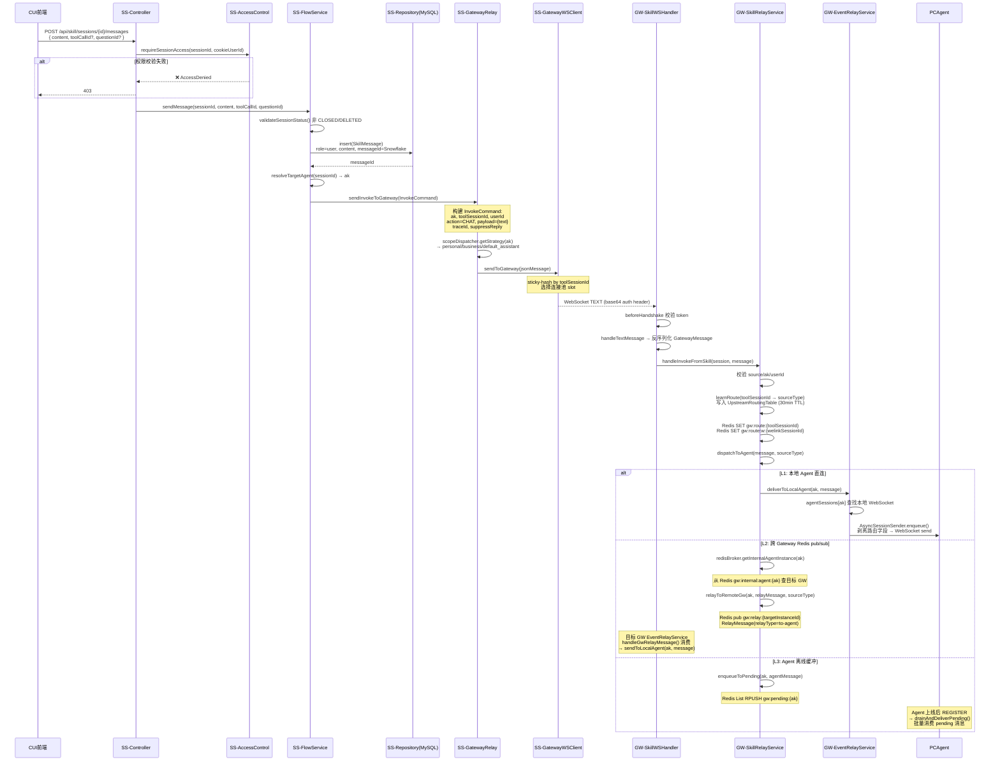
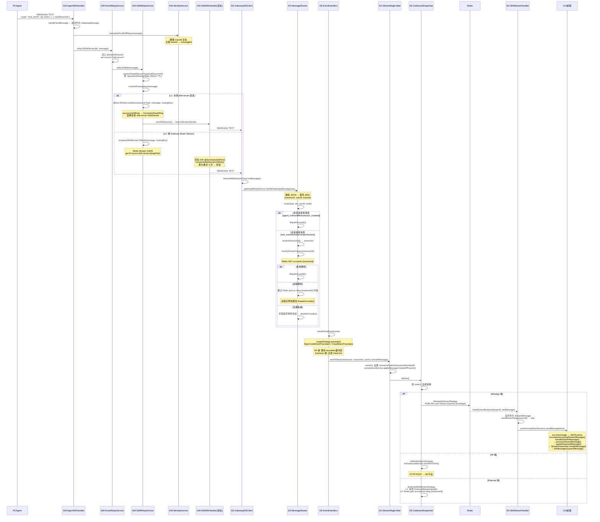
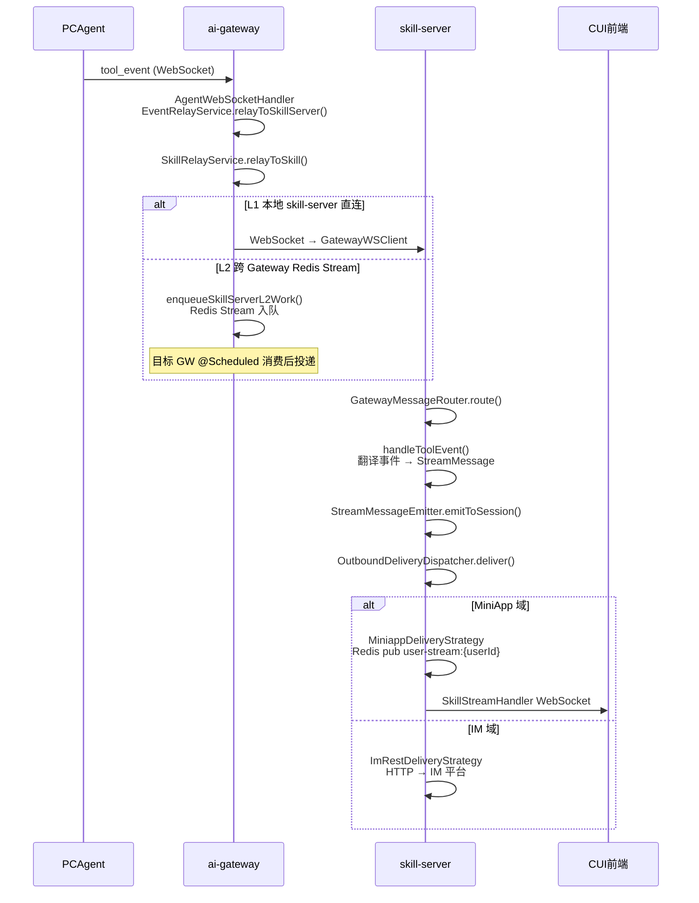
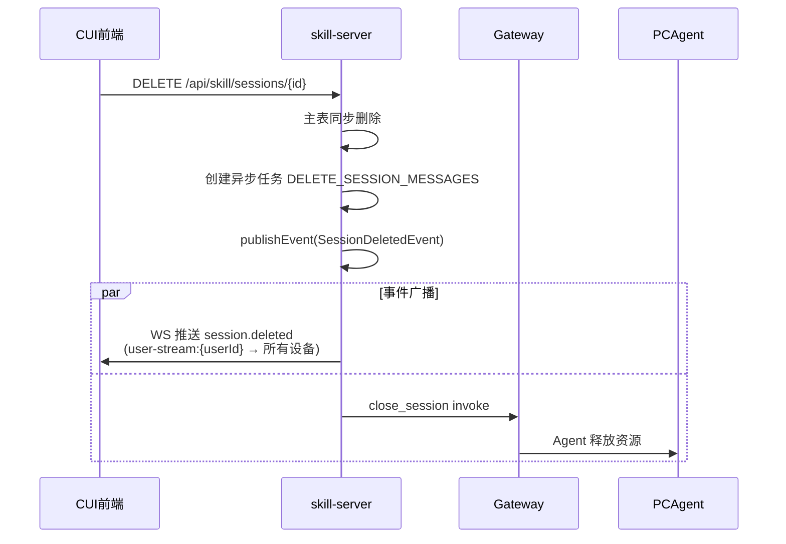

# CUI → Skill → Gateway → Agent 消息链路 FAQ

> 排查消息发送/接收问题的诊断参考。覆盖完整链路：前端发送 → 后端处理 → Gateway 中继 → Agent 执行 → 响应回流。

## 快速定位

| 现象 | 优先排查 |
|------|----------|
| 消息发不出去（HTTP 报错） | [Q1](#q1-前端发送消息失败) |
| 消息发出但 Agent 无响应 | [Q2](#q2-agent-不可用)、[Q3](#q3-gateway-下行中继失败)、[Q5](#q5-agent-执行报错) |
| 有响应但前端收不到 | [Q4](#q4-gateway-上行中继失败)、[Q8](#q8-skill-server-推送前端失败) |
| 收到报错 `session.deleted` | [Q10](#q10-会话被删除) |
| 多设备消息不一致 | [Q8](#q8-skill-server-推送前端失败) |
| Agent 频繁上下线 | [Q11](#q11-agent-连接不稳定) |

---

## 完整链路概览

### 发消息（上行）



### 回消息（下行）



### 回消息（下行）



---

## Q1: 前端发送消息失败

**症状**：用户输入消息后报错，消息未发出

### 可能原因

| 原因 | 错误码 | 日志关键字 |
|------|--------|------------|
| sessionId 无效/不存在 | 400 | `Invalid session ID` |
| 无权限（cookie userId 不匹配） | 403 | `Access denied for session` |
| 网络断开（HTTP 请求超时） | — | 前端 `ApiError` / `fetch failed` |
| 服务端内部异常 | 500 | 见 skill-server 日志 |

### 排查方法

1. **前端侧**：打开浏览器 DevTools Network 面板，查看 `POST /api/skill/sessions/{id}/messages` 请求的响应
2. **skill-server 日志**：搜索 `[ENTRY] SkillMessageController.sendMessage` 和对应的 `[EXIT]`，检查 MDC 中的 `sessionId`
3. **常见前端错误**：`useSkillStream` 中 `sessionId` 为 `undefined`（sendMessageFn 的 guard 拦截）

### 日志示例

```
# 正常
[ENTRY] SkillMessageController.sendMessage sessionId=123456789 content="你好"

# 无权限
[EXIT] SkillMessageController.sendMessage sessionId=123456789 error="Access denied"
```

---

## Q2: Agent 不可用

**症状**：消息发送成功但 Agent 无响应，前端显示"Agent 离线"

### 可能原因

| 原因 | 日志关键字 | 位置 |
|------|------------|------|
| Agent 未注册/离线 | `agent_offline`、`Agent not available` | skill-server `InboundProcessingService.checkAgentOnline()` |
| Agent AK 无效 | `UNKNOWN`、`NOT_EXISTS` | skill-server `resolverService.resolveWithStatus()` |
| Agent 连接在另一 Gateway 实例 | `remote agent` | gateway `EventRelayService.sendToLocalAgentIfPresent()` |
| Agent 注册超时 | `registration timeout` | gateway `AgentWebSocketHandler` |

### 排查方法

1. **skill-server 日志**：搜索 `checkAgentOnline`，查看 Agent 可用性检查结果
2. **gateway 日志**：搜索 `agent_online` / `agent_offline` + AK，确认 Agent 连接状态
3. **Redis**：检查 `conn:ak:{ak}` key 是否存在，确认持有 Agent 的 Gateway 实例

### 日志示例

```
# Agent 在线（正常）
[EXT_CALL] checkAgentOnline ak=agent_xxx result=ONLINE

# Agent 离线
[SKIP] checkAgentOnline ak=agent_xxx result=OFFLINE reason="no active connection"

# AK 解析失败
[EXIT] resolveWithStatus ak=agent_xxx status=NOT_EXISTS
```

---

## Q3: Gateway 下行中继失败（invoke → Agent 未收到）

**症状**：skill-server 已发送 invoke 到 Gateway，但 Agent 未收到消息

### 下行中继三级降级流程

```
dispatchToAgent()
  ├─ L1: deliverToLocalAgent(ak, message)       ← 查找本地 Agent WebSocket
  │   └─ 失败 → L2
  ├─ L2: relayToRemoteGw(ak, relayMessage)       ← Redis pub/sub 跨 Gateway
  │   └─ 失败 → L3
  └─ L3: enqueueToPending(ak, agentMessage)     ← Redis List 离线缓冲
```

### 每级失败原因

| 层级 | 失败原因 | 日志关键字 |
|------|----------|------------|
| L1 | 本地无此 AK 的 Agent 连接 | `no local agent session for ak` |
| L2 | Redis pub/sub 消息丢失 | `relay to remote gw failed` |
| L2 | 目标 Gateway 无此 Agent | `agent not found on target gateway` |
| L3 | Redis 写入失败 | `enqueue to pending failed` |
| L3 | 缓冲区满（>10000 条） | 消息丢弃 |

### 排查方法

1. **gateway 日志**：搜索 `dispatchToAgent` + `traceId`，确认走的是 L1/L2/L3 哪级
2. **Redis**：检查 `gw:pending:{ak}` list 长度，是否有消息积压
3. **跨 Gateway**：若走 L2，检查 `gw:relay:{instanceId}` pub/sub 是否正常

### 日志示例

```
# L1 成功（正常）
dispatchToAgent ak=agent_xxx level=L1 result=delivered

# L1 未找到，走 L2
dispatchToAgent ak=agent_xxx level=L1 result=not_found reason="no local agent"

# L3 兜底
dispatchToAgent ak=agent_xxx level=L3 result=enqueued pending_size=3
```

---

## Q4: Gateway 上行中继失败（tool_event → skill-server 未收到）

**症状**：Agent 已产生 tool_event，但 skill-server 没收到

### 上行中继二级降级流程

```
relayToSkill()
  ├─ L1: deliverToOneLocalSource()               ← 查找本地 skill-server WebSocket 连接
  │   └─ 通过 sourceLinkAffinity 或 ConsistentHashRing 选择连接
  │   └─ 失败 → L2
  └─ L2: enqueueSkillServerL2Work()              ← Redis Stream 跨 Gateway
      └─ 目标 Gateway @Scheduled consumeSkillServerL2Work() 消费
      └─ 失败 3 次 → 死信 Stream
```

### 每级失败原因

| 层级 | 失败原因 | 日志关键字 |
|------|----------|------------|
| L1 | 本地无 skill-server 连接 | `no local source connection` |
| L1 | 源连接已断开 | `source session closed`、`send failed` |
| L1 | 哈希环路由到错误连接 | 排查 `sourceLinkAffinity` 缓存 |
| L2 | 目标 Gateway 不存在 | 死信 |
| L2 | Redis Stream 消费失败（>3次） | `source L2 work failed`、`dead letter` |
| — | sessionId 无路由表记录 | `route not found for session` |
| — | toolSessionId 解析失败 | `Failed to resolve session ID` |

### 排查方法

1. **gateway 日志**：搜索 `relayToSkill` + `traceId`，确认走 L1/L2
2. **skill-server 日志**：搜索 `handleToolEvent`，确认是否收到 tool_event
3. **Redis**：检查 `gw:route:{toolSessionId}` 是否有值

### 日志示例

```
# L1 成功
relayToSkill ak=agent_xxx level=L1 target=skill-server:instance-001

# L1 失败走 L2
relayToSkill ak=agent_xxx level=L1 result=not_found → L2 stream=gw:l2:source:skill-server:gateway-002

# L2 重试
[WARN] source L2 work failed attempt=2/3 streamId=xxx error="connection timeout"
```

---

## Q5: Agent 执行报错（tool_error）

**症状**：收到 `tool_error`，Agent 执行失败

### 常见 tool_error 原因

| type | 含义 | skill-server 处理 |
|------|------|-------------------|
| `session_not_found` | Agent 端 toolSessionId 无效 | `handleToolError()` 中触发 session 重建 |
| `execution_error` | Agent 执行异常 | 推送 error 消息到前端 |
| `timeout` | Agent 执行超时 | 推送 error 消息 |
| `permission_denied` | Agent 权限不足 | 推送 error 消息 |

### 日志示例（skill-server）

```
# session_not_found → 自动重建
[WARN] handleToolError sessionId=xxx toolSessionId=yyy type=session_not_found → rebuilding session

# 一般错误
[ERROR] handleToolError sessionId=xxx type=execution_error error="null pointer exception"
```

---

## Q6: 消息持久化失败

**症状**：消息发送成功但历史记录查不到

### 可能原因

| 原因 | 日志关键字 | 位置 |
|------|------------|------|
| MyBatis 插入异常 | `DataAccessException`、`SQLException` | `SkillMessageService` |
| 事务回滚 | `Transaction rolled back` | Spring 事务日志 |
| 主键冲突（Snowflake ID 重复） | `Duplicate entry for key PRIMARY` | MySQL |
| DB 连接池耗尽 | `Cannot acquire connection` | HikariCP |

### 日志示例

```
[ERROR] Failed to persist message sessionId=xxx error="Duplicate entry '123456' for key 'PRIMARY'"
```

---

## Q7: skill-server → Gateway 连接断开

**症状**：所有 Agent 都不可达，Gateway 相关的操作全部失败

### 原因分析

| 原因 | 日志关键字 | 位置 |
|------|------------|------|
| Gateway ALB/实例宕机 | `Connection refused`、`connect timed out` | `GatewayWSClient` |
| WebSocket 鉴权失败 | `auth failed`、`invalid token` | Gateway `SkillWebSocketHandler.beforeHandshake()` |
| 网络闪断 | `Connection reset`、`Broken pipe` | `InternalWebSocketClient` |
| 连接池全部断开 | `all connections lost` | `GatewayWSClient` |

### 排查方法

1. **skill-server 日志**：搜索 `GatewayWSClient` 的连接状态日志
2. **gateway 日志**：搜索 `SkillWebSocketHandler` 的连接/断开事件

### 日志示例

```
# 连接断开
[WARN] GatewayWSClient connection closed slot=1 reason="Connection reset"

# 重连中
[INFO] GatewayWSClient reconnecting slot=1 attempt=3 delay=4000ms

# 鉴权失败（Gateway 侧）
[WARN] SkillWebSocketHandler.beforeHandshake auth failed reason="invalid token"
```

---

## Q8: skill-server 推送前端失败

**症状**：tool_event 已到达 skill-server 并处理，但前端收不到 WebSocket 消息

### 推送链路

```
StreamMessageEmitter.emitToSession()
  → OutboundDeliveryDispatcher.deliver()
    → MiniappDeliveryStrategy
      → Redis pub user-stream:{userId}
        → SkillStreamHandler.handleUserBroadcast()
          → ws.sendMessage(text)
```

### 每步失败原因

| 步骤 | 失败原因 | 日志关键字 |
|------|----------|------------|
| emitToSession | session 为 null | 跳过（`[SKIP]`） |
| emitToSession | 消息 enrich 异常 | `Failed to enrich message` |
| MiniappDelivery | Redis pub 失败 | `redis publish failed` |
| SkillStreamHandler | 用户无 WebSocket 连接 | 静默（消息丢失） |
| SkillStreamHandler | 用户在其他 SS 实例 | 通过 `user-stream:{userId}` 跨实例投递 |
| SkillStreamHandler | WebSocket send 失败 | `ws send error`、自动注销连接 |

### 特殊场景

- **多设备**：同一 userId 的多个 WebSocket 连接均会收到（广播模式）
- **跨实例**：`user-stream:{userId}` Redis pub/sub 确保所有 SS 实例上的连接都能收到
- **Redis pub/sub 自愈**：loopback probe（`verifySubscriptionDelivery`）检测订阅健康，失败后重建订阅

### 日志示例

```
# 正常推送
[EXT_CALL] emitToSession sessionId=xxx userId=yyy type=tool_event

# 用户无连接
[SKIP] pushStreamMessage sessionId=xxx → no connected user found

# Redis pub 成功
[EXT_CALL] MiniappDelivery publish channel=user-stream:yyy result=1
```

---

## Q9: 前端 WebSocket 连接异常

**症状**：前端偶尔收不到消息，或频繁重连

### 可能原因

| 原因 | 日志关键字（前端） | 处理 |
|------|-------------------|------|
| 网络断开 | `ws.onclose` code=1006 | 自动重连（指数退避 1s→30s） |
| 心跳超时 | 25s 无 pong | 主动关闭重建 |
| 服务端重启 | `ws.onclose` code=1001 | 自动重连 |
| resume 失败 | 重连后消息不连续 | 前端发 `resume` + sessionId，服务端重放 stream buffer |

### 心跳机制

- 前端每 25s 发送 `{ action: 'ping', timestamp }`
- skill-server `SkillStreamHandler` 响应 pong
- 超时后前端主动关闭 WebSocket 并重建

### 排查方法

1. **前端控制台**：观察 WebSocket 连接状态和 `onclose` 事件
2. **skill-server 日志**：搜索 `SkillStreamHandler` 的 `afterConnectionClosed`

---

## Q10: 会话被删除

**症状**：发送消息时返回 400，或收到 `session.deleted` WebSocket 事件

### 原因

- 用户在其他设备主动删除会话
- 会话状态为 CLOSED 后被 GC 清理

### 关联链路



### 前端处理

前端 `useSkillStream` 收到 `session.deleted` → 从列表移除会话，当前会话自动切换到下一个。

---

## Q11: Agent 连接不稳定

**症状**：Agent 频繁上下线，`agent_online` / `agent_offline` 事件反复出现

### 可能原因

| 原因 | 日志关键字 | 位置 |
|------|------------|------|
| PCAgent 网络波动 | `Connection reset`、`afterConnectionClosed` | Gateway `AgentWebSocketHandler` |
| 心跳超时 | 120s 未收到 heartbeat | Gateway 主动断开 |
| 重复连接（AK 冲突） | `duplicate connection` | `handleRegister()` kick 旧连接 |
| Gateway 实例切换 | Agent 重连到不同 Gateway | 条件 Redis 清理 |

### 排查方法

1. **gateway 日志**：搜索 `agent_online` / `agent_offline` + AK，观察时间间隔
2. **Redis**：检查 `conn:ak:{ak}` TTL 是否正常刷新

### 日志示例

```
# 正常心跳
[DEBUG] heartbeat ak=agent_xxx last_seen=2026-06-10T10:30:00

# 心跳超时
[WARN] Agent heartbeat timeout ak=agent_xxx closing connection

# 重复连接
[WARN] Duplicate agent connection ak=agent_xxx kicking old session
```

---

## Q12: 跨 SS 实例消息丢失

**症状**：多实例部署时，消息未能送达正确的 skill-server 实例

### 路由关键点

Gateway 侧 `UpstreamRoutingTable` 负责记录 `toolSessionId → sourceType` 的映射：
- 从 invoke 消息中 `learnRoute()` 学习路由
- 30 分钟 TTL
- 通过 `RelayMessage.routingKeys` 跨 Gateway 实例传播

Session 所有权在 skill-server 侧由 `GatewayMessageRouter` 管理：
- 通过 Redis `ss:owner:{sessionId}` 记录 owning instance
- 非拥有者实例收到消息后通过 Redis pub/sub 中继到拥有者

### 排查方法

1. **gateway 日志**：搜索 `learnRoute` + `toolSessionId`
2. **skill-server 日志**：搜索 `route` + `sessionId`，查看 `resolve owner instance` 的结果
3. **Redis**：检查 `ss:owner:{sessionId}` 的值

---

## 通用排查技巧

### 1. 按 traceId 串联全链路

所有跨服务调用都带 `traceId`，在 gateway 中由 `GatewayMessageIdentityService` 保证：
- 前端 `X-Trace-Id` header → skill-server → gateway invoke → agent → gateway tool_event → skill-server

```bash
# 在 skill-server 日志中搜索
grep "traceId=abc123" skill-server.log

# 在 gateway 日志中搜索
grep "abc123" gateway.log
```

### 2. 检查 Redis 关键 key

```bash
# Agent 连接情况
redis-cli GET conn:ak:{ak}

# Session 路由
redis-cli GET gw:route:{toolSessionId}

# 消息缓冲积压
redis-cli LLEN gw:pending:{ak}

# User stream 订阅者
redis-cli PUBSUB NUMSUB user-stream:{userId}
```

### 3. 检查 MDC 上下文

skill-server 和 gateway 的日志都带 MDC：
- `sessionId` / `welinkSessionId`
- `userId`
- `traceId`
- `ak` (Agent Key)

---

## 符号速查表

| 符号 | 全称 | 说明 |
|------|------|------|
| AK | Agent Key | Agent 接入密钥，路由主键 |
| toolSessionId | Tool Session ID | PCAgent 端会话标识 |
| welinkSessionId | WeLink Session ID | skill-server 端会话标识（= DB sessionId） |
| traceId | Trace ID | 全链路追踪 ID |
| SS | Skill Server | skill-server 实例 |
| GW / Gateway | AI Gateway | 消息网关实例 |
| IM | Instant Messaging | 即时通讯平台（如 WeLink） |
| MDC | Mapped Diagnostic Context | 日志上下文 |
