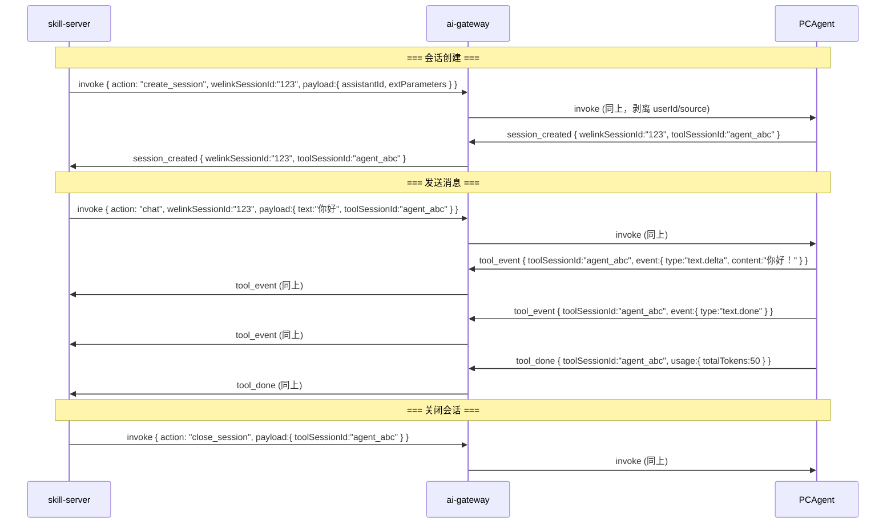
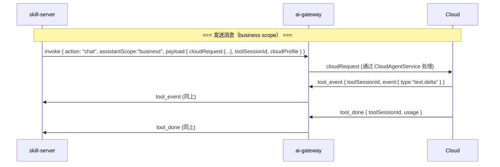
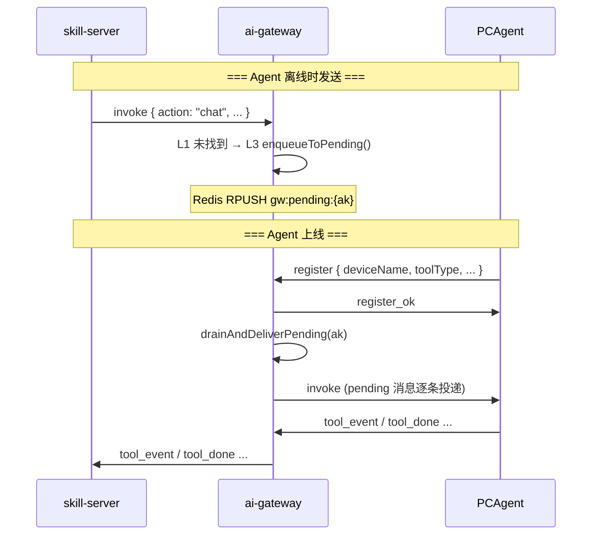

# Skill ↔ Gateway 接口文档

> skill-server 与 ai-gateway 之间的 WebSocket 通信协议完整规范。

---

## 1. 连接建立

### 1.1 端点

skill-server 通过 `GatewayWSClient` 向 Gateway ALB 发起 WebSocket 连接。skill-server 维护一个可配置数量（默认 3）的连接池。

### 1.2 鉴权握手

使用 `Sec-WebSocket-Protocol` 头部传递认证信息：

```
Sec-WebSocket-Protocol: auth.<base64url-json>
```

**Base64 URL-safe 解码后的 JSON**：

```json
{
  "token": "<internal-token>",
  "source": "skill-server",
  "instanceId": "<skill-server-instance-id>"
}
```

| 字段 | 类型 | 必填 | 说明 |
|------|------|------|------|
| `token` | string | 是 | 内网共享密钥，由 `skill.gateway.internal-token` 配置 |
| `source` | string | 是 | 来源标识，固定为 `"skill-server"` |
| `instanceId` | string | 否 | skill-server 实例 ID，用于 mesh 路由 |

**Gateway 侧校验流程**：

1. 解析 `Sec-WebSocket-Protocol`，查找 `auth.` 前缀的 candidate
2. Base64URL 解码 → JSON 解析
3. 校验 `token` 与配置的 `internalToken` 一致
4. 校验 `source` 非空
5. 成功后存储 `source`、`instanceId` 到 WebSocket session attributes
6. 失败则拒绝握手（`beforeHandshake` 返回 false）

### 1.3 连接池路由

skill-server 发消息时按以下规则选择连接池 slot：

| 规则 | 条件 | 说明 |
|------|------|------|
| sticky hash | 消息含 `toolSessionId` 或 `welinkSessionId` | 对 session key 取模，保证同一会话走同一连接 |
| round-robin | 消息无 session key | 轮询选择 |

---

## 2. 通用消息格式

所有消息使用 JSON 文本帧，以 `GatewayMessage` 为统一 DTO（`@JsonInclude(NON_NULL)`，null 字段不序列化）。

### 2.1 公共字段

| 字段 | 类型 | 说明 |
|------|------|------|
| `type` | string | **必填**。消息类型，决定后续路由行为 |
| `ak` | string | Agent 应用密钥，路由主键 |
| `welinkSessionId` | string | skill 侧会话 ID（String 防止 JS 精度丢失） |
| `toolSessionId` | string | Agent 侧会话 ID |
| `userId` | string | 用户 ID（server 注入，路由信任依据） |
| `source` | string | 上游来源标识，固定 `"skill-server"` |
| `traceId` | string | 全链路追踪 ID |
| `messageId` | string | Agent/云端回复消息 ID，用于排序和链路亲和 |
| `sequenceNumber` | long | 多实例排序序号 |
| `gatewayInstanceId` | string | Gateway 实例 ID（内部路由使用，投递到 Agent 前剥离） |

### 2.2 字段按消息类型分组

**invoke 专用**：

| 字段 | 类型 | 说明 |
|------|------|------|
| `action` | string | 操作类型：`chat`、`create_session`、`close_session`、`abort_session`、`question_reply`、`permission_reply` |
| `assistantAccount` | string | 助手账号，云端路由透传 |
| `businessTag` | string | 业务路由标签，用于 SysConfig 查找和云端 profile 解析 |
| `payload` | object | 自由格式 JSON 载荷 |
| `suppressReply` | boolean | 抑制插件端 opencode SDK 回复（仅群聊+通道白名单命中时设置） |
| `assistantScope` | string | 助手作用域：`"personal"`（默认）、`"business"` |

**tool_event 专用**：

| 字段 | 类型 | 说明 |
|------|------|------|
| `event` | object | 原始 OpenCode 事件（透传） |
| `usage` | object | Token 用量信息 |
| `error` | string | 错误描述 |
| `reason` | string | 拒绝/失败原因码 |

**register 专用**：

| 字段 | 类型 | 说明 |
|------|------|------|
| `deviceName` | string | 设备名称 |
| `macAddress` | string | MAC 地址 |
| `os` | string | 操作系统 |
| `toolType` | string | 工具类型 |
| `toolVersion` | string | 工具版本 |

**subagent 专用**：

| 字段 | 类型 | 说明 |
|------|------|------|
| `subagentSessionId` | string | 子会话 ID（Plugin 映射改写后设置） |
| `subagentName` | string | 子 Agent 名称（Plugin 映射改写后设置） |

---

## 3. 消息类型清单

### 3.1 SS → GW（下行，skill-server 发往 Gateway）

| type | 说明 | 必填字段 |
|------|------|----------|
| `invoke` | 调用 Agent 执行操作 | `ak`、`action`、`payload`、`traceId` |
| `route_confirm` | 路由确认（已废弃，保留兼容） | `toolSessionId`、`welinkSessionId`、`source` |
| `route_reject` | 路由拒绝（仅记录日志） | `toolSessionId`、`source` |

### 3.2 GW → SS（上行，Gateway 发往 skill-server）

| type | 说明 | 必填字段 |
|------|------|----------|
| `tool_event` | Agent 流式工具事件 | `toolSessionId`、`messageId`、`event` |
| `tool_done` | Agent 工具执行完成 | `toolSessionId`、`messageId`、`usage` |
| `tool_error` | Agent 工具执行错误 | `toolSessionId`、`messageId`、`error`、`reason` |
| `session_created` | Agent 会话创建完成 | `welinkSessionId`、`toolSessionId` |
| `permission_request` | Agent 权限请求 | 透明透传 |
| `agent_online` | Agent 上线通知 | `ak`、`toolType`、`toolVersion` |
| `agent_offline` | Agent 下线通知 | `ak` |
| `status_response` | Agent OpenCode 在线状态 | `opencodeOnline` |
| `im_push` | 云端 IM 推送 | — |

---

## 4. Invoke 详细定义

### 4.1 action 枚举（`GatewayActions`）

| 常量 | 值 | 说明 |
|------|-----|------|
| `CHAT` | `"chat"` | 发送聊天消息 |
| `CREATE_SESSION` | `"create_session"` | 创建 Agent 会话 |
| `CLOSE_SESSION` | `"close_session"` | 关闭会话 |
| `ABORT_SESSION` | `"abort_session"` | 中止进行中的会话 |
| `QUESTION_REPLY` | `"question_reply"` | 回复工具问题 |
| `PERMISSION_REPLY` | `"permission_reply"` | 回复权限请求 |

### 4.2 作用域策略

skill-server 通过 `AssistantScopeDispatcher` 选择三种策略之一：

| 作用域 | 策略类 | 线上 `assistantScope` | toolSessionId 生成 | 需要 session_created | 需要在线检查 | 事件翻译器 |
|--------|--------|----------------------|--------------------|---------------------|-------------|-----------|
| personal | `PersonalScopeStrategy` | 不设置（默认） | null（等 Agent 回调） | 是 | 是 | 按 event `protocol` 字段：`opencode`→OpenCodeEventTranslator / `cloud`→CloudEventTranslator |
| business | `BusinessScopeStrategy` | `"business"` | Snowflake ID | 否 | 否 | CloudEventTranslator |
| default_assistant | `DefaultAssistantScopeStrategy` | `"business"` | Snowflake ID | 否 | 否 | CloudEventTranslator |

**选择逻辑**：
1. 用 `domain` + `domainType` 查 `DefaultAssistantRule` → 命中返回 `DefaultAssistantScopeStrategy`
2. 未命中则查 `AssistantInfo.assistantScope`：
   - `null` → personal
   - `"business"` → 检查 business whitelist → 白名单命中则 business，否则降级 personal
   - 其他 → personal

### 4.3 Personal Scope Invoke 消息体

#### 4.3.1 create_session

```json
{
  "type": "invoke",
  "ak": "agent_xxx",
  "source": "skill-server",
  "userId": "user123",
  "welinkSessionId": "123456789",
  "action": "create_session",
  "traceId": "uuid-xxx",
  "payload": {
    "assistantId": "resolved_assistant_id",
    "extParameters": {
      "businessExtParam": { },
      "platformExtParam": {
        "businessSessionDomain": "IM",
        "businessSessionType": "group",
        "businessSessionId": "chat_456",
        "bizRobotTag": "default"
      }
    }
  }
}
```

#### 4.3.2 chat

```json
{
  "type": "invoke",
  "ak": "agent_xxx",
  "source": "skill-server",
  "userId": "user123",
  "welinkSessionId": "123456789",
  "action": "chat",
  "suppressReply": false,
  "traceId": "uuid-xxx",
  "assistantAccount": "assistant_001",
  "payload": {
    "text": "帮我写一段代码",
    "toolSessionId": "agent_session_abc",
    "assistantId": "resolved_assistant_id",
    "extParameters": {
      "businessExtParam": { },
      "platformExtParam": {
        "businessSessionDomain": "IM",
        "businessSessionType": "group",
        "businessSessionId": "chat_456",
        "bizRobotTag": "default",
        "allowedSlashCommands": ["plan", "ask", "run"]
      }
    }
  }
}
```

#### 4.3.3 close_session / abort_session

```json
{
  "type": "invoke",
  "ak": "agent_xxx",
  "source": "skill-server",
  "userId": "user123",
  "action": "close_session",
  "traceId": "uuid-xxx",
  "payload": {
    "toolSessionId": "agent_session_abc"
  }
}
```

#### 4.3.4 question_reply / permission_reply

```json
{
  "type": "invoke",
  "ak": "agent_xxx",
  "source": "skill-server",
  "userId": "user123",
  "welinkSessionId": "123456789",
  "action": "question_reply",
  "traceId": "uuid-xxx",
  "payload": {
    "toolSessionId": "agent_session_abc",
    "questionId": "q_001",
    "replyAnswers": ["选项A"],
    "extParameters": {
      "platformExtParam": {
        "businessSessionDomain": "IM",
        "businessSessionType": "group",
        "businessSessionId": "chat_456",
        "bizRobotTag": "default"
      }
    }
  }
}
```

### 4.4 Business Scope Invoke 消息体

#### 4.4.1 chat

```json
{
  "type": "invoke",
  "ak": "agent_xxx",
  "source": "skill-server",
  "action": "chat",
  "assistantScope": "business",
  "assistantAccount": "assistant_001",
  "businessTag": "biz_tag_001",
  "userId": "user123",
  "traceId": "uuid-xxx",
  "payload": {
    "cloudRequest": {
      "content": "帮我统计昨天的订单",
      "contentType": "text",
      "topicId": "1234567890123456789",
      "assistantAccount": "assistant_001",
      "sendUserAccount": "user123",
      "imGroupId": "chat_456",
      "messageId": "msg_789",
      "clientLang": "zh",
      "extParameters": {
        "businessExtParam": { },
        "platformExtParam": {
          "businessSessionDomain": "IM",
          "businessSessionType": "group",
          "businessSessionId": "chat_456",
          "bizRobotTag": "default"
        }
      }
    },
    "toolSessionId": "1234567890123456789",
    "cloudProfile": "default"
  }
}
```

**`cloudRequest` 字段说明**：

| 字段 | 类型 | 说明 |
|------|------|------|
| `content` | string | 消息文本（抽取优先级：`payload.text` → `payload.content` → `payload.message`） |
| `contentType` | string | 固定 `"text"` |
| `topicId` | string | 即 `toolSessionId`，Snowflake ID |
| `assistantAccount` | string | 助手账号 |
| `sendUserAccount` | string | 发送者账号 |
| `imGroupId` | string | IM 群 ID（单聊时为 null） |
| `messageId` | string | 消息 ID |
| `clientLang` | string | 固定 `"zh"` |
| `extParameters` | object | 扩展参数，含 `businessExtParam` + `platformExtParam` |

#### 4.4.2 question_reply / permission_reply（business）

```json
{
  "type": "invoke",
  "ak": "agent_xxx",
  "source": "skill-server",
  "action": "question_reply",
  "assistantScope": "business",
  "assistantAccount": "assistant_001",
  "businessTag": "biz_tag_001",
  "traceId": "uuid-xxx",
  "payload": {
    "cloudRequest": {
      "content": null,
      "replyToolCallId": "tc_001",
      "replyAnswers": ["选项B"],
      "contentType": "text",
      "topicId": "1234567890123456789",
      "assistantAccount": "assistant_001",
      "sendUserAccount": "user123",
      "imGroupId": "chat_456",
      "messageId": "msg_789",
      "clientLang": "zh",
      "extParameters": { }
    },
    "toolSessionId": "1234567890123456789",
    "cloudProfile": "default"
  }
}
```

### 4.5 platformExtParam 公共子对象

所有 invoke 的 payload 中都包含 `platformExtParam`：

| 字段 | 类型 | 说明 |
|------|------|------|
| `businessSessionDomain` | string/null | 业务会话域（如 `"IM"`），null 时序列化为 JSON null |
| `businessSessionType` | string/null | 业务会话类型（如 `"group"`、`"single"`），null 时序列化为 JSON null |
| `businessSessionId` | string/null | 业务会话 ID，null 时序列化为 JSON null |
| `bizRobotTag` | string/null | 机器人标签（如 `"default"`），null 时序列化为 JSON null |
| `allowedSlashCommands` | string[] | 允许的斜杠命令清单（仅 personal CHAT 且非空时附带） |

---

## 5. 上行事件详细定义

### 5.1 tool_event — 流式工具事件

Agent 执行工具过程中产生的增量事件。

```json
{
  "type": "tool_event",
  "ak": "agent_xxx",
  "userId": "user123",
  "toolSessionId": "agent_session_abc",
  "messageId": "msg_reply_001",
  "traceId": "uuid-xxx",
  "source": "skill-server",
  "event": {
    "protocol": "opencode",
    "type": "text.delta",
    "partId": "part_1",
    "content": "这是流式返回的文本内容"
  }
}
```

**`event` 常见子类型**（按 protocol 不同）：

| protocol | 事件子类型 | 说明 |
|----------|-----------|------|
| `opencode` | `text.delta` | 流式文本增量 |
| `opencode` | `text.done` | 文本流结束 |
| `opencode` | `thinking.delta` | 思考过程增量 |
| `opencode` | `thinking.done` | 思考完成 |
| `opencode` | `tool.update` | 工具调用状态更新 |
| `opencode` | `step.start` | 步骤开始 |
| `opencode` | `step.done` | 步骤结束（含 token 用量） |
| `cloud` | `text.delta` | 云端文本增量 |
| `cloud` | `text.done` | 云端文本完成 |

**skill-server 端处理**：
- 按 `event.protocol` 选择翻译器（OpenCodeEventTranslator / CloudEventTranslator）
- OpenCode 事件翻译为 `StreamMessage`（`text.delta`、`thinking.delta`、`tool.update` 等）
- IM 域累积 `text.delta` 文本缓冲区，在 `text.done` 时 flush 到 IM 平台
- business 域过滤云端扩展参数

### 5.2 tool_done — 工具执行完成

```json
{
  "type": "tool_done",
  "ak": "agent_xxx",
  "userId": "user123",
  "toolSessionId": "agent_session_abc",
  "messageId": "msg_reply_001",
  "traceId": "uuid-xxx",
  "usage": {
    "inputTokens": 150,
    "outputTokens": 300,
    "totalTokens": 450
  }
}
```

**skill-server 端处理**：
1. 如果累积了 IM 文本缓冲区 → flush 发送
2. 发送 `session.status` = `idle`
3. 持久化最终消息
4. 清除待处理消息标记

### 5.3 tool_error — 工具执行错误

```json
{
  "type": "tool_error",
  "ak": "agent_xxx",
  "userId": "user123",
  "toolSessionId": "agent_session_abc",
  "messageId": "msg_reply_001",
  "traceId": "uuid-xxx",
  "error": "null pointer exception at line 42",
  "reason": "execution_error"
}
```

**`reason` 常见值**：

| reason | 说明 | skill-server 处理 |
|--------|------|-------------------|
| `session_not_found` | Agent 端 toolSessionId 无效 | 自动触发 session 重建 |
| `execution_error` | Agent 执行时异常 | 推送 error 消息到前端 |
| `timeout` | Agent 执行超时 | 推送 error 消息到前端 |
| `permission_denied` | 权限不足 | 推送 error 消息到前端 |

### 5.4 session_created — 会话创建回调

```json
{
  "type": "session_created",
  "ak": "agent_xxx",
  "userId": "user123",
  "welinkSessionId": "123456789",
  "toolSessionId": "agent_session_abc",
  "traceId": "uuid-xxx"
}
```

**skill-server 端处理**：
1. 将 `toolSessionId` 绑定到 `SkillSession`
2. 回放该 session 排队等待的 pending messages（`retryPendingMessages()`）

### 5.5 agent_online / agent_offline — Agent 上下线

```json
{
  "type": "agent_online",
  "ak": "agent_xxx",
  "toolType": "opencode",
  "toolVersion": "1.2.3"
}
```

```json
{
  "type": "agent_offline",
  "ak": "agent_xxx"
}
```

**skill-server 端处理**：
- `agent_online`：驱逐可用性缓存，向该 AK 所有活跃 session 广播 `agent.online`
- `agent_offline`：驱逐可用性缓存，广播 `agent.offline`

### 5.6 permission_request — 权限请求

由 Agent 发送，Gateway 透传到 skill-server，skill-server 翻译后广播到前端。

```json
{
  "type": "permission_request",
  "ak": "agent_xxx",
  "userId": "user123",
  "toolSessionId": "agent_session_abc",
  "traceId": "uuid-xxx",
  "event": {
    "type": "permission.ask",
    "toolName": "write_file",
    "arguments": { "path": "/tmp/test.txt" }
  }
}
```

---

## 6. 跨 Gateway 中继

当 Agent 连接到 Gateway-B，但 invoke 来自 Gateway-A 侧的 skill-server 时，通过 Redis 中继。

### 6.1 中继消息格式（RelayMessage）

**Channel**: `gw:relay:{targetInstanceId}`

```json
{
  "type": "relay",
  "sourceType": "skill-server",
  "routingKeys": ["agent_session_abc", "w:123456789"],
  "originalMessage": "{...序列化的 GatewayMessage JSON...}",
  "relayType": "to-agent"
}
```

| 字段 | 类型 | 说明 |
|------|------|------|
| `type` | string | 固定 `"relay"` |
| `sourceType` | string | 来源服务类型，如 `"skill-server"` |
| `routingKeys` | string[] | 路由键列表，用于目标 Gateway 更新 `UpstreamRoutingTable` |
| `originalMessage` | string | 原始 `GatewayMessage` 的 JSON 字符串 |
| `relayType` | string | 中继方向（见下表） |
| `targetSourceType` | string | 目标来源类型（`relayType=to-source` 时使用） |
| `targetSourceInstanceId` | string | 目标来源实例 ID（`relayType=to-source` 时使用） |

**relayType 枚举**：

| 值 | 方向 | 说明 |
|-----|------|------|
| `to-agent` | GW→GW→Agent | 下行中继，投递到目标 GW 的本地 Agent |
| `to-source` | GW→GW→SS | 上行中继，投递到目标 GW 的本地 skill-server 连接 |
| `to-cloud-control` | GW→GW | 云端控制帧中继 |

### 6.2 下行中继（invoke → Agent 在远程 GW）

```
GW-A: SkillRelayService.dispatchToAgent()
  ├─ L1: deliverToLocalAgent(ak) → 本地没找到
  ├─ L2: redisBroker.getInternalAgentInstance(ak) → 查到 GW-B
  │      PUBLISH gw:relay:{gwB-instanceId}  RelayMessage(relayType=to-agent)
  │      GW-B: EventRelayService.handleGwRelayMessage()
  │           → 提取 originalMessage → sendToLocalAgent(ak)
  └─ L3: enqueueToPending(ak) → Redis List RPUSH gw:pending:{ak}
          (Agent 上线后 drain)
```

### 6.3 上行中继（tool_event → skill-server 在远程 GW）

```
GW-A: SkillRelayService.relayToSkill()
  ├─ L1: deliverToOneLocalSource() → 本地没找到 skill-server 连接
  └─ L2: XADD gw:l2:source:skill-server:{gwB-instanceId} {message}
          GW-B: @Scheduled(200ms) consumeSkillServerL2Work()
               → deliverToOneLocalSource() → 投递到本地 SS WebSocket
               失败 → 重试最多 3 次 → 死信 Stream
```

---

## 7. Redis Key 参考

| Key 模式 | 类型 | TTL | 说明 |
|----------|------|-----|------|
| `conn:ak:{ak}` | KV | 有 | 记录持有 Agent 连接的 Gateway 实例 |
| `gw:internal:agent:{ak}` | KV | 有 | 同上，供 GW 内部查询 |
| `gw:source-conn:{sourceType}:{sourceInstanceId}` | HASH | — | 记录 skill-server 源连接 |
| `gw:l2:source:{sourceType}:{targetGw}` | Stream | — | L2 上行中继邮箱（每目标 GW 一个） |
| `gw:route:{toolSessionId}` | KV | 30min | toolSessionId → sourceType 路由 |
| `gw:route:w:{welinkSessionId}` | KV | 30min | welinkSessionId → sourceType 路由 |
| `gw:pending:{ak}` | List | 有 | Agent 离线时缓冲的下行消息 |
| `agent:{ak}` | Pub/Sub | — | 跨 GW 下行消息投递 |
| `gw:relay:{instanceId}` | Pub/Sub | — | GW-GW 中继消息 |
| `ss:owner:{sessionId}` | KV | — | Session 归属的 skill-server 实例 |

---

## 8. 完整会话流程示例

### 8.1 Personal Scope 一轮对话



### 8.2 Business Scope 一轮对话



### 8.3 Agent 离线时消息缓冲



---

## 9. 错误处理

### 9.1 Gateway 侧拒绝

| 场景 | 处理 |
|------|------|
| 握手鉴权失败 | 拒绝 WebSocket 连接（`beforeHandshake` 返回 false） |
| 未知 message type | 记录 WARN 日志，忽略消息 |
| invoke 缺少必填字段 | `handleInvokeFromSkill` 中校验失败，记录 ERROR |
| Agent 不在线且 pending buffer 满 | 消息丢弃（AsyncSessionSender 队列上限 10000） |
| L2 Redis Stream 消费失败 | 最多重试 3 次，之后移至死信 Stream |

### 9.2 skill-server 侧处理

| 场景 | 处理 |
|------|------|
| sessionId 无路由记录 | `route()` 中乐观锁声明所有权 |
| toolSessionId 解析失败 | 记录 WARN，跳过该消息 |
| tool_error: session_not_found | 自动重建 session |
| Gateway 连接全部断开 | `GatewayWSClient` 指数退避重连（1s→30s max） |
