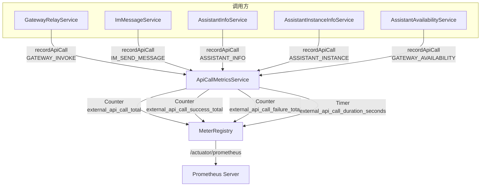
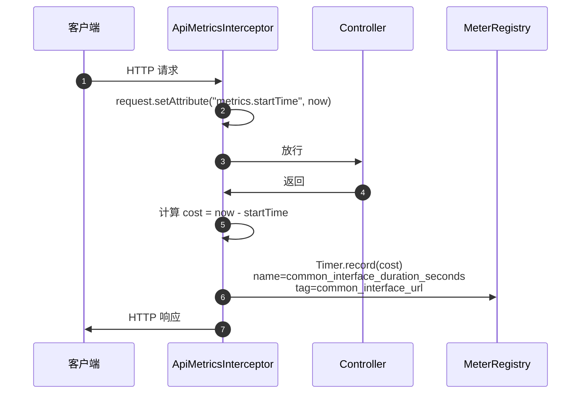
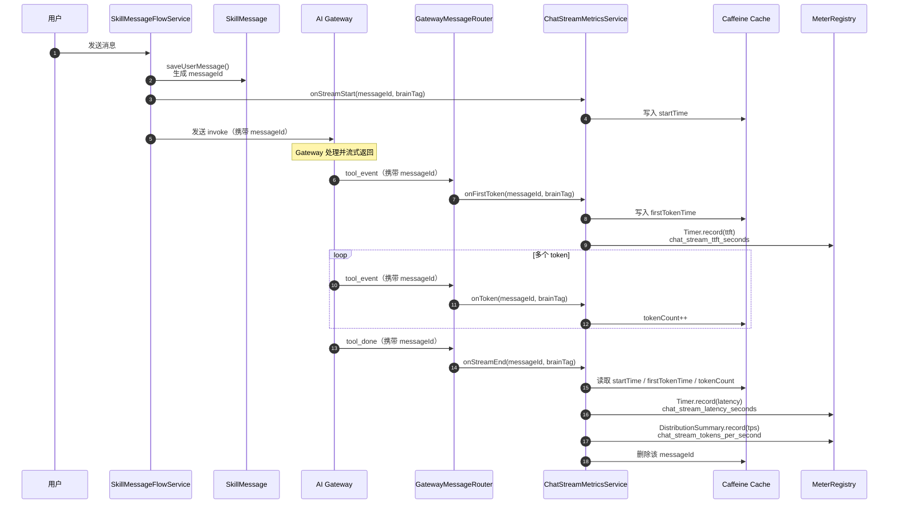
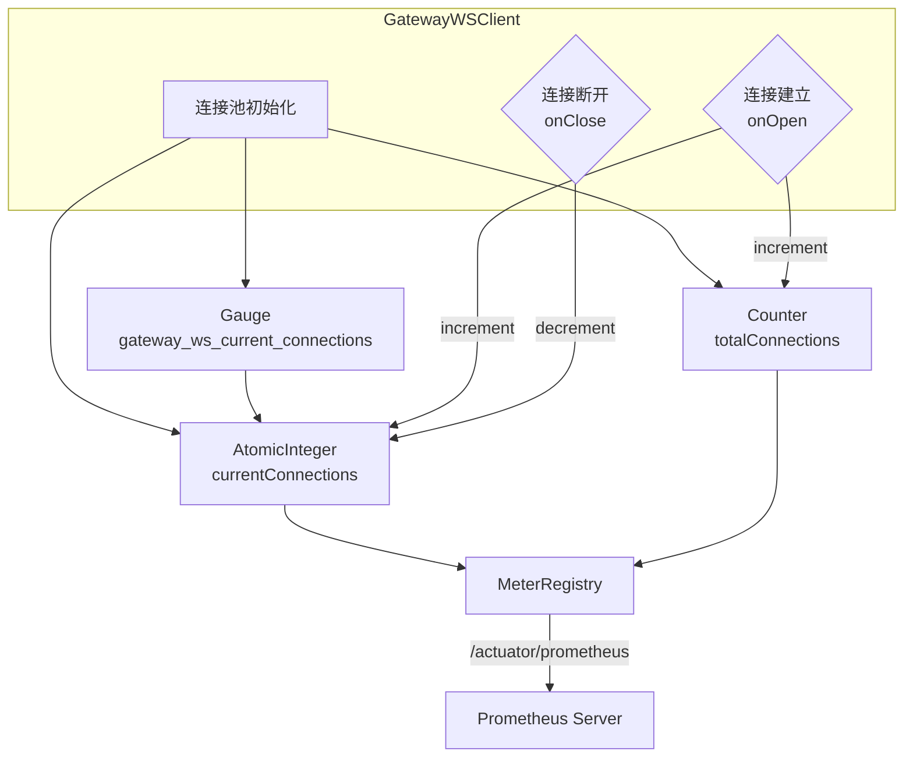
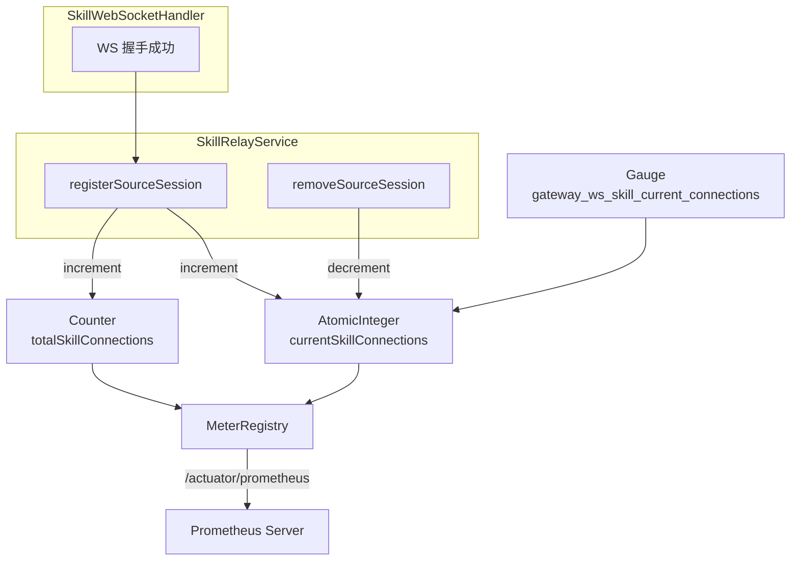

# 运维埋码 — 需求分析与设计

> 基于 `docs/human-docs/001运维埋码.md`
> 日期：2026-06-08
> 状态：设计阶段

---

## 一、背景与目标

当前 skill-server 和 ai-gateway 均**未接入 Prometheus/Micrometer 监控体系**。skill-server 仅有一套 WeLink 事件上报（`telemetry.welink`），用于 chat 对话的请求/回复事件追踪；ai-gateway 仅有手动 `AtomicLong` 计数器 + 60 秒日志输出。

本次需求目标：为 skill-server 和 ai-gateway 接入 **Prometheus（普罗米修斯）指标上报**，覆盖第三方接口调用、对外 API 调用、流式对话效率、WS 连接数四个维度。

---

## 二、现状梳理

### 2.1 skill-server 现状

| 维度 | 现状 |
|------|------|
| **Prometheus/Micrometer** | 无依赖、无配置、无端点 |
| **Actuator** | 无依赖、无 `/actuator/prometheus` 端点 |
| **现有 telemetry** | `telemetry.welink` 体系（WeLink 事件上报），含 ChatRequest/ChatReply 两个事件 |
| **现有 recordApiCall** | 不存在 |
| **现有 API interceptor** | 仅 `MdcRequestInterceptor`（MDC 日志）和 `ImTokenAuthInterceptor`（认证），无统计拦截器 |
| **WS 客户端** | `GatewayWSClient`（连接池，默认 8 连接），无连接数指标 |
| **外部调用** | `GatewayRelayService`、`ImMessageService`、`AssistantInfoService` 等，仅通过 `LogTimer` 记录耗时日志 |
| **Spring Boot 版本** | 3.4.6 |

### 2.2 ai-gateway 现状

| 维度 | 现状 |
|------|------|
| **Prometheus/Micrometer** | 无依赖、无配置、无端点 |
| **Actuator** | 无依赖 |
| **现有 metrics** | 手动 `AtomicLong` 计数器（relayLocal/relayPubsub/relayPending/routingHit/routingRedisL2），60 秒日志输出 |
| **WS Server** | `/ws/agent`（Agent 端）+ `/ws/skill`（Skill Server 端），含完整握手认证 |
| **连接统计** | `EventRelayService.getActiveSessionCount()`、`SkillRelayService.getActiveSourceConnectionCount()` |
| **Spring Boot 版本** | 3.4.6 |

---

## 三、技术选型

| 组件 | 选型 | 理由 |
|------|------|------|
| **指标采集** | Micrometer | Spring Boot 3.x 原生集成，标准 facade |
| **指标暴露** | Prometheus Registry | 通过 `/actuator/prometheus` 端点暴露 |
| **端点** | Spring Boot Actuator | 标准 `/actuator/prometheus`，无需自建 |
| **WS 连接数** | Micrometer Gauge | 实时反映当前值，适合连接数场景 |
| **API 调用** | Micrometer Counter + Timer | 标准调用次数 + 耗时分布 |
| **流式效率** | Micrometer Timer + DistributionSummary | TTFT/TPOT/Latency 用 Timer，token/s 用 DistributionSummary |

---

## 四、skill-server 详细设计

### 4.1 依赖变更

`pom.xml` 新增：

```xml
<!-- Actuator + Prometheus -->
<dependency>
    <groupId>org.springframework.boot</groupId>
    <artifactId>spring-boot-starter-actuator</artifactId>
</dependency>
<dependency>
    <groupId>io.micrometer</groupId>
    <artifactId>micrometer-registry-prometheus</artifactId>
</dependency>
```

### 4.2 配置变更

`application.yml` 新增：

```yaml
management:
  endpoints:
    web:
      exposure:
        include: health,prometheus
      base-path: /actuator
  metrics:
    export:
      prometheus:
        enabled: true
    tags:
      application: skill-server
```

### 4.3 需求 1：第三方接口调用情况埋码

#### 4.3.1 枚举定义

新增 `MetricServiceEnum` 枚举，位于 `com.opencode.cui.skill.telemetry.metrics` 包：

| 枚举值 | id | comment |
|--------|-----|---------|
| GATEWAY_INVOKE | gateway_invoke | Gateway 调用 |
| GATEWAY_AVAILABILITY | gateway_availability | Gateway 可用性查询 |
| IM_SEND_MESSAGE | im_send_message | IM 发送消息 |
| IM_UPLOAD_FILE | im_upload_file | IM 上传文件 |
| IM_DOWNLOAD_FILE | im_download_file | IM 下载文件 |
| ASSISTANT_INFO | assistant_info | 助手信息查询 |
| ASSISTANT_INSTANCE | assistant_instance | 助手实例查询 |

#### 4.3.2 recordApiCall 方法

新增 `ApiCallMetricsService`，注入 `MeterRegistry`，提供：

```java
public void recordApiCall(MetricServiceEnum service, String url, boolean success, long durationMs)
```

内部实现：
1. 定义 3 个 tag：`serviceId`、`serviceComment`、`url`
2. Counter `external_api_call_total` — 总调用次数
3. Counter `external_api_call_success_total` / `external_api_call_failure_total` — 成功/失败次数
4. Timer `external_api_call_duration_seconds` — 耗时（单位 ms）

#### 4.3.3 接入点

| 调用方 | 文件 | 接入方式 |
|--------|------|---------|
| `GatewayRelayService.sendInvokeToGateway()` | GatewayRelayService.java | 注入 ApiCallMetricsService，调用前后记录 |
| `AssistantAvailabilityService` | AssistantAvailabilityService.java | 替换 LogTimer 为 recordApiCall |
| `ImMessageService` | ImMessageService.java | 替换 LogTimer 为 recordApiCall |
| `AssistantInfoService.fetchFromUpstream()` | AssistantInfoService.java | 注入并记录 |
| `AssistantInstanceInfoService.lookup()` | AssistantInstanceInfoService.java | 注入并记录 |

#### 4.3.4 流程图



#### 4.4.1 拦截器设计

新增 `ApiMetricsInterceptor`，实现 `HandlerInterceptor`：

- `preHandle`: 记录 `request.setAttribute("metrics.startTime", System.currentTimeMillis())`
- `postHandle`: 计算 cost，使用 `Timer` 记录 `common_interface_duration_seconds`，tag 为 `common_interface_url`

在 `WebMvcConfig` 中注册，拦截 `/api/**` 路径。

#### 4.4.2 流程图



#### 4.5.1 指标定义

| 指标名 | 类型 | 说明 |
|--------|------|------|
| `chat_stream_ttft_seconds` | Timer | 首 token 延迟（TTFT） |
| `chat_stream_tpot_seconds` | Timer | 每 token 输出延迟（TPOT） |
| `chat_stream_latency_seconds` | Timer | 端到端延迟 |
| `chat_stream_tokens_per_second` | DistributionSummary | 每秒输出 token 数 |

#### 4.5.2 Tag 设计

所有指标仅携带一个 tag：

| Tag | 来源 | 说明 |
|-----|------|------|
| `brain_tag` | `AssistantInfo.businessTag` | 大脑标签，不存在则 `UNKNOWN` |

#### 4.5.3 实现方式

**维度确认**：一问一答的统计维度为 `messageId`（`SkillMessage.messageId`，即用户消息入库后生成的 ID，同时作为 gateway payload 中的 `messageId` 下发和回传）。`messageId` 缺失时直接跳过该轮次，不统计。

新增 `ChatStreamMetricsService`，使用 **Caffeine Cache**（size-limited，容量可配置）按 `messageId` 维护每轮问答的状态，防止 map 爆炸：

- `sessionStartTimes`: 轮次开始时间（key = `messageId`，`Cache<String, Long>`）
- `firstTokenTimestamps`: 首 token 到达时间（key = `messageId`，`Cache<String, Long>`）
- `tokenCounts`: token 计数（key = `messageId`，`Cache<String, AtomicInteger>`）

Caffeine Cache 配置：
- `maximumSize`: 通过 `skill.metrics.stream.max-sessions` 配置，默认 10000
- `expireAfterWrite`: 通过 `skill.metrics.stream.session-ttl` 配置，默认 30 分钟（兜底清理异常轮次）

提供 4 个生命周期方法（`messageId` 为 null 时直接 return，不做任何统计）：
- `onStreamStart(messageId, brainTag)`: 记录开始时间
- `onFirstToken(messageId, brainTag)`: 计算并记录 TTFT
- `onToken(messageId, brainTag)`: 递增 token 计数
- `onStreamEnd(messageId, brainTag)`: 计算 Latency + tokensPerSecond，清理状态

配置项（`application.yml`）：

```yaml
skill:
  metrics:
    stream:
      max-sessions: ${SKILL_METRICS_STREAM_MAX_SESSIONS:10000}
      session-ttl: ${SKILL_METRICS_STREAM_SESSION_TTL:30m}
```

#### 4.5.4 接入点

`messageId` 的流转路径：用户发消息 → `saveUserMessage()` 生成 `messageId` → 随 payload 发往 gateway → gateway 回传事件带回同一 `messageId`。

- `onStreamStart`: `SkillMessageFlowService.sendMessage()` 中，用户消息入库后调用，参数取 `message.getMessageId()`
- `onFirstToken`: `GatewayMessageRouter.handleToolEvent()` 中，收到该 `messageId` 的首个 text.delta 时调用
- `onToken`: `GatewayMessageRouter.handleToolEvent()` 中，每收到一个 text.delta 时调用
- `onStreamEnd`: `GatewayMessageRouter.handleToolDone()` 中，收到该 `messageId` 的完成事件时调用

#### 4.5.4a 时序图



```promql
# TTFT P50/P95/P99
histogram_quantile(0.50, rate(chat_stream_ttft_seconds_bucket[5m]))
histogram_quantile(0.95, rate(chat_stream_ttft_seconds_bucket[5m]))
histogram_quantile(0.99, rate(chat_stream_ttft_seconds_bucket[5m]))

# Latency P50/P95/P99
histogram_quantile(0.50, rate(chat_stream_latency_seconds_bucket[5m]))
histogram_quantile(0.95, rate(chat_stream_latency_seconds_bucket[5m]))
histogram_quantile(0.99, rate(chat_stream_latency_seconds_bucket[5m]))

# 按大脑标签分组
histogram_quantile(0.95, rate(chat_stream_ttft_seconds_bucket[5m])) by (brain_tag)

# 每秒 token 数平均值
rate(chat_stream_tokens_per_second_sum[5m]) / rate(chat_stream_tokens_per_second_count[5m])
```

### 4.6 需求 4：Gateway WS Client 连接情况

#### 4.6.1 指标定义

| 指标名 | 类型 | 说明 |
|--------|------|------|
| `gateway_ws_current_connections` | Gauge | 当前已连接的 gateway 数 |
| `gateway_ws_total_connections` | Counter | 总共连接次数（累计） |

#### 4.6.2 实现方式

在 `GatewayWSClient` 中注入 `MeterRegistry`：
- `AtomicInteger currentConnections`: 当前连接数
- `Counter totalConnections`: 累计连接次数
- `Gauge` 绑定 `currentConnections` 到 `gateway_ws_current_connections`
- 在 `onOpen` 回调中 `currentConnections++`、`totalConnections++`
- 在 `onClose` 回调中 `currentConnections--`

#### 4.6.3 流程图



## 五、ai-gateway 详细设计

### 5.1 依赖变更

同 skill-server，`pom.xml` 新增 `spring-boot-starter-actuator` + `micrometer-registry-prometheus`。

### 5.2 配置变更

同 skill-server，`application.yml` 新增 `management` 配置段（`application: ai-gateway`）。

### 5.3 需求：Gateway WS 被连接情况

#### 5.3.1 指标定义

| 指标名 | 类型 | 说明 |
|--------|------|------|
| `gateway_ws_skill_current_connections` | Gauge | 当前被多少个 skill 连接 |
| `gateway_ws_skill_total_connections` | Counter | 总共被 skill 连接次数（累计） |

#### 5.3.2 实现方式

在 `SkillRelayService` 中注入 `MeterRegistry`：
- `AtomicInteger currentSkillConnections`: 当前 skill 连接数
- `Counter totalSkillConnections`: 累计 skill 连接次数
- `Gauge` 绑定 `currentSkillConnections` 到 `gateway_ws_skill_current_connections`
- 在 `registerSourceSession()` 中 `currentSkillConnections++`、`totalSkillConnections++`
- 在 `removeSourceSession()` 中 `currentSkillConnections--`

#### 5.3.3 流程图



## 六、文件变更清单

### 6.1 skill-server

| 操作 | 文件 | 说明 |
|------|------|------|
| **修改** | `pom.xml` | 新增 actuator + micrometer-registry-prometheus 依赖 |
| **修改** | `application.yml` | 新增 management 配置段 |
| **新增** | `telemetry/metrics/MetricServiceEnum.java` | 第三方服务枚举 |
| **新增** | `telemetry/metrics/ApiCallMetricsService.java` | recordApiCall 实现 |
| **新增** | `telemetry/metrics/ApiMetricsInterceptor.java` | 对外 API 拦截器 |
| **新增** | `telemetry/metrics/ChatStreamMetricsService.java` | 流式效率指标 |
| **修改** | `config/WebMvcConfig.java` | 注册 ApiMetricsInterceptor |
| **修改** | `ws/GatewayWSClient.java` | 注入 MeterRegistry，WS 连接数指标 |
| **修改** | `service/GatewayRelayService.java` | 注入 ApiCallMetricsService |
| **修改** | `service/ImMessageService.java` | 注入 ApiCallMetricsService |
| **修改** | `service/AssistantInfoService.java` | 注入 ApiCallMetricsService |
| **修改** | `service/AssistantInstanceInfoService.java` | 注入 ApiCallMetricsService |
| **修改** | `service/AssistantAvailabilityService.java` | 注入 ApiCallMetricsService |
| **修改** | `service/SkillMessageFlowService.java` | 注入 ChatStreamMetricsService，流式埋点 |

### 6.2 ai-gateway

| 操作 | 文件 | 说明 |
|------|------|------|
| **修改** | `pom.xml` | 新增 actuator + micrometer-registry-prometheus 依赖 |
| **修改** | `application.yml` | 新增 management 配置段 |
| **修改** | `service/SkillRelayService.java` | 注入 MeterRegistry，WS 连接数指标 |

---

## 七、风险与注意事项

1. **内存泄漏**：`ChatStreamMetricsService` 使用 Caffeine Cache（size-limited + TTL），自动淘汰过期条目，防止异常 session 永不清理
2. **性能影响**：Micrometer Counter/Timer 基于 `ConcurrentHashMap` + `AtomicLong`，性能开销极小（纳秒级），不会影响主链路
3. **端点安全**：`/actuator/prometheus` 应配置内网访问限制或 Spring Security 保护
4. **与现有 WeLink telemetry 的关系**：本次新增的 Prometheus 指标与现有 WeLink 事件上报**独立共存**，互不影响

---

## 八、待确认事项

1. `chat_stream_tpot_seconds`（TPOT）的接入点：当前流式处理路径中是否已有"每个 token 到达"的回调？需确认 `SkillMessageFlowService` 的流式处理细节
2. Grafana 面板由开发手工添加，是否需要在文档中提供完整的 Dashboard JSON？
