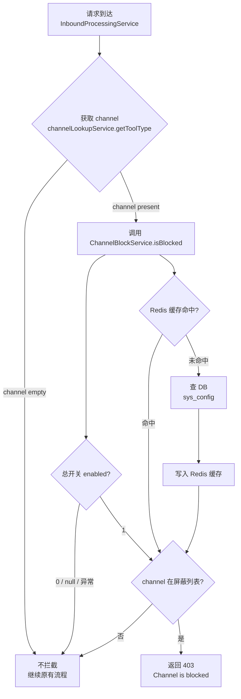
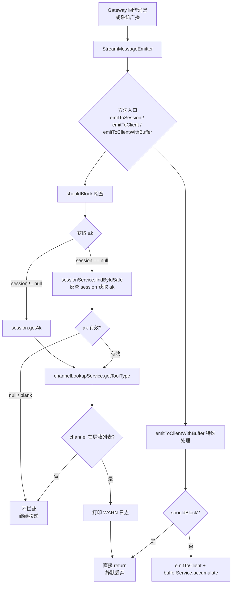
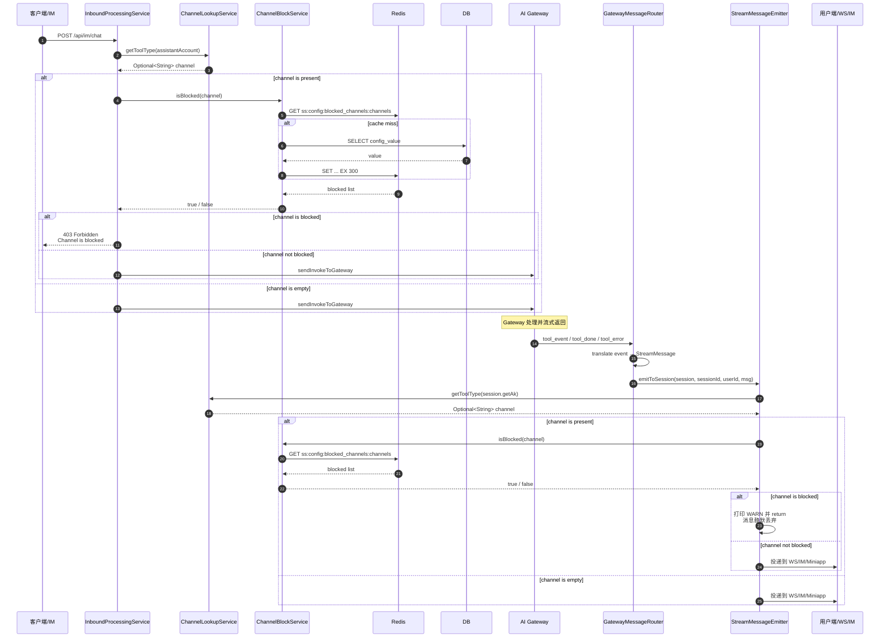

# Skill 配置对话屏蔽特定 Channel — 需求分析与设计

> 基于 `docs/human-docs/003skill配置对话，屏蔽特定channel.md`
> 日期：2026-06-09
> 状态：设计阶段

---

## 一、背景与目标

当前 skill-server 对所有 channel（即 plugin 上报的 toolType）的对话请求均无条件处理，缺乏按 channel 维度进行快速熔断/屏蔽的能力。当某个 channel 出现故障、流量异常或需要临时停服时，只能通过停掉对应 plugin 或修改代码发版来实现，响应速度慢、操作成本高。

本次需求目标：在 skill-server 的入站 + 出站全链路中，新增基于 `sys_config` 配置的 channel 屏蔽能力，支持动态启用/禁用、指定 channel 列表、Redis 缓存加速，达到**无需发版即可秒级生效**的运维效果。

屏蔽语义为**双向拦截**：
- **入站拦截**：拒绝该 channel 的新对话请求（用户 → SS）
- **出站拦截**：丢弃该 channel 的 AI 回传消息，阻止推送给用户（Gateway → SS → 用户/WS/IM）

---

## 二、现状分析

| 维度 | 现状 |
|------|------|
| **服务** | skill-server |
| **Web 框架** | Spring Boot 3.4.6 + Spring MVC |
| **Java 版本** | Java 21 |
| **配置表** | 已存在 `sys_config` 表，支持 `configType` + `configKey` 分组 key-value 配置 |
| **配置服务** | 已有 `SysConfigService`，自带 Redis 缓存（TTL 默认 5min，可配置），提供 CRUD 接口 |
| **配置管理接口** | 已有 `SysConfigController` (`/api/admin/configs`)，支持增删改查 |
| **入站处理** | `InboundProcessingService` 统一处理 4 类入站请求：`processChat`、`processQuestionReply`、`processPermissionReply`、`processRebuild` |
| **Channel 解析** | 已有 `ChannelLookupService`，通过 `GatewayApiClient.getAgentByAk()` 解析 ak 对应的 toolType，本地 Caffeine 缓存 5min |
| **Redis** | 已引入 `spring-boot-starter-data-redis`，使用 `StringRedisTemplate` |
| **现有屏蔽能力** | 无按 channel 维度的动态屏蔽机制 |
| **出站消息入口** | `StreamMessageEmitter` 是出站的唯一权威入口，所有消息（IM/WS/Miniapp）均通过 `emitToSession` / `emitToClient` / `emitToClientWithBuffer` 发出 |
| **出站投递策略** | `OutboundDeliveryDispatcher` 按 domain 路由到 `ImRestDeliveryStrategy` / `ExternalWsDeliveryStrategy` / `MiniappDeliveryStrategy` |

---

## 三、需求范围

### 3.1 本期范围

| 能力 | 说明 |
|------|------|
| 总开关控制 | 通过 `sys_config` 启用/禁用 channel 屏蔽功能 |
| Channel 列表配置 | 通过 `sys_config` 配置逗号分隔的 channel 列表 |
| Redis 缓存 | 屏蔽列表读取 Redis 缓存，TTL 5 分钟（可配置），降低 DB 压力 |
| 入站全链路拦截 | 对 `processChat`、`processQuestionReply`、`processPermissionReply`、`processRebuild` 四类请求统一拦截 |
| 出站全链路拦截 | 对 `StreamMessageEmitter` 的所有出站方法（`emitToSession`、`emitToClient`、`emitToClientWithBuffer`）统一拦截，阻止被屏蔽 channel 的消息到达用户（IM/WS/Miniapp） |
| 入站阻断响应 | 被屏蔽的 channel 返回 HTTP 403，带明确错误信息 |
| 出站静默丢弃 | 被屏蔽的 channel 的 Gateway 回传消息直接丢弃，不投递、不缓冲、不持久化 |
| Fail-safe | 配置读取异常时默认不拦截，保证可用性 |
| 动态生效 | 修改 `sys_config` 后，最长 5 分钟（缓存 TTL）内自动生效 |

### 3.2 非本期范围

| 能力 | 说明 |
|------|------|
| 按用户/会话维度屏蔽 | 本期仅按 channel 维度 |
| 灰度/百分比屏蔽 | 本期不支持按比例放量 |
| 自动熔断 | 本期无基于错误率/QPS 的自动熔断逻辑 |
| 通知/告警 | 屏蔽触发时无额外通知机制 |
| 持久化拦截日志 | 本期仅打印业务日志，不入库 |
| 已缓冲消息清理 | 屏蔽前已写入 buffer 的历史消息，断线重连时仍会回放；本期不主动清理 |
| 强制断开 WS 连接 | 屏蔽后已建立的 WebSocket 连接保持不断开，仅对新消息静默丢弃 |

---

## 四、配置设计

复用现有 `sys_config` 表，新增两条配置记录：

| configType | configKey | configValue | 说明 |
|------------|-----------|-------------|------|
| `blocked_channels` | `enabled` | `0` 或 `1` | 总开关，`1`=启用屏蔽，`0`=禁用 |
| `blocked_channels` | `channels` | `channel1,channel2` | 逗号分隔的屏蔽 channel 列表 |

配置示例：

```sql
INSERT INTO sys_config (config_type, config_key, config_value, description, status) VALUES
('blocked_channels', 'enabled', '1', '是否启用渠道屏蔽功能，1=启用，0=禁用', 1),
('blocked_channels', 'channels', 'welink,slack', '逗号分隔的屏蔽渠道列表', 1);
```

缓存 TTL 沿用现有 `SysConfigProperties`：

```yaml
skill:
  sys-config:
    cache-ttl-minutes: 5  # 默认 5 分钟，可配置
```

---

## 五、模块设计

新增/修改文件：

```text
com.opencode.cui.skill.service
  ChannelBlockService.java          (新增)
  InboundProcessingService.java       (修改)
  StreamMessageEmitter.java           (修改)

skill-server/src/main/resources/db/migration
  V16__init_blocked_channels_config.sql  (新增)
```

### 5.1 ChannelBlockService

职责：读取屏蔽配置、管理缓存、判断指定 channel 是否被屏蔽。

核心方法：

```java
/**
 * 是否屏蔽该 channel 的对话请求。
 *
 * @param channel 通道标识（toolType）
 * @return true = 需屏蔽；false = 不屏蔽或异常时不拦截
 */
public boolean isBlocked(String channel)
```

判断逻辑（严格顺序）：

1. 总开关关闭（`enabled != 1`）→ `false`（不拦截）
2. `channel` 为 null 或 blank → `false`（不拦截）
3. 读屏蔽列表（先查 Redis 缓存，miss 穿透 DB）
4. 异常路径一律 fail-safe 返回 `false`（不拦截，保持原有行为）

缓存策略：
- 缓存 key：`ss:config:blocked_channels:channels`
- 缓存 value：逗号分隔的 channel 字符串（已排序，去重）
- TTL：由 `SysConfigProperties.cacheTtlMinutes` 控制

### 5.2 InboundProcessingService 接入

在 4 个入站处理方法的**最前端**（解析助手账号之前）增加 channel 屏蔽检查：

| 方法 | 检查位置 | 被阻断时的返回 |
|------|---------|--------------|
| `processChat` | 第 0 步，log 前 | `InboundResult(false, 403, "Channel is blocked", null)` |
| `processQuestionReply` | 第 0 步，log 前 | `InboundResult(false, 403, "Channel is blocked", null)` |
| `processPermissionReply` | 第 0 步，log 前 | `InboundResult(false, 403, "Channel is blocked", null)` |
| `processRebuild` | 第 0 步，log 前 | `InboundResult(false, 403, "Channel is blocked", null)` |

检查逻辑：

```java
Optional<String> channel = channelLookupService.getToolType(assistantAccount);
if (channel.isPresent() && channelBlockService.isBlocked(channel.get())) {
    log.warn("[processChat] Channel {} is blocked, rejecting request", channel.get());
    return new InboundResult(false, 403, "Channel is blocked", null);
}
```

### 5.3 StreamMessageEmitter 出站拦截

职责：在出站消息推送给用户之前，检查该消息所属 channel 是否被屏蔽；如果被屏蔽，静默丢弃，不投递、不缓冲。

拦截点：在 `StreamMessageEmitter` 的 3 个公共方法**最前端**增加检查：

| 方法 | 检查方式 | 被拦截时的行为 |
|------|---------|--------------|
| `emitToSession(session, sessionId, userId, msg)` | 直接用 `session.getAk()` 获取 ak | 打印 WARN 日志并 return，不调用 `dispatcher.deliver` |
| `emitToClient(sessionId, userIdHint, msg)` | 通过 `sessionId` 反查 `SkillSession` 获取 ak | 打印 WARN 日志并 return，不调用 `sendToUserChannel` |
| `emitToClientWithBuffer(sessionId, msg)` | 先检查，通过后再调用 `emitToClient` + `bufferService.accumulate` | 打印 WARN 日志并 return，不 emit、不缓冲 |

核心逻辑（`shouldBlock` 私有方法）：

```java
private boolean shouldBlock(SkillSession session, String sessionId) {
    String ak = null;
    if (session != null) {
        ak = session.getAk();
    } else if (sessionId != null && !sessionId.isBlank()) {
        try {
            Long numericId = ProtocolUtils.parseSessionId(sessionId);
            if (numericId != null) {
                SkillSession resolved = sessionService.findByIdSafe(numericId);
                ak = resolved != null ? resolved.getAk() : null;
            }
        } catch (Exception e) {
            log.warn("[ChannelBlock] resolve session failed, fail-safe: sessionId={}, error={}", sessionId, e.getMessage());
            return false;
        }
    }
    if (ak == null || ak.isBlank()) {
        return false;
    }
    Optional<String> channel = channelLookupService.getToolType(ak);
    if (channel.isPresent() && channelBlockService.isBlocked(channel.get())) {
        log.warn("[ChannelBlock] Outbound blocked: channel={}, ak={}, sessionId={}", channel.get(), ak, sessionId);
        return true;
    }
    return false;
}
```

**注意**：
- `emitToClientWithBuffer` 必须**先检查再缓冲**，否则被屏蔽的消息会被写入 buffer，断线重连时回放给用户
- `emitToClient` 中 session 反查异常时 fail-safe 返回 false（不拦截），避免反查故障导致所有消息无法发出
- 对于 `agent_online`/`agent_offline` 广播：遍历 activeSessions 时，每个 session 单独调用 `emitToClient`，被屏蔽的 session 会被拦截，未被屏蔽的 session 正常收到

---

## 六、流程图

### 6.1 Channel 屏蔽判断流程



### 6.2 出站消息屏蔽流程



### 6.3 完整入站 + 出站时序图



---

## 七、文件变更清单

| 操作 | 文件 | 说明 |
|------|------|------|
| **新增** | `service/ChannelBlockService.java` | Channel 屏蔽判断服务 |
| **修改** | `service/InboundProcessingService.java` | 4 个 process 方法前增加 channel 屏蔽检查 |
| **修改** | `service/delivery/StreamMessageEmitter.java` | 3 个 emit 方法前增加 channel 屏蔽检查，被拦截时静默丢弃 |
| **新增** | `db/migration/V16__init_blocked_channels_config.sql` | 初始化屏蔽配置（enabled=0, channels=''） |

---

## 八、测试设计

| 测试类 | 覆盖点 |
|--------|--------|
| `ChannelBlockServiceTest` | 总开关关闭时不拦截、channel 为空不拦截、命中屏蔽列表时拦截、缓存穿透、DB 异常时 fail-safe |
| `InboundProcessingServiceTest` | 4 个 process 方法在 channel 被屏蔽时返回 403、未被屏蔽时正常流转 |
| `StreamMessageEmitterTest` | `emitToSession` 被屏蔽时静默丢弃、`emitToClient` 被屏蔽时静默丢弃、`emitToClientWithBuffer` 被屏蔽时不 emit 也不缓冲、session 反查异常时 fail-safe 不拦截 |
| `SysConfigControllerTest` | 通过 `/api/admin/configs` 修改屏蔽列表后，最长 5 分钟内生效 |

建议回归命令：

```bash
cd skill-server
mvn test
```

---

## 九、风险与注意事项

1. **Fail-safe 原则**：`ChannelBlockService` 在读取配置异常时返回 `false`（不拦截），避免配置故障导致服务完全不可用
2. **缓存一致性**：修改 `sys_config` 后依赖 `SysConfigService` 的缓存 TTL 自然过期，最长延迟 = `skill.sys-config.cache-ttl-minutes`（默认 5 分钟）。如需立即生效，需手动清理 Redis key `ss:config:blocked_channels:channels`
3. **与现有 `ChannelSuppressReplyWhitelistService` 的区别**：
   - `ChannelSuppressReplyWhitelistService`：群聊场景下禁止 AI 在群里回复（只接收不回复）
   - `ChannelBlockService`：完全拒绝该 channel 的所有对话请求
4. **Channel 解析依赖 Gateway**：`ChannelLookupService` 依赖 `GatewayApiClient.getAgentByAk()`，若 Gateway 不可用时 channel 解析返回 empty，此时**不会触发屏蔽**（属于 fail-safe）
5. **日志规范**：屏蔽命中时打印 `WARN` 级别日志，便于运维排查；未命中时打印 `DEBUG` 级别日志，避免日志膨胀
6. **出站拦截与 buffer 的关系**：`emitToClientWithBuffer` 必须先检查再调用 `bufferService.accumulate`，否则被屏蔽的消息会被缓冲，断线重连时回放给用户。这是关键 bug 风险
7. **已建立连接的处理**：屏蔽后已建立的 WebSocket 连接不会主动断开，但新消息会被静默丢弃。如需强制断开，需额外实现连接管理逻辑（非本期范围）
8. **agent_online/offline 广播**：`agent_online`/`agent_offline` 会遍历该 ak 的所有 active sessions 逐个调用 `emitToClient`。被屏蔽 channel 的 session 会被拦截，未被屏蔽的 session 正常收到。这是预期行为

---

## 十、实施步骤

1. 新增 `ChannelBlockService.java`
2. 修改 `InboundProcessingService.java`，在 4 个 process 方法中注入并调用 `ChannelBlockService`
3. 修改 `StreamMessageEmitter.java`：
   - 注入 `ChannelLookupService` 和 `ChannelBlockService`
   - 新增 `shouldBlock(SkillSession, String)` 私有方法
   - 在 `emitToSession`、`emitToClient`、`emitToClientWithBuffer` 最前端增加检查
4. 新增数据库迁移文件 `V16__init_blocked_channels_config.sql`
5. 补充 `ChannelBlockServiceTest`、`InboundProcessingServiceTest`、`StreamMessageEmitterTest` 测试用例
6. 执行 `mvn test` 验证
7. 通过 `/api/admin/configs` 接口验证配置读写正常
8. 上线后通过修改 `sys_config` 配置验证动态生效（入站 403 + 出站静默丢弃）

---

## 十一、运维操作手册

### 启用屏蔽

```bash
# 1. 启用总开关
curl -X PUT "http://skill-server/api/admin/configs/{id}" \
  -H "Content-Type: application/json" \
  -d '{"configType":"blocked_channels","configKey":"enabled","configValue":"1","status":1}'

# 2. 设置屏蔽列表（逗号分隔）
curl -X PUT "http://skill-server/api/admin/configs/{id}" \
  -H "Content-Type: application/json" \
  -d '{"configType":"blocked_channels","configKey":"channels","configValue":"welink,slack","status":1}'
```

### 禁用屏蔽

```bash
curl -X PUT "http://skill-server/api/admin/configs/{id}" \
  -H "Content-Type: application/json" \
  -d '{"configType":"blocked_channels","configKey":"enabled","configValue":"0","status":1}'
```

### 立即生效（清除缓存）

```bash
redis-cli DEL ss:config:blocked_channels:channels
```
