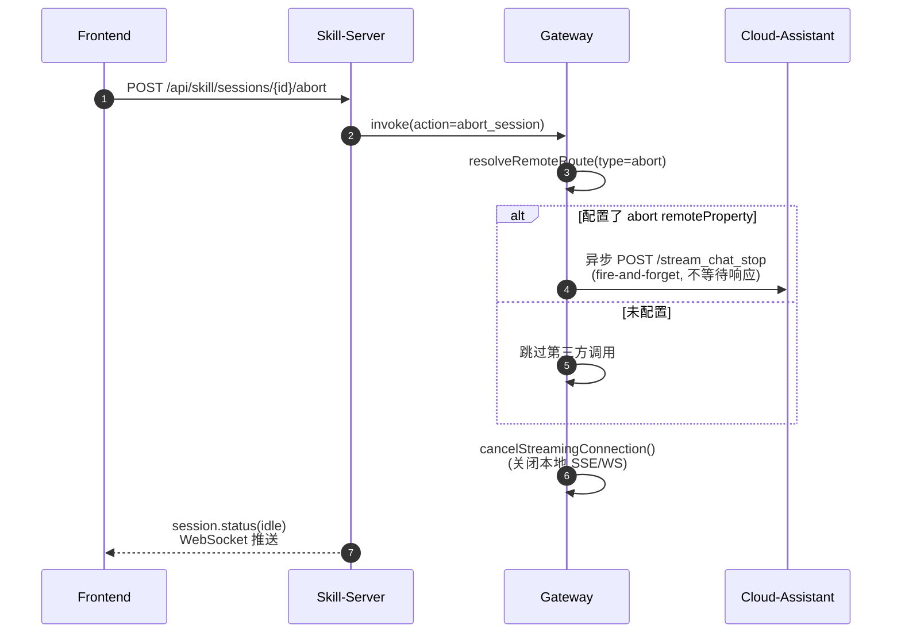

# Skill Abort 第三方助手终止接口调用设计

> **日期**: 2026-06-10  
> **需求来源**: `docs/human-docs/003终止skill对话流程.md`  
> **目标**: Gateway 收到 `abort_session` 时，通过 remoteProperty 配置调用第三方助手的终止执行接口，实现异步 fire-and-forget。

---

## 1. 背景与问题

### 1.1 现有 abort 流程

```
前端 POST /api/skill/sessions/{id}/abort
  → skill-server: abortSession()
    → 发送 abort_session invoke 到 Gateway
    → 本地 finalize（persist buffer → idle → clear）
  → Gateway: CloudAgentService.handleInvoke()
    → cancelStreamingConnection() —— 仅关闭本地 SSE/WS 连接
```

### 1.2 缺失环节

Gateway 本地连接取消后，**第三方助手平台（assistant-agent-b）仍在继续推理**，导致：
- 后端资源浪费
- 可能产生"孤儿"响应，后续会话状态错乱

### 1.3 需求

在 Gateway 本地取消前/后，**调用第三方助手终止接口**：

```
POST https://xxx/api/digital-assistant/assistant-agent-b/stream_chat_stop
Headers: x-hw-id, x-hw-appkey, Content-Type: application/json
Body: { topicId, assistantAccount, sendUserAccount, imGroupId?, messageId?, clientLang? }
```

**约束**：异步执行（fire-and-forget），不等待响应。

---

## 2. 设计原则

1. **配置驱动**：复用现有 `remoteProperty` 机制，新增 `type="abort"` 配置项，零硬编码。
2. **与现有架构对称**：abort 回调的配置、解析、调用模式与 `chat` / `question` 完全一致。
3. **最小侵入**：不改 skill-server 现有 payload 契约（gateway 从 invokeMessage 提取所需字段）。
4. **异步非阻塞**：使用 `CompletableFuture.runAsync()` + 固定线程池异步发送 HTTP POST，不阻塞 `cancelStreamingConnection()`。

---

## 3. 详细设计

### 3.1 RemoteProperty 配置扩展

助手实例的 `remoteProperty` 列表中增加 `type="abort"` 项：

```json
{
  "remoteProperty": [
    {
      "type": "chat",
      "url": "https://xxx/api/digital-assistant/assistant-agent-b/stream_chat",
      "commProtocol": "sse",
      "headers": [...]
    },
    {
      "type": "question",
      "url": "https://xxx/api/digital-assistant/assistant-agent-b/question_reply",
      "commProtocol": "webhook",
      "headers": [...]
    },
    {
      "type": "abort",
      "url": "https://xxx/api/digital-assistant/assistant-agent-b/stream_chat_stop",
      "commProtocol": "webhook",
      "headers": [
        {"type": "3", "customKey": "x-hw-id", "customValue": "xxx"},
        {"type": "3", "customKey": "x-hw-appkey", "customValue": "xxx"}
      ]
    }
  ]
}
```

| 字段 | 说明 |
|---|---|
| `type` | 固定 `"abort"`，表示终止回调 |
| `url` | 第三方终止接口完整地址 |
| `commProtocol` | 固定 `"webhook"`（同步 HTTP POST） |
| `headers` | 认证头，复用现有 `CloudAuthService` 解析逻辑 |

### 3.2 Gateway 侧代码变更

#### 3.2.1 `CloudAgentService` — 扩展 abilityType 映射

```java
private static String abilityType(String action) {
    return switch (action) {
        case "chat" -> "chat";
        case "abort_session" -> "abort";
        default -> "question"; // question_reply, permission_reply
    };
}
```

> 仅新增 `abort_session → "abort"` 分支，其余不变。

#### 3.2.2 新增 `CloudAgentConfig` — 专用线程池 Bean

```java
@Configuration
public class CloudAgentConfig {

    @Bean(name = "cloudAbortExecutor")
    public Executor cloudAbortExecutor(
            @Value("${gateway.cloud.abort.executor.core-size:2}") int coreSize,
            @Value("${gateway.cloud.abort.executor.max-size:10}") int maxSize,
            @Value("${gateway.cloud.abort.executor.queue-capacity:100}") int queueCapacity) {
        return new ThreadPoolExecutor(
            coreSize,
            maxSize,
            60L, TimeUnit.SECONDS,
            new LinkedBlockingQueue<>(queueCapacity),
            new ThreadFactory() {
                private final AtomicInteger counter = new AtomicInteger(0);
                @Override
                public Thread newThread(Runnable r) {
                    Thread t = new Thread(r, "cloud-abort-" + counter.incrementAndGet());
                    t.setDaemon(true);
                    return t;
                }
            },
            new ThreadPoolExecutor.DiscardPolicy() // 队列满时丢弃，不打断主流程
        );
    }
}
```

> **为什么不用虚拟线程**：项目里 `BusinessInvokeRouteStrategy` 用虚拟线程执行 webhook，但 abort 请求是旁路通知（非主业务路径），使用固定线程池更可控，避免虚拟线程无限制增长。  
> **专用线程池**：与 `RedisConfig` 中的 `redisListenerExecutor` / `redisSubscriptionExecutor` 对齐，独立配置、独立生命周期、独立监控。

#### 3.2.3 `CloudAgentService` — 注入专用线程池

```java
private final Executor abortExecutor;

@Autowired
public CloudAgentService(...,
                         @Qualifier("cloudAbortExecutor") Executor abortExecutor) {
    // ... 现有字段注入 ...
    this.abortExecutor = abortExecutor;
}
```

#### 3.2.4 `CloudAgentService` — 修改 abort_session 处理

```java
public void handleInvoke(GatewayMessage invokeMessage, Consumer<GatewayMessage> onRelay) {
    // ... 前置字段提取不变 ...

    if (ACTION_ABORT_SESSION.equals(action)) {
        // 【新增】异步调用第三方终止接口（fire-and-forget）
        invokeRemoteAbortIfConfigured(invokeMessage, toolSessionId, assistantAccount, businessTag);
        
        // 【原有】取消本地活跃 SSE/WS 连接
        cancelStreamingConnection(invokeMessage, toolSessionId);
        return;
    }
    // ... 其余 action 处理不变 ...
}
```

#### 3.2.5 `CloudAgentService` — 新增 invokeRemoteAbortIfConfigured

```java
private void invokeRemoteAbortIfConfigured(GatewayMessage invokeMessage,
                                           String toolSessionId,
                                           String assistantAccount,
                                           String businessTag) {
    RemoteRoute route = resolveRemoteRoute(assistantAccount, ACTION_ABORT_SESSION, businessTag);
    if (route == null) {
        log.debug("[CLOUD_AGENT] No remote abort route configured, skipping third-party stop call");
        return;
    }

    // 构造请求体
    AbortRequest request = buildAbortRequest(invokeMessage, toolSessionId);

    // 异步发送（fire-and-forget）
    // 使用 CompletableFuture + 固定线程池，与 EventRelayService 中 requestAgentStatus() 的异步模式一致
    CompletableFuture.runAsync(() -> {
        try {
            sendAbortRequest(route, request, invokeMessage.getTraceId());
        } catch (Exception e) {
            log.warn("[CLOUD_AGENT] Async abort request failed: traceId={}, error={}",
                    invokeMessage.getTraceId(), e.getMessage());
        }
    }, abortExecutor);
}
```

> 使用 `CompletableFuture.runAsync()` + 固定线程池异步执行，不阻塞主流程。  
> 失败仅打 WARN 日志，不回传 tool_error。

#### 3.2.6 `CloudAgentService` — 新增 AbortRequest DTO

```java
public record AbortRequest(
    String topicId,
    String assistantAccount,
    String sendUserAccount,
    String imGroupId,
    String messageId,
    String clientLang
) {}
```

#### 3.2.7 `CloudAgentService` — 参数来源映射

| 终止接口字段 | Gateway 来源 | 优先级 |
|---|---|---|
| `topicId` | `toolSessionId`（已提取） | 必填 |
| `assistantAccount` | `invokeMessage.getAssistantAccount()` → payload.assistantAccount → payload.partnerAccount | 必填 |
| `sendUserAccount` | `invokeMessage.getUserId()` | 必填 |
| `imGroupId` | payload.imGroupId | 可选，缺省 null |
| `messageId` | payload.messageId | 可选，缺省 null |
| `clientLang` | payload.clientLang | 可选，缺省 `"zh"` |

```java
private AbortRequest buildAbortRequest(GatewayMessage invokeMessage, String toolSessionId) {
    JsonNode payload = invokeMessage.getPayload();
    String clientLang = textAt(payload, "clientLang");
    if (clientLang == null || clientLang.isBlank()) {
        clientLang = "zh";
    }
    return new AbortRequest(
        toolSessionId,
        firstNonBlank(invokeMessage.getAssistantAccount(),
                      textAt(payload, "assistantAccount"),
                      textAt(payload, "partnerAccount")),
        firstNonBlank(invokeMessage.getUserId(), textAt(payload, "sendUserAccount")),
        textAt(payload, "imGroupId"),
        textAt(payload, "messageId"),
        clientLang
    );
}
```

#### 3.2.8 `CloudAgentService` — 发送终止请求

复用 `WebHookExecutor` 的 HTTP 发送模式，但简化（不处理 response body）：

```java
private void sendAbortRequest(RemoteRoute route, AbortRequest request, String traceId) {
    String body = objectMapper.writeValueAsString(request);
    HttpRequest.Builder builder = HttpRequest.newBuilder()
        .uri(URI.create(route.channelAddress()))
        .header("Content-Type", "application/json")
        .POST(HttpRequest.BodyPublishers.ofString(body))
        .timeout(Duration.ofSeconds(10));
    if (traceId != null) {
        builder.header("X-Trace-Id", traceId);
    }
    cloudAuthService.applyAuth(builder, route.appId(), route.authType());

    HttpResponse<String> resp = httpClient.send(builder.build(), HttpResponse.BodyHandlers.ofString());
    if (resp.statusCode() / 100 == 2) {
        log.info("[CLOUD_AGENT] Abort request sent successfully: url={}, status={}, traceId={}",
                route.channelAddress(), resp.statusCode(), traceId);
    } else {
        log.warn("[CLOUD_AGENT] Abort request returned non-2xx: url={}, status={}, traceId={}",
                route.channelAddress(), resp.statusCode(), traceId);
    }
}
```

### 3.3 与现有 remote route 的复用关系

`resolveRemoteRoute()` 和 `invokeRemoteRoute()` 已存在的逻辑：
- 按 `assistantAccount` 查询 `AssistantInstanceInfo`
- 按 `abilityType(action)` 匹配 `remoteProperty.type`
- 解析 `url`, `commProtocol`, `headers` → `RemoteRoute`

**abort 完全复用以上流程**，无需新增解析逻辑。

### 3.4 时序图



---

## 4. 文件变更清单

### 修改文件

| 文件 | 变更 |
|---|---|
| `ai-gateway/.../CloudAgentService.java` | 1) `abilityType()` 新增 abort 分支；2) `handleInvoke()` abort 逻辑前置调用 `invokeRemoteAbortIfConfigured()`；3) 新增 `invokeRemoteAbortIfConfigured()`, `buildAbortRequest()`, `sendAbortRequest()`；4) 新增 `AbortRequest` record；5) 注入专用 `abortExecutor` 线程池 |
| `ai-gateway/.../config/CloudAgentConfig.java` | **新增**：声明 `cloudAbortExecutor` Bean，专用线程池配置 |

### 不改动文件

| 文件 | 原因 |
|---|---|
| `SkillSessionFlowService.java` | payload 已有足够字段（toolSessionId, assistantAccount, userId），无需扩展 |
| `SkillSessionController.java` | abort REST 接口行为不变 |
| `BusinessInvokeRouteStrategy.java` | abort 已 inline 处理，逻辑不变 |
| `WebHookExecutor.java` | abort 请求单独在 CloudAgentService 内发送（更轻量，无需 onRelay 回调） |
| `AssistantInstanceInfo.java` | remoteProperty 结构已足够，无需新增字段 |

---

## 5. 错误处理与边界情况

| 场景 | 行为 |
|---|---|
| 未配置 `type=abort` 的 remoteProperty | 跳过第三方调用，仅执行本地 cancel，与现有行为一致 |
| 第三方接口返回非 2xx | 打 WARN 日志，不影响本地 abort 流程 |
| 第三方接口超时/网络异常 | 打 WARN 日志，不影响本地 abort 流程 |
| 缺少 assistantAccount | `resolveRemoteRoute()` 返回 null，跳过 |
| `userId` 为空 | `sendUserAccount` 为 null，第三方接口可能返回错误（仅打日志） |

---

## 6. 测试策略

| 测试项 | 类型 | 验证点 |
|---|---|---|
| `abilityType("abort_session")` 返回 `"abort"` | 单元 | `CloudAgentServiceTest` |
| `resolveRemoteRoute()` 匹配 `type=abort` | 单元 | `CloudAgentServiceTest` |
| `buildAbortRequest()` 字段映射正确 | 单元 | `CloudAgentServiceTest` |
| 无 abort 配置时跳过调用 | 单元 | `CloudAgentServiceTest` |
| 异步发送失败不抛异常 | 单元 | mock httpClient |
| 端到端：配置 abort → 触发 abort → 验证 HTTP POST | 集成 | 使用 WireMock / Testcontainers |

---

## 7. 配置示例（完整）

```json
{
  "partnerAccount": "assistant-bot-001",
  "remoteType": 1,
  "remoteProperty": [
    {
      "type": "chat",
      "url": "https://assistant.example.com/api/digital-assistant/assistant-agent-b/stream_chat",
      "commProtocol": "sse",
      "headers": [{"type": "3", "customKey": "Authorization", "customValue": "Bearer xxx"}]
    },
    {
      "type": "abort",
      "url": "https://assistant.example.com/api/digital-assistant/assistant-agent-b/stream_chat_stop",
      "commProtocol": "webhook",
      "headers": [
        {"type": "3", "customKey": "x-hw-id", "customValue": "hw-123"},
        {"type": "3", "customKey": "x-hw-appkey", "customValue": "appkey-456"}
      ]
    }
  ]
}
```

---

## 8. 后续扩展（可选）

- **响应处理**：如需根据第三方终止响应做后续动作（如刷新 UI 状态），可将 `sendAbortRequest` 改为返回 `CompletableFuture`，由调用方决定等待或忽略。
- **批量终止**：子代理场景下，abort 可能需要级联终止多个 topicId。
- **指标监控**：增加 `abort_remote_request_total` / `abort_remote_error_total` 计数器。
