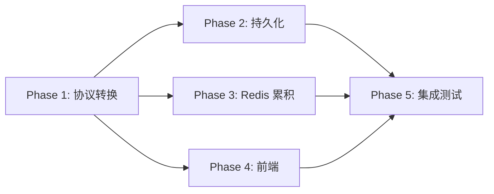

# 协议实施计划

> 基于 01~04 设计文档的分阶段实施方案

## 总览

```
Phase 1: 后端协议转换       — GatewayRelayService 拆解 OpenCode 事件
Phase 2: 后端持久化改造      — 新建 skill_message_part 表 + upsert 逻辑
Phase 3: 后端 Redis 累积器   — 实时缓冲 + resume 接口
Phase 4: 前端消息处理        — StreamMessage 解析 + UI 组件
Phase 5: 集成测试与验证      — 端到端联调
```

---

## Phase 1: 后端协议转换（核心，预计 2-3h）

**目标：** Skill Server 将 OpenCode 原始事件拆解为语义化的 StreamMessage 推给前端。

### 1.1 新建 StreamMessage DTO

#### [NEW] `StreamMessage.java`
> `skill-server/src/main/java/com/opencode/cui/skill/model/StreamMessage.java`

```java
@Data @Builder
public class StreamMessage {
    private String type;       // text.delta / tool.update / question / ...
    private Integer seq;
    private String partId;
    private String content;
    private String partType;   // text / reasoning / tool / ...
    private String toolName;
    private String toolCallId;
    private String status;     // pending / running / completed / error
    private Object input;
    private String output;
    private String title;
    private String header;     // question 专用
    private String question;   // question 专用
    private List<String> options; // question 专用
    private String permissionId;
    private String permType;
    private Object metadata;
    private Object tokens;
    private Double cost;
    private String reason;
    private String error;
    private Object raw;        // 原始事件（可选）
}
```

### 1.2 新建事件解析器

#### [NEW] `OpenCodeEventTranslator.java`
> `skill-server/src/main/java/com/opencode/cui/skill/service/OpenCodeEventTranslator.java`

- `StreamMessage translate(JsonNode event)` — 主入口
- 内部 switch 逻辑对应 `02-stream-protocol-design.md` 第五节映射表
- 处理 `message.part.updated` 的 12 种 Part type
- 处理 `session.status`、`permission.updated` 等顶层事件

### 1.3 改造 GatewayRelayService

#### [MODIFY] `GatewayRelayService.java`
> `skill-server/src/main/java/com/opencode/cui/skill/service/GatewayRelayService.java`

| 方法                      | 改动                                                                         |
| ------------------------- | ---------------------------------------------------------------------------- |
| `handleToolEvent`         | 调用 `translator.translate(event)` → `broadcastToSession(msg)`               |
| `broadcastToSession`      | 签名改为接收 `StreamMessage` 而非 `(type, content)` → 序列化为 JSON 发 Redis |
| `handleSessionBroadcast`  | 保持不变（从 Redis 收消息推给本地 WS 客户端）                                |
| `handlePermissionRequest` | 调用 `translator` 统一格式化                                                 |

### 1.4 改造 SkillStreamHandler

#### [MODIFY] `SkillStreamHandler.java`
> `skill-server/src/main/java/com/opencode/cui/skill/ws/SkillStreamHandler.java`

- `pushToSession` 方法适配新的 `StreamMessage` JSON 格式
- seq 序列号递增逻辑

### 1.5 单元测试

#### [NEW] `OpenCodeEventTranslatorTest.java`
> `skill-server/src/test/java/.../service/OpenCodeEventTranslatorTest.java`

测试用例：
- [ ] TextPart + delta → `text.delta`
- [ ] TextPart 无 delta → `text.done`
- [ ] ReasoningPart → `thinking.delta` / `thinking.done`
- [ ] ToolPart (bash, completed) → `tool.update`
- [ ] ToolPart (question, running) → `question`
- [ ] StepFinishPart → `step.done`
- [ ] session.status → `session.status`
- [ ] permission.updated → `permission.ask`

---

## Phase 2: 后端持久化改造（预计 2h）

**目标：** 引入 `skill_message_part` 表，实现"存最终态不存中间态"。

### 2.1 数据库迁移

#### [NEW] `V2__message_parts.sql`
> `skill-server/src/main/resources/db/migration/V2__message_parts.sql`

- 新建 `skill_message_part` 表（见 `03-persistence-design.md` 第七节）
- `ALTER TABLE skill_message` 添加 `message_id, finished, tokens_input, tokens_output, cost`

### 2.2 Model + Repository

#### [NEW] `SkillMessagePart.java`
> `skill-server/src/main/java/com/opencode/cui/skill/model/SkillMessagePart.java`

#### [NEW] `SkillMessagePartRepository.java` + Mapper XML
> `skill-server/src/main/java/com/opencode/cui/skill/repository/SkillMessagePartRepository.java`

方法：
- `insert(SkillMessagePart part)`
- `updateByPartId(SkillMessagePart part)` — upsert 语义
- `findByMessageId(Long messageId)` — 加载一条消息的所有 Parts
- `findByPartId(String partId)` — 查找单个 Part
- `findMaxSeqByMessageId(Long messageId)`

### 2.3 持久化 Service

#### [NEW] `MessagePersistenceService.java`
> `skill-server/src/main/java/com/opencode/cui/skill/service/MessagePersistenceService.java`

- `void persistIfFinal(String sessionId, StreamMessage msg, JsonNode rawEvent)` — 判断是否最终态并存储
- `upsertTextPart / upsertToolPart / upsertFilePart` — 按类型存储
- `updateMessageTokens(sessionId, tokens, cost)` — step.done 时更新统计

### 2.4 整合到 handleToolEvent

#### [MODIFY] `GatewayRelayService.handleToolEvent`

```java
// 改造后：
StreamMessage msg = translator.translate(event);
broadcastToSession(sessionId, msg);         // 1. 实时推送
persistenceService.persistIfFinal(sessionId, msg, event);  // 2. 条件持久化
```

### 2.5 改造历史记录 API

#### [MODIFY] `SkillMessageService.getMessageHistory`

返回结果增加 `parts` 字段，嵌套查询 `skill_message_part`。

#### [MODIFY] `SkillMessageController`

历史记录 API 返回消息+部件嵌套结构。

---

## Phase 3: 后端 Redis 累积器（预计 1.5h）

**目标：** 流式过程中在 Redis 累积 Part 内容，支持断线恢复。

### 3.1 Redis 累积服务

#### [NEW] `StreamBufferService.java`
> `skill-server/src/main/java/com/opencode/cui/skill/service/StreamBufferService.java`

方法：
- `void accumulate(String sessionId, StreamMessage msg)` — 按类型 APPEND 或 SET
- `void setSessionStreaming(String sessionId, boolean busy)` — 设置/清除 streaming 标记
- `List<StreamMessage> getStreamingParts(String sessionId)` — 获取所有进行中的 Parts
- `boolean isSessionStreaming(String sessionId)` — 查询是否在流式中
- `void clearPart(String sessionId, String partId)` — Part 完成后清除缓冲
- `void clearSession(String sessionId)` — 会话结束后清除所有

Redis Key 规则（见 `04-reconnect-design.md` 第三节）。

### 3.2 整合到 handleToolEvent

#### [MODIFY] `GatewayRelayService.handleToolEvent`

```java
// 最终形态：
StreamMessage msg = translator.translate(event);
broadcastToSession(sessionId, msg);                        // 1. 实时推送
bufferService.accumulate(sessionId, msg);                  // 2. Redis 累积
persistenceService.persistIfFinal(sessionId, msg, event);  // 3. 条件持久化
if (isFinal) bufferService.clearPart(sessionId, partId);   // 4. 清除缓冲
```

### 3.3 Resume 接口

#### [MODIFY] `SkillStreamHandler`

WebSocket 连接时处理 resume：
- 收到 `{ action: "resume", sessionId }` 
- → 发送 DB snapshot + Redis streaming parts
- → 订阅实时流

---

## Phase 4: 前端消息处理（预计 2-3h）

**目标：** 前端适配新的 StreamMessage 协议，渲染多种消息类型。

### 4.1 类型定义更新

#### [MODIFY] `types.ts`
> `skill-miniapp/src/protocol/types.ts`

更新 `StreamMessage` interface，添加所有 17 种 type（见 `02-stream-protocol-design.md` 3.3 节）。

### 4.2 消息解析器更新

#### [MODIFY] `OpenCodeEventParser.ts`
> `skill-miniapp/src/protocol/OpenCodeEventParser.ts`

适配新的 StreamMessage type（不再需要前端解析 OpenCode 原始事件，直接消费 type + content）。

### 4.3 Stream 组装器更新

#### [MODIFY] `StreamAssembler.ts`
> `skill-miniapp/src/protocol/StreamAssembler.ts`

- 按 `partId` 管理消息内的 Part 块
- `text.delta` → 追加到对应 partId 的块
- `tool.update` → 更新工具卡片状态
- `question` → 创建问答交互块

### 4.4 Hook 改造

#### [MODIFY] `useSkillStream.ts`
> `skill-miniapp/src/hooks/useSkillStream.ts`

- `handleStreamMessage` 改为 switch msg.type
- 添加 resume 逻辑：连接时发 `{ action: "resume", sessionId }`
- 处理 `snapshot` 和 `streaming` 消息

### 4.5 新增 UI 组件

#### [NEW] `QuestionCard.tsx`
> `skill-miniapp/src/components/QuestionCard.tsx`

AI 提问卡片：标题 + 问题 + 选项按钮 + 自由输入 + 提交按钮

#### [NEW] `PermissionCard.tsx`
> `skill-miniapp/src/components/PermissionCard.tsx`

权限审批卡片：类型标签 + 操作描述 + 允许/拒绝按钮

#### [NEW] `ToolCard.tsx`
> `skill-miniapp/src/components/ToolCard.tsx`

工具调用卡片：工具名 + 状态指示 + 可折叠的输入/输出面板

#### [NEW] `ThinkingBlock.tsx`
> `skill-miniapp/src/components/ThinkingBlock.tsx`

思维链展示：可折叠的"思考过程"区域

#### [MODIFY] `ToolUseRenderer.ts`
> `skill-miniapp/src/protocol/ToolUseRenderer.ts`

适配新的 ToolPart 结构（state.status 状态机）

---

## Phase 5: 集成测试与验证（预计 1h）

### 5.1 后端测试

- [ ] `OpenCodeEventTranslatorTest` — 12 种 Part 转换
- [ ] `MessagePersistenceServiceTest` — 持久化条件判断
- [ ] `StreamBufferServiceTest` — Redis 累积/清除逻辑

### 5.2 端到端验证

- [ ] 发送消息 → 收到 `text.delta` 流式文本
- [ ] 思维链显示为可折叠区域
- [ ] 工具调用显示状态变化（pending → running → completed）
- [ ] question 工具渲染问答 UI → 用户回答 → AI 继续
- [ ] permission 审批弹窗 → 用户允许 → AI 继续
- [ ] 关闭标签页 → 重新打开 → 恢复历史 + 接续流式
- [ ] 切换会话 → 切回来 → 内容完整
- [ ] 历史记录 API 返回消息+部件嵌套结构

---

## 实施顺序与依赖



**推荐实施顺序：** P1 → P2 + P4 并行 → P3 → P5

|  Phase   | 预估时间 | 前置依赖 | 涉及文件（新建/修改） |
| :------: | :------: | :------: | :-------------------: |
|    P1    |   2-3h   |    无    |      2 新 + 2 改      |
|    P2    |    2h    |    P1    |      3 新 + 3 改      |
|    P3    |   1.5h   |    P1    |      1 新 + 2 改      |
|    P4    |   2-3h   |    P1    |      4 新 + 4 改      |
|    P5    |    1h    |  P1-P4   |       测试文件        |
| **总计** | **~10h** |          |   **10 新 + 11 改**   |
