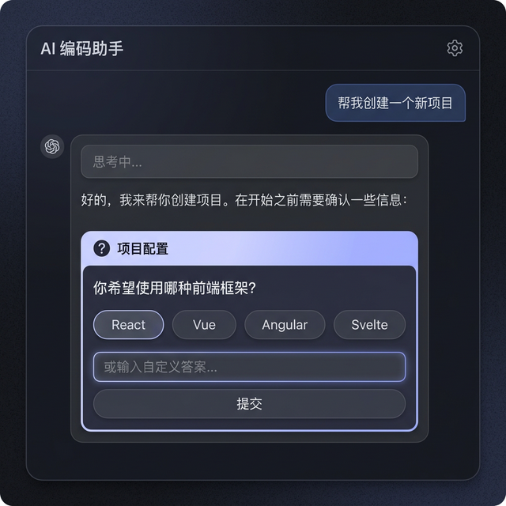
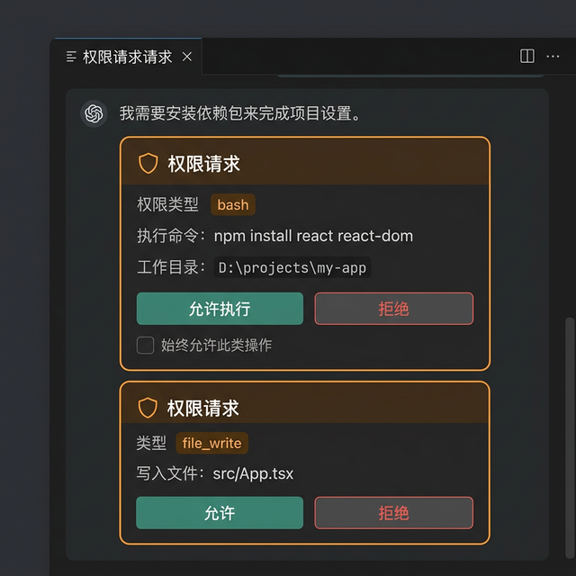

# 需求文档：前端协议适配与会话恢复

> 版本: 1.0 | 日期: 2026-03-07

## 一、需求背景

OpenCode CUI 系统的前端 miniapp 之前直接接收后端透传的 OpenCode 原始事件，存在以下问题：

1. **前端解析复杂** — 前端需要理解 OpenCode 的 31 种 Event 类型和 12 种 Part 类型
2. **缺乏语义化** — 前端无法区分"AI 正文输出"与"思维链"、"工具调用"等不同语义
3. **无会话恢复能力** — 用户关闭窗口或切换会话后，无法恢复正在流式输出的内容
4. **缺乏结构化持久化** — 消息仅保存为纯文本，无法精确记录每个 Part 的类型和状态

## 二、需求目标

### 2.1 核心目标

将 OpenCode 原始事件翻译为语义化的 StreamMessage 协议，前端无需理解 OpenCode 内部协议，仅需消费 17 种语义类型即可渲染完整 UI。

### 2.2 具体需求

| 编号 | 需求                                                                | 优先级 |
| ---- | ------------------------------------------------------------------- | ------ |
| R1   | 后端将 OpenCode 事件翻译为 StreamMessage（17种type）                | P0     |
| R2   | 前端支持 text/thinking/tool/question/permission/file 六种 Part 渲染 | P0     |
| R3   | 消息 Part 级别持久化（MySQL skill_message_part 表）                 | P0     |
| R4   | Redis 实时累积器，支持断线后 Part 内容恢复                          | P1     |
| R5   | WebSocket resume 协议，前端重连后无缝续流                           | P1     |
| R6   | ToolCard 可折叠展示工具调用输入/输出                                | P0     |
| R7   | ThinkingBlock 可折叠展示 AI 思维过程                                | P0     |
| R8   | QuestionCard 支持 AI 提问交互（选项 + 自由输入）                    | P0     |
| R9   | PermissionCard 支持权限审批（允许/拒绝）                            | P0     |

## 三、涉及模块

```
┌─────────────────────────────────────────────────┐
│  skill-miniapp (前端 React + TypeScript)          │
│  · types.ts          — StreamMessage 类型定义     │
│  · StreamAssembler   — 多 Part 管理器             │
│  · useSkillStream    — WebSocket 消息处理 Hook    │
│  · ToolCard/ThinkingBlock/QuestionCard/...        │
│  · MessageBubble     — Parts 渲染                 │
└──────────┬──────────────────────────────────────┘
           │ WebSocket (StreamMessage JSON)
┌──────────▼──────────────────────────────────────┐
│  skill-server (后端 Spring Boot + Java)           │
│  · OpenCodeEventTranslator — 事件翻译器          │
│  · StreamMessage           — DTO 模型             │
│  · StreamBufferService     — Redis 累积器         │
│  · MessagePersistenceService — MySQL 持久化       │
│  · SkillStreamHandler      — WS 端点 + resume    │
│  · GatewayRelayService     — 事件路由中枢         │
└──────────┬──────────┬───────────────────────────┘
           │          │
     ┌─────▼────┐ ┌───▼────┐
     │  Redis   │ │ MySQL  │
     │ 实时累积 │ │ 持久化 │
     └──────────┘ └────────┘
```

## 四、StreamMessage 协议总览

### 4.1 17 种消息类型

| 类别 | Type                                                 | 用途              |
| ---- | ---------------------------------------------------- | ----------------- |
| 内容 | `text.delta` / `text.done`                           | AI 正文流式/完成  |
| 内容 | `thinking.delta` / `thinking.done`                   | 思维链流式/完成   |
| 工具 | `tool.update`                                        | 工具调用状态更新  |
| 交互 | `question`                                           | AI 向用户提问     |
| 交互 | `permission.ask` / `permission.reply`                | 权限申请/回复     |
| 文件 | `file`                                               | 文件输出          |
| 步骤 | `step.start` / `step.done`                           | 推理步骤开始/结束 |
| 会话 | `session.status` / `session.title` / `session.error` | 会话状态          |
| 系统 | `agent.online` / `agent.offline`                     | 代理在线状态      |
| 系统 | `error`                                              | 通用错误          |
| 恢复 | `snapshot` / `streaming`                             | 断线重连恢复      |

### 4.2 UI 组件映射

| Part 类型  | 前端组件                       | 交互方式            |
| ---------- | ------------------------------ | ------------------- |
| text       | Markdown 渲染 + streaming 光标 | 只读                |
| thinking   | `ThinkingBlock` 可折叠面板     | 点击展开/收起       |
| tool       | `ToolCard` 状态卡片            | 可折叠输入/输出     |
| question   | `QuestionCard` 交互卡片        | 选项点击 / 输入提交 |
| permission | `PermissionCard` 审批卡片      | 允许/拒绝按钮       |
| file       | 文件链接                       | 点击下载            |

## 五、三层数据架构

| 层     | 存储           | 特点              | 用途                     |
| ------ | -------------- | ----------------- | ------------------------ |
| 瞬时态 | WebSocket      | 断开即丢失        | 实时推送给在线用户       |
| 实时态 | Redis (1h TTL) | 每条 delta APPEND | 断线重连时恢复进行中内容 |
| 最终态 | MySQL          | 永久保存          | 历史回看、数据统计       |

## 六、前端效果参考




