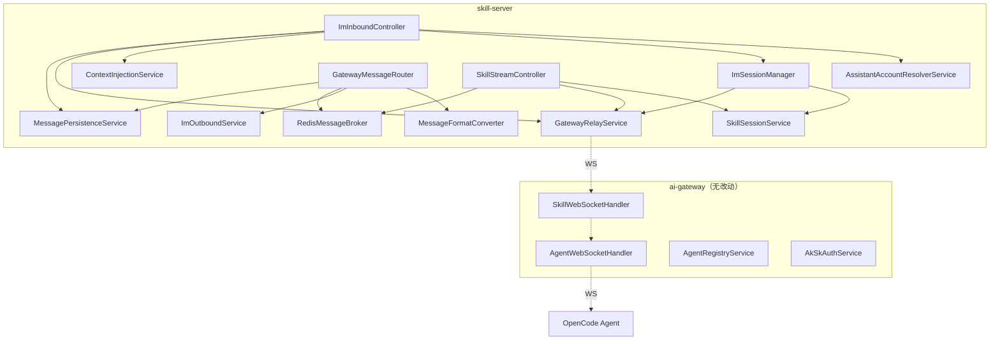

# OpenCode-CUI 架构设计文档

> 基于 [business_analysis.md](./business_analysis.md) 和 [scope_definition.md](./scope_definition.md) 的需求边界产出。

---

## 一、系统全景

### 1.1 系统定位

OpenCode-CUI 是连接**多种外部平台**与 OpenCode Agent 的中间层，核心职责：
- **skill-server**：面向外部平台的业务入口，管理会话、消息持久化、协议转换
- **ai-gateway**：面向 Agent 的通信网关，管理 AK/SK 认证、WS 连接、消息中继

> **扩展性设计**：系统通过 `business_session_domain + business_session_type + business_session_id` 三元组标识会话来源，
> 使得未来接入飞书、钉钉、Slack 等新平台时无需更改数据库 Schema。

### 1.2 系统边界

```
┌────────────────────────────────────────────┐
│              IM 平台（外部）                │
│   ┌──────────┐       ┌──────────────┐      │
│   │IM 客户端 │       │  IM 服务端   │      │
│   └────┬─────┘       └──────┬───────┘      │
└────────┼────────────────────┼──────────────┘
         │                    │
   场景一: WS           场景二/单聊: REST
  (skill-miniapp)      (IM 调我们接口)
         │                    │
┌────────┴────────────────────┴──────────────┐
│          我 们 的 系 统 边 界               │
│                                            │
│   ┌──────────────────────────────────┐     │
│   │          skill-server            │     │
│   │  ┌─────────┐  ┌──────────────┐   │     │
│   │  │ WS 入站 │  │ REST 入站    │   │     │
│   │  │(miniapp)│  │(IM 服务端)   │   │     │
│   │  └────┬────┘  └──────┬───────┘   │     │
│   │       └──────┬───────┘           │     │
│   │              ↓                   │     │
│   │     ┌─────────────────┐          │     │
│   │     │   业务处理层     │          │     │
│   │     │ Session/Message/ │          │     │
│   │     │ Format/Context  │          │     │
│   │     └────────┬────────┘          │     │
│   └──────────────┼───────────────────┘     │
│                  │ WS (内部 Token)          │
│   ┌──────────────┴───────────────────┐     │
│   │          ai-gateway              │     │
│   │  AK/SK认证 · Agent注册 · 消息中继  │     │
│   └──────────────┬───────────────────┘     │
└──────────────────┼─────────────────────────┘
                   │ WS (AK/SK HMAC)
            ┌──────┴──────┐
            │  OpenCode   │
            │   Agent     │
            └─────────────┘
```

### 1.3 技术栈

| 层级      | 技术选型         | 说明                             |
| --------- | ---------------- | -------------------------------- |
| 语言      | Java 21          | Spring Boot 3.x                  |
| 构建      | Maven            | 多模块 monorepo                  |
| 数据库    | MySQL 5.7        | Flyway 迁移管理                  |
| 缓存/消息 | Redis 5.0        | pub/sub 多实例广播               |
| 通信      | WebSocket + REST | WS 用于长连接，REST 用于外部对接 |
| ID 生成   | Snowflake        | 分布式唯一 ID                    |
| 前端      | Lit + Vite       | skill-miniapp（场景一）          |

---

## 二、现有架构（场景一）

### 2.1 skill-server 分层

```
Controller 层
├── SkillStreamController    ← WS 端点 /stream，管理 miniapp 连接
├── SkillSessionController   ← REST /sessions CRUD
├── SkillMessageController   ← REST /messages 查询
└── AgentQueryController     ← REST /agents 查询

Service 层
├── SkillSessionService      ← 会话 CRUD + 生命周期（ACTIVE/IDLE/CLOSED）
├── SkillMessageService      ← 消息查询
├── MessagePersistenceService← 消息持久化（user/assistant/system/tool + parts）
├── GatewayRelayService      ← Gateway 下行通信（invoke 发送）
├── GatewayMessageRouter     ← Gateway 上行消息路由（tool_event/done/error/session_created）
├── SessionRebuildService    ← ToolSession 重建（toolSession not found → rebuild）
├── ImMessageService         ← IM 群聊发送（纯文本 POST）
├── RedisMessageBroker       ← Redis pub/sub 多实例广播
├── StreamBufferService      ← 流式消息缓冲
├── SessionAccessControlService ← 会话访问控制
├── GatewayApiClient         ← Gateway REST 客户端
├── OpenCodeEventTranslator  ← Agent 事件翻译
├── PayloadBuilder           ← invoke payload 构建
└── ProtocolMessageMapper    ← 协议消息映射

Model 层
├── SkillSession             ← 会话实体（id/userId/ak/toolSessionId/title/status/imGroupId）
├── SkillMessage             ← 消息实体（id/sessionId/role/content/contentType）
├── SkillMessagePart         ← 消息片段（text/reasoning/tool/file/step）
├── InvokeCommand            ← invoke 命令封装
└── StreamMessage            ← 流式消息封装

Repository 层（MyBatis Mapper）
├── SkillSessionRepository
├── SkillMessageRepository
├── SkillMessagePartRepository
└── SkillDefinitionRepository
```

### 2.2 ai-gateway 分层

```
WS Handler 层
├── AgentWebSocketHandler    ← Agent 侧 WS（AK/SK HMAC 签名认证）
└── SkillWebSocketHandler    ← skill-server 侧 WS（Token 认证）

Controller 层
└── AgentController          ← REST /agents 查询（在线列表、状态）

Service 层
├── AgentRegistryService     ← Agent 注册/心跳/离线管理
├── AkSkAuthService          ← AK/SK HMAC 签名验证
├── DeviceBindingService     ← 设备绑定 + 重复连接检测
├── SkillRelayService        ← skill-server invoke 转发给 Agent
├── EventRelayService        ← Agent 事件中继给 skill-server
├── RedisMessageBroker       ← Redis pub/sub（集群模式下的消息转发）
└── SnowflakeIdGenerator     ← 分布式 ID 生成

Model 层
├── AgentConnection          ← Agent 连接实体
├── AkSkCredential           ← AK/SK 凭证实体
└── GatewayMessage           ← Gateway 消息封装

Repository 层（MyBatis Mapper）
├── AgentConnectionRepository
└── AkSkCredentialRepository
```

### 2.3 数据库 Schema（现有）

```sql
-- skill-server（经 V1~V5 迁移后的当前结构）
skill_session (id BIGINT, user_id VARCHAR(128), ak VARCHAR(64),
               tool_session_id VARCHAR(128), title VARCHAR(200),
               status ENUM('ACTIVE','IDLE','CLOSED'),
               im_group_id VARCHAR(128),     -- ← 待替换为三元组
               created_at, last_active_at)
skill_message (id, session_id, seq, role, content, content_type, ...)
skill_message_part (id, message_id, session_id, part_id, part_type, content, ...)
skill_definition (id, skill_code, skill_name, tool_type, ...)

-- ai-gateway
agent_connection (id, user_id, ak_id, device_name, os, status, ...)
ak_sk_credential (id, ak, sk, user_id, description, status, ...)
```

### 2.4 场景一数据流

```
miniapp ──WS(Cookie)──→ SkillStreamController
    → SkillSessionService.createSession(userId, ak, title, imGroupId)
    → GatewayRelayService.sendInvokeToGateway(InvokeCommand)
        → SkillWebSocketHandler → ai-gateway → AgentWebSocketHandler → Agent
    ← Agent 回复
        → EventRelayService → SkillWebSocketHandler → GatewayRelayService.handleGatewayMessage
        → GatewayMessageRouter.route(type, ak, userId, node)
            → handleToolEvent → translateEvent → broadcastStreamMessage
                → RedisMessageBroker → SkillStreamController → miniapp
            → MessagePersistenceService (持久化)
```

---

## 三、目标架构（场景二 + 单聊）

### 3.1 核心设计决策

#### ADR-1：统一 REST 入站接口

**决策**：所有外部平台共用同一个 REST 接收消息接口，通过 `businessDomain + sessionType + sessionId` 三元组标识来源。

**权衡分析**：

| 方案       | 优点                           | 缺点                           |
| ---------- | ------------------------------ | ------------------------------ |
| ✅ 统一接口 | 代码复用高、维护简单、对接简单 | 接口内部需分支处理             |
| ❌ 分开接口 | 逻辑隔离清晰                   | 重复代码多、每个平台需独立接口 |

**理由**：核心流程完全一致（接收→解析→找会话→Agent调用→回复），仅上下文注入这一步有差异。`businessDomain` 预留了未来多平台扩展能力。

#### ADR-2：会话自动创建策略

**决策**：发消息接口内 findOrCreate session，不对外暴露独立的会话创建 API。

**理由**：
- IM 不调会话创建（关键前提 #2）
- 降低 IM 对接复杂度（只需一个接口）
- 会话生命周期完全由 skill-server 内部管理

#### ADR-3：assistantAccount → ak 解析 + 缓存

**决策**：每次消息进来都调第三方接口解析 assistantAccount → ak，结果缓存到 Redis（TTL 可配）。

**权衡分析**：

| 方案               | 优点                   | 缺点                     |
| ------------------ | ---------------------- | ------------------------ |
| ❌ 每次都调         | 数据实时性最好         | 第三方接口压力大、延迟高 |
| ✅ Redis 缓存 + TTL | 性能好、可接受的实时性 | 缓存过期期间有短暂不一致 |
| ❌ 本地数据库映射表 | 不依赖第三方           | 需要同步机制，维护复杂   |

#### ADR-4：消息格式转换策略

**决策**：在 skill-server 侧新增 `MessageFormatConverter`，将 Agent 输出转换为 IM 支持的纯文本/图片。

**理由**：IM 仅支持纯文本和图片（规则 GA10/D10），Markdown、Question 卡片、Tool 调用等格式需在出站前转换，避免 IM 侧显示异常。

#### ADR-5：回复路由分支策略

**决策**：在 `GatewayMessageRouter` 中根据 session 的 `businessSessionDomain + businessSessionType` 决定回复走向。

```
businessSessionDomain = miniapp                                        → 走现有 WS 广播路径 + 持久化
businessSessionDomain = im, businessSessionType = group     → 格式转换 → ImOutboundService（❗不做消息持久化）
businessSessionDomain = im, businessSessionType = direct    → 格式转换 → ImOutboundService + 持久化
businessSessionDomain = meeting, ...  → （未来扩展）会议场景出站适配
businessSessionDomain = doc, ...      → （未来扩展）云文档场景出站适配
```

> **持久化策略**：群聊场景不做消息持久化，因为聊天记录由 IM 平台管理，
> 我们只是被 @时回复，无需重复存储。单聊场景需要持久化，保持与 miniapp 一致的历史记录能力。

#### ADR-6：会话标识三元组设计

**决策**：使用 `business_session_domain + business_session_type + business_session_id` 三元组（而非二元组）标识会话来源。

**权衡分析**：

| 方案                                                                      | 优点                                           | 缺点                        |
| ------------------------------------------------------------------------- | ---------------------------------------------- | --------------------------- |
| ❌ `business_session_type + business_session_id`                           | 简单                                           | 不同平台 sessionId 可能冲突 |
| ❌ `session_type` ENUM                                                     | 查询直观                                       | 新增平台需改 ENUM，DDL 变更 |
| ✅ `business_session_domain + business_session_type + business_session_id` | 无需改 schema 即可接入新平台，sessionId 不冲突 | 三字段联合索引稍复杂        |

**business_session_domain 取值示例**：

| business_session_domain | 含义        | 说明                   |
| ----------------------- | ----------- | ---------------------- |
| `miniapp`               | 技能小程序  | 场景一，现有 WS 入站   |
| `im`                    | IM 消息场景 | 场景二/单聊，REST 入站 |
| `meeting`               | 会议场景    | 未来扩展               |
| `doc`                   | 云文档场景  | 未来扩展               |

### 3.2 新增模块设计

#### 3.2.1 REST 入站层

```java
// 新增 Controller
@RestController
@RequestMapping("/api/inbound")
public class ImInboundController {

    /**
     * 统一消息接收接口，供 IM 服务端调用
     * POST /api/inbound/messages
     */
    @PostMapping("/messages")
    ApiResponse<Void> receiveMessage(@RequestBody ImMessageRequest request);
}

// 请求模型
record ImMessageRequest(
    String businessDomain,       // 来源场景（"im" / "meeting" / "doc"）
    String sessionType,          // 会话类型（"group" / "direct"）
    String sessionId,            // 平台定义的会话标识（域内唯一）
    String assistantAccount,     // 数字分身平台账号标识（用于解析 ak）
    String content,              // 消息内容
    String msgType,              // "text" | "image"
    String imageUrl,             // 图片 URL（msgType=image 时）
    List<ChatMessage> chatHistory  // 群聊历史（场景二可选）
) {}
```

#### 3.2.2 assistantAccount 解析服务

```java
@Service
public class AssistantAccountResolverService {

    @Cacheable(value = "assistantAccount:ak", key = "#assistantAccount", unless = "#result == null")
    public String resolveAk(String assistantAccount) {
        // 调用第三方接口：assistantAccount → ak
    }
}
```

#### 3.2.3 会话自动管理服务

```java
@Service
public class ImSessionManager {

    /**
     * 核心方法：findOrCreate
     * 1. 用 businessDomain + sessionId + ak 三元组查找已有 session
     * 2. 找不到 → 创建 Session → 通过 Gateway 创建 ToolSession → 等待绑定
     * 3. 找到了 → 校验 toolSession 是否有效 → 无效则重建
     */
    public SkillSession findOrCreateSession(String businessDomain, String sessionType,
                                             String sessionId, String ak,
                                             String userId) {
        // businessDomain + sessionId + ak → 唯一 session
    }
}
```

#### 3.2.4 上下文注入引擎（仅场景二）

```java
@Service
public class ContextInjectionService {

    /**
     * 将群聊历史 + 当前消息组装为 Prompt
     * 使用可配置的 prompt 模板
     */
    public String buildPrompt(String currentMessage, 
                              List<ChatMessage> chatHistory,
                              String templateName) {
        // 加载模板 → 填充变量 → 返回完整 Prompt
    }
}
```

#### 3.2.5 消息格式转换器

```java
@Service
public class MessageFormatConverter {

    /**
     * Agent 输出 → IM 支持的格式
     * Markdown → 纯文本（去除格式标记，保留结构可读性）
     * Question/Tool/Permission → 纯文本描述
     * 图片 → 保持图片 URL
     */
    public ImOutboundMessage convert(StreamMessage agentMessage) { ... }
}
```

#### 3.2.6 IM 出站服务

```java
@Service
public class ImOutboundService {

    // 对接 IM 平台真实 API：
    // 单聊: POST {im-api-url}/v1/welinkim/im-service/chat/app-user-chat
    // 群聊: POST {im-api-url}/v1/welinkim/im-service/chat/app-group-chat
    //
    // 请求体: { appMsgId, senderAccount, sessionId, contentType(13), content, clientSendTime }
    // 响应体: { msgId, clientMsgId, serverSendTime, error: {errorCode, errorMsg} }

    public boolean sendTextToIm(String sessionType, String sessionId,
                                 String content, String assistantAccount) {
        // 1. sessionType="group" → app-group-chat, "direct" → app-user-chat
        // 2. 构建请求体（appMsgId=UUID, senderAccount=assistantAccount, contentType=13）
        // 3. Bearer Token 认证头
        // 4. 发送 HTTP POST，解析响应中 error 字段判断业务成功/失败
    }
}
```

### 3.3 数据库变更

```sql
-- V6: 会话三元组改造 + 全局 ENUM → VARCHAR 迁移
-- 1. 新增三元组字段
ALTER TABLE skill_session
  ADD COLUMN business_session_domain VARCHAR(32) NOT NULL DEFAULT 'miniapp'
      COMMENT '来源场景（miniapp/im/meeting/doc）',
  ADD COLUMN business_session_type VARCHAR(32) NULL
      COMMENT '聊天类型（group/direct）',
  ADD COLUMN business_session_id VARCHAR(128) NULL
      COMMENT '平台定义的会话标识',
  ADD COLUMN assistant_account VARCHAR(128) NULL
      COMMENT '数字分身的平台账号标识';

-- 2. 迁移旧数据：im_group_id → business_session_id
UPDATE skill_session
  SET business_session_id = im_group_id
  WHERE im_group_id IS NOT NULL;

-- 3. 删除旧字段
ALTER TABLE skill_session
  DROP COLUMN im_group_id;

-- 4. 添加三元组唯一索引（findOrCreate 核心索引）
ALTER TABLE skill_session
  ADD UNIQUE INDEX idx_biz_domain_session_ak (business_session_domain, business_session_id, ak);

-- 5. ENUM → VARCHAR 迁移（消除所有数据库层枚举约束）
ALTER TABLE skill_definition
  MODIFY COLUMN status VARCHAR(16) NOT NULL DEFAULT 'ACTIVE'
      COMMENT '状态（应用层枚举：ACTIVE/DISABLED）';
ALTER TABLE skill_session
  MODIFY COLUMN status VARCHAR(16) NOT NULL DEFAULT 'ACTIVE'
      COMMENT '状态（应用层枚举：ACTIVE/IDLE/CLOSED）';
ALTER TABLE skill_message
  MODIFY COLUMN role VARCHAR(16) NOT NULL
      COMMENT '角色（应用层枚举：USER/ASSISTANT/SYSTEM/TOOL）';
ALTER TABLE skill_message
  MODIFY COLUMN content_type VARCHAR(16) NOT NULL DEFAULT 'MARKDOWN'
      COMMENT '内容类型（应用层枚举：MARKDOWN/CODE/PLAIN/IMAGE）';

-- V7: 标记迁移（content_type 已在 V6 改为 VARCHAR，新增 IMAGE 值无需 DDL）
SELECT 1;
```

> **为什么全面使用 VARCHAR 而非 ENUM**：所有枚举字段统一使用 VARCHAR 存储，枚举约束在 Java 应用层完成。
> 新增枚举值时无需 DDL 变更，MySQL 5.7 修改 ENUM 需重建表有锁表风险。
>
> **为什么 session 表要存 assistantAccount**：会话需要关联其对应的数字分身，
> 出站发消息时可直接从 session 获取 assistantAccount，避免 ak → assistantAccount 的反向查找。

### 3.4 完整数据流

#### 场景二（群聊 @数字分身）

```
IM 服务端 ── POST /api/inbound/messages ──→ ImInboundController
    │
    ├─ Token 认证（拦截器）
    │
    ├─ AssistantAccountResolverService.resolveAk(assistantAccount)  →  第三方 API
    │                                                    ↓ (缓存到 Redis)
    │                                                   ak
    │
    ├─ ImSessionManager.findOrCreateSession("im", "group", sessionId, ak, assistantAccount)
    │       ├─ 查找: SELECT ... WHERE business_session_domain='im' AND business_session_id=? AND ak=?
    │       ├─ 不存在: createSession + GatewayRelayService.sendInvoke(CREATE_SESSION)
    │       │         等待 session_created 回调 → 绑定 toolSessionId
    │       └─ 存在: 校验 toolSessionId → 无效则 rebuildToolSession
    │
    ├─ ContextInjectionService.buildPrompt(message, chatHistory, template)
    │
    ├─ GatewayRelayService.sendInvokeToGateway(InvokeCommand{ak, action:chat, payload})
    │       → ai-gateway(复用) → Agent
    │
    ← Agent 回复 (via GatewayMessageRouter)
    │
    ├─ MessageFormatConverter.convert(agentMessage)  →  纯文本/图片
    │
    ├─ ImOutboundService.sendTextToIm("group", sessionId, content, assistantAccount)
    │       → POST IM 服务端 /chat/app-group-chat（Bearer Token 认证）
    │
    └─ （无消息持久化，聊天记录由 IM 平台管理）
```

#### 单聊

```
IM 服务端 ── POST /api/inbound/messages ──→ ImInboundController
    │   （与场景二完全相同的接口）
    │
    ├─ Token 认证
    ├─ assistantAccount → ak
    ├─ findOrCreateSession("im", "direct", sessionId, ak, assistantAccount)
    ├─ 直接发给 Agent（无 ContextInjection 步骤）
    ← Agent 回复
    ├─ MessageFormatConverter.convert
    ├─ ImOutboundService.sendTextToIm("direct", sessionId, content, assistantAccount)
    │       → POST IM 服务端 /chat/app-user-chat
    └─ MessagePersistenceService.persist（单聊需要持久化）
```

---

## 四、模块依赖关系



---

## 五、上下文超限重建机制

```
Agent 返回错误（context overflow / token limit exceeded）
    │
    ↓
GatewayMessageRouter.handleAssistantToolEvent
    │
    ├─ 检测: session.error 事件 + error.name == "ContextOverflowError"
    │
    ├─ businessSessionDomain == miniapp?
    │       → 通知前端 → 前端展示提示
    │
    ├─ businessSessionDomain != miniapp (im/meeting/doc)?
    │       → 自动重建:
    │           1. SessionRebuildService.rebuildToolSession
    │           2. 新建 ToolSession 并绑定
    │           3. 重发被拒的消息
    │           4. 通过 IM 发送「上下文已重置」系统提示
    │
    └─ 更新 session 记录
```

---

## 六、安全设计

| 通道                        | 认证方式         | 说明                          |
| --------------------------- | ---------------- | ----------------------------- |
| miniapp → skill-server      | Cookie (Session) | 现有方案                      |
| IM 服务端 → skill-server    | Token (Header)   | **新增** - 验证 IM 请求合法性 |
| skill-server → IM 服务端    | Token (Header)   | **增强** - 出站也需要 Token   |
| skill-server → ai-gateway   | Token (WS 握手)  | 现有方案                      |
| ai-gateway → Agent          | AK/SK HMAC (WS)  | 现有方案                      |
| skill-server 集群 ↔ IM 集群 | Token (长连接)   | **新增** - 可后置             |

---

## 七、部署架构

```
┌─────────────────────────────────────────────┐
│           负载均衡 (Nginx / API Gateway)      │
│     /api/im/*  →  skill-server 集群          │
│     /stream    →  skill-server 集群 (WS sticky)│
│     /gateway/* →  ai-gateway 集群             │
└─────────┬──────────────┬───────────────────┘
          │              │
  ┌───────┴──────┐  ┌────┴──────────┐
  │skill-server ×N│  │ai-gateway ×N │
  │  Spring Boot  │  │  Spring Boot  │
  └───────┬──────┘  └─────┬─────────┘
          │               │
   ┌──────┴───────────────┴──────┐
   │    共享基础设施               │
   │  ┌──────┐  ┌──────────────┐ │
   │  │MySQL │  │    Redis     │ │
   │  │ (RW) │  │ (pub/sub +   │ │
   │  │      │  │  cache)      │ │
   │  └──────┘  └──────────────┘ │
   └─────────────────────────────┘
```

**集群注意事项**：
- skill-server 多实例通过 Redis pub/sub 同步流式消息
- WS 连接需要 sticky session（已有方案）
- REST 接口无状态，可自由负载均衡
- assistantAccount → ak 缓存存储在 Redis，多实例共享

> **注意**：MySQL 5.7 不支持部分 8.0 特性（如 CTE、窗口函数），迁移脚本需避免使用。

---

## 八、配置设计

```yaml
# skill-server application.yml 新增配置项
skill:
  im:
    api-url: ${IM_API_URL}          # IM 服务端 API 基础 URL
    token: ${IM_TOKEN}              # IM 通信 Token
    inbound-token: ${IM_INBOUND_TOKEN}  # IM 调我们接口的 Token（验证用）

  assistant:
    resolve-url: ${ASSISTANT_RESOLVE_URL}  # 第三方 assistantAccount → ak 接口
    cache-ttl-minutes: 30                   # ak 缓存 TTL

  context:
    templates:                           # Prompt 模板配置
      group-chat: classpath:templates/group-chat-prompt.txt
    max-history-messages: 20             # 最大注入历史消息数

  session:
    auto-create-timeout-seconds: 30      # 自动创建 session 等待 toolSession 超时
    # 注：上下文超限检测基于 OpenCode session.error 事件的
    # ContextOverflowError 结构化字段，无需配置正则模式
```

---

## 九、影响评估

### ai-gateway

> **无需改动**。三个场景完全复用现有代码。

### skill-server

| 类型     | 文件                              | 说明                                                                                                        |
| -------- | --------------------------------- | ----------------------------------------------------------------------------------------------------------- |
| **新增** | `ImInboundController`             | REST 消息接收端点                                                                                           |
| **新增** | `ImMessageRequest`                | 入站消息模型                                                                                                |
| **新增** | `AssistantAccountResolverService` | assistantAccount → ak 解析 + 缓存                                                                           |
| **新增** | `ImSessionManager`                | findOrCreate session 逻辑                                                                                   |
| **新增** | `ContextInjectionService`         | Prompt 模板 + 历史注入                                                                                      |
| **新增** | `MessageFormatConverter`          | Agent 输出 → 纯文本/图片                                                                                    |
| **新增** | `ImOutboundService`               | 增强版 IM 发送                                                                                              |
| **新增** | `ImTokenAuthInterceptor`          | Token 认证拦截器                                                                                            |
| **修改** | `SkillSession`                    | 新增 `businessSessionDomain`/`businessSessionType`/`businessSessionId`/`assistantAccount`，删除 `imGroupId` |
| **修改** | `GatewayMessageRouter`            | 回复路由分支（按 businessSessionDomain + businessSessionType）                                              |
| **修改** | `SkillSessionService`             | 新增 `findByDomainSessionIdAndAk`，删除 imGroupId 相关                                                      |
| **修改** | `SkillSessionRepository`          | 新增查询方法 + 三元组索引，删除旧查询                                                                       |
| **修改** | `MessagePersistenceService`       | 支持 IMAGE 类型                                                                                             |
| **新增** | `V6__session_chat_triple.sql`     | 三元组字段 + 旧数据迁移 + 删除 im_group_id                                                                  |
| **新增** | `V7__image_content_type.sql`      | content_type 扩展                                                                                           |

### 新增文件数：~8 个 Java 类 + 2 个 SQL 迁移 + 1 个 Prompt 模板
### 修改文件数：~5 个现有类
