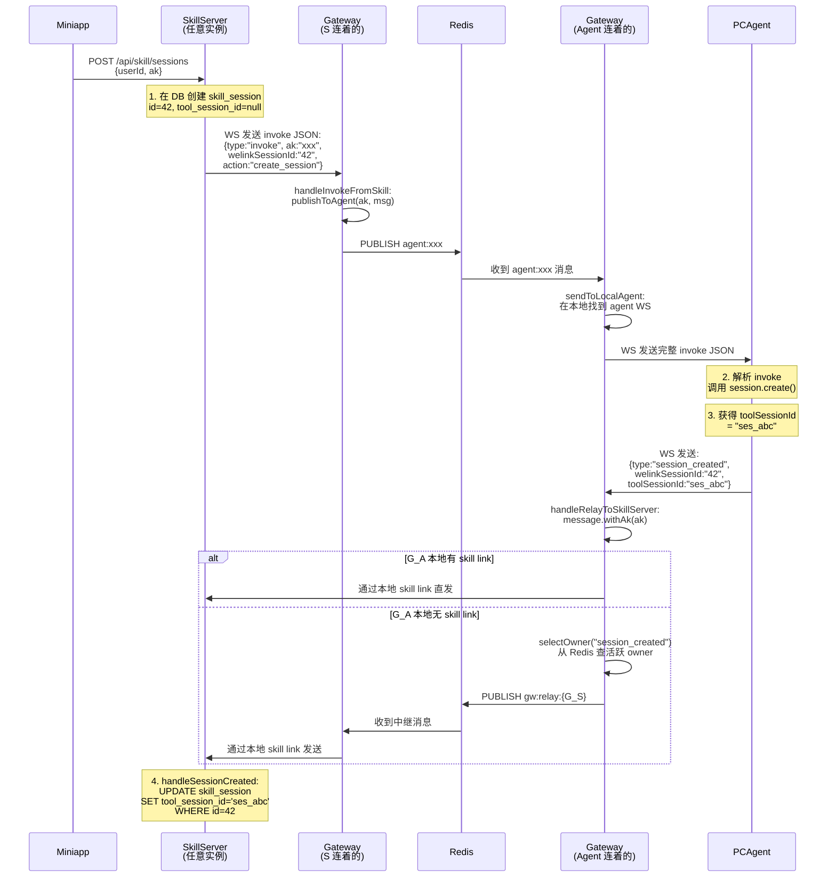

# 多实例路由功能流程文档

> 本文档详细描述 CUI 系统在 SkillServer 和 Gateway 多实例部署下，**当前代码实际实现**的消息路由处理流程。
> 
> 版本：1.0 | 日期：2026-03-10

---

## 1. 系统全景图

```
                     ┌─────────────────────────────────────────┐
                     │           Redis（共享）                  │
                     │                                         │
                     │  Channels:                               │
                     │    agent:{ak}         — Gateway 集群下行 │
                     │    gw:relay:{instId}  — Gateway 集群中继 │
                     │    session:{sessId}   — Skill 集群广播   │
                     │                                         │
                     │  Keys:                                   │
                     │    gw:skill:owners    — owner 集合       │
                     │    gw:skill:owner:{x} — owner 心跳 TTL  │
                     └─────────┬───────────────────┬───────────┘
                               │                   │
              ┌────────────────┘                   └────────────────┐
              │                                                     │
     ┌────────▼──────────┐                             ┌────────────▼─────────┐
     │   Gateway G1       │                             │   Gateway G2          │
     │                    │                             │                       │
     │  接收 PCAgent WS   │                             │  接收 Skill WS        │
     │  (agent owner)     │                             │  (skill owner)        │
     └────────┬───────────┘                             └───────────┬───────────┘
              │                                                     │
              │ WS /ws/agent                                        │ WS /ws/skill
              │                                                     │
     ┌────────▼──────────┐                             ┌────────────▼─────────┐
     │   PCAgent          │                             │  SkillServer S1       │
     │   (OpenCode 插件)  │                             │  (Spring Boot)        │
     └───────────────────┘                             └───────────────────────┘
                                                              │  共享
                                                       ┌──────▼──────┐
                                                       │   MySQL DB    │
                                                       └──────────────┘
```

> **关键前提**：所有 SkillServer 实例共享同一个 MySQL 数据库。因此，任何 SkillServer 实例都能执行 DB 读写操作。

---

## 2. 组件角色说明

| 组件            | 角色     | 实例数 | 说明                                                         |
| --------------- | -------- | ------ | ------------------------------------------------------------ |
| **Miniapp**     | 前端     | N      | 用户使用的小程序客户端，通过 HTTP + WS 连接 SkillServer      |
| **SkillServer** | 业务服务 | ≥1     | 会话管理、消息持久化、推流。每个实例启动时主动连一个 Gateway |
| **Gateway**     | 消息网关 | ≥1     | 双向消息中转：SkillServer ↔ PCAgent。管理 Agent 和 Skill WS  |
| **PCAgent**     | 桌面代理 | 1/AK   | VS Code 插件，通过 WS 连接一个 Gateway                       |
| **Redis**       | 消息总线 | 1      | Pub/Sub 实现跨实例消息路由和广播                             |
| **MySQL**       | 持久存储 | 1      | 所有 SkillServer 实例共享的数据库                            |

---

## 3. 启动与建链流程

### 3.1 SkillServer 启动 → 连接 Gateway

每个 SkillServer 实例启动时，会主动发起一条 WS 长连接到 Gateway。

| 步骤 | 说明                                                                                                                                                                                | 代码位置                                                                                                                                                                     |
| ---- | ----------------------------------------------------------------------------------------------------------------------------------------------------------------------------------- | ---------------------------------------------------------------------------------------------------------------------------------------------------------------------------- |
| ①    | SkillServer 读取配置 `skill.gateway.ws-url`（默认 `ws://localhost:8081/ws/skill`）                                                                                                  | [GatewayWSClient.java L28-29](file:///d:/02_Lab/Projects/sandbox/opencode-CUI/skill-server/src/main/java/com/opencode/cui/skill/ws/GatewayWSClient.java#L28-L29)             |
| ②    | `@PostConstruct init()` 触发：将自己注册为 `GatewayRelayTarget`，然后调用 `connect()`                                                                                               | [GatewayWSClient.java L53-58](file:///d:/02_Lab/Projects/sandbox/opencode-CUI/skill-server/src/main/java/com/opencode/cui/skill/ws/GatewayWSClient.java#L53-L58)             |
| ③    | `connect()` 构造 URL（带 `?token=xxx`），创建 WS 客户端并 `connectBlocking`                                                                                                         | [GatewayWSClient.java L96-109](file:///d:/02_Lab/Projects/sandbox/opencode-CUI/skill-server/src/main/java/com/opencode/cui/skill/ws/GatewayWSClient.java#L96-L109)           |
| ④    | Gateway 的 `SkillWebSocketHandler` 收到连接请求，验证 token                                                                                                                         | [SkillWebSocketHandler.java L38-57](file:///d:/02_Lab/Projects/sandbox/opencode-CUI/ai-gateway/src/main/java/com/opencode/cui/gateway/ws/SkillWebSocketHandler.java#L38-L57) |
| ⑤    | token 验证通过后，Gateway 调用 `skillRelayService.registerSkillSession(session)`                                                                                                    | [SkillWebSocketHandler.java L56](file:///d:/02_Lab/Projects/sandbox/opencode-CUI/ai-gateway/src/main/java/com/opencode/cui/gateway/ws/SkillWebSocketHandler.java#L56)        |
| ⑥    | `registerSkillSession` 做 3 件事：<br/>a) 将 session 存入本地 `skillSessions` map<br/>b) 将自己设为 `defaultLinkId`（如果还没有）<br/>c) 刷新 Redis owner 状态 + 订阅 relay channel | [SkillRelayService.java L54-64](file:///d:/02_Lab/Projects/sandbox/opencode-CUI/ai-gateway/src/main/java/com/opencode/cui/gateway/service/SkillRelayService.java#L54-L64)    |

**Redis 操作（步骤 ⑥）：**
```
SETEX gw:skill:owner:{G2} "alive" 30      ← 自己是 skill owner，30 秒过期
SADD  gw:skill:owners {G2}                ← 加入全局 owner 集合
SUBSCRIBE gw:relay:{G2}                   ← 订阅自己的中继频道
```

**连接断开时：**
- `SkillWebSocketHandler.afterConnectionClosed` → `removeSkillSession`
- 如果该 Gateway 没有任何 skill link 了 → `clearOwnerState()` → 从 Redis 移除自己
- 如果还有其他 skill link → 更新 `defaultLinkId` 为另一条

**自动重连：**
- `GatewayWSClient.onClose` → `scheduleReconnect()`（指数退避 1s ~ 30s）
- 如果断开原因是 token 无效 → 不重连

---

### 3.2 PCAgent 启动 → 连接 Gateway

| 步骤 | 说明                                                         | 代码位置                                                                                                                                                                  |
| ---- | ------------------------------------------------------------ | ------------------------------------------------------------------------------------------------------------------------------------------------------------------------- |
| ①    | PCAgent 读取 Gateway URL，用 AK/SK 签名生成 auth 参数        | [GatewayConnection.ts L121-134](file:///d:/02_Lab/Projects/sandbox/opencode-CUI/src/main/pc-agent/GatewayConnection.ts#L121-L134)                                         |
| ②    | 通过 WS subprotocol `auth.{base64(json)}` 发送认证信息       | [GatewayConnection.ts L190-269](file:///d:/02_Lab/Projects/sandbox/opencode-CUI/src/main/pc-agent/GatewayConnection.ts#L190-L269)                                         |
| ③    | Gateway 的 `AgentWebSocketHandler` 验证签名                  | [AgentWebSocketHandler.java](file:///d:/02_Lab/Projects/sandbox/opencode-CUI/ai-gateway/src/main/java/com/opencode/cui/gateway/ws/AgentWebSocketHandler.java)             |
| ④    | 验证通过后，注册 agent session，订阅 Redis `agent:{ak}` 频道 | [EventRelayService.java L42-55](file:///d:/02_Lab/Projects/sandbox/opencode-CUI/ai-gateway/src/main/java/com/opencode/cui/gateway/service/EventRelayService.java#L42-L55) |

**Redis 操作：**
```
SUBSCRIBE agent:{ak}    ← 监听发给这个 agent 的消息
```

---

### 3.3 SkillServer 启动时 → 订阅活跃会话

| 步骤 | 说明                                                         | 代码位置                                                                                                                                                                      |
| ---- | ------------------------------------------------------------ | ----------------------------------------------------------------------------------------------------------------------------------------------------------------------------- |
| ①    | `GatewayRelayService.@PostConstruct init()`                  | [GatewayRelayService.java L79-92](file:///d:/02_Lab/Projects/sandbox/opencode-CUI/skill-server/src/main/java/com/opencode/cui/skill/service/GatewayRelayService.java#L79-L92) |
| ②    | 查 DB：`SELECT * FROM skill_session WHERE status = 'ACTIVE'` | [GatewayRelayService.java L83](file:///d:/02_Lab/Projects/sandbox/opencode-CUI/skill-server/src/main/java/com/opencode/cui/skill/service/GatewayRelayService.java#L83)        |
| ③    | 对每个活跃会话，订阅 Redis `session:{id}` 频道               | [GatewayRelayService.java L85-86](file:///d:/02_Lab/Projects/sandbox/opencode-CUI/skill-server/src/main/java/com/opencode/cui/skill/service/GatewayRelayService.java#L85-L86) |

**目的**：保证每个 SkillServer 实例都能收到所有活跃会话的广播消息，推送给连到自己的 Miniapp 客户端。

---

## 4. 场景一：创建会话（create_session）

> Miniapp 用户点击"新建会话"，创建一个 SkillServer 会话并关联一个 OpenCode 会话。

### 4.1 流程图



### 4.2 逐步详解

#### 第一段：Miniapp → SkillServer

| 步骤         | 详细说明                                                                                                                                    | 代码                                                                                                                                                                                   |
| ------------ | ------------------------------------------------------------------------------------------------------------------------------------------- | -------------------------------------------------------------------------------------------------------------------------------------------------------------------------------------- |
| HTTP 请求    | Miniapp 发送 `POST /api/skill/sessions`，body 含 `userId`、`ak`                                                                             | [SkillSessionController.java L44-76](file:///d:/02_Lab/Projects/sandbox/opencode-CUI/skill-server/src/main/java/com/opencode/cui/skill/controller/SkillSessionController.java#L44-L76) |
| 创建 DB 记录 | `INSERT INTO skill_session (user_id, ak, tool_session_id, status, ...) VALUES (?, ?, null, 'ACTIVE', ...)` — 此时 `tool_session_id` 为 null | [SkillSessionController.java L54](file:///d:/02_Lab/Projects/sandbox/opencode-CUI/skill-server/src/main/java/com/opencode/cui/skill/controller/SkillSessionController.java#L54)        |
| 发送 invoke  | 调用 `gatewayRelayService.sendInvokeToGateway(ak, sessionId, "create_session", payload)`                                                    | [SkillSessionController.java L61](file:///d:/02_Lab/Projects/sandbox/opencode-CUI/skill-server/src/main/java/com/opencode/cui/skill/controller/SkillSessionController.java#L61)        |

#### 第二段：SkillServer → Gateway（下行 invoke）

| 步骤     | 详细说明                                                                                          | 代码                                                                                                                                                                              |
| -------- | ------------------------------------------------------------------------------------------------- | --------------------------------------------------------------------------------------------------------------------------------------------------------------------------------- |
| 构建消息 | `sendInvokeToGateway` 构建一个 JSON 对象 `{type: "invoke", ak, welinkSessionId, action, payload}` | [GatewayRelayService.java L151-193](file:///d:/02_Lab/Projects/sandbox/opencode-CUI/skill-server/src/main/java/com/opencode/cui/skill/service/GatewayRelayService.java#L151-L193) |
| 判断连接 | 检查 `gatewayRelayTarget.hasActiveConnection()`，如果 WS 断开则打 warn 日志并丢弃                 | [GatewayRelayService.java L178-183](file:///d:/02_Lab/Projects/sandbox/opencode-CUI/skill-server/src/main/java/com/opencode/cui/skill/service/GatewayRelayService.java#L178-L183) |
| WS 发送  | 通过 `GatewayWSClient.sendToGateway(json)` 发送给这个 SkillServer 连着的 Gateway                  | [GatewayWSClient.java L74-88](file:///d:/02_Lab/Projects/sandbox/opencode-CUI/skill-server/src/main/java/com/opencode/cui/skill/ws/GatewayWSClient.java#L74-L88)                  |

> **注意**：这里 `welinkSessionId` 只在 `action == "create_session"` 时才设置（L155-157）。其他 invoke 不携带此字段。

#### 第三段：Gateway 内部路由（invoke → Agent）

| 步骤                | 详细说明                                                                                 | 代码                                                                                                                                                                          |
| ------------------- | ---------------------------------------------------------------------------------------- | ----------------------------------------------------------------------------------------------------------------------------------------------------------------------------- |
| Gateway 接收        | `SkillWebSocketHandler.handleTextMessage` 解析 JSON 为 `GatewayMessage`                  | [SkillWebSocketHandler.java L60-77](file:///d:/02_Lab/Projects/sandbox/opencode-CUI/ai-gateway/src/main/java/com/opencode/cui/gateway/ws/SkillWebSocketHandler.java#L60-L77)  |
| 类型分发            | `type == "invoke"` → 调用 `skillRelayService.handleInvokeFromSkill(session, message)`    | [SkillWebSocketHandler.java L69-71](file:///d:/02_Lab/Projects/sandbox/opencode-CUI/ai-gateway/src/main/java/com/opencode/cui/gateway/ws/SkillWebSocketHandler.java#L69-L71)  |
| 发布到 Redis        | `handleInvokeFromSkill` → `publishToAgent(ak, message)` → 发布到 Redis 频道 `agent:{ak}` | [SkillRelayService.java L87-97](file:///d:/02_Lab/Projects/sandbox/opencode-CUI/ai-gateway/src/main/java/com/opencode/cui/gateway/service/SkillRelayService.java#L87-L97)     |
| 另一个 Gateway 接收 | 持有该 Agent 的 Gateway 实例从 Redis `agent:{ak}` 收到消息                               | [EventRelayService.java L53](file:///d:/02_Lab/Projects/sandbox/opencode-CUI/ai-gateway/src/main/java/com/opencode/cui/gateway/service/EventRelayService.java#L53)            |
| 推送给 Agent        | `sendToLocalAgent` 将 `GatewayMessage` 序列化为 JSON，通过 Agent WS 发送                 | [EventRelayService.java L104-123](file:///d:/02_Lab/Projects/sandbox/opencode-CUI/ai-gateway/src/main/java/com/opencode/cui/gateway/service/EventRelayService.java#L104-L123) |

> **关键**：`GatewayMessage` 经过 Redis Pub/Sub 时使用 Jackson 序列化/反序列化（`writeValueAsString` / `readValue`），所有字段包括 `welinkSessionId` 都被保留。

#### 第四段：PCAgent 处理 create_session

| 步骤     | 详细说明                                                                                           | 代码                                                                                                                              |
| -------- | -------------------------------------------------------------------------------------------------- | --------------------------------------------------------------------------------------------------------------------------------- |
| 接收消息 | `GatewayConnection` 从 WS 收到 JSON，emit `message` 事件                                           | [GatewayConnection.ts L136-147](file:///d:/02_Lab/Projects/sandbox/opencode-CUI/src/main/pc-agent/GatewayConnection.ts#L136-L147) |
| 分发处理 | `handleDownstreamMessage`: `type == "invoke"` → `handleInvoke(msg)`                                | [EventRelay.ts L324-340](file:///d:/02_Lab/Projects/sandbox/opencode-CUI/src/main/pc-agent/EventRelay.ts#L324-L340)               |
| 创建会话 | `action == "create_session"`: 调用 `this.client.session.create({body: payload})`                   | [EventRelay.ts L427-455](file:///d:/02_Lab/Projects/sandbox/opencode-CUI/src/main/pc-agent/EventRelay.ts#L427-L455)               |
| 提取 ID  | 从返回值中提取 `toolSessionId`：`result.data.id ?? result.data.sessionId`                          | [EventRelay.ts L435-436](file:///d:/02_Lab/Projects/sandbox/opencode-CUI/src/main/pc-agent/EventRelay.ts#L435-L436)               |
| 发送响应 | 构建 `{type: "session_created", welinkSessionId: msg.welinkSessionId, toolSessionId}` 通过 WS 发回 | [EventRelay.ts L442-449](file:///d:/02_Lab/Projects/sandbox/opencode-CUI/src/main/pc-agent/EventRelay.ts#L442-L449)               |

> **注意**：PCAgent 能正确回传 `welinkSessionId`，因为 `msg.welinkSessionId` 来自 Gateway 下发的 invoke 消息（invoke 中由 SkillServer 设置）。如果 invoke 中 `welinkSessionId` 有值，这里就有值。

#### 第五段：session_created 回程路由

| 步骤         | 详细说明                                                                                                | 代码                                                                                                                                                                             |
| ------------ | ------------------------------------------------------------------------------------------------------- | -------------------------------------------------------------------------------------------------------------------------------------------------------------------------------- |
| Gateway 接收 | `AgentWebSocketHandler.handleTextMessage` 解析 JSON 为 `GatewayMessage`                                 | [AgentWebSocketHandler.java](file:///d:/02_Lab/Projects/sandbox/opencode-CUI/ai-gateway/src/main/java/com/opencode/cui/gateway/ws/AgentWebSocketHandler.java)                    |
| 类型分发     | `type == "session_created"` → `handleRelayToSkillServer(session, message)`                              | [AgentWebSocketHandler.java L199-210](file:///d:/02_Lab/Projects/sandbox/opencode-CUI/ai-gateway/src/main/java/com/opencode/cui/gateway/ws/AgentWebSocketHandler.java#L199-L210) |
| 添加 AK      | `relayToSkillServer(ak, message)` → `message.withAk(ak)` 创建新消息，保留所有字段包括 `welinkSessionId` | [EventRelayService.java L81-97](file:///d:/02_Lab/Projects/sandbox/opencode-CUI/ai-gateway/src/main/java/com/opencode/cui/gateway/service/EventRelayService.java#L81-L97)        |
| 路由到 Skill | `skillRelayService.relayToSkill(forwarded)` — **这是多实例路由的核心**                                  | [SkillRelayService.java L104-125](file:///d:/02_Lab/Projects/sandbox/opencode-CUI/ai-gateway/src/main/java/com/opencode/cui/gateway/service/SkillRelayService.java#L104-L125)    |

**`relayToSkill` 的路由决策逻辑（非常重要）：**

```
relayToSkill(message) {
    ① 尝试本地发送：sendViaDefaultLink(message)
       → 查本地 skillSessions map，找一个 open 的 WS session
       → 如果找到，JSON.stringify(message) 发过去 → 成功返回 true

    ② 本地发送失败（本 Gateway 没有 skill link）：
       selectOwner(message.getType())
       → 从 Redis gw:skill:owners 读取所有活跃 owner
       → 用 Rendezvous Hash 算法选一个
       → hash key 是 message.getType()（如 "session_created"）

    ③ 如果选中的 owner 是自己：
       → 再次 sendViaDefaultLink（大概率仍然失败）
       → 返回 false → 消息丢失

    ④ 如果选中的 owner 是另一个 Gateway：
       → publishToRelay(ownerId, message)
       → 发布到 Redis gw:relay:{ownerId}
       → 目标 Gateway 收到后调用 handleRelayedMessage
       → handleRelayedMessage 调用 sendViaDefaultLink 发给本地 Skill
}
```

#### 第六段：SkillServer 处理 session_created

| 步骤      | 详细说明                                                                                                                                          | 代码                                                                                                                                                                                                                                                                                                                                 |
| --------- | ------------------------------------------------------------------------------------------------------------------------------------------------- | ------------------------------------------------------------------------------------------------------------------------------------------------------------------------------------------------------------------------------------------------------------------------------------------------------------------------------------ |
| 接收消息  | `GatewayWSClient.onMessage` → `handleGatewayMessage(rawMessage)`                                                                                  | [GatewayWSClient.java L148-150](file:///d:/02_Lab/Projects/sandbox/opencode-CUI/skill-server/src/main/java/com/opencode/cui/skill/ws/GatewayWSClient.java#L148-L150)                                                                                                                                                                 |
| 解析 JSON | `objectMapper.readTree(rawMessage)` 得到 JsonNode                                                                                                 | [GatewayRelayService.java L201-208](file:///d:/02_Lab/Projects/sandbox/opencode-CUI/skill-server/src/main/java/com/opencode/cui/skill/service/GatewayRelayService.java#L201-L208)                                                                                                                                                    |
| 类型分发  | `type == "session_created"` → `handleSessionCreated(ak, node)`                                                                                    | [GatewayRelayService.java L229](file:///d:/02_Lab/Projects/sandbox/opencode-CUI/skill-server/src/main/java/com/opencode/cui/skill/service/GatewayRelayService.java#L229)                                                                                                                                                             |
| 提取字段  | `toolSessionId = node.path("toolSessionId")`<br/>`sessionId = node.path("welinkSessionId")` — 有回退到 `"sessionId"`                              | [GatewayRelayService.java L385-396](file:///d:/02_Lab/Projects/sandbox/opencode-CUI/skill-server/src/main/java/com/opencode/cui/skill/service/GatewayRelayService.java#L385-L396)                                                                                                                                                    |
| 更新 DB   | `sessionService.updateToolSessionId(Long.valueOf(sessionId), toolSessionId)`<br/>SQL: `UPDATE skill_session SET tool_session_id = ? WHERE id = ?` | [GatewayRelayService.java L399](file:///d:/02_Lab/Projects/sandbox/opencode-CUI/skill-server/src/main/java/com/opencode/cui/skill/service/GatewayRelayService.java#L399), [SkillSessionMapper.xml L140-145](file:///d:/02_Lab/Projects/sandbox/opencode-CUI/skill-server/src/main/resources/mapper/SkillSessionMapper.xml#L140-L145) |

---

## 5. 场景二：发送消息（invoke.chat）

> 用户在 Miniapp 输入消息 → SkillServer → Gateway → PCAgent → OpenCode 执行

### 5.1 下行路径（消息下发到 PCAgent）

与创建会话的下行路径**完全相同**，区别仅在于：
- `action` = `"chat"`（而非 `"create_session"`）
- `welinkSessionId` **不会被设置**（仅 create_session 设置此字段）
- `payload` 包含 `{toolSessionId, text}`

### 5.2 PCAgent 处理 chat

| 步骤     | 详细说明                                                                             | 代码                                                                                                                |
| -------- | ------------------------------------------------------------------------------------ | ------------------------------------------------------------------------------------------------------------------- |
| 分发     | `action == "chat"`                                                                   | [EventRelay.ts L349-384](file:///d:/02_Lab/Projects/sandbox/opencode-CUI/src/main/pc-agent/EventRelay.ts#L349-L384) |
| 调用 SDK | `session.prompt({path: {id: toolSessionId}, body: {parts: [{type: "text", text}]}})` | [EventRelay.ts L368](file:///d:/02_Lab/Projects/sandbox/opencode-CUI/src/main/pc-agent/EventRelay.ts#L368)          |
| 等待结果 | `await` — 同步等待 OpenCode 完成所有处理（期间 OpenCode 会发出大量事件）             |                                                                                                                     |
| 完成通知 | 发送 `{type: "tool_done", toolSessionId}`                                            | [EventRelay.ts L372-375](file:///d:/02_Lab/Projects/sandbox/opencode-CUI/src/main/pc-agent/EventRelay.ts#L372-L375) |

---

## 6. 场景三：上行事件流（tool_event / tool_done / tool_error）

> OpenCode 执行任务时产生大量事件（token 流、工具调用等），PCAgent 上报给 SkillServer。

### 6.1 上行事件路由

```
OpenCode → PCAgent.relayUpstream(event)
         → gateway.send({type: "tool_event", toolSessionId, event})
         → Gateway.AgentWebSocketHandler
         → handleRelayToSkillServer
         → EventRelayService.relayToSkillServer
         → SkillRelayService.relayToSkill  ← 多实例路由核心
         → SkillServer.handleGatewayMessage
         → handleToolEvent / handleToolDone / handleToolError
```

### 6.2 关键字段：sessionId 的解析

上行事件只携带 `toolSessionId`（OpenCode 的会话 ID），不携带 `welinkSessionId`。SkillServer 需要通过以下策略解析出 `welinkSessionId`：

```java
// GatewayRelayService.resolveSessionId(node)
// 优先级：
1. node.path("welinkSessionId")    ← 大多数上行事件没有此字段
2. node.path("sessionId")         ← 兼容旧格式
3. 回退：通过 toolSessionId 查 DB
   → sessionService.findByToolSessionId(toolSessionId)
   → 返回 session.getId()
```

| 代码位置                                                                                                                                                                          | 说明                    |
| --------------------------------------------------------------------------------------------------------------------------------------------------------------------------------- | ----------------------- |
| [GatewayRelayService.java L243-269](file:///d:/02_Lab/Projects/sandbox/opencode-CUI/skill-server/src/main/java/com/opencode/cui/skill/service/GatewayRelayService.java#L243-L269) | `resolveSessionId` 方法 |

> **这就是为什么 `session_created` 必须先更新 DB 的 `tool_session_id`**——否则后续的 `tool_event` 无法通过 `findByToolSessionId` 找到 `welinkSessionId`，事件就无法路由到正确的会话。

### 6.3 事件到达 SkillServer 后的处理

| 步骤   | 详细说明                                                                              | 代码                                                                                                                                                                     |
| ------ | ------------------------------------------------------------------------------------- | ------------------------------------------------------------------------------------------------------------------------------------------------------------------------ |
| 翻译   | `OpenCodeEventTranslator.translate(event)` — 将 OpenCode 原始事件转为 `StreamMessage` | [GatewayRelayService.java L286](file:///d:/02_Lab/Projects/sandbox/opencode-CUI/skill-server/src/main/java/com/opencode/cui/skill/service/GatewayRelayService.java#L286) |
| 广播   | `broadcastStreamMessage(sessionId, msg)` — 发布到 Redis `session:{id}`                | [GatewayRelayService.java L293](file:///d:/02_Lab/Projects/sandbox/opencode-CUI/skill-server/src/main/java/com/opencode/cui/skill/service/GatewayRelayService.java#L293) |
| 缓冲   | `bufferService.accumulate(sessionId, msg)` — 写入 Redis 缓冲（供断线重连恢复）        | [GatewayRelayService.java L296](file:///d:/02_Lab/Projects/sandbox/opencode-CUI/skill-server/src/main/java/com/opencode/cui/skill/service/GatewayRelayService.java#L296) |
| 持久化 | `persistenceService.persistIfFinal(sessionId, msg)` — 如果是最终状态，写入 DB         | [GatewayRelayService.java L300](file:///d:/02_Lab/Projects/sandbox/opencode-CUI/skill-server/src/main/java/com/opencode/cui/skill/service/GatewayRelayService.java#L300) |

---

## 7. 场景四：SkillServer 集群内推流广播

> 事件到达一个 SkillServer 后，需要广播给所有连着前端 Miniapp 的 SkillServer 实例。

### 7.1 为什么需要广播？

Miniapp 用户可能连着 SkillServer S1，但上行事件可能被路由到 S2（因为 S2 连着的 Gateway 收到了事件）。所以 S2 处理完事件后，需要通过 Redis 广播给 S1，让 S1 推送给 Miniapp。

### 7.2 广播流程

```
S2 处理完事件
  → broadcastStreamMessage(sessionId, msg)
  → 构建 envelope: {sessionId: "42", message: {type, partId, content, ...}}
  → redisMessageBroker.publishToSession("42", json)
  → Redis PUBLISH session:42

S1 订阅了 session:42（启动时 @PostConstruct 注册）
  → handleSessionBroadcast("42", json)
  → 解析 StreamMessage
  → skillStreamHandler.pushStreamMessage("42", msg)
  → 找到订阅了此会话的 Miniapp WS 连接
  → 逐个发送

S2 也订阅了 session:42（自己也会收到）
  → 同样推送给连在 S2 上的 Miniapp 客户端（如果有的话）
```

| 步骤           | 代码位置                                                                                                                                                                          |
| -------------- | --------------------------------------------------------------------------------------------------------------------------------------------------------------------------------- |
| 发布广播       | [GatewayRelayService.java L436-449](file:///d:/02_Lab/Projects/sandbox/opencode-CUI/skill-server/src/main/java/com/opencode/cui/skill/service/GatewayRelayService.java#L436-L449) |
| 接收广播       | [GatewayRelayService.java L121-139](file:///d:/02_Lab/Projects/sandbox/opencode-CUI/skill-server/src/main/java/com/opencode/cui/skill/service/GatewayRelayService.java#L121-L139) |
| 推送给 Miniapp | [SkillStreamHandler.java L127-163](file:///d:/02_Lab/Projects/sandbox/opencode-CUI/skill-server/src/main/java/com/opencode/cui/skill/ws/SkillStreamHandler.java#L127-L163)        |
| 查找订阅者     | [SkillStreamHandler.java L472-484](file:///d:/02_Lab/Projects/sandbox/opencode-CUI/skill-server/src/main/java/com/opencode/cui/skill/ws/SkillStreamHandler.java#L472-L484)        |

---

## 8. 场景五：Gateway 集群内跨实例中继

> 当 PCAgent 连着 G1，但 G1 没有 SkillServer 连接时，需要通过 Redis 中继到有 SkillServer 连接的 G2。

### 8.1 触发条件

`SkillRelayService.relayToSkill()` 中 `sendViaDefaultLink()` 返回 `false`（本地没有可用的 skill link）。

### 8.2 Owner 选择算法

```java
// SkillRelayService.selectOwner(key)

1. 读取 Redis gw:skill:owners SET 中的所有成员
2. 对每个成员，检查 gw:skill:owner:{instanceId} KEY 是否存在（TTL 未过期）
3. 过滤掉已过期的成员
4. 用 Rendezvous Hashing 算法选分数最高的 owner：
   score = hashCode(key + "|" + ownerId)
   其中 key = message.getType()（当前实现）
```

| 代码位置                                                                                                                                                                        | 说明                          |
| ------------------------------------------------------------------------------------------------------------------------------------------------------------------------------- | ----------------------------- |
| [SkillRelayService.java L182-196](file:///d:/02_Lab/Projects/sandbox/opencode-CUI/ai-gateway/src/main/java/com/opencode/cui/gateway/service/SkillRelayService.java#L182-L196)   | selectOwner + rendezvousScore |
| [RedisMessageBroker.java L118-136](file:///d:/02_Lab/Projects/sandbox/opencode-CUI/ai-gateway/src/main/java/com/opencode/cui/gateway/service/RedisMessageBroker.java#L118-L136) | getActiveSkillOwners          |

### 8.3 中继流程

```
G1（无 skill link）
  → selectOwner("session_created") → G2
  → publishToRelay(G2, message)
  → Redis PUBLISH gw:relay:G2

G2（有 skill link，已订阅 gw:relay:G2）
  → handleRelayedMessage(message)
  → sendViaDefaultLink(message) → 通过本地 skill link 发给 SkillServer
```

### 8.4 心跳保活

| 操作     | 频率                                           | 代码                                                                                                                                                                            |
| -------- | ---------------------------------------------- | ------------------------------------------------------------------------------------------------------------------------------------------------------------------------------- |
| 刷新心跳 | 每 10 秒                                       | [SkillRelayService.java L143-148](file:///d:/02_Lab/Projects/sandbox/opencode-CUI/ai-gateway/src/main/java/com/opencode/cui/gateway/service/SkillRelayService.java#L143-L148)   |
| 心跳 TTL | 30 秒                                          | 配置 `gateway.skill-relay.owner-ttl-seconds`                                                                                                                                    |
| 方式     | `SETEX gw:skill:owner:{instanceId} "alive" 30` | [RedisMessageBroker.java L104-107](file:///d:/02_Lab/Projects/sandbox/opencode-CUI/ai-gateway/src/main/java/com/opencode/cui/gateway/service/RedisMessageBroker.java#L104-L107) |

---

## 9. Redis 频道/Key 完整清单

| Key / Channel                 | 类型            | 归属组件    | 用途                                           | 生命周期                   |
| ----------------------------- | --------------- | ----------- | ---------------------------------------------- | -------------------------- |
| `agent:{ak}`                  | Pub/Sub Channel | Gateway     | 将 invoke 和消息路由到持有 Agent WS 的 Gateway | Agent 在线期间             |
| `gw:relay:{instanceId}`       | Pub/Sub Channel | Gateway     | 跨 Gateway 实例中继上行消息                    | Gateway 有 skill link 期间 |
| `gw:skill:owners`             | SET             | Gateway     | 记录所有有 skill link 的 Gateway instanceId    | 持续维护                   |
| `gw:skill:owner:{instanceId}` | KV + TTL        | Gateway     | 单个 Gateway 的 skill owner 心跳               | TTL 30s，每 10s 刷新       |
| `session:{sessionId}`         | Pub/Sub Channel | SkillServer | SkillServer 集群内 StreamMessage 广播          | 会话 ACTIVE 期间           |

---

## 10. 当前实现的局限性

### 10.1 上行路由没有 session 亲和性

当前 `relayToSkill` 将上行事件发到**任意**可用的 skill link，没有保证同一个 session 的事件始终到达同一个 SkillServer 实例。这意味着：

- `SequenceTracker`、`OpenCodeEventTranslator` 等本地内存状态可能被打散
- 不影响 DB 操作的正确性（共享 DB），但可能影响流式推送的连续性

### 10.2 `selectOwner` 的 hash key 使用 `message.getType()`

所有同类型的消息（如所有 `session_created`、所有 `tool_event`）都哈希到**同一个** owner，没有按 session 分散。这在功能上是正确的，但在负载均衡上不理想。

### 10.3 自选中时消息丢失

当 `selectOwner` 选中自己（TTL 窗口内刚断开 skill link），会再次尝试 `sendViaDefaultLink` 仍然失败，导致消息丢失。此时应该选择另一个 owner 或将消息入队重试。

### 10.4 Redis Pub/Sub 是 at-most-once

Redis Pub/Sub 不保证消息一定送达。如果目标 Gateway 在 `PUBLISH` 和 `SUBSCRIBE` 之间短暂断线，消息会丢失。对于关键消息（如 `session_created`），缺少补偿机制。
