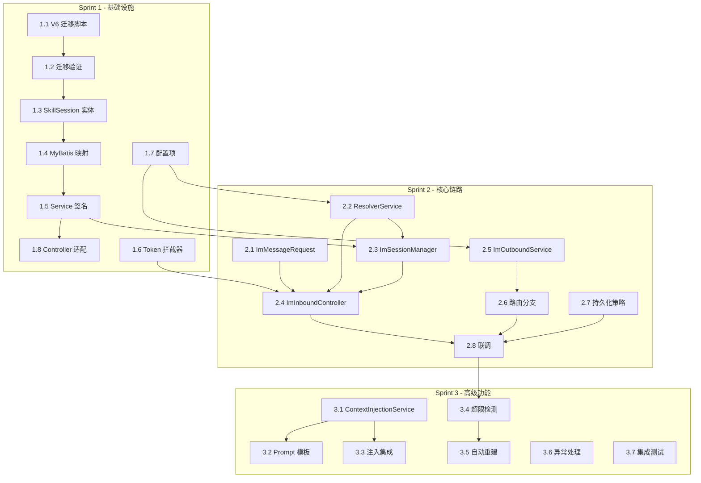

# OpenCode-CUI Phase 2 实施计划

> 基于 [detailed_design.md](./detailed_design.md) 和 [architecture_design.md](./architecture_design.md) 产出。

---

## 一、实施概述

### 1.1 目标

在 skill-server 中实现 **场景二（IM 群聊 @数字分身）** 和 **单聊** 的完整消息收发链路，包括：

- IM 入站 REST 接口（Token 认证 + 消息接收）
- assistantAccount → ak 解析 + Redis 缓存
- 三元组会话自动管理（findOrCreate）
- 群聊上下文注入（Prompt 模板 + 历史消息）
- Agent 回复路由到 IM 出站（区分单聊/群聊双端点）
- 上下文超限自动重建
- 数据库三元组改造 + ENUM → VARCHAR 迁移

### 1.2 约束与前提

- **不涉及 ai-gateway 改动**：所有变更在 skill-server 内完成
- **MySQL 5.7 兼容**：迁移脚本不使用 CTE、窗口函数等 8.0 特性
- **本期不做**：MessageFormatConverter、图片消息、@人字段、ImOutboundMessage 模型
- **IM 平台为外部系统**：我们不控制 IM 客户端和 IM 服务端

---

## 二、实施分期

### Sprint 1：基础设施（预计 3 天）

> **目标**：完成数据库改造和认证层，为后续功能打基础。

| #   | 任务                                           | 产出物                              | 依赖     | 预估工时  |
| --- | ---------------------------------------------- | ----------------------------------- | -------- | --------- |
| 1.1 | 编写 V6 迁移脚本                               | `V6__session_chat_triple.sql`       | 无       | 0.5d      |
| 1.2 | 本地执行迁移脚本并验证                         | 数据库变更验证记录                  | 1.1      | 0.25d     |
| 1.3 | 修改 SkillSession 实体                         | 新增 4 字段，删除 imGroupId         | 1.2      | 0.25d     |
| 1.4 | 修改 SkillSessionRepository（MyBatis 映射）    | insert/select/查询映射              | 1.3      | 0.5d      |
| 1.5 | 修改 SkillSessionService（createSession 签名） | 新签名 + findByDomainSessionIdAndAk | 1.4      | 0.25d     |
| 1.6 | 实现 ImTokenAuthInterceptor + WebMvcConfig     | Token 认证拦截器                    | 无       | 0.5d      |
| 1.7 | 添加配置项（application.yml）                  | im/assistant/context 配置段         | 无       | 0.25d     |
| 1.8 | SkillStreamController 适配新签名               | 场景一入口兼容                      | 1.5      | 0.25d     |
|     |                                                |                                     | **小计** | **2.75d** |

**Sprint 1 交付标准**：
- [x] V6 迁移脚本在本地/测试环境执行成功，旧数据迁移正确
- [x] 场景一（miniapp）功能回归正常
- [x] Token 拦截器对 `/api/inbound/**` 路径生效

---

### Sprint 2：核心链路（预计 4 天）

> **目标**：打通 IM 消息入站 → Agent 处理 → IM 消息出站的完整链路。

| #   | 任务                                         | 产出物                               | 依赖               | 预估工时 |
| --- | -------------------------------------------- | ------------------------------------ | ------------------ | -------- |
| 2.1 | 实现 ImMessageRequest 模型                   | record 定义                          | 无                 | 0.25d    |
| 2.2 | 实现 AssistantAccountResolverService         | 第三方接口调用 + Redis 缓存          | 1.7                | 0.5d     |
| 2.3 | 实现 ImSessionManager（findOrCreateSession） | 三元组查找/创建 + 等待 toolSessionId | 1.5, 2.2           | 1d       |
| 2.4 | 实现 ImInboundController                     | REST 端点 + 调用编排                 | 1.6, 2.1, 2.2, 2.3 | 0.5d     |
| 2.5 | 实现 ImOutboundService（双端点）             | 单聊/群聊 IM API 对接                | 1.7                | 0.5d     |
| 2.6 | 修改 GatewayMessageRouter（路由分支）        | IM 出站路由                          | 2.5                | 0.5d     |
| 2.7 | 修改 MessagePersistenceService（群聊跳过）   | 持久化策略                           | 无                 | 0.25d    |
| 2.8 | 端到端联调（群聊场景）                       | 联调报告                             | 2.1~2.7            | 0.5d     |
|     |                                              |                                      | **小计**           | **4d**   |

**Sprint 2 交付标准**：
- [x] 群聊 @数字分身 → 收到 Agent 回复（文本）
- [x] 单聊发消息 → 收到 Agent 回复（文本）
- [x] 群聊消息不持久化，单聊消息持久化

---

### Sprint 3：高级功能 + 稳定性（预计 3 天）

> **目标**：完成上下文注入、超限重建、异常处理和整体稳定性。

| #   | 任务                                       | 产出物                     | 依赖     | 预估工时 |
| --- | ------------------------------------------ | -------------------------- | -------- | -------- |
| 3.1 | 实现 ContextInjectionService               | Prompt 模板 + 群聊历史注入 | 无       | 0.5d     |
| 3.2 | 编写 group-chat-prompt.txt 模板            | Prompt 模板文件            | 3.1      | 0.25d    |
| 3.3 | ImInboundController 集成上下文注入         | 调用链串联                 | 3.1      | 0.25d    |
| 3.4 | 实现上下文超限检测（ContextOverflowError） | GatewayMessageRouter 增强  | Sprint 2 | 0.5d     |
| 3.5 | 实现 IM 场景自动重建 + 系统提示            | 重建流程 + IM 通知         | 3.4, 2.5 | 0.5d     |
| 3.6 | 异常处理与边界保护                         | 超时、重试、降级           | 全部     | 0.5d     |
| 3.7 | 全场景集成测试                             | 测试报告                   | 全部     | 0.5d     |
|     |                                            |                            | **小计** | **3d**   |

**Sprint 3 交付标准**：
- [x] 群聊带上下文历史回复更准确
- [x] 上下文超限时 IM 场景自动重建并发送提示
- [x] miniapp 场景上下文超限正常通知前端
- [x] 异常情况（第三方接口超时、IM 发送失败等）有合理降级

---

## 三、依赖关系图

---

## 四、风险与缓解

| 风险                           | 影响                                 | 概率 | 缓解措施                                      |
| ------------------------------ | ------------------------------------ | ---- | --------------------------------------------- |
| 第三方 ak 解析接口不稳定       | assistantAccount → ak 失败，消息丢失 | 中   | Redis 缓存 + 合理 TTL + 降级日志              |
| IM 出站 API 返回业务错误       | Agent 回复无法送达用户               | 中   | 解析 error 对象，记录详细日志，后续可加重试   |
| V6 迁移脚本在大表上执行慢      | 长时间锁表影响线上                   | 低   | 在低峰期执行，ENUM→VARCHAR 为 in-place 操作   |
| 并发 findOrCreate 创建重复会话 | 数据不一致                           | 低   | 唯一索引 `idx_biz_domain_session_ak` 保证幂等 |
| toolSessionId 创建超时         | 用户等待过长无响应                   | 低   | 30s 超时 + CompletableFuture 超时异常         |

---

## 五、里程碑与时间线

| 里程碑           | 预计完成时间          | 交付物                                  |
| ---------------- | --------------------- | --------------------------------------- |
| M1: 基础设施就绪 | Sprint 1 结束（D+3）  | DB 迁移完成 + 场景一回归 + Token 拦截器 |
| M2: 核心链路打通 | Sprint 2 结束（D+7）  | 群聊/单聊端到端消息收发                 |
| M3: 全功能交付   | Sprint 3 结束（D+10） | 上下文注入 + 超限重建 + 异常处理        |

**总预估工时**：**~10 个工作日**
