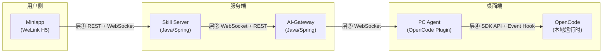
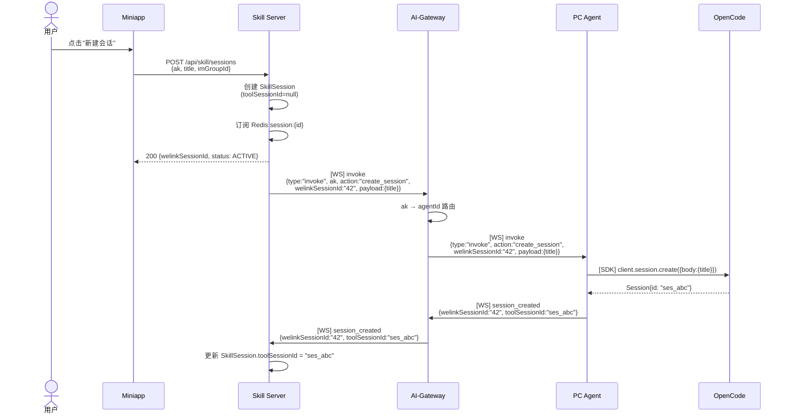
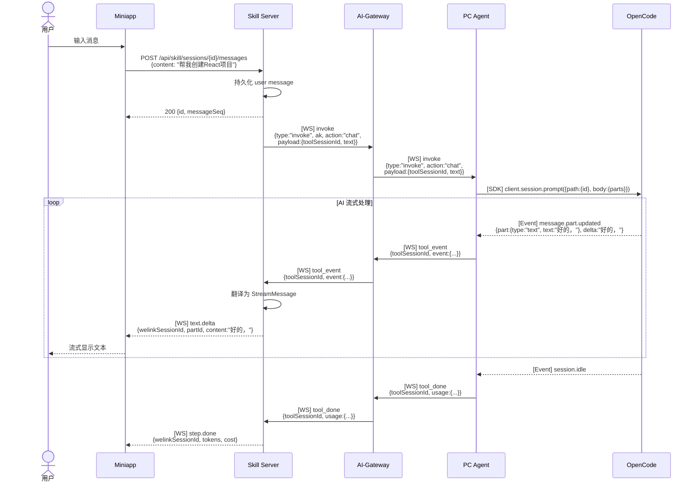
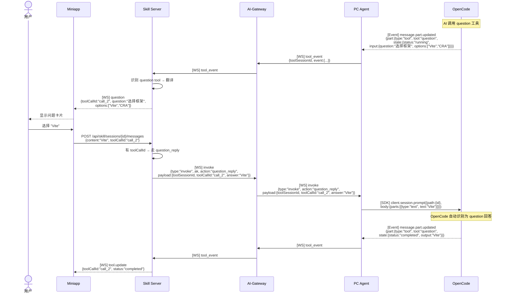
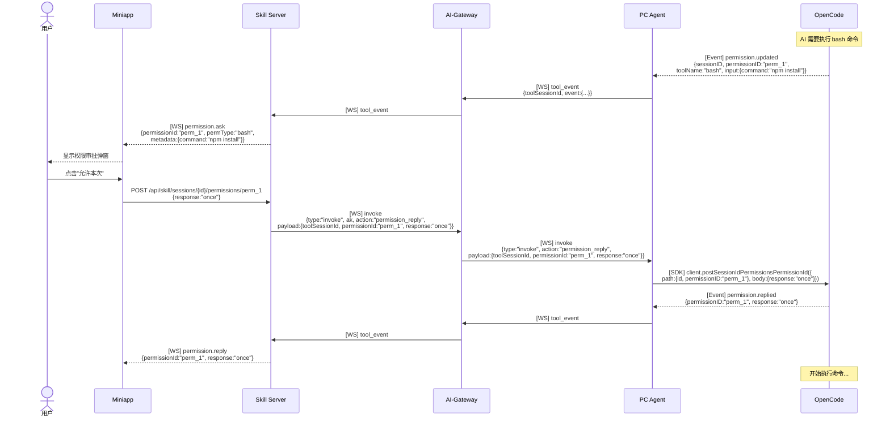
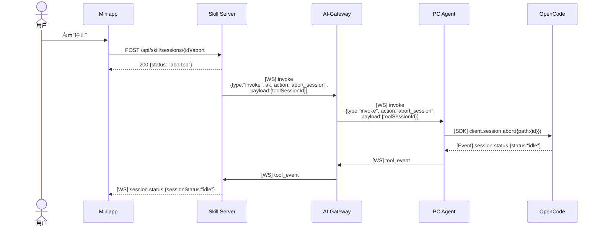
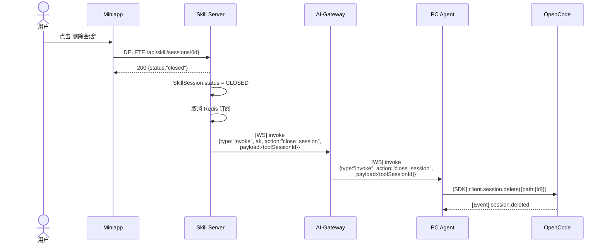
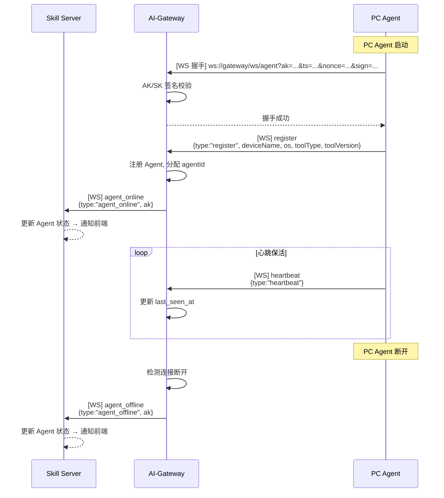
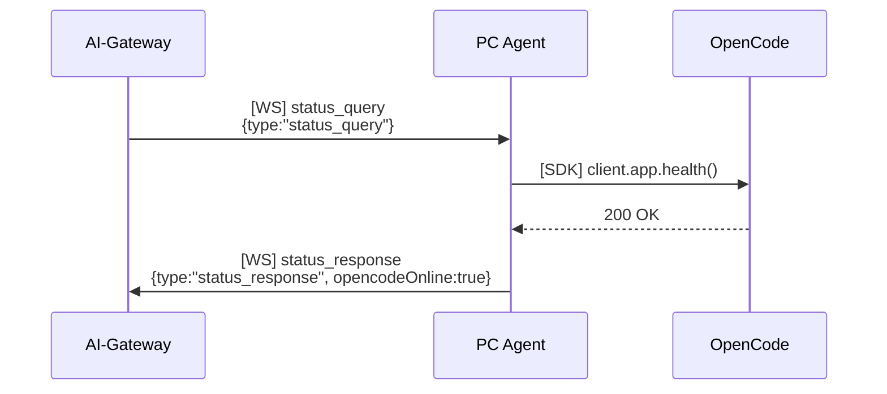
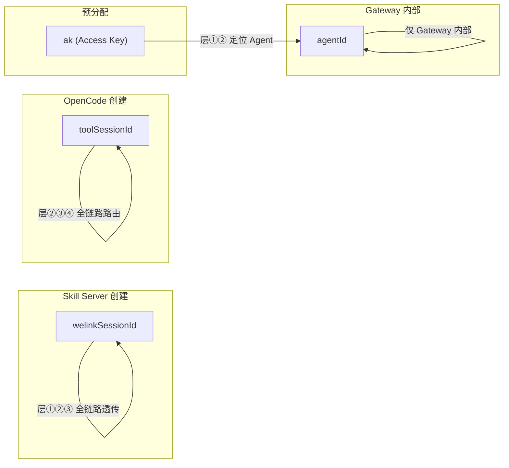

# OpenCode CUI 端到端协议全景

> 版本：1.1  
> 日期：2026-03-08

---

## 系统架构

---

## 四层协议总览

| 层  | 链路                      | 下行（指令方向） | 上行（事件方向）         | 认证             |
| --- | ------------------------- | ---------------- | ------------------------ | ---------------- |
| ①   | Miniapp ↔ Skill Server    | 8 REST API       | 19 种 StreamMessage (WS) | WeLink Cookie    |
| ②   | Skill Server ↔ AI-Gateway | 6 种 invoke (WS) | 6 种事件 (WS) + 3 REST   | 内部 Token       |
| ③   | AI-Gateway ↔ PC Agent     | 7 种消息 (WS)    | 7 种消息 (WS)            | AK/SK 签名       |
| ④   | PC Agent ↔ OpenCode       | 7 SDK 调用       | 17 种事件 + 12 种 Part   | 无（本机进程间） |

---

## 完整流程图

### 流程 1：创建会话

---

### 流程 2：发送消息（含 AI 流式回复）

---

### 流程 3：AI 提问（question tool）+ 用户回答

---

### 流程 4：权限请求 + 用户批准

---

### 流程 5：中止执行

---

### 流程 6：关闭会话

---

### 流程 7：Agent 上线/下线

---

### 流程 8：健康检查

---

## 各层协议消息映射

### 下行映射（指令方向：用户 → AI）

| 用户操作 | 层① Miniapp                                      | 层② Skill→GW              | 层③ GW→Agent              | 层④ Agent→OpenCode                       |
| -------- | ------------------------------------------------ | ------------------------- | ------------------------- | ---------------------------------------- |
| 创建会话 | `POST /sessions`                                 | `invoke.create_session`   | `invoke.create_session`   | `session.create()`                       |
| 发消息   | `POST /sessions/{id}/messages`                   | `invoke.chat`             | `invoke.chat`             | `session.prompt()`                       |
| 回答提问 | `POST /sessions/{id}/messages` (+toolCallId) | `invoke.question_reply`   | `invoke.question_reply`   | `session.prompt()`                       |
| 权限批准 | `POST /sessions/{id}/permissions/{permId}`       | `invoke.permission_reply` | `invoke.permission_reply` | `postSessionIdPermissionsPermissionId()` |
| 中止     | `POST /sessions/{id}/abort`                      | `invoke.abort_session`    | `invoke.abort_session`    | `session.abort()`                        |
| 关闭会话 | `DELETE /sessions/{id}`                          | `invoke.close_session`    | `invoke.close_session`    | `session.delete()`                       |
| 健康检查 | —                                                | REST `GET /agents/status` | `status_query`            | `app.health()`                           |

### 上行映射（事件方向：AI → 用户）

| OpenCode 事件 | 层④ Event                                          | 层③ Agent→GW | 层② GW→Skill    | 层① StreamMessage                  |
| ------------- | -------------------------------------------------- | ------------ | --------------- | ---------------------------------- |
| 文本生成      | `message.part.updated` (part.type=text)        | `tool_event` | `tool_event`    | `text.delta` / `text.done`         |
| 思维链        | `message.part.updated` (part.type=reasoning)   | `tool_event` | `tool_event`    | `thinking.delta` / `thinking.done` |
| 工具调用      | `message.part.updated` (part.type=tool)        | `tool_event` | `tool_event`    | `tool.update`                      |
| AI 提问       | `message.part.updated` (tool=question)         | `tool_event` | `tool_event`    | `question`                         |
| 权限请求      | `permission.updated`                               | `tool_event` | `tool_event`    | `permission.ask`                   |
| 权限响应      | `permission.replied`                               | `tool_event` | `tool_event`    | `permission.reply`                 |
| 会话状态      | `session.status`                                   | `tool_event` | `tool_event`    | `session.status`                   |
| 标题更新      | `session.updated`                                  | `tool_event` | `tool_event`    | `session.title`                    |
| 推理开始      | `message.part.updated` (part.type=step-start)  | `tool_event` | `tool_event`    | `step.start`                       |
| 推理结束      | `message.part.updated` (part.type=step-finish) | `tool_event` | `tool_event`    | `step.done`                        |
| 会话错误      | `session.error`                                    | `tool_event` | `tool_error`    | `session.error`                    |
| 执行完成      | `session.idle`                                     | `tool_done`  | `tool_done`     | `step.done`                        |
| Agent 上线    | —                                                  | `register`   | `agent_online`  | `agent.online`                     |
| Agent 下线    | —                                                  | 连接断开     | `agent_offline` | `agent.offline`                    |

---

## ID 流转全景

| ID                | 创建者       | 感知范围                         | 用途                         |
| ----------------- | ------------ | -------------------------------- | ---------------------------- |
| `welinkSessionId` | Skill Server | 全链路（Skill→GW→Agent→回传）    | 层① 会话标识，其他层原样透传 |
| `toolSessionId`   | OpenCode SDK | Agent→GW→Skill（回传）           | 层②③④ 会话路由               |
| `ak`              | 预分配       | Miniapp / Skill Server / Gateway | 定位 Agent 连接              |
| `agentId`         | Gateway      | 仅 Gateway 内部                  | 内部路由，对外不暴露         |
