# 全链路流程汇总

## 概述

本文档将 01~04 各层级协议文档中的流程汇总到一起，覆盖所有完整业务场景。每个场景从第一个组件到最后一个组件，逐层展开每一步的详细处理。

**组件缩写：**

| 缩写 | 组件 | 说明 |
|------|------|------|
| **MA** | Skill Miniapp | React SPA，端口 3001 |
| **SS** | Skill Server | Spring Boot，端口 8082 |
| **GW** | AI Gateway | Spring Boot，端口 8081 |
| **PL** | Message Bridge Plugin | Bun/TypeScript，OpenCode 插件 |
| **OC** | OpenCode CLI | 本地运行的 AI Agent |

**数据存储标记：**

| 标记 | 说明 |
|------|------|
| `[MySQL:gw]` | Gateway 数据库 `ai_gateway` |
| `[MySQL:ss]` | Skill Server 数据库 `skill_db` |
| `[Redis]` | Redis（localhost:6379，db 0） |
| `[Caffeine]` | 进程内 Caffeine 缓存 |

---

## 场景 1：Agent 注册与上线

Plugin 启动后连接 Gateway，完成认证、注册，直到 Miniapp 收到 Agent 上线通知。

### 时序图

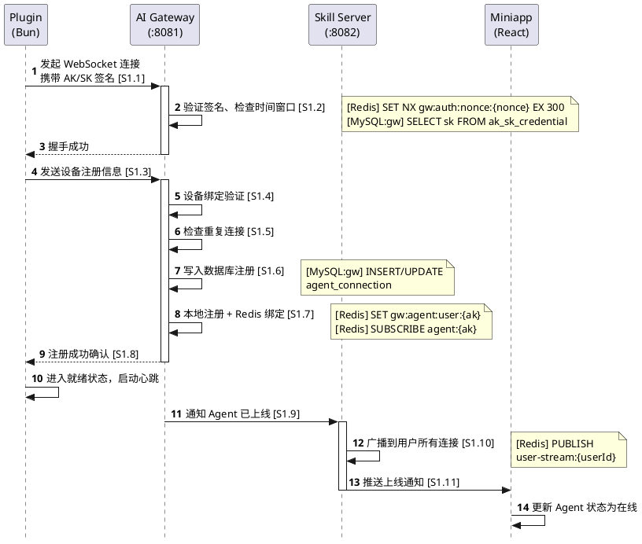
```plantuml
@startuml 场景1_Agent注册与上线
skinparam style strictuml
autonumber

participant "Plugin\n(Bun)" as PL
participant "AI Gateway\n(:8081)" as GW
participant "Skill Server\n(:8082)" as SS
participant "Miniapp\n(React)" as MA

PL -> GW : 发起 WebSocket 连接\n携带 AK/SK 签名 [S1.1]

activate GW
GW -> GW : 验证签名、检查时间窗口 [S1.2]
note right: [Redis] SET NX gw:auth:nonce:{nonce} EX 300\n[MySQL:gw] SELECT sk FROM ak_sk_credential
GW --> PL : 握手成功
deactivate GW

PL -> GW : 发送设备注册信息 [S1.3]

activate GW
GW -> GW : 设备绑定验证 [S1.4]
GW -> GW : 检查重复连接 [S1.5]
GW -> GW : 写入数据库注册 [S1.6]
note right: [MySQL:gw] INSERT/UPDATE\nagent_connection
GW -> GW : 本地注册 + Redis 绑定 [S1.7]
note right: [Redis] SET gw:agent:user:{ak}\n[Redis] SUBSCRIBE agent:{ak}
GW --> PL : 注册成功确认 [S1.8]
deactivate GW

PL -> PL : 进入就绪状态，启动心跳

GW -> SS : 通知 Agent 已上线 [S1.9]
activate SS
SS -> SS : 广播到用户所有连接 [S1.10]
note right: [Redis] PUBLISH\nuser-stream:{userId}
SS -> MA : 推送上线通知 [S1.11]
deactivate SS

MA -> MA : 更新 Agent 状态为在线

@enduml
```

### 详解

#### [S1.1] Plugin 发起 WebSocket 连接

- **组件：** Plugin (GatewayConnection)
- **方法：** `GatewayConnection.connect()` → `new WebSocket(url, [subprotocol])`
- **子协议格式：** `auth.{Base64URL(JSON)}`
- **认证载荷：**
  ```json
  { "ak": "agent-key", "ts": "1710000000", "nonce": "uuid-v4", "sign": "Base64(HMAC-SHA256)" }
  ```
- **签名算法：** `AkSkAuth.generateAuthPayload()` → `HMAC-SHA256(SK, AK + ts + nonce)` → Base64 编码
- **触发条件：** Plugin 启动 / 重连
- **存储操作：** 无

#### [S1.2] Gateway 验证 AK/SK 签名

- **组件：** AI Gateway (AgentWebSocketHandler)
- **方法：** `AgentWebSocketHandler.beforeHandshake()` → `AkSkAuthService.verify(ak, ts, nonce, sign)`
- **处理步骤：**
  1. `AkSkAuthService.verify()` — 时间戳窗口验证：`|now - ts| ≤ 300s`
  2. Nonce 防重放：`Redis SET NX gw:auth:nonce:{nonce} "1" EX 300`
  3. AK 查表：`SQL: SELECT sk, user_id FROM ak_sk_credential WHERE ak = ? AND status = 'ACTIVE'`
  4. 签名计算：`Base64(HMAC-SHA256(sk, ak + ts + nonce))`
  5. 恒定时间比较：`MessageDigest.isEqual(expected, signature)`
- **成功：** 存储 `userId` 和 `akId` 到 WebSocket 会话属性；启动 10s 注册超时计时器
- **失败：** 返回 false，握手失败，连接断开
- **存储操作：** `[Redis]` gw:auth:nonce:{nonce} TTL=300s；`[MySQL:gw]` 查询 ak_sk_credential

#### [S1.3] Plugin 发送设备注册信息

- **组件：** Plugin (GatewayConnection)
- **方法：** `GatewayConnection.onOpen()` → `send({type: "register", ...})`
- **消息格式：**
  ```json
  {
    "type": "register",
    "deviceName": "My-Workstation",
    "macAddress": "AA:BB:CC:DD:EE:FF",
    "os": "linux",
    "toolType": "opencode",
    "toolVersion": "1.4.0"
  }
  ```
- **字段来源：** `deviceName` 来自系统 hostname，`macAddress` 来自网卡，`os` 来自 `process.platform`，`toolType` 来自配置 `gateway.channel`，`toolVersion` 来自 package.json
- **触发条件：** WebSocket 握手成功后立即发送
- **存储操作：** 无

#### [S1.4] Gateway 设备绑定验证

- **组件：** AI Gateway (AgentWebSocketHandler)
- **方法：** `AgentWebSocketHandler.handleRegister()` → `DeviceBindingService.validate(ak, macAddress, toolType)`
- **处理步骤：**
  1. 检查设备绑定功能是否启用（默认未启用）
  2. 未启用 → 直接通过
  3. 服务不可用 → 通过（Fail-Open 策略）
  4. `valid=true` → 通过
  5. `valid=false` → `registerRejected("device_binding_failed")` + `close(4403)`
- **存储操作：** 无

#### [S1.5] Gateway 检查重复连接

- **组件：** AI Gateway (AgentWebSocketHandler)
- **方法：** `EventRelayService.hasAgentSession(ak)`
- **处理步骤：**
  1. 检查内存 Map `agentSessions` 中是否已有该 AK 的会话
  2. 已存在 → `registerRejected("duplicate_connection")` + `close(4409)`
  3. 不存在 → 继续
- **存储操作：** 内存 Map 查询

#### [S1.6] Gateway 写入数据库注册

- **组件：** AI Gateway (AgentWebSocketHandler)
- **方法：** `AgentRegistryService.register(userId, ak, deviceName, macAddress, os, toolType, toolVersion)`
- **处理步骤：**
  1. 查找已有记录（同 ak + toolType）
  2. 已有记录 → `UPDATE status=ONLINE`，更新元数据（deviceName, os, toolVersion, last_seen_at）
  3. 新记录 → `INSERT`（Snowflake ID），状态 ONLINE
- **存储操作：** `[MySQL:gw]` INSERT/UPDATE agent_connection

#### [S1.7] Gateway 本地注册 + Redis 绑定

- **组件：** AI Gateway (AgentWebSocketHandler)
- **方法：** `EventRelayService.registerAgentSession(ak, userId, session)`
- **处理步骤：**
  1. `sessionAkMap[wsSessionId] = ak` — 记录 WS 会话与 AK 的映射
  2. `session.attributes[ATTR_AGENT_ID] = agentId` — 存储数据库 ID
  3. `agentSessions[ak] = session` — 注册到本地 Map
  4. `Redis SET gw:agent:user:{ak} = userId` — AK 与 userId 的映射
  5. `Redis SUBSCRIBE agent:{ak}` — 订阅该 Agent 的消息频道
- **存储操作：** `[Redis]` gw:agent:user:{ak}；`[Redis]` SUBSCRIBE agent:{ak}

#### [S1.8] Gateway 返回注册成功

- **组件：** AI Gateway → Plugin
- **方法：** `AgentWebSocketHandler.handleRegister()` → `sendMessage({type: "register_ok"})`
- **Plugin 处理：** 状态从 CONNECTED 切换到 READY；启动心跳定时器（30s 间隔）
- **存储操作：** 无

#### [S1.9] Gateway 通知 Skill Server Agent 上线

- **组件：** AI Gateway (AgentWebSocketHandler)
- **方法：** `SkillRelayService.relayToSkill(agentOnlineMessage)`
- **消息格式：**
  ```json
  {
    "type": "agent_online",
    "ak": "agent-key",
    "userId": "user-123",
    "toolType": "opencode",
    "toolVersion": "1.4.0"
  }
  ```
- **说明：** 此消息由 Gateway **自动生成**，不是从 Agent 透传
- **存储操作：** 无

#### [S1.10] Skill Server 广播上线通知

- **组件：** Skill Server (GatewayMessageRouter)
- **方法：** `GatewayMessageRouter.handleAgentOnline()` → `broadcastStreamMessage()`
- **处理步骤：**
  1. 构造 `StreamMessage(type="agent.online")`
  2. `SkillStreamHandler.pushStreamMessage()` — 推送到本实例该用户的所有 WS 连接
  3. `RedisMessageBroker.publishToUser(userId, envelope)` — 跨实例推送
- **存储操作：** `[Redis]` PUBLISH user-stream:{userId}

#### [S1.11] Miniapp 收到上线通知

- **组件：** Miniapp (useSkillStream)
- **方法：** WebSocket `onMessage` → `setAgentStatus('online')`
- **处理步骤：**
  1. 收到 `StreamMessage(type="agent.online")`
  2. 调用 `setAgentStatus('online')` 更新 Agent 状态
  3. `useAgentSelector` 若只有 1 个 Agent 且未选择 → 自动选择
- **存储操作：** 无

---

## 场景 2：创建会话（Miniapp 发起）

用户在 Miniapp 创建新会话，Skill Server 创建本地记录后请求 Plugin 通过 OpenCode SDK 创建远端会话，最终 toolSessionId 回填。

### 时序图

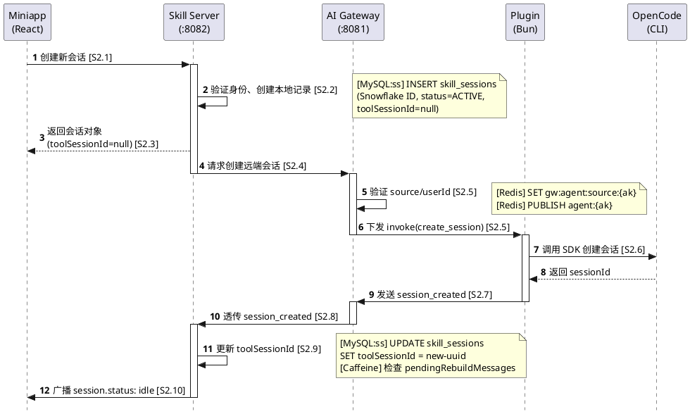
```plantuml
@startuml 场景2_创建会话
skinparam style strictuml
autonumber

participant "Miniapp\n(React)" as MA
participant "Skill Server\n(:8082)" as SS
participant "AI Gateway\n(:8081)" as GW
participant "Plugin\n(Bun)" as PL
participant "OpenCode\n(CLI)" as OC

MA -> SS : 创建新会话 [S2.1]
activate SS
SS -> SS : 验证身份、创建本地记录 [S2.2]
note right: [MySQL:ss] INSERT skill_sessions\n(Snowflake ID, status=ACTIVE,\ntoolSessionId=null)
SS --> MA : 返回会话对象\n(toolSessionId=null) [S2.3]

SS -> GW : 请求创建远端会话 [S2.4]
deactivate SS

activate GW
GW -> GW : 验证 source/userId [S2.5]
note right: [Redis] SET gw:agent:source:{ak}\n[Redis] PUBLISH agent:{ak}
GW -> PL : 下发 invoke(create_session) [S2.5]
deactivate GW

activate PL
PL -> OC : 调用 SDK 创建会话 [S2.6]
OC --> PL : 返回 sessionId
PL -> GW : 发送 session_created [S2.7]
deactivate PL

activate GW
GW -> SS : 透传 session_created [S2.8]
deactivate GW

activate SS
SS -> SS : 更新 toolSessionId [S2.9]
note right: [MySQL:ss] UPDATE skill_sessions\nSET toolSessionId = new-uuid\n[Caffeine] 检查 pendingRebuildMessages
SS -> MA : 广播 session.status: idle [S2.10]
deactivate SS

@enduml
```

### 详解

#### [S2.1] Miniapp 发起创建会话请求

- **组件：** Miniapp (useSkillSession)
- **方法：** `POST /api/skill/sessions`
- **请求体：**
  ```json
  { "ak": "agent-access-key", "title": "会话标题", "imGroupId": "im-group-123" }
  ```
- **字段说明：** `ak` 必需，`title` 和 `imGroupId` 可选
- **存储操作：** 无

#### [S2.2] Skill Server 验证身份并创建本地记录

- **组件：** Skill Server (SkillSessionController)
- **方法：** `SkillSessionController.createSession()` → `SkillSessionService.createSession()`
- **处理步骤：**
  1. 从 cookie 提取 `userId`
  2. 生成 Snowflake ID
  3. 创建 `SkillSession` 记录：`status=ACTIVE`, `toolSessionId=null`, `businessSessionDomain=miniapp`
- **存储操作：** `[MySQL:ss]` INSERT skill_sessions

#### [S2.3] Skill Server 返回会话对象

- **组件：** Skill Server → Miniapp
- **方法：** HTTP 200 响应
- **说明：** 此时 `toolSessionId` 为 null，远端会话尚未创建
- **存储操作：** 无

#### [S2.4] Skill Server 发送 invoke(create_session) 到 Gateway

- **组件：** Skill Server (GatewayRelayService)
- **方法：** `GatewayRelayService.sendInvokeToGateway()` → `GatewayWSClient.send(invokeMessage)`
- **消息格式：**
  ```json
  {
    "type": "invoke",
    "ak": "agent-key",
    "userId": "owner-welink-id",
    "welinkSessionId": "12345",
    "source": "skill-server",
    "action": "create_session",
    "payload": "{\"title\":\"会话标题\"}"
  }
  ```
- **存储操作：** 无

#### [S2.5] Gateway 验证并下发到 Plugin

- **组件：** AI Gateway (SkillRelayService)
- **方法：** `SkillRelayService.handleInvokeFromSkill(session, message)`
- **处理步骤：**
  1. 验证 `source` 非空且匹配绑定的 source
  2. 验证 `userId` 与 `Redis gw:agent:user:{ak}` 匹配
  3. `Redis SET gw:agent:source:{ak} = source` — 绑定 agent source
  4. `Redis PUBLISH agent:{ak} = message.withoutRoutingContext()` — 剥离 userId 和 source 后发布
- **存储操作：** `[Redis]` gw:agent:source:{ak}；`[Redis]` PUBLISH agent:{ak}

#### [S2.6] Plugin 调用 OpenCode SDK 创建会话

- **组件：** Plugin (CreateSessionAction)
- **方法：** `CreateSessionAction.execute()` → `client.session.create({body: payload})`
- **SDK 调用：** `POST /session`
- **sessionId 提取优先级：** `response.sessionId` → `response.id` → `response.data.sessionId` → `response.data.id`
- **存储操作：** 无

#### [S2.7] Plugin 发送 session_created 到 Gateway

- **组件：** Plugin (CreateSessionAction)
- **方法：** `gatewayConnection.send(sessionCreatedMessage)`
- **消息格式：**
  ```json
  {
    "type": "session_created",
    "welinkSessionId": "12345",
    "toolSessionId": "new-opencode-session-uuid",
    "session": { "sessionId": "new-opencode-session-uuid" }
  }
  ```
- **存储操作：** 无

#### [S2.8] Gateway 透传 session_created 到 Skill Server

- **组件：** AI Gateway (EventRelayService)
- **方法：** `EventRelayService.relayToSkillServer(ak, message)` → `SkillRelayService.relayToSkill(message)`
- **处理步骤：** 注入 `ak`, `userId`, `source` 后透传
- **存储操作：** 无

#### [S2.9] Skill Server 更新 toolSessionId

- **组件：** Skill Server (GatewayMessageRouter)
- **方法：** `GatewayMessageRouter.handleSessionCreated()` → `sessionService.updateToolSessionId(numericSessionId, toolSessionId)`
- **处理步骤：**
  1. 查找 SkillSession（by welinkSessionId）
  2. 更新 `toolSessionId` 为新值
  3. 检查 `pendingRebuildMessages`（此场景无 pending）
- **存储操作：** `[MySQL:ss]` UPDATE skill_sessions；`[Caffeine]` 检查 pendingRebuildMessages

#### [S2.10] Skill Server 广播会话就绪状态

- **组件：** Skill Server (GatewayMessageRouter)
- **方法：** `broadcastStreamMessage(sessionId, userId, StreamMessage(type=session.status, sessionStatus=idle))`
- **处理步骤：**
  1. 构造 `StreamMessage(type="session.status", sessionStatus="idle")`
  2. 本地 WS 推送 + Redis PUBLISH
- **存储操作：** `[Redis]` PUBLISH user-stream:{userId}

---

## 场景 3：用户发送消息并获得 AI 回复（核心流程）

最完整的业务链路，涵盖文本流、思考过程、工具调用、步骤统计四种子事件类型。

### 3.0 公共部分：消息发送到 OpenCode 开始执行

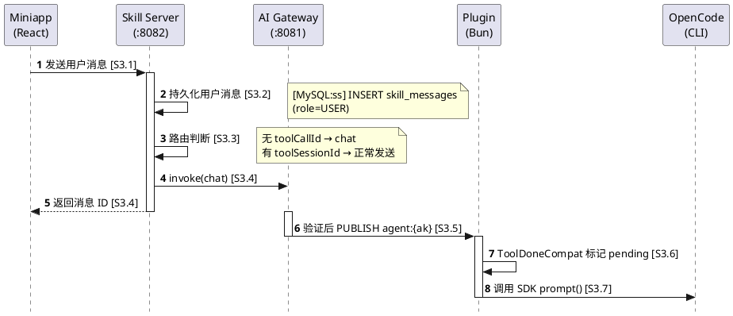
```plantuml
@startuml 场景3_消息发送公共部分
skinparam style strictuml
autonumber

participant "Miniapp\n(React)" as MA
participant "Skill Server\n(:8082)" as SS
participant "AI Gateway\n(:8081)" as GW
participant "Plugin\n(Bun)" as PL
participant "OpenCode\n(CLI)" as OC

MA -> SS : 发送用户消息 [S3.1]
activate SS
SS -> SS : 持久化用户消息 [S3.2]
note right: [MySQL:ss] INSERT skill_messages\n(role=USER)
SS -> SS : 路由判断 [S3.3]
note right: 无 toolCallId → chat\n有 toolSessionId → 正常发送
SS -> GW : invoke(chat) [S3.4]
SS --> MA : 返回消息 ID [S3.4]
deactivate SS

activate GW
GW -> PL : 验证后 PUBLISH agent:{ak} [S3.5]
deactivate GW

activate PL
PL -> PL : ToolDoneCompat 标记 pending [S3.6]
PL -> OC : 调用 SDK prompt() [S3.7]
deactivate PL

@enduml
```

### 详解（公共部分）

#### [S3.1] Miniapp 发送用户消息

- **组件：** Miniapp (useSkillStream)
- **方法：** `sendMessage(content)` → `POST /api/skill/sessions/{sessionId}/messages`
- **请求体：**
  ```json
  { "content": "用户消息文本" }
  ```
- **Miniapp 乐观更新：**
  1. 创建临时 user 消息（临时 ID）立即显示
  2. POST 发送消息
  3. 替换临时 ID 为服务端返回的真实 `messageId`
  4. 将 `messageId` 加入 `knownUserMessageIdsRef`（防回显去重）
- **存储操作：** 无

#### [S3.2] Skill Server 持久化用户消息

- **组件：** Skill Server (SkillMessageController)
- **方法：** `SkillMessageController.sendMessage()` → `SkillMessageService.saveUserMessage()`
- **存储操作：** `[MySQL:ss]` INSERT skill_messages (role=USER)

#### [S3.3] Skill Server 路由判断

- **组件：** Skill Server (SkillMessageController)
- **方法：** `SkillMessageController.sendMessage()`
- **路由规则：**
  - 无 `toolCallId` → 动作为 `chat`，payload = `{text, toolSessionId}`
  - 有 `toolCallId` → 动作为 `question_reply`，payload = `{answer, toolCallId, toolSessionId}`
  - 无 `toolSessionId` → 触发 Session 重建流程（见场景 8）
- **存储操作：** 无

#### [S3.4] Skill Server 发送 invoke(chat) 到 Gateway

- **组件：** Skill Server (GatewayRelayService)
- **方法：** `GatewayRelayService.sendInvokeToGateway(invokeCommand)`
- **消息格式：**
  ```json
  {
    "type": "invoke",
    "ak": "agent-key",
    "userId": "owner-welink-id",
    "welinkSessionId": "12345",
    "source": "skill-server",
    "action": "chat",
    "payload": "{\"text\":\"你好\",\"toolSessionId\":\"xxx\"}"
  }
  ```
- **存储操作：** 无

#### [S3.5] Gateway 验证并下发 invoke 到 Plugin

- **组件：** AI Gateway (SkillRelayService)
- **方法：** `SkillRelayService.handleInvokeFromSkill()` → `Redis PUBLISH agent:{ak}`
- **处理步骤：** 同 [S2.5]，验证 source/userId 匹配后 PUBLISH，下发时 `withoutRoutingContext()`
- **存储操作：** `[Redis]` PUBLISH agent:{ak}

#### [S3.6] Plugin ToolDoneCompat 标记 pending

- **组件：** Plugin (BridgeRuntime)
- **方法：** `ToolDoneCompat.handleInvokeStarted(toolSessionId)`
- **处理步骤：** `pendingPromptSessions.add(toolSessionId)` — 标记该会话有正在执行的 chat
- **存储操作：** 内存 Set

#### [S3.7] Plugin 调用 OpenCode SDK prompt

- **组件：** Plugin (ChatAction)
- **方法：** `ChatAction.execute()` → `client.session.prompt({path: {id: toolSessionId}, body: {parts: [{type: 'text', text}]}})`
- **SDK 调用：** `POST /session/{id}/prompt`
- **说明：** `prompt()` 是异步的，结果通过 OpenCode 事件流返回
- **存储操作：** 无

---

### 3a. 思考过程（thinking.delta → thinking.done）

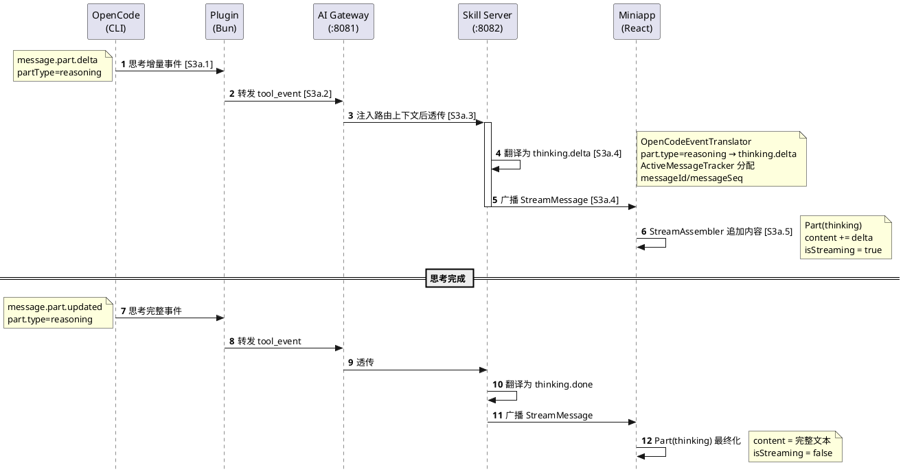
```plantuml
@startuml 场景3a_思考过程
skinparam style strictuml
autonumber

participant "OpenCode\n(CLI)" as OC
participant "Plugin\n(Bun)" as PL
participant "AI Gateway\n(:8081)" as GW
participant "Skill Server\n(:8082)" as SS
participant "Miniapp\n(React)" as MA

OC -> PL : 思考增量事件 [S3a.1]
note left: message.part.delta\npartType=reasoning

PL -> GW : 转发 tool_event [S3a.2]

GW -> SS : 注入路由上下文后透传 [S3a.3]

activate SS
SS -> SS : 翻译为 thinking.delta [S3a.4]
note right: OpenCodeEventTranslator\npart.type=reasoning → thinking.delta\nActiveMessageTracker 分配\nmessageId/messageSeq
SS -> MA : 广播 StreamMessage [S3a.4]
deactivate SS

MA -> MA : StreamAssembler 追加内容 [S3a.5]
note right: Part(thinking)\ncontent += delta\nisStreaming = true

== 思考完成 ==

OC -> PL : 思考完整事件
note left: message.part.updated\npart.type=reasoning

PL -> GW : 转发 tool_event
GW -> SS : 透传
SS -> SS : 翻译为 thinking.done
SS -> MA : 广播 StreamMessage

MA -> MA : Part(thinking) 最终化
note right: content = 完整文本\nisStreaming = false

@enduml
```

### 详解（场景 3a）

#### [S3a.1] OpenCode 产生思考增量事件

- **组件：** OpenCode CLI
- **事件类型：** `message.part.delta`
- **事件格式：**
  ```json
  {
    "type": "message.part.delta",
    "properties": {
      "sessionID": "session-uuid",
      "messageID": "msg-001",
      "partID": "part-reasoning-001",
      "delta": "让我分析一下..."
    }
  }
  ```
- **说明：** Claude Extended Thinking 产生推理过程时触发
- **存储操作：** 无

#### [S3a.2] Plugin 转发 tool_event

- **组件：** Plugin (BridgeRuntime)
- **方法：** `BridgeRuntime.handleEvent()` → `gatewayConnection.send({type: "tool_event", toolSessionId, event: raw})`
- **处理步骤：**
  1. `UpstreamEventExtractor.extract(rawEvent)` — 提取 common 和 extra 信息
  2. 检查连接状态为 READY
  3. 检查事件在 allowlist 中
  4. 构建 `tool_event` 消息，`event` 字段保留原始事件完整透传
- **存储操作：** 无

#### [S3a.3] Gateway 注入路由上下文后透传

- **组件：** AI Gateway (EventRelayService)
- **方法：** `EventRelayService.relayToSkillServer(ak, message)`
- **处理步骤：**
  1. `message.ensureTraceId()` — 若无 traceId 则生成
  2. 注入 `userId`（从 `Redis gw:agent:user:{ak}`）
  3. 注入 `source`（从 `Redis gw:agent:source:{ak}`）
  4. `SkillRelayService.relayToSkill(message)` — 通过 Skill WS link 发送
- **存储操作：** 无

#### [S3a.4] Skill Server 翻译为 thinking.delta 并广播

- **组件：** Skill Server (GatewayMessageRouter + OpenCodeEventTranslator)
- **方法：** `GatewayMessageRouter.handleToolEvent()` → `OpenCodeEventTranslator.translate(event, sessionId)`
- **翻译规则：** `message.part.delta` + `partType=reasoning` → `StreamMessage(type="thinking.delta")`
- **处理步骤：**
  1. 通过 toolSessionId 或 welinkSessionId 查找 SkillSession
  2. 激活空闲会话（若 session.status == IDLE → ACTIVE）
  3. `ActiveMessageTracker` 分配 messageId / messageSeq / role
  4. 广播：本地 WS 推送 + Redis PUBLISH
- **存储操作：** 无（delta 不持久化）

#### [S3a.5] Miniapp StreamAssembler 处理思考增量

- **组件：** Miniapp (StreamAssembler)
- **方法：** `StreamAssembler.handleMessage(msg)` → 获取/创建 Part(type=thinking)
- **处理步骤：**
  1. 获取/创建 `partId` 对应的 MessagePart（type=thinking）
  2. 追加 `content` 到该 Part
  3. 标记 `isStreaming = true`
  4. 更新 `activeMessageIdsRef`
  5. 触发 UI 重渲染
- **存储操作：** 无

---

### 3b. 文本流（text.delta → text.done）

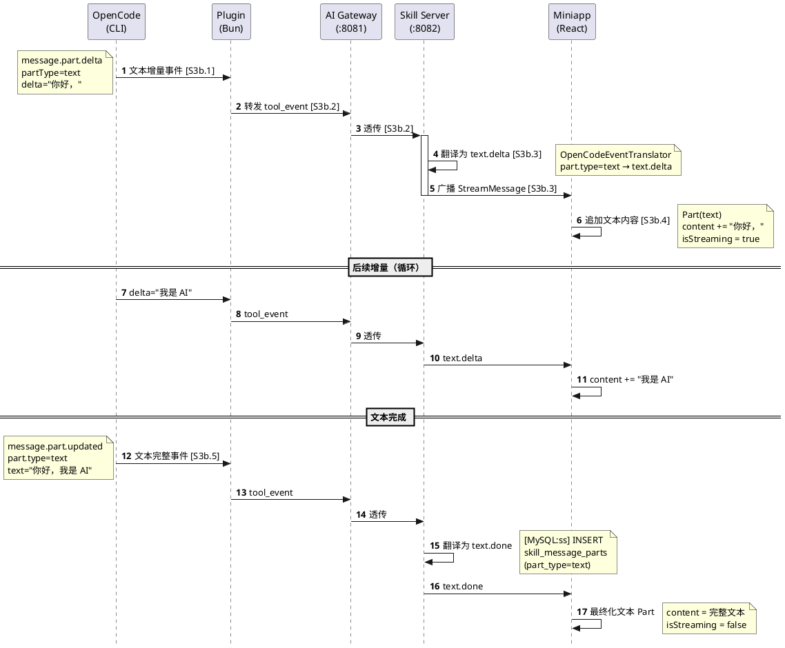
```plantuml
@startuml 场景3b_文本流
skinparam style strictuml
autonumber

participant "OpenCode\n(CLI)" as OC
participant "Plugin\n(Bun)" as PL
participant "AI Gateway\n(:8081)" as GW
participant "Skill Server\n(:8082)" as SS
participant "Miniapp\n(React)" as MA

OC -> PL : 文本增量事件 [S3b.1]
note left: message.part.delta\npartType=text\ndelta="你好，"

PL -> GW : 转发 tool_event [S3b.2]
GW -> SS : 透传 [S3b.2]

activate SS
SS -> SS : 翻译为 text.delta [S3b.3]
note right: OpenCodeEventTranslator\npart.type=text → text.delta
SS -> MA : 广播 StreamMessage [S3b.3]
deactivate SS

MA -> MA : 追加文本内容 [S3b.4]
note right: Part(text)\ncontent += "你好，"\nisStreaming = true

== 后续增量（循环） ==

OC -> PL : delta="我是 AI"
PL -> GW : tool_event
GW -> SS : 透传
SS -> MA : text.delta
MA -> MA : content += "我是 AI"

== 文本完成 ==

OC -> PL : 文本完整事件 [S3b.5]
note left: message.part.updated\npart.type=text\ntext="你好，我是 AI"

PL -> GW : tool_event
GW -> SS : 透传
SS -> SS : 翻译为 text.done
note right: [MySQL:ss] INSERT\nskill_message_parts\n(part_type=text)
SS -> MA : text.done

MA -> MA : 最终化文本 Part
note right: content = 完整文本\nisStreaming = false

@enduml
```

### 详解（场景 3b）

#### [S3b.1] OpenCode 产生文本增量事件

- **组件：** OpenCode CLI
- **事件类型：** `message.part.delta`
- **事件格式：**
  ```json
  {
    "type": "message.part.delta",
    "properties": { "sessionID": "...", "messageID": "msg-001", "partID": "part-text-001", "delta": "你好，" }
  }
  ```
- **存储操作：** 无

#### [S3b.2] Plugin 转发 → Gateway 透传

- **组件：** Plugin → AI Gateway → Skill Server
- **方法：** 同 [S3a.2] 和 [S3a.3]
- **存储操作：** 无

#### [S3b.3] Skill Server 翻译为 text.delta 并广播

- **组件：** Skill Server (OpenCodeEventTranslator)
- **翻译规则：** `message.part.delta` + `partType=text` → `StreamMessage(type="text.delta", content="你好，")`
- **说明：** delta 映射为 `content` 字段；delta 不持久化
- **存储操作：** 无

#### [S3b.4] Miniapp StreamAssembler 追加文本

- **组件：** Miniapp (StreamAssembler)
- **方法：** `StreamAssembler.handleMessage(msg)` → 获取/创建 Part(type=text)
- **处理步骤：** 追加 `content` → 标记 `isStreaming = true` → 触发 UI 重渲染
- **存储操作：** 无

#### [S3b.5] 文本完成并持久化

- **组件：** OpenCode → Plugin → Gateway → Skill Server → Miniapp
- **事件类型：** `message.part.updated`（part.type=text）
- **Skill Server 翻译规则：** `message.part.updated` + `part.type=text` → `StreamMessage(type="text.done", content="完整文本")`
- **Skill Server 持久化：** `MessagePersistenceService` → INSERT skill_message_parts (part_type=text)
- **Miniapp 处理：** 若 `msg.content` 存在 → 替换为完整内容；标记 `isStreaming = false`
- **存储操作：** `[MySQL:ss]` INSERT skill_message_parts

---

### 3c. 工具调用（tool.update: pending → running → completed）

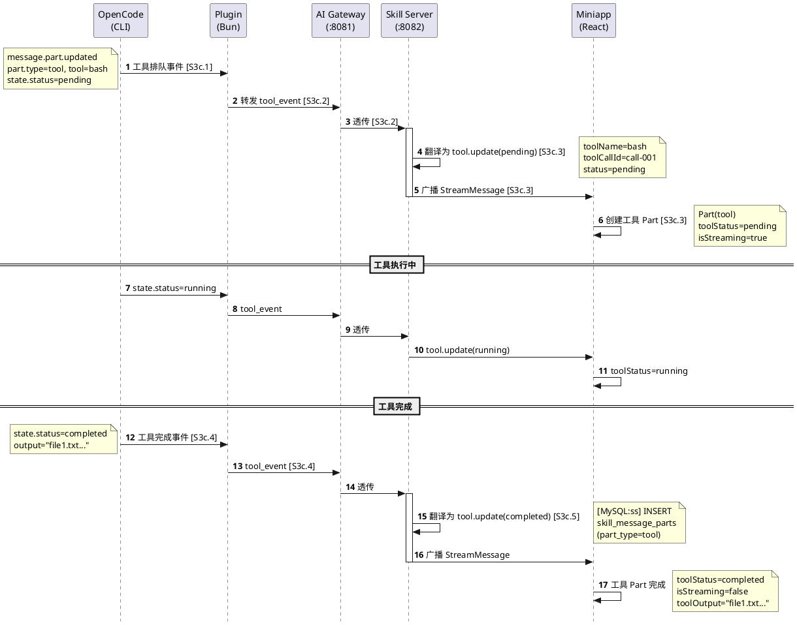
```plantuml
@startuml 场景3c_工具调用
skinparam style strictuml
autonumber

participant "OpenCode\n(CLI)" as OC
participant "Plugin\n(Bun)" as PL
participant "AI Gateway\n(:8081)" as GW
participant "Skill Server\n(:8082)" as SS
participant "Miniapp\n(React)" as MA

OC -> PL : 工具排队事件 [S3c.1]
note left: message.part.updated\npart.type=tool, tool=bash\nstate.status=pending

PL -> GW : 转发 tool_event [S3c.2]
GW -> SS : 透传 [S3c.2]

activate SS
SS -> SS : 翻译为 tool.update(pending) [S3c.3]
note right: toolName=bash\ntoolCallId=call-001\nstatus=pending
SS -> MA : 广播 StreamMessage [S3c.3]
deactivate SS

MA -> MA : 创建工具 Part [S3c.3]
note right: Part(tool)\ntoolStatus=pending\nisStreaming=true

== 工具执行中 ==

OC -> PL : state.status=running
PL -> GW : tool_event
GW -> SS : 透传
SS -> MA : tool.update(running)
MA -> MA : toolStatus=running

== 工具完成 ==

OC -> PL : 工具完成事件 [S3c.4]
note left: state.status=completed\noutput="file1.txt..."

PL -> GW : tool_event [S3c.4]
GW -> SS : 透传

activate SS
SS -> SS : 翻译为 tool.update(completed) [S3c.5]
note right: [MySQL:ss] INSERT\nskill_message_parts\n(part_type=tool)
SS -> MA : 广播 StreamMessage
deactivate SS

MA -> MA : 工具 Part 完成
note right: toolStatus=completed\nisStreaming=false\ntoolOutput="file1.txt..."

@enduml
```

### 详解（场景 3c）

#### [S3c.1] OpenCode 产生工具排队事件

- **组件：** OpenCode CLI
- **事件类型：** `message.part.updated`（part.type=tool）
- **事件格式：**
  ```json
  {
    "type": "message.part.updated",
    "properties": {
      "part": {
        "id": "part-tool-001", "type": "tool", "tool": "bash", "callID": "call-001",
        "state": { "status": "pending", "input": {"command": "ls -la"}, "title": "Execute: ls -la" }
      }
    }
  }
  ```
- **存储操作：** 无

#### [S3c.2] Plugin 转发 → Gateway 透传

- **组件：** Plugin → AI Gateway → Skill Server
- **方法：** 同 [S3a.2] 和 [S3a.3]
- **存储操作：** 无

#### [S3c.3] Skill Server 翻译为 tool.update 并广播

- **组件：** Skill Server (OpenCodeEventTranslator)
- **翻译规则：** `message.part.updated` + `part.type=tool` + `toolName!="question"` → `StreamMessage(type="tool.update")`
- **字段映射：**
  - `part.tool` → `toolName`
  - `part.callID` → `toolCallId`
  - `state.status` → `status`
  - `state.input` → `input`
  - `state.output` → `output`
  - `state.title` → `title`
- **Miniapp 处理：** 创建 Part(type=tool)，`isStreaming = (status === 'pending' || status === 'running')`
- **存储操作：** pending/running 不持久化

#### [S3c.4] OpenCode 工具执行完成

- **组件：** OpenCode CLI
- **事件类型：** `message.part.updated`（state.status=completed）
- **新增字段：** `output`（工具输出结果）、`title`（工具执行标题）
- **存储操作：** 无

#### [S3c.5] Skill Server 持久化工具结果

- **组件：** Skill Server (MessagePersistenceService)
- **方法：** `MessagePersistenceService.savePart()` — 仅 completed/error 状态持久化
- **存储操作：** `[MySQL:ss]` INSERT skill_message_parts (part_type=tool)

---

### 3d. 步骤统计（step.start → step.done）

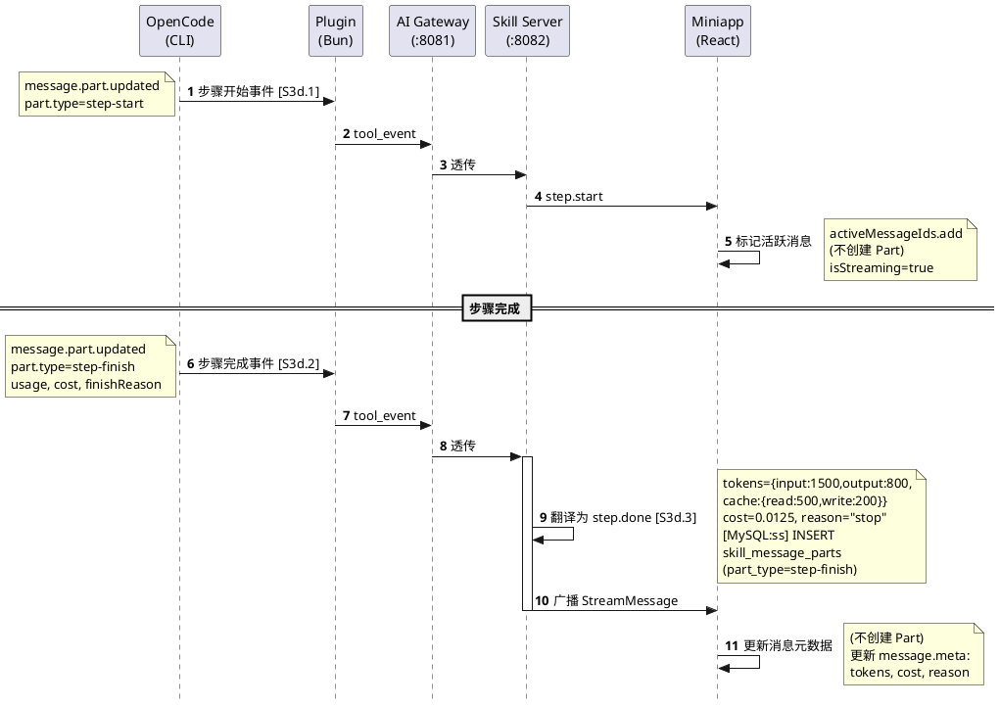
```plantuml
@startuml 场景3d_步骤统计
skinparam style strictuml
autonumber

participant "OpenCode\n(CLI)" as OC
participant "Plugin\n(Bun)" as PL
participant "AI Gateway\n(:8081)" as GW
participant "Skill Server\n(:8082)" as SS
participant "Miniapp\n(React)" as MA

OC -> PL : 步骤开始事件 [S3d.1]
note left: message.part.updated\npart.type=step-start

PL -> GW : tool_event
GW -> SS : 透传
SS -> MA : step.start
MA -> MA : 标记活跃消息
note right: activeMessageIds.add\n(不创建 Part)\nisStreaming=true

== 步骤完成 ==

OC -> PL : 步骤完成事件 [S3d.2]
note left: message.part.updated\npart.type=step-finish\nusage, cost, finishReason

PL -> GW : tool_event
GW -> SS : 透传

activate SS
SS -> SS : 翻译为 step.done [S3d.3]
note right: tokens={input:1500,output:800,\ncache:{read:500,write:200}}\ncost=0.0125, reason="stop"\n[MySQL:ss] INSERT\nskill_message_parts\n(part_type=step-finish)
SS -> MA : 广播 StreamMessage
deactivate SS

MA -> MA : 更新消息元数据
note right: (不创建 Part)\n更新 message.meta:\ntokens, cost, reason

@enduml
```

### 详解（场景 3d）

#### [S3d.1] OpenCode 步骤开始

- **组件：** OpenCode CLI → Plugin → Gateway → Skill Server → Miniapp
- **事件类型：** `message.part.updated`（part.type=step-start）
- **Skill Server 翻译：** → `StreamMessage(type="step.start")`
- **Miniapp 处理：** **不创建 MessagePart**，仅将 `messageId` 加入 `activeMessageIdsRef`，设置 `isStreaming = true`
- **存储操作：** 无

#### [S3d.2] OpenCode 步骤完成（含 Token 统计）

- **组件：** OpenCode CLI
- **事件类型：** `message.part.updated`（part.type=step-finish）
- **事件格式：**
  ```json
  {
    "type": "message.part.updated",
    "properties": {
      "part": {
        "type": "step-finish",
        "usage": { "inputTokens": 1500, "outputTokens": 800, "cacheReadInputTokens": 500, "cacheCreationInputTokens": 200 },
        "cost": 0.0125,
        "finishReason": "stop"
      }
    }
  }
  ```
- **存储操作：** 无

#### [S3d.3] Skill Server 翻译为 step.done 并持久化

- **组件：** Skill Server (OpenCodeEventTranslator)
- **翻译规则：** `message.part.updated` + `part.type=step-finish` → `StreamMessage(type="step.done")`
- **字段映射：**
  - `usage.inputTokens` → `tokens.input`
  - `usage.outputTokens` → `tokens.output`
  - `usage.cacheReadInputTokens` → `tokens.cache.read`
  - `usage.cacheCreationInputTokens` → `tokens.cache.write`
  - `cost` → `cost`
  - `finishReason` → `reason`
- **Miniapp 处理：** **不创建 MessagePart**，更新 `message.meta` 中的 `tokens, cost, reason`
- **存储操作：** `[MySQL:ss]` INSERT skill_message_parts (part_type=step-finish)

---

### 3e. 完成流程（tool_done）

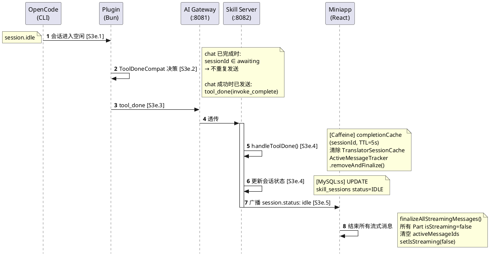
```plantuml
@startuml 场景3e_完成流程
skinparam style strictuml
autonumber

participant "OpenCode\n(CLI)" as OC
participant "Plugin\n(Bun)" as PL
participant "AI Gateway\n(:8081)" as GW
participant "Skill Server\n(:8082)" as SS
participant "Miniapp\n(React)" as MA

OC -> PL : 会话进入空闲 [S3e.1]
note left: session.idle

PL -> PL : ToolDoneCompat 决策 [S3e.2]
note right: chat 已完成时:\nsessionId ∈ awaiting\n→ 不重复发送\n\nchat 成功时已发送:\ntool_done(invoke_complete)

PL -> GW : tool_done [S3e.3]
GW -> SS : 透传

activate SS
SS -> SS : handleToolDone() [S3e.4]
note right: [Caffeine] completionCache\n(sessionId, TTL=5s)\n清除 TranslatorSessionCache\nActiveMessageTracker\n.removeAndFinalize()

SS -> SS : 更新会话状态 [S3e.4]
note right: [MySQL:ss] UPDATE\nskill_sessions status=IDLE

SS -> MA : 广播 session.status: idle [S3e.5]
deactivate SS

MA -> MA : 结束所有流式消息
note right: finalizeAllStreamingMessages()\n所有 Part isStreaming=false\n清空 activeMessageIds\nsetIsStreaming(false)

@enduml
```

### 详解（场景 3e）

#### [S3e.1] OpenCode 会话进入空闲

- **组件：** OpenCode CLI
- **事件类型：** `session.idle`
- **说明：** 专门的空闲事件，Plugin 同时将其作为 `tool_event` 转发，并用于触发 `tool_done` 的兜底发送逻辑
- **存储操作：** 无

#### [S3e.2] Plugin ToolDoneCompat 决策

- **组件：** Plugin (ToolDoneCompat)
- **方法：** `ToolDoneCompat.handleSessionIdle(toolSessionId)`
- **决策逻辑：**
  - `sessionId ∈ pending` → 不发送（chat 还在执行）
  - `sessionId ∈ awaiting` → `awaiting.delete(sessionId)` → 不发送（已由 `invoke_complete` 发过）
  - `sessionId ∉ pending ∧ awaiting` → 发送 `tool_done`（source: session_idle）
- **说明：** chat 成功完成时，`ToolDoneCompat.handleInvokeCompleted()` 已立即发送 `tool_done(source: invoke_complete)`
- **存储操作：** 内存 Set

#### [S3e.3] Plugin 发送 tool_done 到 Gateway

- **组件：** Plugin (BridgeRuntime)
- **方法：** `gatewayConnection.send({type: "tool_done", toolSessionId, welinkSessionId})`
- **存储操作：** 无

#### [S3e.4] Skill Server 处理 tool_done

- **组件：** Skill Server (GatewayMessageRouter)
- **方法：** `GatewayMessageRouter.handleToolDone()`
- **处理步骤：**
  1. `[Caffeine]` PUT completionCache(sessionId, TTL=5s) — 后续迟到 tool_event 将被抑制（question/permission 除外）
  2. 清除 `TranslatorSessionCache(sessionId)`
  3. `ActiveMessageTracker.removeAndFinalize(sessionId)` — 结束当前活跃 assistant 消息
  4. 更新 `SkillSession.status = IDLE`
  5. 检查 `pendingRebuildMessages`（若有 pending → 自动发 chat invoke）
- **存储操作：** `[Caffeine]` completionCache；`[MySQL:ss]` UPDATE skill_sessions

#### [S3e.5] Miniapp 结束所有流式消息

- **组件：** Miniapp (useSkillStream)
- **方法：** 收到 `StreamMessage(type="session.status", sessionStatus="idle")` → `finalizeAllStreamingMessages()`
- **处理步骤：**
  1. 遍历所有活跃 `assemblerRef`
  2. 每个 assembler 调用 `complete()` → 所有 Part `isStreaming = false`
  3. 清空 `activeMessageIdsRef`
  4. `setIsStreaming(false)`
- **存储操作：** 无

---

## 场景 4：交互式提问与回答

OpenCode 需要用户确认（如文件操作）时的完整交互流程。

### 时序图

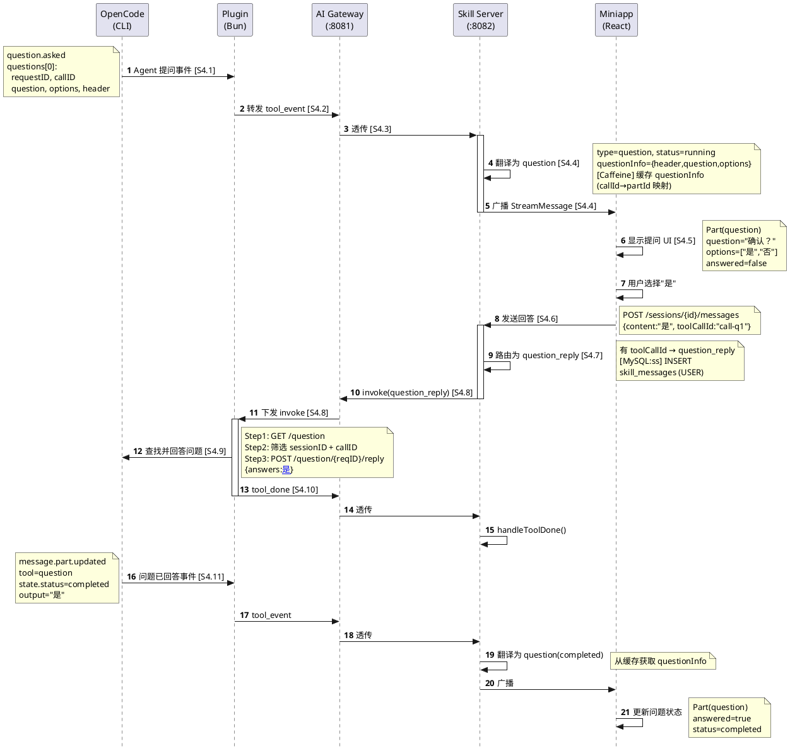
```plantuml
@startuml 场景4_交互式提问与回答
skinparam style strictuml
autonumber

participant "OpenCode\n(CLI)" as OC
participant "Plugin\n(Bun)" as PL
participant "AI Gateway\n(:8081)" as GW
participant "Skill Server\n(:8082)" as SS
participant "Miniapp\n(React)" as MA

OC -> PL : Agent 提问事件 [S4.1]
note left: question.asked\nquestions[0]:\n  requestID, callID\n  question, options, header

PL -> GW : 转发 tool_event [S4.2]
GW -> SS : 透传 [S4.3]

activate SS
SS -> SS : 翻译为 question [S4.4]
note right: type=question, status=running\nquestionInfo={header,question,options}\n[Caffeine] 缓存 questionInfo\n(callId→partId 映射)
SS -> MA : 广播 StreamMessage [S4.4]
deactivate SS

MA -> MA : 显示提问 UI [S4.5]
note right: Part(question)\nquestion="确认？"\noptions=["是","否"]\nanswered=false

MA -> MA : 用户选择"是"

MA -> SS : 发送回答 [S4.6]
note right: POST /sessions/{id}/messages\n{content:"是", toolCallId:"call-q1"}

activate SS
SS -> SS : 路由为 question_reply [S4.7]
note right: 有 toolCallId → question_reply\n[MySQL:ss] INSERT\nskill_messages (USER)
SS -> GW : invoke(question_reply) [S4.8]
deactivate SS

GW -> PL : 下发 invoke [S4.8]

activate PL
PL -> OC : 查找并回答问题 [S4.9]
note right: Step1: GET /question\nStep2: 筛选 sessionID + callID\nStep3: POST /question/{reqID}/reply\n{answers:[["是"]]}

PL -> GW : tool_done [S4.10]
deactivate PL
GW -> SS : 透传
SS -> SS : handleToolDone()

OC -> PL : 问题已回答事件 [S4.11]
note left: message.part.updated\ntool=question\nstate.status=completed\noutput="是"

PL -> GW : tool_event
GW -> SS : 透传
SS -> SS : 翻译为 question(completed)
note right: 从缓存获取 questionInfo
SS -> MA : 广播

MA -> MA : 更新问题状态
note right: Part(question)\nanswered=true\nstatus=completed

@enduml
```

### 详解

#### [S4.1] OpenCode 发起提问

- **组件：** OpenCode CLI
- **事件类型：** `question.asked`
- **事件格式：**
  ```json
  {
    "type": "question.asked",
    "properties": {
      "sessionID": "session-uuid",
      "questions": [{
        "requestID": "req-001",
        "tool": { "callID": "call-q1" },
        "question": "你确定要删除这个文件吗？",
        "options": ["是", "否"],
        "header": "确认操作"
      }]
    }
  }
  ```
- **说明：** `questions` 是数组但通常只有一个元素，Plugin 取 `questions[0]`；`options` 是 `List<String>`（不是对象数组）
- **存储操作：** 无

#### [S4.2] Plugin 转发 tool_event

- **组件：** Plugin (BridgeRuntime)
- **方法：** 同 [S3a.2]，构建 `tool_event` 并发送
- **存储操作：** 无

#### [S4.3] Gateway 透传到 Skill Server

- **组件：** AI Gateway (EventRelayService)
- **方法：** 同 [S3a.3]
- **存储操作：** 无

#### [S4.4] Skill Server 翻译为 question 并广播

- **组件：** Skill Server (OpenCodeEventTranslator)
- **方法：** `OpenCodeEventTranslator.translateQuestionAsked(event, sessionId)`
- **翻译结果：**
  ```json
  {
    "type": "question",
    "toolName": "question",
    "toolCallId": "call-q1",
    "status": "running",
    "header": "确认操作",
    "question": "你确定要删除这个文件吗？",
    "options": ["是", "否"]
  }
  ```
- **缓存：** `[Caffeine]` 缓存 questionInfo（用于后续 completed 时恢复）+ callId→partId 映射（防重复创建 Part）
- **存储操作：** `[Caffeine]` questionInfo 缓存

#### [S4.5] Miniapp 显示提问 UI

- **组件：** Miniapp (StreamAssembler)
- **方法：** `StreamAssembler.handleMessage(msg)` → 创建 Part(type=question)
- **处理步骤：**
  1. 创建 Part(type=question)
  2. 提取 `header, question, options`
  3. `content = question` 文本
  4. `isStreaming = false`（问题立即显示完整）
  5. `answered = false`
- **存储操作：** 无

#### [S4.6] 用户选择答案并发送

- **组件：** Miniapp (useSkillStream)
- **方法：** `sendMessage("是", { toolCallId: "call-q1" })` → `POST /api/skill/sessions/{id}/messages`
- **请求体：**
  ```json
  { "content": "是", "toolCallId": "call-q1" }
  ```
- **存储操作：** 无

#### [S4.7] Skill Server 路由为 question_reply

- **组件：** Skill Server (SkillMessageController)
- **方法：** `SkillMessageController.sendMessage()` — 检测到 `toolCallId` 存在，路由为 `question_reply`
- **处理步骤：**
  1. 持久化用户消息
  2. 构造 `invoke(action=question_reply, payload={answer, toolCallId, toolSessionId})`
- **存储操作：** `[MySQL:ss]` INSERT skill_messages (role=USER)

#### [S4.8] Skill Server 发送 invoke(question_reply) 到 Plugin

- **组件：** Skill Server → AI Gateway → Plugin
- **方法：** `GatewayRelayService.sendInvokeToGateway()` → Gateway PUBLISH → Plugin 收到
- **Payload：**
  ```json
  { "answer": "是", "toolCallId": "call-q1", "toolSessionId": "opencode-session-uuid" }
  ```
- **存储操作：** 无

#### [S4.9] Plugin 执行 QuestionReplyAction

- **组件：** Plugin (QuestionReplyAction)
- **方法：** `QuestionReplyAction.execute(payload)`
- **处理步骤：**
  1. `GET /question` — 获取所有待答问题列表
  2. 筛选 `sessionID === toolSessionId`
  3. 若有 `toolCallId` → 精确匹配 `tool.callID`；若无 → 仅唯一匹配时使用
  4. 未找到 → 返回 `INVALID_PAYLOAD` 错误
  5. `POST /question/{requestID}/reply` → `{answers: [["是"]]}`
- **说明：** `answers` 是二维数组，第一层对应多个问题，第二层对应多个答案选项
- **存储操作：** 无

#### [S4.10] Plugin 发送 tool_done

- **组件：** Plugin (BridgeRuntime)
- **方法：** `ToolDoneCompat.handleInvokeCompleted()` → `gatewayConnection.send({type: "tool_done", ...})`
- **存储操作：** 无

#### [S4.11] OpenCode 发出问题已回答事件

- **组件：** OpenCode CLI → Plugin → Gateway → Skill Server → Miniapp
- **事件类型：** `message.part.updated`（part.type=tool, tool=question, state.status=completed）
- **Skill Server 翻译：** `question` 工具 + `completed/error` 状态 → `StreamMessage(type="question", status="completed")`
- **翻译细节：** 从 Caffeine 缓存获取 questionInfo；`output = normalizeQuestionAnswerOutput(state.output, input)`
- **Miniapp 处理：** `Part(question)` → `answered = true`, `status = completed`
- **存储操作：** 无

---

## 场景 5：权限请求与授权

OpenCode 需要执行受保护操作（如写文件）时的权限授权流程。

### 时序图

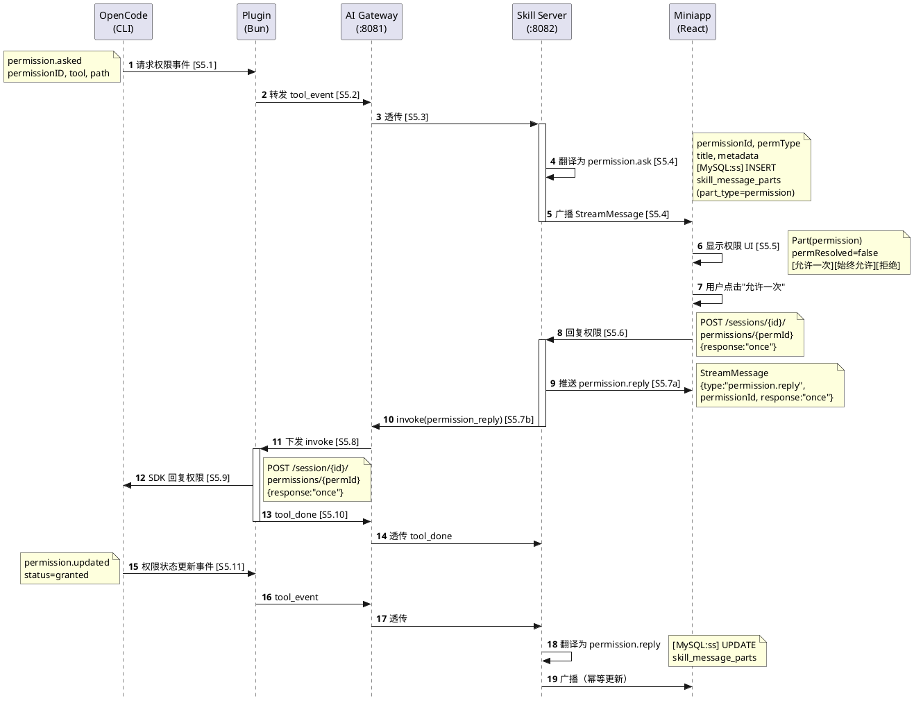
```plantuml
@startuml 场景5_权限请求与授权
skinparam style strictuml
autonumber

participant "OpenCode\n(CLI)" as OC
participant "Plugin\n(Bun)" as PL
participant "AI Gateway\n(:8081)" as GW
participant "Skill Server\n(:8082)" as SS
participant "Miniapp\n(React)" as MA

OC -> PL : 请求权限事件 [S5.1]
note left: permission.asked\npermissionID, tool, path

PL -> GW : 转发 tool_event [S5.2]
GW -> SS : 透传 [S5.3]

activate SS
SS -> SS : 翻译为 permission.ask [S5.4]
note right: permissionId, permType\ntitle, metadata\n[MySQL:ss] INSERT\nskill_message_parts\n(part_type=permission)
SS -> MA : 广播 StreamMessage [S5.4]
deactivate SS

MA -> MA : 显示权限 UI [S5.5]
note right: Part(permission)\npermResolved=false\n[允许一次][始终允许][拒绝]

MA -> MA : 用户点击"允许一次"

MA -> SS : 回复权限 [S5.6]
note right: POST /sessions/{id}/\npermissions/{permId}\n{response:"once"}

activate SS
SS -> MA : 推送 permission.reply [S5.7a]
note right: StreamMessage\n{type:"permission.reply",\npermissionId, response:"once"}

SS -> GW : invoke(permission_reply) [S5.7b]
deactivate SS

GW -> PL : 下发 invoke [S5.8]

activate PL
PL -> OC : SDK 回复权限 [S5.9]
note right: POST /session/{id}/\npermissions/{permId}\n{response:"once"}
PL -> GW : tool_done [S5.10]
deactivate PL

GW -> SS : 透传 tool_done

OC -> PL : 权限状态更新事件 [S5.11]
note left: permission.updated\nstatus=granted

PL -> GW : tool_event
GW -> SS : 透传
SS -> SS : 翻译为 permission.reply
note right: [MySQL:ss] UPDATE\nskill_message_parts
SS -> MA : 广播（幂等更新）

@enduml
```

### 详解

#### [S5.1] OpenCode 请求权限

- **组件：** OpenCode CLI
- **事件类型：** `permission.asked`
- **事件格式：**
  ```json
  {
    "type": "permission.asked",
    "properties": {
      "sessionID": "session-uuid",
      "permissionID": "perm-001",
      "tool": "write",
      "path": "/src/main.ts",
      "operation": "write"
    }
  }
  ```
- **存储操作：** 无

#### [S5.2] Plugin 转发 tool_event

- **组件：** Plugin (BridgeRuntime)
- **方法：** 同 [S3a.2]
- **存储操作：** 无

#### [S5.3] Gateway 透传到 Skill Server

- **组件：** AI Gateway (EventRelayService)
- **方法：** 同 [S3a.3]
- **存储操作：** 无

#### [S5.4] Skill Server 翻译为 permission.ask 并广播

- **组件：** Skill Server (GatewayMessageRouter)
- **方法：** `GatewayMessageRouter.handleToolEvent()` → `OpenCodeEventTranslator.translate()`
- **翻译结果：**
  ```json
  {
    "type": "permission.ask",
    "permissionId": "perm-001",
    "permType": "write",
    "toolName": "write",
    "title": "write /src/main.ts",
    "metadata": { "path": "/src/main.ts", "operation": "write" }
  }
  ```
- **存储操作：** `[MySQL:ss]` INSERT skill_message_parts (part_type=permission)

#### [S5.5] Miniapp 显示权限 UI

- **组件：** Miniapp (StreamAssembler)
- **方法：** `StreamAssembler.handleMessage(msg)` → 创建 Part(type=permission)
- **处理步骤：** 设置 `permissionId, permType, toolName`；`content = msg.title`；`permResolved = false`；`isStreaming = false`
- **UI 显示：** 三个按钮："允许一次"、"始终允许"、"拒绝"
- **存储操作：** 无

#### [S5.6] 用户回复权限

- **组件：** Miniapp (useSkillStream)
- **方法：** `replyPermission(permId, 'once')` → `POST /api/skill/sessions/{id}/permissions/{permId}`
- **请求体：** `{ "response": "once" }`
- **response 取值：** `"once"` — 本次允许；`"always"` — 始终允许；`"reject"` — 拒绝
- **存储操作：** 无

#### [S5.7a] Skill Server 推送 permission.reply 到前端

- **组件：** Skill Server (SkillSessionController)
- **方法：** `SkillSessionController.replyPermission()` → `pushStreamMessage(permission.reply)`
- **说明：** 与 [S5.7b] 的 invoke 并行执行
- **Miniapp 处理：** `Part(permission)` → `permResolved = true`, `permissionResponse = "once"`
- **存储操作：** 无

#### [S5.7b] Skill Server 发送 invoke(permission_reply) 到 Gateway

- **组件：** Skill Server (GatewayRelayService)
- **方法：** `GatewayRelayService.sendInvokeToGateway()`
- **Payload：**
  ```json
  { "permissionId": "perm-001", "response": "once", "toolSessionId": "opencode-session-uuid" }
  ```
- **存储操作：** 无

#### [S5.8] Gateway 下发 invoke 到 Plugin

- **组件：** AI Gateway
- **方法：** 同 [S2.5]，PUBLISH agent:{ak}
- **存储操作：** 无

#### [S5.9] Plugin 执行 PermissionReplyAction

- **组件：** Plugin (PermissionReplyAction)
- **方法：** `PermissionReplyAction.execute()` → `client.postSessionIdPermissionsPermissionId({path: {id, permissionID}, body: {response}})`
- **SDK 调用：** `POST /session/{id}/permissions/{permissionId}` → `{response: "once"}`
- **存储操作：** 无

#### [S5.10] Plugin 发送 tool_done

- **组件：** Plugin (BridgeRuntime)
- **方法：** 同 [S4.10]
- **存储操作：** 无

#### [S5.11] OpenCode 权限状态更新

- **组件：** OpenCode CLI → Plugin → Gateway → Skill Server → Miniapp
- **事件类型：** `permission.updated`（status=granted, response=once）
- **Skill Server 翻译：** → `StreamMessage(type="permission.reply")`
- **Skill Server 持久化：** `[MySQL:ss]` UPDATE skill_message_parts
- **Miniapp 处理：** 幂等更新（若前端已通过 [S5.7a] 收到，则为重复更新）
- **存储操作：** `[MySQL:ss]` UPDATE skill_message_parts

---

## 场景 6：会话完成（tool_done 流程）

OpenCode 处理完毕进入空闲状态，Plugin 决策并发送 tool_done 的完整流程。

### 时序图

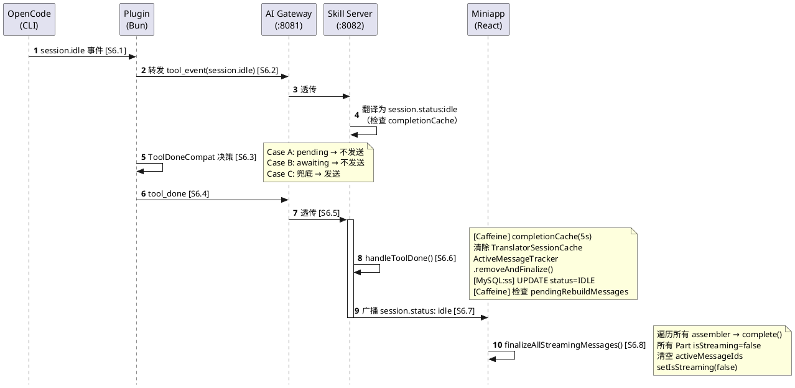
```plantuml
@startuml 场景6_会话完成
skinparam style strictuml
autonumber

participant "OpenCode\n(CLI)" as OC
participant "Plugin\n(Bun)" as PL
participant "AI Gateway\n(:8081)" as GW
participant "Skill Server\n(:8082)" as SS
participant "Miniapp\n(React)" as MA

OC -> PL : session.idle 事件 [S6.1]

PL -> GW : 转发 tool_event(session.idle) [S6.2]
GW -> SS : 透传
SS -> SS : 翻译为 session.status:idle\n（检查 completionCache）

PL -> PL : ToolDoneCompat 决策 [S6.3]
note right: Case A: pending → 不发送\nCase B: awaiting → 不发送\nCase C: 兜底 → 发送

PL -> GW : tool_done [S6.4]

GW -> SS : 透传 [S6.5]

activate SS
SS -> SS : handleToolDone() [S6.6]
note right: [Caffeine] completionCache(5s)\n清除 TranslatorSessionCache\nActiveMessageTracker\n.removeAndFinalize()\n[MySQL:ss] UPDATE status=IDLE\n[Caffeine] 检查 pendingRebuildMessages

SS -> MA : 广播 session.status: idle [S6.7]
deactivate SS

MA -> MA : finalizeAllStreamingMessages() [S6.8]
note right: 遍历所有 assembler → complete()\n所有 Part isStreaming=false\n清空 activeMessageIds\nsetIsStreaming(false)

@enduml
```

### 详解

#### [S6.1] OpenCode session.idle 事件

- **组件：** OpenCode CLI
- **事件类型：** `session.idle`
- **说明：** 专门的空闲事件，与 `session.status(idle)` 不同，Plugin 用此事件触发 `tool_done` 兜底逻辑
- **存储操作：** 无

#### [S6.2] Plugin 转发 tool_event

- **组件：** Plugin (BridgeRuntime)
- **方法：** `BridgeRuntime.handleEvent()` → `gatewayConnection.send({type: "tool_event", event: raw})`
- **说明：** session.idle 也作为 tool_event 转发给 Gateway
- **存储操作：** 无

#### [S6.3] Plugin ToolDoneCompat 决策

- **组件：** Plugin (ToolDoneCompat)
- **方法：** `ToolDoneCompat.handleSessionIdle(toolSessionId)`
- **三种情况：**
  - **Case A:** `sessionId ∈ pendingPromptSessions` → 不发送（chat 还在执行）
  - **Case B:** `sessionId ∈ completedSessionsAwaitingIdleDrop` → `awaiting.delete(sessionId)` → 不发送（已由 `invoke_complete` 发过）
  - **Case C:** `sessionId ∉ pending ∧ awaiting` → 发送 `tool_done`（source: session_idle）
- **存储操作：** 内存 Set

#### [S6.4] Plugin 发送 tool_done

- **组件：** Plugin (BridgeRuntime)
- **方法：** `gatewayConnection.send({type: "tool_done", toolSessionId, welinkSessionId})`
- **存储操作：** 无

#### [S6.5] Gateway 透传 tool_done

- **组件：** AI Gateway (EventRelayService)
- **方法：** 同 [S3a.3]，注入路由上下文后透传
- **存储操作：** 无

#### [S6.6] Skill Server handleToolDone()

- **组件：** Skill Server (GatewayMessageRouter)
- **方法：** `GatewayMessageRouter.handleToolDone()`
- **处理步骤：**
  1. `[Caffeine]` PUT completionCache(sessionId, TTL=5s) — 后续迟到 tool_event 被抑制（question/permission 除外）
  2. 清除 `TranslatorSessionCache(sessionId)`
  3. `ActiveMessageTracker.removeAndFinalize(sessionId)` — 结束活跃 assistant 消息
  4. `[MySQL:ss]` UPDATE skill_sessions status=IDLE
  5. `[Caffeine]` 检查 pendingRebuildMessages → 若有 pending → 自动发 chat invoke
- **存储操作：** `[Caffeine]` completionCache；`[MySQL:ss]` UPDATE skill_sessions

#### [S6.7] Skill Server 广播 idle 状态

- **组件：** Skill Server (GatewayMessageRouter)
- **方法：** `broadcastStreamMessage(sessionId, userId, StreamMessage(type=session.status, sessionStatus=idle))`
- **存储操作：** `[Redis]` PUBLISH user-stream:{userId}

#### [S6.8] Miniapp finalizeAllStreamingMessages()

- **组件：** Miniapp (useSkillStream)
- **方法：** `finalizeAllStreamingMessages()`
- **处理步骤：**
  1. 遍历所有活跃 `assemblerRef`
  2. 每个 assembler 调用 `complete()` → 所有 Part `isStreaming = false`
  3. 清空 `activeMessageIdsRef`
  4. `setIsStreaming(false)`
- **存储操作：** 无

---

## 场景 7：IM 入站消息完整流程

外部 IM 系统向系统发送消息，经过认证、解析、上下文注入，到 AI 回复，再通过 IM 出站返回。

### 时序图

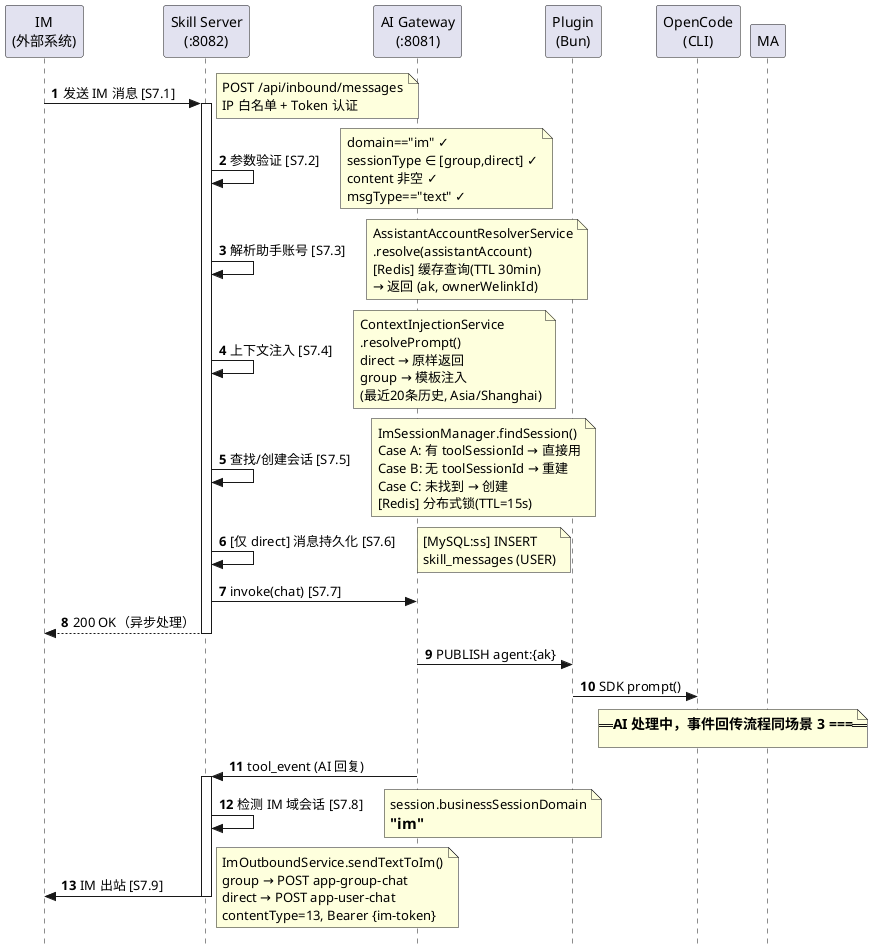
```plantuml
@startuml 场景7_IM入站消息
skinparam style strictuml
autonumber

participant "IM\n(外部系统)" as IM
participant "Skill Server\n(:8082)" as SS
participant "AI Gateway\n(:8081)" as GW
participant "Plugin\n(Bun)" as PL
participant "OpenCode\n(CLI)" as OC

IM -> SS : 发送 IM 消息 [S7.1]
note right: POST /api/inbound/messages\nIP 白名单 + Token 认证

activate SS
SS -> SS : 参数验证 [S7.2]
note right: domain=="im" ✓\nsessionType ∈ [group,direct] ✓\ncontent 非空 ✓\nmsgType=="text" ✓

SS -> SS : 解析助手账号 [S7.3]
note right: AssistantAccountResolverService\n.resolve(assistantAccount)\n[Redis] 缓存查询(TTL 30min)\n→ 返回 (ak, ownerWelinkId)

SS -> SS : 上下文注入 [S7.4]
note right: ContextInjectionService\n.resolvePrompt()\ndirect → 原样返回\ngroup → 模板注入\n(最近20条历史, Asia/Shanghai)

SS -> SS : 查找/创建会话 [S7.5]
note right: ImSessionManager.findSession()\nCase A: 有 toolSessionId → 直接用\nCase B: 无 toolSessionId → 重建\nCase C: 未找到 → 创建\n[Redis] 分布式锁(TTL=15s)

SS -> SS : [仅 direct] 消息持久化 [S7.6]
note right: [MySQL:ss] INSERT\nskill_messages (USER)

SS -> GW : invoke(chat) [S7.7]
SS --> IM : 200 OK（异步处理）
deactivate SS

GW -> PL : PUBLISH agent:{ak}
PL -> OC : SDK prompt()

note over OC, MA: ===== AI 处理中，事件回传流程同场景 3 =====

GW -> SS : tool_event (AI 回复)
activate SS
SS -> SS : 检测 IM 域会话 [S7.8]
note right: session.businessSessionDomain\n== "im"

SS -> IM : IM 出站 [S7.9]
deactivate SS
note right: ImOutboundService.sendTextToIm()\ngroup → POST app-group-chat\ndirect → POST app-user-chat\ncontentType=13, Bearer {im-token}

@enduml
```

### 详解

#### [S7.1] IM 发送入站消息

- **组件：** IM 外部系统 → Skill Server
- **方法：** `POST /api/inbound/messages`
- **认证：** IP 白名单 + `ImTokenAuthInterceptor`
- **请求体：**
  ```json
  {
    "businessDomain": "im",
    "sessionType": "group",
    "sessionId": "im-chat-12345",
    "assistantAccount": "ai-bot-account",
    "content": "今天天气如何？",
    "msgType": "text",
    "chatHistory": [
      { "senderAccount": "user001", "senderName": "张三", "content": "上午好", "timestamp": 1710000000 }
    ]
  }
  ```
- **存储操作：** 无

#### [S7.2] Skill Server 参数验证

- **组件：** Skill Server (ImInboundController)
- **方法：** `ImInboundController.receiveMessage()`
- **验证规则：** `businessDomain == "im"`；`sessionType ∈ ["group", "direct"]`；`content` 非空；`msgType == "text"`
- **存储操作：** 无

#### [S7.3] 解析助手账号

- **组件：** Skill Server (AssistantAccountResolverService)
- **方法：** `AssistantAccountResolverService.resolve(assistantAccount)`
- **处理步骤：**
  1. Redis 缓存查询（TTL 30min）
  2. 缓存未命中 → `HTTP GET {resolveUrl}?partnerAccount={account}`
  3. 返回 `(ak, ownerWelinkId)`
- **存储操作：** `[Redis]` 缓存 TTL=30min

#### [S7.4] 上下文注入

- **组件：** Skill Server (ContextInjectionService)
- **方法：** `ContextInjectionService.resolvePrompt(sessionType, content, chatHistory)`
- **处理步骤：**
  - `direct` 会话 → 原样返回 `content`
  - `group` 会话：
    1. 加载模板 `classpath:templates/group-chat-prompt.txt`
    2. 格式化历史（最近 20 条）：`"[2024-03-20 10:30:00] 张三: 上午好"`（自动检测秒级/毫秒级时间戳，Asia/Shanghai 时区）
    3. 替换占位符 `{{chatHistory}}` + `{{currentMessage}}`
    4. 返回完整 prompt
- **存储操作：** 无

#### [S7.5] 查找/创建会话

- **组件：** Skill Server (ImSessionManager)
- **方法：** `ImSessionManager.findSession(domain, type, sessionId, ak)`
- **三种情况：**
  - **Case A:** 找到且有 `toolSessionId` → 直接使用
  - **Case B:** 找到但无 `toolSessionId` → 触发 Session 重建（见场景 8）
  - **Case C:** 未找到 → 创建：
    1. `Redis` 分布式锁：`skill:session:create:{domain}:{type}:{sessionId}:{ak}`（TTL=15s，重试间隔=100ms）
    2. 二次检查（防并发）
    3. 创建 `SkillSession(userId=ownerWelinkId, domain=im, type=group/direct)`
    4. 缓存 pending 消息
    5. 发送 `create_session` 到 Gateway → 等待 `session_created`（后续同场景 2 [S2.6]~[S2.9]）
- **存储操作：** `[MySQL:ss]` INSERT skill_sessions；`[Redis]` 分布式锁

#### [S7.6] [仅 direct] 消息持久化

- **组件：** Skill Server (MessagePersistenceService + SkillMessageService)
- **方法：** `MessagePersistenceService.finalizeActiveAssistantTurn()` → `SkillMessageService.saveUserMessage(sessionId, content)`
- **说明：** 仅 direct 会话持久化用户消息；group 会话不持久化（内容已注入 prompt）
- **存储操作：** `[MySQL:ss]` INSERT skill_messages (role=USER)

#### [S7.7] Skill Server 发送 invoke(chat)

- **组件：** Skill Server (GatewayRelayService)
- **方法：** `GatewayRelayService.sendInvokeToGateway()`
- **Payload：** `{text: "<完整prompt>", toolSessionId: "xxx"}`
- **说明：** group 会话的 `text` 是经过上下文注入后的完整 prompt
- **存储操作：** 无

#### [S7.8] Skill Server 检测 IM 域会话

- **组件：** Skill Server (GatewayMessageRouter)
- **方法：** `GatewayMessageRouter.handleToolEvent()` → 检查 `session.businessSessionDomain == "im"`
- **说明：** 收到翻译后的 StreamMessage（如 text.done）时，若为 IM 域会话则触发出站
- **存储操作：** 无

#### [S7.9] IM 出站

- **组件：** Skill Server (ImOutboundService)
- **方法：** `ImOutboundService.sendTextToIm(sessionType, businessSessionId, content, assistantAccount)`
- **处理步骤：**
  - `group` → `POST /v1/welinkim/im-service/chat/app-group-chat`
  - `direct` → `POST /v1/welinkim/im-service/chat/app-user-chat`
  - 请求体：`{appMsgId: uuid, senderAccount, sessionId, contentType: 13, content, clientSendTime}`
  - 认证：`Authorization: Bearer {im-token}`
- **存储操作：** 无

---

## 场景 8：Session 重建流程

发消息时发现 toolSessionId 为空，系统自动重建远端会话并重发消息。

### 时序图

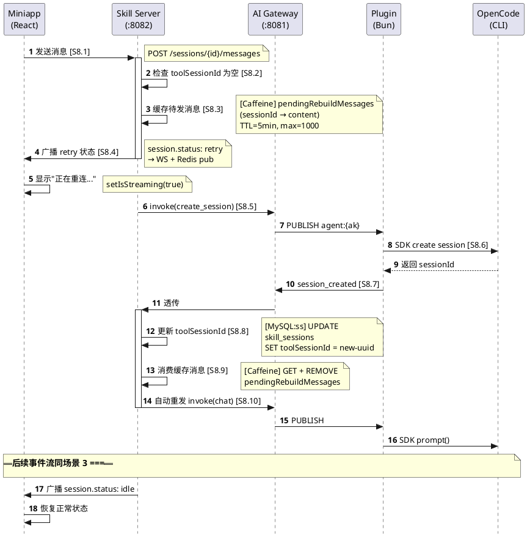
```plantuml
@startuml 场景8_Session重建
skinparam style strictuml
autonumber

participant "Miniapp\n(React)" as MA
participant "Skill Server\n(:8082)" as SS
participant "AI Gateway\n(:8081)" as GW
participant "Plugin\n(Bun)" as PL
participant "OpenCode\n(CLI)" as OC

MA -> SS : 发送消息 [S8.1]
note right: POST /sessions/{id}/messages

activate SS
SS -> SS : 检查 toolSessionId 为空 [S8.2]

SS -> SS : 缓存待发消息 [S8.3]
note right: [Caffeine] pendingRebuildMessages\n(sessionId → content)\nTTL=5min, max=1000

SS -> MA : 广播 retry 状态 [S8.4]
deactivate SS
note right: session.status: retry\n→ WS + Redis pub

MA -> MA : 显示"正在重连..."
note right: setIsStreaming(true)

SS -> GW : invoke(create_session) [S8.5]

GW -> PL : PUBLISH agent:{ak}
PL -> OC : SDK create session [S8.6]
OC --> PL : 返回 sessionId

PL -> GW : session_created [S8.7]
GW -> SS : 透传

activate SS
SS -> SS : 更新 toolSessionId [S8.8]
note right: [MySQL:ss] UPDATE\nskill_sessions\nSET toolSessionId = new-uuid

SS -> SS : 消费缓存消息 [S8.9]
note right: [Caffeine] GET + REMOVE\npendingRebuildMessages

SS -> GW : 自动重发 invoke(chat) [S8.10]
deactivate SS

GW -> PL : PUBLISH
PL -> OC : SDK prompt()

note over OC, MA: ===== 后续事件流同场景 3 =====

SS -> MA : 广播 session.status: idle
MA -> MA : 恢复正常状态

@enduml
```

### 详解

#### [S8.1] Miniapp 发送消息

- **组件：** Miniapp (useSkillStream)
- **方法：** `POST /api/skill/sessions/{id}/messages`
- **存储操作：** 无

#### [S8.2] Skill Server 检查 toolSessionId

- **组件：** Skill Server (SkillMessageController)
- **方法：** `session.getToolSessionId() == null` → 触发重建
- **触发条件：**
  1. 发消息时 `toolSessionId` 为空（首次创建尚未就绪）
  2. Gateway 返回 `tool_error(reason=session_not_found)`
  3. OpenCode 上下文溢出
- **存储操作：** 无

#### [S8.3] 缓存待发消息

- **组件：** Skill Server (SessionRebuildService)
- **方法：** `SessionRebuildService.rebuildToolSession(sessionId, session, pendingMessage)`
- **处理步骤：** `pendingRebuildMessages.put(sessionId, pendingMessage)` — Caffeine 缓存，TTL=5min，maxSize=1000
- **存储操作：** `[Caffeine]` pendingRebuildMessages

#### [S8.4] 广播 retry 状态

- **组件：** Skill Server (SessionRebuildService)
- **方法：** `broadcastStreamMessage(sessionId, userId, StreamMessage(type=session.status, sessionStatus=retry))`
- **Miniapp 处理：** `setIsStreaming(true)`，显示"正在重连..."
- **存储操作：** `[Redis]` PUBLISH user-stream:{userId}

#### [S8.5] Skill Server 发送 invoke(create_session)

- **组件：** Skill Server (SessionRebuildService)
- **方法：** `GatewayRelayService.sendInvokeToGateway(createSessionCmd)`
- **存储操作：** 无

#### [S8.6] Plugin 调用 OpenCode SDK 创建会话

- **组件：** Plugin (CreateSessionAction)
- **方法：** 同 [S2.6]
- **存储操作：** 无

#### [S8.7] Plugin 发送 session_created

- **组件：** Plugin → AI Gateway → Skill Server
- **方法：** 同 [S2.7] ~ [S2.8]
- **存储操作：** 无

#### [S8.8] Skill Server 更新 toolSessionId

- **组件：** Skill Server (GatewayMessageRouter)
- **方法：** `sessionService.updateToolSessionId(numericSessionId, toolSessionId)`
- **存储操作：** `[MySQL:ss]` UPDATE skill_sessions

#### [S8.9] 消费缓存消息

- **组件：** Skill Server (SessionRebuildService)
- **方法：** `rebuildService.consumePendingMessage(sessionId)` — 从 Caffeine 缓存取出（GET + REMOVE）
- **存储操作：** `[Caffeine]` GET + REMOVE pendingRebuildMessages

#### [S8.10] 自动重发 chat

- **组件：** Skill Server (GatewayMessageRouter)
- **方法：** `GatewayRelayService.sendInvokeToGateway(chatCmd)` — payload = `{text: pendingMessage, toolSessionId: new-uuid}`
- **说明：** 后续事件流同场景 3
- **存储操作：** 无

---

## 场景 9：Agent 心跳与超时离线

Plugin 定期发送心跳保持在线状态，超时未发心跳则被标记离线。

### 时序图

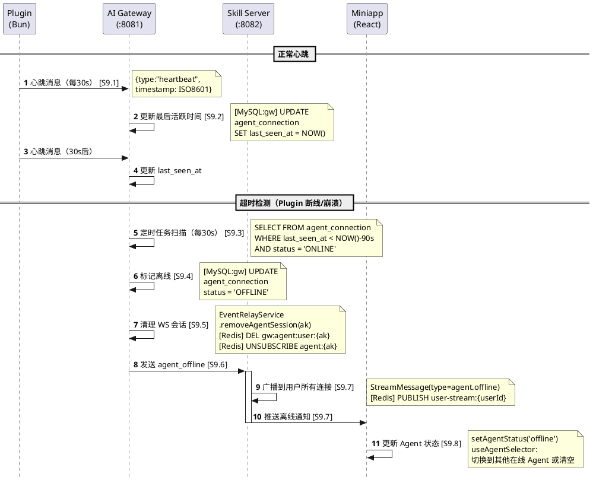
```plantuml
@startuml 场景9_心跳与超时离线
skinparam style strictuml
autonumber

participant "Plugin\n(Bun)" as PL
participant "AI Gateway\n(:8081)" as GW
participant "Skill Server\n(:8082)" as SS
participant "Miniapp\n(React)" as MA

== 正常心跳 ==

PL -> GW : 心跳消息（每30s） [S9.1]
note right: {type:"heartbeat",\ntimestamp: ISO8601}

GW -> GW : 更新最后活跃时间 [S9.2]
note right: [MySQL:gw] UPDATE\nagent_connection\nSET last_seen_at = NOW()

PL -> GW : 心跳消息（30s后）
GW -> GW : 更新 last_seen_at

== 超时检测（Plugin 断线/崩溃） ==

GW -> GW : 定时任务扫描（每30s） [S9.3]
note right: SELECT FROM agent_connection\nWHERE last_seen_at < NOW()-90s\nAND status = 'ONLINE'

GW -> GW : 标记离线 [S9.4]
note right: [MySQL:gw] UPDATE\nagent_connection\nstatus = 'OFFLINE'

GW -> GW : 清理 WS 会话 [S9.5]
note right: EventRelayService\n.removeAgentSession(ak)\n[Redis] DEL gw:agent:user:{ak}\n[Redis] UNSUBSCRIBE agent:{ak}

GW -> SS : 发送 agent_offline [S9.6]

activate SS
SS -> SS : 广播到用户所有连接 [S9.7]
note right: StreamMessage(type=agent.offline)\n[Redis] PUBLISH user-stream:{userId}
SS -> MA : 推送离线通知 [S9.7]
deactivate SS

MA -> MA : 更新 Agent 状态 [S9.8]
note right: setAgentStatus('offline')\nuseAgentSelector:\n切换到其他在线 Agent 或清空

@enduml
```

### 详解

#### [S9.1] Plugin 发送心跳

- **组件：** Plugin (GatewayConnection)
- **方法：** 定时器每 30s → `gatewayConnection.send({type: "heartbeat", timestamp: ISO8601})`
- **前置条件：** 仅在 READY 状态发送
- **配置：** `gateway.heartbeatIntervalMs`（默认 30000）
- **存储操作：** 无

#### [S9.2] Gateway 更新最后活跃时间

- **组件：** AI Gateway (AgentWebSocketHandler)
- **方法：** `agentRegistryService.heartbeat(agentId)` → `SQL: UPDATE agent_connection SET last_seen_at = NOW() WHERE id = ?`
- **存储操作：** `[MySQL:gw]` UPDATE agent_connection.last_seen_at

#### [S9.3] Gateway 定时任务扫描超时 Agent

- **组件：** AI Gateway (AgentRegistryService)
- **方法：** 定时任务每 30s 执行
- **SQL：** `SELECT * FROM agent_connection WHERE last_seen_at < NOW() - 90s AND status = 'ONLINE'`
- **存储操作：** `[MySQL:gw]` SELECT agent_connection

#### [S9.4] Gateway 标记 Agent 离线

- **组件：** AI Gateway (AgentRegistryService)
- **方法：** `AgentRegistryService.markOffline(agentId)`
- **存储操作：** `[MySQL:gw]` UPDATE agent_connection SET status='OFFLINE'

#### [S9.5] Gateway 清理 WS 会话和 Redis 注册

- **组件：** AI Gateway (EventRelayService)
- **方法：** `EventRelayService.removeAgentSession(ak)`
- **处理步骤：**
  1. 从内存 Map 移除 `agentSessions[ak]`
  2. `Redis DEL gw:agent:user:{ak}`
  3. `Redis UNSUBSCRIBE agent:{ak}`
- **存储操作：** `[Redis]` DEL + UNSUBSCRIBE

#### [S9.6] Gateway 发送 agent_offline 到 Skill Server

- **组件：** AI Gateway (AgentWebSocketHandler)
- **方法：** `SkillRelayService.relayToSkill(agentOfflineMessage)`
- **消息格式：** `{type: "agent_offline", ak, userId}`
- **说明：** 此消息由 Gateway **自动生成**
- **存储操作：** 无

#### [S9.7] Skill Server 广播离线通知

- **组件：** Skill Server (GatewayMessageRouter)
- **方法：** `GatewayMessageRouter.handleAgentOffline()` → `broadcastStreamMessage()`
- **存储操作：** `[Redis]` PUBLISH user-stream:{userId}

#### [S9.8] Miniapp 更新 Agent 状态

- **组件：** Miniapp (useSkillStream + useAgentSelector)
- **方法：** `setAgentStatus('offline')`
- **处理步骤：**
  1. 设置 Agent 状态为 offline
  2. `useAgentSelector`：若当前选中 Agent 离线 → 切换到第一个在线 Agent 或清空
- **存储操作：** 无

---

## 场景 10：关闭会话

用户在 Miniapp 删除会话，通知 OpenCode 端删除远端会话。

### 时序图

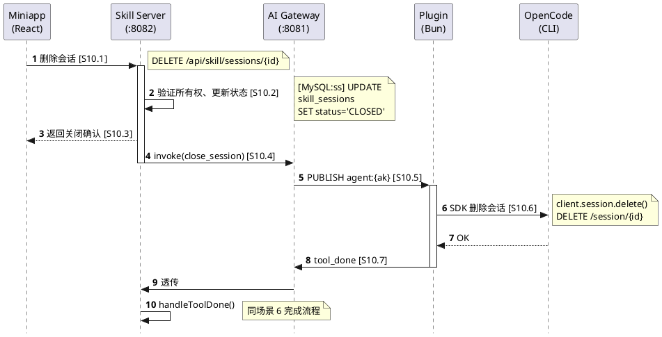
```plantuml
@startuml 场景10_关闭会话
skinparam style strictuml
autonumber

participant "Miniapp\n(React)" as MA
participant "Skill Server\n(:8082)" as SS
participant "AI Gateway\n(:8081)" as GW
participant "Plugin\n(Bun)" as PL
participant "OpenCode\n(CLI)" as OC

MA -> SS : 删除会话 [S10.1]
note right: DELETE /api/skill/sessions/{id}

activate SS
SS -> SS : 验证所有权、更新状态 [S10.2]
note right: [MySQL:ss] UPDATE\nskill_sessions\nSET status='CLOSED'
SS --> MA : 返回关闭确认 [S10.3]

SS -> GW : invoke(close_session) [S10.4]
deactivate SS

GW -> PL : PUBLISH agent:{ak} [S10.5]

activate PL
PL -> OC : SDK 删除会话 [S10.6]
note right: client.session.delete()\nDELETE /session/{id}
OC --> PL : OK

PL -> GW : tool_done [S10.7]
deactivate PL

GW -> SS : 透传

SS -> SS : handleToolDone()
note right: 同场景 6 完成流程

@enduml
```

### 详解

#### [S10.1] Miniapp 发起关闭会话

- **组件：** Miniapp (useSkillSession)
- **方法：** `DELETE /api/skill/sessions/{id}`
- **存储操作：** 无

#### [S10.2] Skill Server 验证并更新状态

- **组件：** Skill Server (SkillSessionController)
- **方法：** `SkillSessionController.closeSession()` → `SkillSessionService.closeSession()`
- **处理步骤：**
  1. 验证会话所有权（userId 匹配）
  2. 更新状态为 CLOSED
- **存储操作：** `[MySQL:ss]` UPDATE skill_sessions SET status='CLOSED'

#### [S10.3] Skill Server 返回关闭确认

- **组件：** Skill Server → Miniapp
- **响应：** `{ "status": "closed", "welinkSessionId": "12345" }`
- **存储操作：** 无

#### [S10.4] Skill Server 发送 invoke(close_session)

- **组件：** Skill Server (GatewayRelayService)
- **方法：** `GatewayRelayService.sendInvokeToGateway()`
- **Payload：** `{ "toolSessionId": "opencode-session-uuid" }`
- **存储操作：** 无

#### [S10.5] Gateway PUBLISH 到 Plugin

- **组件：** AI Gateway (SkillRelayService)
- **方法：** 同 [S2.5]
- **存储操作：** `[Redis]` PUBLISH agent:{ak}

#### [S10.6] Plugin 执行 CloseSessionAction

- **组件：** Plugin (CloseSessionAction)
- **方法：** `CloseSessionAction.execute()` → `client.session.delete({path: {id: toolSessionId}})`
- **SDK 调用：** `DELETE /session/{id}`
- **存储操作：** 无

#### [S10.7] Plugin 发送 tool_done

- **组件：** Plugin (BridgeRuntime)
- **方法：** `ToolDoneCompat.handleInvokeCompleted()` → `gatewayConnection.send({type: "tool_done", ...})`
- **后续处理：** Skill Server 收到后执行 `handleToolDone()`，同场景 6 完成流程
- **存储操作：** 无

---

## 场景 11：中止会话

用户点击"停止"按钮，中止当前正在执行的操作但不关闭会话。

### 时序图

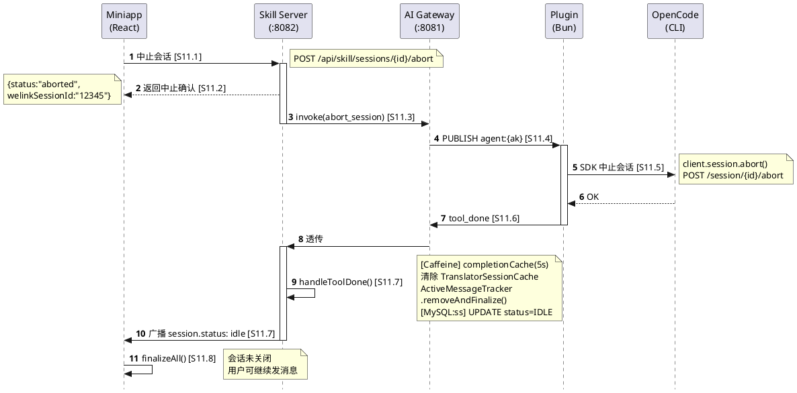
```plantuml
@startuml 场景11_中止会话
skinparam style strictuml
autonumber

participant "Miniapp\n(React)" as MA
participant "Skill Server\n(:8082)" as SS
participant "AI Gateway\n(:8081)" as GW
participant "Plugin\n(Bun)" as PL
participant "OpenCode\n(CLI)" as OC

MA -> SS : 中止会话 [S11.1]
note right: POST /api/skill/sessions/{id}/abort

activate SS
SS --> MA : 返回中止确认 [S11.2]
note left: {status:"aborted",\nwelinkSessionId:"12345"}

SS -> GW : invoke(abort_session) [S11.3]
deactivate SS

GW -> PL : PUBLISH agent:{ak} [S11.4]

activate PL
PL -> OC : SDK 中止会话 [S11.5]
note right: client.session.abort()\nPOST /session/{id}/abort
OC --> PL : OK

PL -> GW : tool_done [S11.6]
deactivate PL

GW -> SS : 透传

activate SS
SS -> SS : handleToolDone() [S11.7]
note right: [Caffeine] completionCache(5s)\n清除 TranslatorSessionCache\nActiveMessageTracker\n.removeAndFinalize()\n[MySQL:ss] UPDATE status=IDLE

SS -> MA : 广播 session.status: idle [S11.7]
deactivate SS

MA -> MA : finalizeAll() [S11.8]
note right: 会话未关闭\n用户可继续发消息

@enduml
```

### 详解

#### [S11.1] Miniapp 发起中止请求

- **组件：** Miniapp (useSkillSession)
- **方法：** `POST /api/skill/sessions/{id}/abort`
- **存储操作：** 无

#### [S11.2] Skill Server 返回中止确认

- **组件：** Skill Server (SkillSessionController)
- **方法：** `SkillSessionController.abortSession()`
- **响应：** `{ "status": "aborted", "welinkSessionId": "12345" }`
- **存储操作：** 无

#### [S11.3] Skill Server 发送 invoke(abort_session)

- **组件：** Skill Server (GatewayRelayService)
- **方法：** `GatewayRelayService.sendInvokeToGateway()`
- **Payload：** `{ "toolSessionId": "opencode-session-uuid" }`
- **存储操作：** 无

#### [S11.4] Gateway PUBLISH 到 Plugin

- **组件：** AI Gateway (SkillRelayService)
- **方法：** 同 [S2.5]
- **存储操作：** `[Redis]` PUBLISH agent:{ak}

#### [S11.5] Plugin 执行 AbortSessionAction

- **组件：** Plugin (AbortSessionAction)
- **方法：** `AbortSessionAction.execute()` → `client.session.abort({path: {id: toolSessionId}})`
- **SDK 调用：** `POST /session/{id}/abort`
- **存储操作：** 无

#### [S11.6] Plugin 发送 tool_done

- **组件：** Plugin (BridgeRuntime)
- **方法：** 同 [S10.7]
- **存储操作：** 无

#### [S11.7] Skill Server handleToolDone() 并广播

- **组件：** Skill Server (GatewayMessageRouter)
- **方法：** `GatewayMessageRouter.handleToolDone()`
- **处理步骤：** 同 [S6.6]，completionCache → 清除缓存 → removeAndFinalize → UPDATE status=IDLE → 广播 idle
- **存储操作：** `[Caffeine]` completionCache；`[MySQL:ss]` UPDATE skill_sessions

#### [S11.8] Miniapp 恢复正常状态

- **组件：** Miniapp (useSkillStream)
- **方法：** `finalizeAllStreamingMessages()`
- **与关闭会话的区别：**
  - **关闭 (DELETE)：** 会话状态变为 CLOSED，不可继续使用
  - **中止 (POST abort)：** 仅停止当前执行，会话状态变为 IDLE，可继续发消息
- **存储操作：** 无

---

## 场景 12：多实例路由（Gateway 多实例）

Agent 连接在 Gateway-A，而 Skill Server 的 invoke 到达 Gateway-B 时的跨实例路由流程。

### 时序图

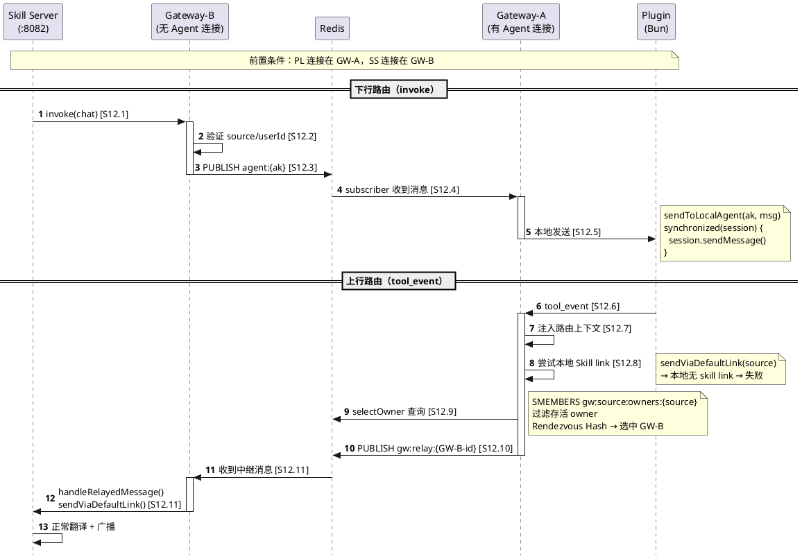
```plantuml
@startuml 场景12_多实例路由
skinparam style strictuml
autonumber

participant "Skill Server\n(:8082)" as SS
participant "Gateway-B\n(无 Agent 连接)" as GWB
participant "Redis" as RD
participant "Gateway-A\n(有 Agent 连接)" as GWA
participant "Plugin\n(Bun)" as PL

note over SS, PL: 前置条件：PL 连接在 GW-A，SS 连接在 GW-B

== 下行路由（invoke） ==

SS -> GWB : invoke(chat) [S12.1]

activate GWB
GWB -> GWB : 验证 source/userId [S12.2]
GWB -> RD : PUBLISH agent:{ak} [S12.3]
deactivate GWB

RD -> GWA : subscriber 收到消息 [S12.4]

activate GWA
GWA -> PL : 本地发送 [S12.5]
note right: sendToLocalAgent(ak, msg)\nsynchronized(session) {\n  session.sendMessage()\n}
deactivate GWA

== 上行路由（tool_event） ==

PL -> GWA : tool_event [S12.6]

activate GWA
GWA -> GWA : 注入路由上下文 [S12.7]
GWA -> GWA : 尝试本地 Skill link [S12.8]
note right: sendViaDefaultLink(source)\n→ 本地无 skill link → 失败

GWA -> RD : selectOwner 查询 [S12.9]
note right: SMEMBERS gw:source:owners:{source}\n过滤存活 owner\nRendezvous Hash → 选中 GW-B

GWA -> RD : PUBLISH gw:relay:{GW-B-id} [S12.10]
deactivate GWA

RD -> GWB : 收到中继消息 [S12.11]

activate GWB
GWB -> SS : handleRelayedMessage()\nsendViaDefaultLink() [S12.11]
deactivate GWB

SS -> SS : 正常翻译 + 广播

@enduml
```

### 详解

#### [S12.1] Skill Server 发送 invoke 到 Gateway-B

- **组件：** Skill Server (GatewayWSClient)
- **方法：** `GatewayWSClient.send(invokeMessage)` — SS 的 WS 连接在 GW-B 上
- **存储操作：** 无

#### [S12.2] Gateway-B 验证 invoke

- **组件：** AI Gateway-B (SkillRelayService)
- **方法：** `SkillRelayService.handleInvokeFromSkill(session, message)`
- **验证步骤：** 验证 source 匹配 → 验证 userId 匹配 → 绑定 agent source
- **存储操作：** `[Redis]` SET gw:agent:source:{ak}

#### [S12.3] Gateway-B PUBLISH 到 Agent 频道

- **组件：** AI Gateway-B (SkillRelayService)
- **方法：** `Redis PUBLISH agent:{ak} = message.withoutRoutingContext()`
- **说明：** GW-B 本地没有该 Agent 的 WS 连接，但 Redis Pub/Sub 会将消息送达订阅者
- **存储操作：** `[Redis]` PUBLISH agent:{ak}

#### [S12.4] Gateway-A 收到 Agent 频道消息

- **组件：** AI Gateway-A (EventRelayService)
- **方法：** Redis subscriber 回调 → `EventRelayService.onMessage(channel, message)`
- **说明：** GW-A 在 Agent 注册时已 SUBSCRIBE agent:{ak}
- **存储操作：** 无

#### [S12.5] Gateway-A 本地发送到 Plugin

- **组件：** AI Gateway-A (EventRelayService)
- **方法：** `EventRelayService.sendToLocalAgent(ak, message)` → `synchronized(session) { session.sendMessage(TextMessage(json)) }`
- **说明：** 使用 synchronized 保证 WS 消息发送的线程安全
- **存储操作：** 无

#### [S12.6] Plugin 发送 tool_event 到 Gateway-A

- **组件：** Plugin (BridgeRuntime)
- **方法：** `gatewayConnection.send({type: "tool_event", ...})`
- **存储操作：** 无

#### [S12.7] Gateway-A 注入路由上下文

- **组件：** AI Gateway-A (EventRelayService)
- **方法：** `EventRelayService.relayToSkillServer(ak, message)` — 注入 ak, userId, source
- **存储操作：** 无

#### [S12.8] Gateway-A 尝试本地 Skill link

- **组件：** AI Gateway-A (SkillRelayService)
- **方法：** `SkillRelayService.relayToSkill(message)` → `sendViaDefaultLink(source, message)`
- **结果：** GW-A 本地没有 Skill Server 的 WS 连接 → 失败
- **存储操作：** 无

#### [S12.9] Gateway-A selectOwner 查询

- **组件：** AI Gateway-A (SkillRelayService)
- **方法：** `SkillRelayService.selectOwner(source, message.type)`
- **处理步骤：**
  1. `Redis SMEMBERS gw:source:owners:{source}` — 获取所有 owner
  2. 过滤存活 owner：`EXISTS gw:source:owner:{source}:{ownerKey}`
  3. Rendezvous Hash：`max(hash(type + "|" + ownerKey))` — 选择得分最高的 owner
  4. 返回 GW-B 的 instanceId
- **Rendezvous Hashing 算法：**
  ```java
  long rendezvousScore(String key, String ownerKey) {
    String stableKey = key != null ? key : "default";
    return Integer.toUnsignedLong((stableKey + "|" + ownerKey).hashCode());
  }
  ```
- **存储操作：** `[Redis]` SMEMBERS + EXISTS 查询

#### [S12.10] Gateway-A 通过 Redis 中继到 Gateway-B

- **组件：** AI Gateway-A (SkillRelayService)
- **方法：** `Redis PUBLISH gw:relay:{GW-B-instanceId} = message`
- **存储操作：** `[Redis]` PUBLISH gw:relay:{instanceId}

#### [S12.11] Gateway-B 收到中继消息并发送到 Skill Server

- **组件：** AI Gateway-B (SkillRelayService)
- **方法：** `SkillRelayService.handleRelayedMessage()` → `sendViaDefaultLink(source, message)`
- **说明：** GW-B 本地有 Skill Server 的 WS 连接，直接发送
- **存储操作：** 无

**关键机制总结：**

| Key/Channel | 用途 | TTL |
|-------------|------|-----|
| `agent:{ak}` | Agent 消息投递（invoke 下发） | Pub/Sub |
| `gw:relay:{instanceId}` | 跨 Gateway 实例消息中继 | Pub/Sub |
| `gw:agent:user:{ak}` | AK → userId 映射 | 无 |
| `gw:agent:source:{ak}` | AK → source 映射 | 无 |
| `gw:source:owner:{source}:{instanceId}` | 实例 ownership 心跳 | 30s |
| `gw:source:owners:{source}` | 集群级 source owner 注册表 | Set |

**Owner 心跳机制：**
- 每 10s：`SET gw:source:owner:{source}:{instanceId} "alive" EX 30`
- 注册到 Set：`SADD gw:source:owners:{source} "{source}:{instanceId}"`
- 断开时清理：DEL + SREM

---

## 场景 13：多实例推送（Skill Server 多实例）

用户 WebSocket 连接在 SkillServer-A，事件到达 SkillServer-B 时通过 Redis pub/sub 推送。

### 时序图

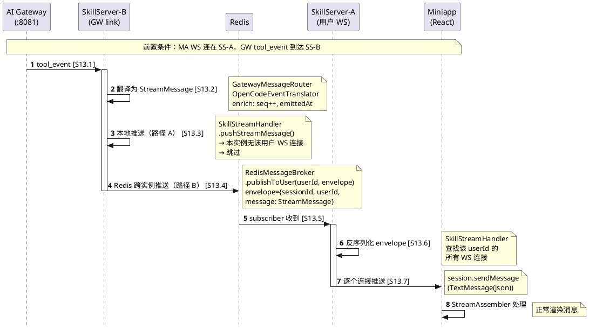
```plantuml
@startuml 场景13_多实例推送
skinparam style strictuml
autonumber

participant "AI Gateway\n(:8081)" as GW
participant "SkillServer-B\n(GW link)" as SSB
participant "Redis" as RD
participant "SkillServer-A\n(用户 WS)" as SSA
participant "Miniapp\n(React)" as MA

note over GW, MA: 前置条件：MA WS 连在 SS-A，GW tool_event 到达 SS-B

GW -> SSB : tool_event [S13.1]

activate SSB
SSB -> SSB : 翻译为 StreamMessage [S13.2]
note right: GatewayMessageRouter\nOpenCodeEventTranslator\nenrich: seq++, emittedAt

SSB -> SSB : 本地推送（路径 A） [S13.3]
note right: SkillStreamHandler\n.pushStreamMessage()\n→ 本实例无该用户 WS 连接\n→ 跳过

SSB -> RD : Redis 跨实例推送（路径 B） [S13.4]
note right: RedisMessageBroker\n.publishToUser(userId, envelope)\nenvelope={sessionId, userId,\nmessage: StreamMessage}
deactivate SSB

RD -> SSA : subscriber 收到 [S13.5]

activate SSA
SSA -> SSA : 反序列化 envelope [S13.6]
note right: SkillStreamHandler\n查找该 userId 的\n所有 WS 连接

SSA -> MA : 逐个连接推送 [S13.7]
note right: session.sendMessage\n(TextMessage(json))
deactivate SSA

MA -> MA : StreamAssembler 处理
note right: 正常渲染消息

@enduml
```

### 详解

#### [S13.1] Gateway tool_event 到达 SkillServer-B

- **组件：** AI Gateway → SkillServer-B
- **方法：** 通过 Skill WS link 直接发送
- **存储操作：** 无

#### [S13.2] SkillServer-B 翻译为 StreamMessage

- **组件：** SkillServer-B (GatewayMessageRouter + OpenCodeEventTranslator)
- **方法：** `GatewayMessageRouter.handleToolEvent()` → `OpenCodeEventTranslator.translate()`
- **enrichStreamMessage 处理：**
  1. `msg.sessionId = sessionId`
  2. `msg.welinkSessionId = sessionId`（JSON 序列化名）
  3. `msg.emittedAt = ISO8601 now()`
  4. `msg.seq = per-session AtomicLong.incrementAndGet()`
- **存储操作：** 无

#### [S13.3] SkillServer-B 本地推送（路径 A）

- **组件：** SkillServer-B (SkillStreamHandler)
- **方法：** `SkillStreamHandler.pushStreamMessage(sessionId, msg)`
- **结果：** 查找本实例中该用户的 WS 连接 → 本实例无该用户连接 → 跳过
- **存储操作：** 无

#### [S13.4] SkillServer-B 通过 Redis 跨实例推送（路径 B）

- **组件：** SkillServer-B (RedisMessageBroker)
- **方法：** `RedisMessageBroker.publishToUser(userId, envelope)`
- **信封格式：**
  ```json
  { "sessionId": "12345", "userId": "user-123", "message": { /* StreamMessage JSON */ } }
  ```
- **存储操作：** `[Redis]` PUBLISH user-stream:{userId}

#### [S13.5] SkillServer-A subscriber 收到消息

- **组件：** SkillServer-A (SkillStreamHandler)
- **方法：** Redis subscriber 回调
- **说明：** SS-A 在用户首个 WS 连接建立时已 `SUBSCRIBE user-stream:{userId}`
- **存储操作：** 无

#### [S13.6] SkillServer-A 反序列化并查找连接

- **组件：** SkillServer-A (SkillStreamHandler)
- **方法：** 反序列化 envelope → 查找该 userId 的所有 WS 连接
- **存储操作：** 无

#### [S13.7] SkillServer-A 推送到 Miniapp

- **组件：** SkillServer-A (SkillStreamHandler)
- **方法：** 逐个连接发送 `session.sendMessage(TextMessage(json))`
- **存储操作：** 无

**关键机制总结：**

- **Redis 频道：** `user-stream:{userId}`
- **订阅生命周期：** 用户首个 WS 连接 → SUBSCRIBE；最后一个 WS 断开 → UNSUBSCRIBE
- **双路径推送确保消息不丢失：**
  1. 路径 A（本地推送）：直接查找本实例中该用户的 WS 连接
  2. 路径 B（Redis 推送）：通过 pub/sub 广播到所有实例

---

## 场景 14：错误处理流程

### 14a. tool_error(session_not_found) → Session 重建

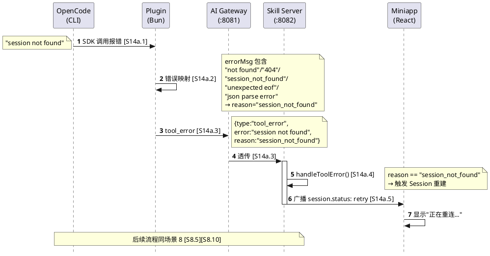
```plantuml
@startuml 场景14a_Session重建
skinparam style strictuml
autonumber

participant "OpenCode\n(CLI)" as OC
participant "Plugin\n(Bun)" as PL
participant "AI Gateway\n(:8081)" as GW
participant "Skill Server\n(:8082)" as SS
participant "Miniapp\n(React)" as MA

OC -> PL : SDK 调用报错 [S14a.1]
note left: "session not found"

PL -> PL : 错误映射 [S14a.2]
note right: errorMsg 包含\n"not found"/"404"/\n"session_not_found"/\n"unexpected eof"/\n"json parse error"\n→ reason="session_not_found"

PL -> GW : tool_error [S14a.3]
note right: {type:"tool_error",\nerror:"session not found",\nreason:"session_not_found"}

GW -> SS : 透传 [S14a.3]

activate SS
SS -> SS : handleToolError() [S14a.4]
note right: reason == "session_not_found"\n→ 触发 Session 重建

SS -> MA : 广播 session.status: retry [S14a.5]
deactivate SS

MA -> MA : 显示"正在重连..."

note over SS, OC: 后续流程同场景 8 [S8.5]~[S8.10]

@enduml
```

### 详解（14a）

#### [S14a.1] OpenCode SDK 调用报错

- **组件：** OpenCode CLI → Plugin
- **错误原因：** OpenCode 会话不存在（可能已被清理或上下文溢出）
- **存储操作：** 无

#### [S14a.2] Plugin 错误映射

- **组件：** Plugin (ChatAction / ActionRouter)
- **映射规则：** 错误信息包含 `"not found"`, `"404"`, `"session_not_found"`, `"unexpected eof"`, `"json parse error"` → `reason = "session_not_found"`；其他 → `reason = undefined`
- **存储操作：** 无

#### [S14a.3] Plugin 发送 tool_error

- **组件：** Plugin → AI Gateway → Skill Server
- **消息格式：**
  ```json
  {
    "type": "tool_error",
    "welinkSessionId": "12345",
    "toolSessionId": "xxx",
    "error": "session not found",
    "reason": "session_not_found"
  }
  ```
- **存储操作：** 无

#### [S14a.4] Skill Server 处理 tool_error(session_not_found)

- **组件：** Skill Server (GatewayMessageRouter)
- **方法：** `GatewayMessageRouter.handleToolError()` → `rebuildService.rebuildToolSession(sessionId, session, null)`
- **说明：** `pendingMessage` 为 null（之前发的消息已丢失）
- **存储操作：** 无

#### [S14a.5] 广播 retry 并启动重建

- **组件：** Skill Server (SessionRebuildService)
- **方法：** 广播 `session.status: retry` → 发送 `invoke(create_session)`
- **后续流程：** 同场景 8 [S8.5]~[S8.10]
- **存储操作：** `[Redis]` PUBLISH user-stream:{userId}

---

### 14b. tool_error(其他) → 前端错误显示

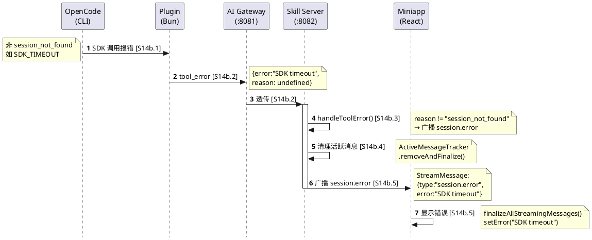
```plantuml
@startuml 场景14b_前端错误显示
skinparam style strictuml
autonumber

participant "OpenCode\n(CLI)" as OC
participant "Plugin\n(Bun)" as PL
participant "AI Gateway\n(:8081)" as GW
participant "Skill Server\n(:8082)" as SS
participant "Miniapp\n(React)" as MA

OC -> PL : SDK 调用报错 [S14b.1]
note left: 非 session_not_found\n如 SDK_TIMEOUT

PL -> GW : tool_error [S14b.2]
note right: {error:"SDK timeout",\nreason: undefined}

GW -> SS : 透传 [S14b.2]

activate SS
SS -> SS : handleToolError() [S14b.3]
note right: reason != "session_not_found"\n→ 广播 session.error

SS -> SS : 清理活跃消息 [S14b.4]
note right: ActiveMessageTracker\n.removeAndFinalize()

SS -> MA : 广播 session.error [S14b.5]
deactivate SS
note right: StreamMessage:\n{type:"session.error",\nerror:"SDK timeout"}

MA -> MA : 显示错误 [S14b.5]
note right: finalizeAllStreamingMessages()\nsetError("SDK timeout")

@enduml
```

### 详解（14b）

#### [S14b.1] OpenCode SDK 调用报错（非 session_not_found）

- **组件：** OpenCode CLI → Plugin
- **错误类型：** 如 `SDK_TIMEOUT`、`SDK_UNREACHABLE` 等
- **存储操作：** 无

#### [S14b.2] Plugin 发送 tool_error

- **组件：** Plugin → AI Gateway → Skill Server
- **消息格式：** `{type: "tool_error", error: "SDK timeout", reason: undefined}`
- **存储操作：** 无

#### [S14b.3] Skill Server 处理非重建类错误

- **组件：** Skill Server (GatewayMessageRouter)
- **方法：** `GatewayMessageRouter.handleToolError()` — `reason != "session_not_found"` 分支
- **处理步骤：** 广播 `StreamMessage(type="session.error", error=errorMessage)`
- **存储操作：** 无

#### [S14b.4] 清理活跃消息

- **组件：** Skill Server (ActiveMessageTracker)
- **方法：** `ActiveMessageTracker.removeAndFinalize(sessionId)`
- **存储操作：** 无

#### [S14b.5] Miniapp 显示错误

- **组件：** Miniapp (useSkillStream)
- **方法：** 收到 `StreamMessage(type="session.error")` → `finalizeAllStreamingMessages()` + `setError(msg.error)`
- **存储操作：** 无

---

### 14c. completionCache 竞态防护

```plantuml
@startuml 场景14c_竞态防护
skinparam style strictuml

participant "Skill Server\n内部处理" as SS
participant "Miniapp\n(React)" as MA

== T+0 正常事件 ==

-> SS : tool_event (text.delta)
SS -> SS : completionCache 未命中\n→ 正常翻译推送 ✓
SS -> MA : text.delta
MA -> MA : 显示增量文本

== T+1 正常事件 ==

-> SS : tool_event (text.done)
SS -> SS : completionCache 未命中\n→ 正常翻译推送 ✓
note right: [MySQL:ss] INSERT\nskill_message_parts
SS -> MA : text.done
MA -> MA : 最终化文本

== T+2 完成 ==

-> SS : tool_done
SS -> SS : handleToolDone()
note right: [Caffeine] PUT completionCache\n(sessionId, TTL=5s)\n清除 TranslatorSessionCache\nActiveMessageTracker.removeAndFinalize()
SS -> MA : session.status: idle
MA -> MA : finalizeAll()

== T+3 迟到事件（被抑制） ==

-> SS : tool_event (text.delta, 网络延迟)
SS -> SS : completionCache 命中!\n非 question/permission\n→ 抑制该事件 ✗
note right: 日志记录被抑制的事件

== T+4 交互事件（不被抑制） ==

-> SS : tool_event (question)
SS -> SS : completionCache 命中!\n但是 question 类事件\n→ 例外! 不被抑制 ✓
SS -> MA : question
MA -> MA : 显示提问 UI

== T+7 缓存过期 ==

note over SS: completionCache TTL 5s 过期\n新的 chat invoke 也会清除缓存\n→ 恢复正常处理

@enduml
```

### 详解（14c）

**completionCache 防护规则总结：**

| 条件 | 处理 |
|------|------|
| `tool_done` 后 5s 内收到 `tool_event`（非交互类） | **抑制**，不推送前端 |
| `tool_done` 后 5s 内收到 `question` / `permission` 事件 | **不抑制**，正常推送 |
| 新的 chat invoke 到来 | 清除 completionCache，恢复正常 |
| 5s TTL 自然过期 | 恢复正常 |

**设计意图：** `tool_done` 与最后几个 `tool_event` 可能因网络延迟乱序到达。completionCache 机制确保已完成的会话不会因迟到事件而重新进入流式状态，同时保留交互类事件（question/permission）的实时性。
