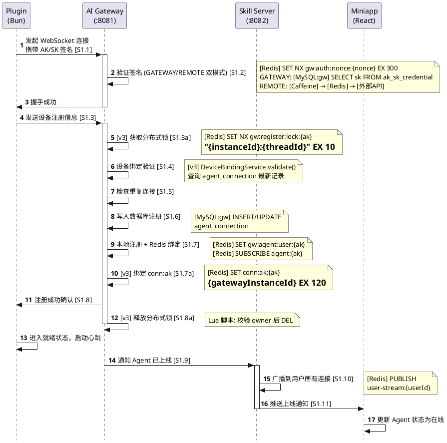
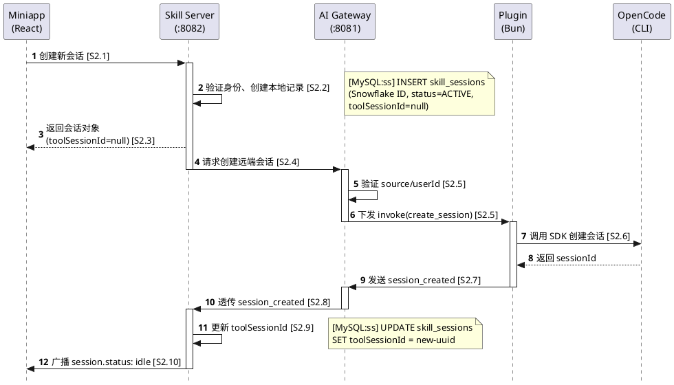
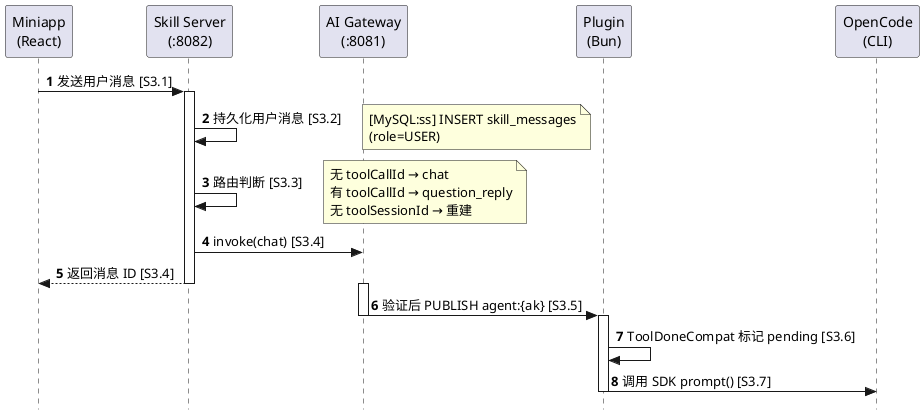

# 全链路流程汇总（v3）

> **v3 变更：** 场景 1（Agent 注册）增加分布式锁和 conn:ak 绑定步骤；场景 5（心跳）增加 conn:ak TTL 刷新；场景 7（Agent 断开）增加 Lua 条件删除。

## 概述

本文档将 01~04 各层级协议文档中的流程汇总到一起，覆盖所有完整业务场景。每个场景从第一个组件到最后一个组件，逐层展开每一步的详细处理。

**组件缩写：**

| 缩写 | 组件 | 说明 |
|------|------|------|
| **MA** | Skill Miniapp | React SPA，端口 3001 |
| **SS** | Skill Server | Spring Boot，端口 8082 |
| **GW** | AI Gateway | Spring Boot，端口 8081 |
| **PL** | Message Bridge Plugin | Bun/TypeScript，OpenCode 插件 |
| **OC** | OpenCode CLI | 本地运行的 AI Agent |

**数据存储标记：**

| 标记 | 说明 |
|------|------|
| `[MySQL:gw]` | Gateway 数据库 `ai_gateway` |
| `[MySQL:ss]` | Skill Server 数据库 `skill_db` |
| `[Redis]` | Redis（localhost:6379，db 0） |
| `[Caffeine]` | 进程内 Caffeine 缓存 |

---

## 场景 1：Agent 注册与上线（v3 更新）

Plugin 启动后连接 Gateway，完成认证、注册，直到 Miniapp 收到 Agent 上线通知。

### 时序图



### 详解

#### [S1.1] Plugin 发起 WebSocket 连接

- **组件：** Plugin (GatewayConnection)
- **方法：** `GatewayConnection.connect()` → `new WebSocket(url, [subprotocol])`
- **子协议格式：** `auth.{Base64URL(JSON)}`
- **认证载荷：**
  ```json
  { "ak": "agent-key", "ts": "1710000000", "nonce": "uuid-v4", "sign": "Base64(HMAC-SHA256)" }
  ```
- **签名算法：** `AkSkAuth.generateAuthPayload()` → `HMAC-SHA256(SK, AK + ts + nonce)` → Base64 编码
- **触发条件：** Plugin 启动 / 重连
- **存储操作：** 无

#### [S1.2] Gateway 验证 AK/SK 签名（v3 双模式）

- **组件：** AI Gateway (AgentWebSocketHandler)
- **方法：** `AgentWebSocketHandler.beforeHandshake()` → `AkSkAuthService.verify(ak, ts, nonce, sign)`
- **处理步骤（根据 gateway.auth.mode 分支）：**

  **GATEWAY 模式（默认）：**
  1. 时间戳窗口验证：`|now - ts| ≤ 300s`
  2. Nonce 防重放：`Redis SET NX gw:auth:nonce:{nonce} "1" EX 300`
  3. AK 查表：`SQL: SELECT sk, user_id FROM ak_sk_credential WHERE ak = ? AND status = 'ACTIVE'`
  4. 签名计算：`Base64(HMAC-SHA256(sk, ak + ts + nonce))`
  5. 恒定时间比较：`MessageDigest.isEqual(expected, signature)`

  **REMOTE 模式：**
  1. 时间戳窗口验证 + Nonce 防重放（同上）
  2. L1 Caffeine 缓存查找（TTL 300s，上限 10000）
  3. L2 Redis 缓存查找（`auth:identity:{ak}`，TTL 3600s）
  4. L3 外部身份 API（`POST /appstore/wecodeapi/open/identity/check`）
  5. 成功 → 回填 L1 + L2；失败 → 拒绝

- **成功：** 存储 `userId` 和 `akId` 到 WebSocket 会话属性；启动 10s 注册超时计时器
- **失败：** 返回 false，握手失败，连接断开
- **存储操作：** `[Redis]` gw:auth:nonce:{nonce}；`[Caffeine]`/`[Redis]` 认证缓存（REMOTE 模式）

#### [S1.3] Plugin 发送设备注册信息

- **组件：** Plugin (GatewayConnection)
- **方法：** `GatewayConnection.onOpen()` → `send({type: "register", ...})`
- **消息格式：**
  ```json
  {
    "type": "register",
    "deviceName": "My-Workstation",
    "macAddress": "AA:BB:CC:DD:EE:FF",
    "os": "linux",
    "toolType": "opencode",
    "toolVersion": "1.4.0"
  }
  ```
- **存储操作：** 无

#### [S1.3a] Gateway 获取分布式锁（v3 新增）

- **组件：** AI Gateway (AgentWebSocketHandler)
- **方法：** `handleRegister()` 入口
- **处理步骤：**
  1. `Redis SET NX gw:register:lock:{ak} = "{instanceId}:{threadId}" EX 10`
  2. 获取成功 → 继续注册流程
  3. 获取失败 → `registerRejected("concurrent_registration")` + `close(4409)`
- **存储操作：** `[Redis]` gw:register:lock:{ak} TTL=10s

#### [S1.4] Gateway 设备绑定验证（v3 优化）

- **组件：** AI Gateway (AgentWebSocketHandler)
- **方法：** `DeviceBindingService.validate(ak, macAddress, toolType)`
- **处理步骤：**
  1. 检查 `gateway.device-binding.enabled`（默认 false）
  2. 未启用 → 直接通过
  3. 查询 `agent_connection` 最新记录（`findLatestByAkId`）
  4. 无记录（首次注册）→ 通过
  5. MAC + toolType 匹配（忽略大小写）→ 通过
  6. 不匹配 → `registerRejected("device_binding_failed")` + `close(4403)`
  7. 异常 → Fail-Open（允许 + WARN 日志）
- **存储操作：** `[MySQL:gw]` 查询 agent_connection

#### [S1.5] Gateway 检查重复连接

- **组件：** AI Gateway (AgentWebSocketHandler)
- **方法：** `EventRelayService.hasAgentSession(ak)`
- **处理步骤：**
  1. 检查内存 Map `agentSessions` 中是否已有该 AK 的会话
  2. 已存在 → `registerRejected("duplicate_connection")` + `close(4409)`
  3. 不存在 → 继续
- **存储操作：** 内存 Map 查询

#### [S1.6] Gateway 写入数据库注册

- **组件：** AI Gateway (AgentWebSocketHandler)
- **方法：** `AgentRegistryService.register(userId, ak, deviceName, macAddress, os, toolType, toolVersion)`
- **处理步骤：**
  1. 查找已有记录（同 ak + toolType，唯一约束）
  2. 已有记录 → `UPDATE status=ONLINE`，更新元数据
  3. 新记录 → `INSERT`（Snowflake ID），状态 ONLINE
- **存储操作：** `[MySQL:gw]` INSERT/UPDATE agent_connection

#### [S1.7] Gateway 本地注册 + Redis 绑定

- **组件：** AI Gateway (AgentWebSocketHandler)
- **方法：** `EventRelayService.registerAgentSession(ak, userId, session)`
- **处理步骤：**
  1. `sessionAkMap[wsSessionId] = ak`
  2. `session.attributes[ATTR_AGENT_ID] = agentId`
  3. `agentSessions[ak] = session`
  4. `Redis SET gw:agent:user:{ak} = userId`
  5. `Redis SUBSCRIBE agent:{ak}`
- **存储操作：** `[Redis]` gw:agent:user:{ak}；`[Redis]` SUBSCRIBE agent:{ak}

#### [S1.7a] Gateway 绑定 conn:ak（v3 新增）

- **组件：** AI Gateway (AgentWebSocketHandler)
- **方法：** `redisMessageBroker.bindConnAk(ak, gatewayInstanceId, 120)`
- **处理步骤：**
  1. `Redis SET conn:ak:{ak} = {gatewayInstanceId} EX 120`
- **存储操作：** `[Redis]` conn:ak:{ak} TTL=120s

#### [S1.8] Gateway 返回注册成功

- **组件：** AI Gateway → Plugin
- **消息格式：** `{type: "register_ok"}`
- **Plugin 处理：** 状态 CONNECTED → READY；启动心跳定时器（30s）
- **存储操作：** 无

#### [S1.8a] Gateway 释放分布式锁（v3 新增）

- **组件：** AI Gateway (AgentWebSocketHandler)
- **方法：** Lua 脚本释放锁
- **Lua 脚本：**
  ```lua
  if redis.call('GET', KEYS[1]) == ARGV[1] then
    return redis.call('DEL', KEYS[1])
  else
    return 0
  end
  ```
- **说明：** 即使释放失败（锁已超时被清除），注册已完成，不影响流程
- **存储操作：** `[Redis]` DEL gw:register:lock:{ak}（条件成功时）

#### [S1.9] Gateway 通知 Skill Server Agent 上线

- **组件：** AI Gateway (AgentWebSocketHandler)
- **方法：** `SkillRelayService.relayToSkill(agentOnlineMessage)`
- **消息格式：**
  ```json
  {
    "type": "agent_online",
    "ak": "agent-key",
    "userId": "user-123",
    "toolType": "opencode",
    "toolVersion": "1.4.0"
  }
  ```
- **存储操作：** 无

#### [S1.10] Skill Server 广播上线通知

- **组件：** Skill Server (GatewayMessageRouter)
- **处理步骤：**
  1. 构造 `StreamMessage(type="agent.online")`
  2. `SkillStreamHandler.pushStreamMessage()` — 本地 WS 推送
  3. `RedisMessageBroker.publishToUser(userId, envelope)` — 跨实例推送
- **存储操作：** `[Redis]` PUBLISH user-stream:{userId}

#### [S1.11] Miniapp 收到上线通知

- **组件：** Miniapp (useSkillStream)
- **处理步骤：**
  1. 收到 `StreamMessage(type="agent.online")`
  2. `setAgentStatus('online')`
  3. `useAgentSelector` 若只有 1 个 Agent 且未选择 → 自动选择
- **存储操作：** 无

---

## 场景 2：创建会话（Miniapp 发起）

用户在 Miniapp 创建新会话，Skill Server 创建本地记录后请求 Plugin 通过 OpenCode SDK 创建远端会话，最终 toolSessionId 回填。

### 时序图



### 详解

#### [S2.1] Miniapp 发起创建会话请求

- **方法：** `POST /api/skill/sessions`
- **请求体：** `{ "ak": "agent-access-key", "title": "会话标题", "imGroupId": "im-group-123" }`

#### [S2.2] Skill Server 创建本地记录

- **方法：** `SkillSessionController.createSession()` → `SkillSessionService.createSession()`
- **存储操作：** `[MySQL:ss]` INSERT skill_sessions（Snowflake ID，status=ACTIVE，toolSessionId=null）

#### [S2.3~S2.10] 后续流程

同 v2 文档，无协议变更。核心路径：
- SS 发送 `invoke(create_session)` → GW 路由到 Agent → PL 调用 SDK `POST /session`
- PL 返回 `session_created` → GW 透传 → SS 更新 toolSessionId → 广播 `session.status: idle`

---

## 场景 3：用户发送消息并获得 AI 回复（核心流程）

最完整的业务链路，涵盖文本流、思考过程、工具调用、步骤统计四种子事件类型。

### 3.0 公共部分：消息发送到 OpenCode 开始执行



### 详解（公共部分）

#### [S3.1] Miniapp 发送用户消息

- **方法：** `sendMessage(content)` → `POST /api/skill/sessions/{sessionId}/messages`
- **请求体：** `{ "content": "用户消息文本" }`
- **Miniapp 乐观更新：** 创建临时 ID → POST → 替换为真实 messageId → 加入 knownUserMessageIdsRef

#### [S3.2] Skill Server 持久化用户消息

- **存储操作：** `[MySQL:ss]` INSERT skill_messages (role=USER)

#### [S3.3] 路由判断

- 无 `toolCallId` → `chat`
- 有 `toolCallId` → `question_reply`
- 无 `toolSessionId` → Session 重建（场景 8）

#### [S3.4] invoke(chat) 发送

- **消息格式：**
  ```json
  {
    "type": "invoke", "ak": "agent-key", "userId": "owner-welink-id",
    "welinkSessionId": "12345", "source": "skill-server",
    "action": "chat", "payload": "{\"text\":\"你好\",\"toolSessionId\":\"xxx\"}"
  }
  ```

#### [S3.5] Gateway 验证后下发

- Mesh 策略: `learnRoute()` 被动学习路由 → `PUBLISH agent:{ak}` (withoutRoutingContext)
- Legacy 策略: 验证 source/userId → `PUBLISH agent:{ak}`

#### [S3.6~S3.7] Plugin 处理

- `ToolDoneCompat.handleInvokeStarted(toolSessionId)` → 标记 pending
- `ChatAction.execute()` → `client.session.prompt({path: {id}, body: {parts: [{type: 'text', text}]}})`

---

### 3a~3d. 子事件流程

以下子流程同 v2 文档，无协议变更：

- **3a. 思考过程（thinking.delta → thinking.done）** — `message.part.delta(reasoning)` → `tool_event` → `thinking.delta` → `Part(thinking)`
- **3b. 文本流（text.delta → text.done）** — `message.part.delta(text)` → `tool_event` → `text.delta` → `Part(text)`
- **3c. 工具调用（tool.update pending → running → completed）** — `message.part.updated(tool)` → `tool_event` → `tool.update` → `Part(tool)`
- **3d. 步骤统计（step.start → step.done）** — `message.part.updated(step-finish)` → `tool_event` → `step.done` → `message.meta`

### 3e. AI 处理完毕

```
OC: session.idle 事件
PL: tool_event(session.idle) + ToolDoneCompat → tool_done
GW: 透传 tool_event + tool_done → SS
SS: tool_done 触发 completionCache(5s TTL) + session.status(idle)
MA: finalizeAllStreamingMessages() + isStreaming=false
```

---

## 场景 4：IM 消息入站

外部 IM 平台消息进入系统。

```
IM Platform → SS: POST /api/inbound/messages
SS: 解析 assistantAccount → 获取 (ak, ownerWelinkId)
SS: 查找/创建 session
SS: 持久化用户消息
SS → GW: invoke(chat)
GW → PL: invoke(chat)
PL → OC: SDK prompt()
...正常事件流...
```

---

## 场景 5：心跳保活（v3 更新）

```
每 30s:
PL → GW: {type: "heartbeat"}
GW: AgentRegistryService.heartbeat(agentId)
    → [MySQL:gw] UPDATE last_seen_at = NOW()
    → [v3] [Redis] EXPIRE conn:ak:{ak} 120   ← 刷新连接注册 TTL

每 30s (Gateway 定时任务):
GW: 扫描 last_seen_at < NOW() - 90s 的 ONLINE Agent
    → 标记 OFFLINE
    → EventRelayService.removeAgentSession(ak)
    → 通知 SS: agent_offline
```

---

## 场景 6：权限请求与回复

```
OC → PL: permission.asked 事件
PL → GW: tool_event
GW → SS: 透传（注入路由上下文）
SS → MA: StreamMessage(permission.ask)
MA: 用户点击"允许一次"/"始终允许"/"拒绝"
MA → SS: POST /sessions/{id}/permissions/{permId} {response: "once"}
SS: invoke(permission_reply) + 推送 permission.reply
SS → GW: invoke(permission_reply)
GW → PL: invoke(permission_reply) [withoutRoutingContext]
PL: PermissionReplyAction → SDK POST /session/{id}/permissions/{permId}
PL → GW: tool_done
```

---

## 场景 7：Agent 断开与离线（v3 更新）

```
Plugin WS 连接断开（网络错误/进程退出）
  ↓
GW: AgentWebSocketHandler.afterConnectionClosed()
  1. AgentRegistryService.markOffline(agentId)
     → [MySQL:gw] UPDATE status=OFFLINE
  2. EventRelayService.removeAgentSession(ak)
     → agentSessions.remove(ak)
     → Redis UNSUBSCRIBE agent:{ak}
  3. [v3] Lua 条件删除 conn:ak
     → GET conn:ak:{ak}
     → 若 value == 当前 gatewayInstanceId → DEL
     → 若 value != 当前 gatewayInstanceId → 不删除（Agent 已重连到其他实例）
  4. relayToSkillServer(ak, agentOffline(ak))
  ↓
SS: GatewayMessageRouter.handleAgentOffline()
  → broadcastStreamMessage(agent.offline)
  ↓
MA: setAgentStatus('offline')
```

---

## 场景 8：Session 重建

当用户发送消息但 `toolSessionId` 为空时触发。

```
MA → SS: POST /messages {content}
SS: toolSessionId 为空 → 缓存消息
SS → MA: session.status(retry)
SS → GW: invoke(create_session)
GW → PL: invoke(create_session)
PL → OC: SDK create()
PL → GW: session_created {welinkSessionId, toolSessionId}
GW → SS: session_created
SS: 更新 toolSessionId → 消费缓存消息 → invoke(chat)
GW → PL: invoke(chat)
PL → OC: SDK prompt()
...正常事件流...
```

---

## 场景 9：交互式提问与回答

```
OC → PL: question.asked 事件
PL → GW: tool_event
GW → SS: 透传
SS → MA: StreamMessage(question)
MA: 用户输入回答
MA → SS: POST /messages {content: "是", toolCallId: "call-q1"}
SS: 路由为 question_reply → invoke(question_reply)
SS → GW: invoke(question_reply)
GW → PL: invoke(question_reply)
PL: QuestionReplyAction
    GET /question → 查找匹配的 requestID
    POST /question/{requestID}/reply {answers: [["是"]]}
PL → GW: tool_done
```

---

## 场景 10：Agent 注册被拒绝

### 10a. 设备绑定失败

```
PL → GW: register {macAddress: "XX:XX:XX"}
GW: DeviceBindingService.validate() → MAC 不匹配
GW → PL: register_rejected {reason: "device_binding_failed"}
GW: close(4403)
PL: 停止重连
```

### 10b. 重复连接

```
PL → GW: register
GW: EventRelayService.hasAgentSession(ak) = true
GW → PL: register_rejected {reason: "duplicate_connection"}
GW: close(4409)
PL: 停止重连
```

### 10c. 并发注册冲突（v3 新增）

```
PL-A → GW-A: register (ak=agent-1)
PL-B → GW-B: register (ak=agent-1)  // 几乎同时
GW-A: SET NX gw:register:lock:agent-1 → 成功
GW-B: SET NX gw:register:lock:agent-1 → 失败
GW-B → PL-B: register_rejected {reason: "concurrent_registration"}
GW-B: close(4409)
GW-A: 正常完成注册流程 → register_ok
```

---

## 场景 11：状态查询

```
外部系统 → GW: GET /api/gateway/agents/status?ak=xxx
GW: EventRelayService.requestAgentStatus(ak)
GW → PL: {type: "status_query"}
PL: StatusQueryAction → hostClient.global.health()
PL → GW: {type: "status_response", opencodeOnline: true}
GW: recordStatusResponse(ak, true) → 完成 CompletableFuture
GW → 外部系统: {ak, status, opencodeOnline, wsSessionCount}

超时场景（1.5s）:
GW → 外部系统: 返回缓存值 opencodeStatusCache[ak]
```

---

## 场景 12：发送到 IM

```
MA → SS: POST /sessions/{id}/send-to-im {content, chatId}
SS: 调用 IM API 发送消息
SS → MA: 204 No Content
MA: useSendToIm → success 状态（3s 自动清除）
```

---

## 场景 13：会话中止

```
MA → SS: POST /sessions/{id}/abort
SS: 更新状态
SS → GW: invoke(abort_session, {toolSessionId})
GW → PL: invoke(abort_session)
PL: AbortSessionAction → client.session.abort({path: {id}})
PL → GW: tool_done
```

---

## 场景 14：多 Gateway 实例路由（Mesh 策略）

```
场景: SS-1 连接 GW-A 和 GW-B，Agent 连接 GW-A

SS-1 → GW-B: invoke(chat, ak=agent-1)
GW-B: SkillRelayService.handleInvokeFromSkill()
  → learnRoute(toolSessionId → SS-1 session)
  → PUBLISH agent:agent-1 = message.withoutRoutingContext()
GW-A: 订阅了 agent:agent-1
  → EventRelayService.sendToLocalAgent()
  → Agent 收到 invoke

Agent → GW-A: tool_event
GW-A: EventRelayService.relayToSkillServer()
  → SkillRelayService.relayToSkill(message)
  → routeCache[toolSessionId] → 命中 SS-1 在 GW-A 的连接 → 精确发送
  → 若未命中 → 广播到所有 Mesh 实例

SS-1: 收到 tool_event → 翻译 → StreamMessage → MA
```
