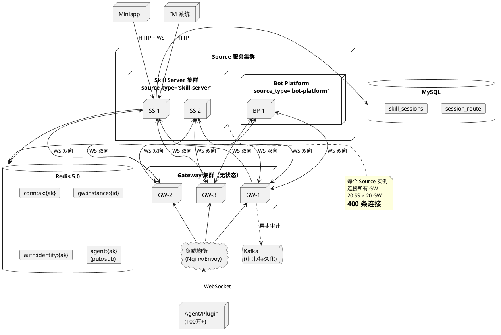
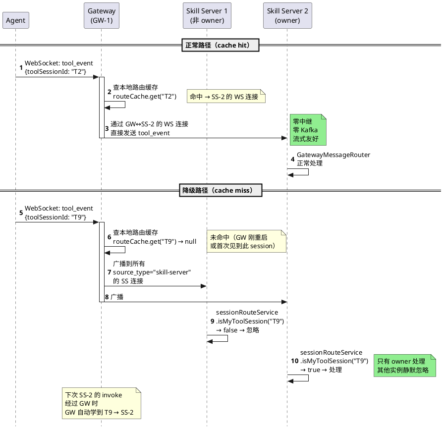
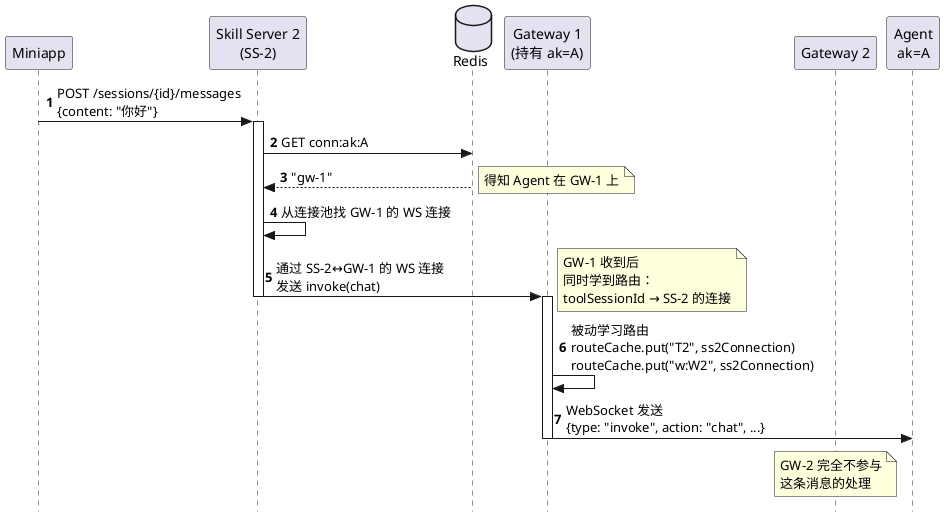
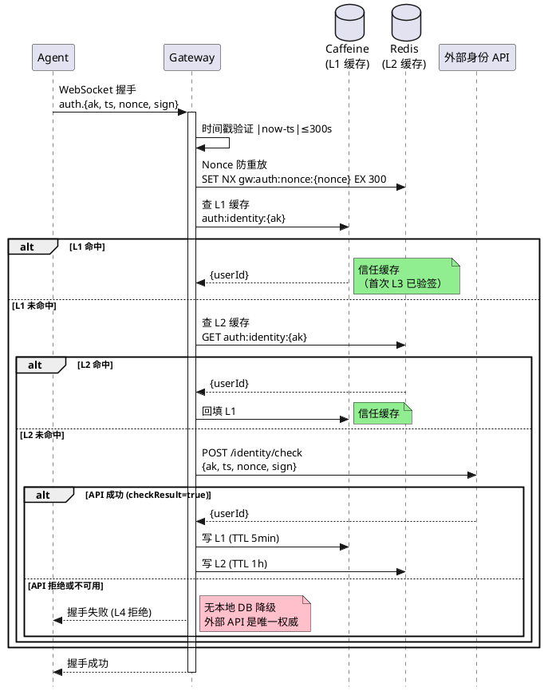
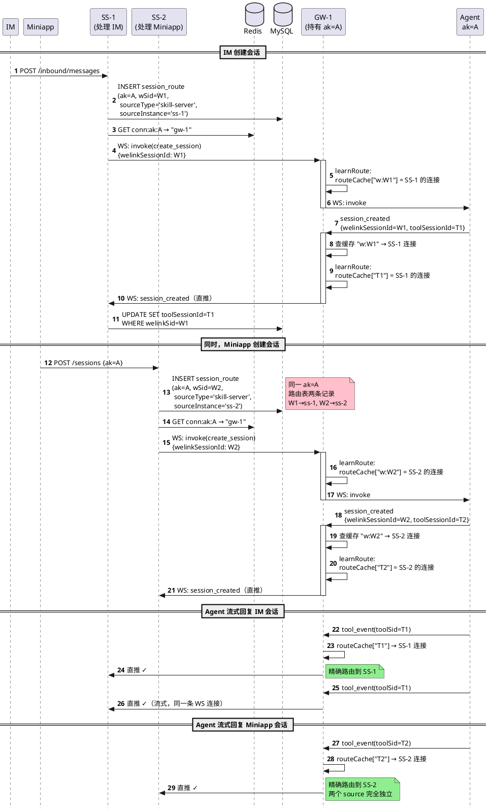
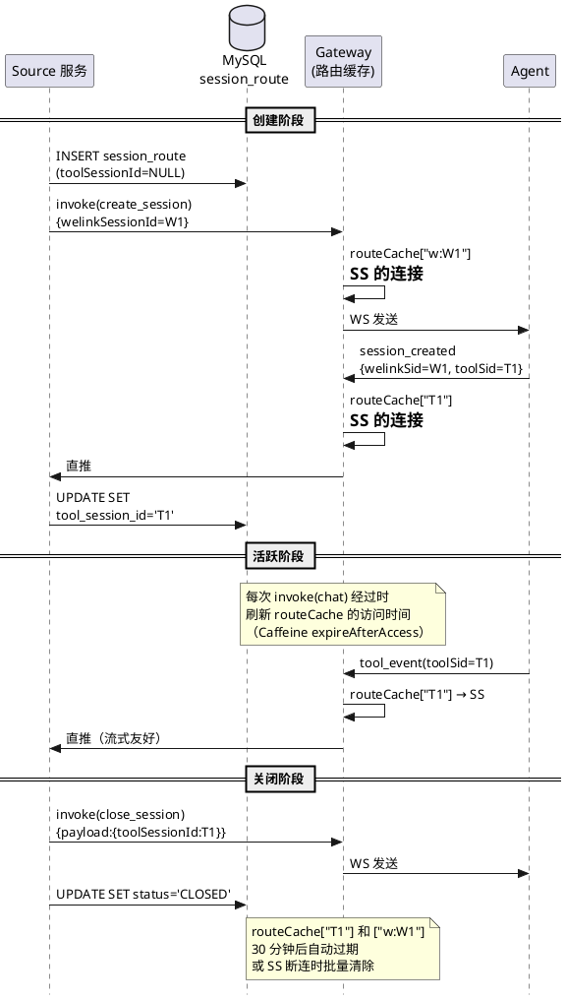
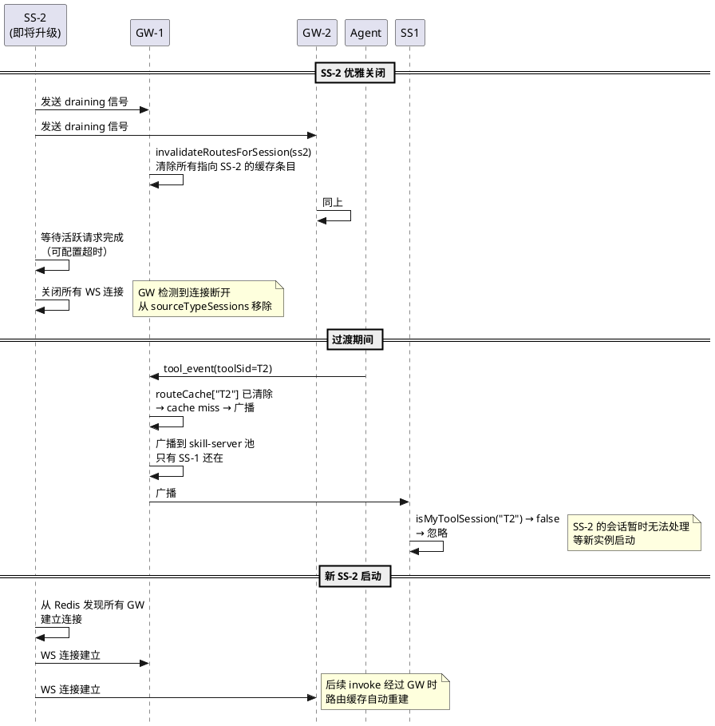
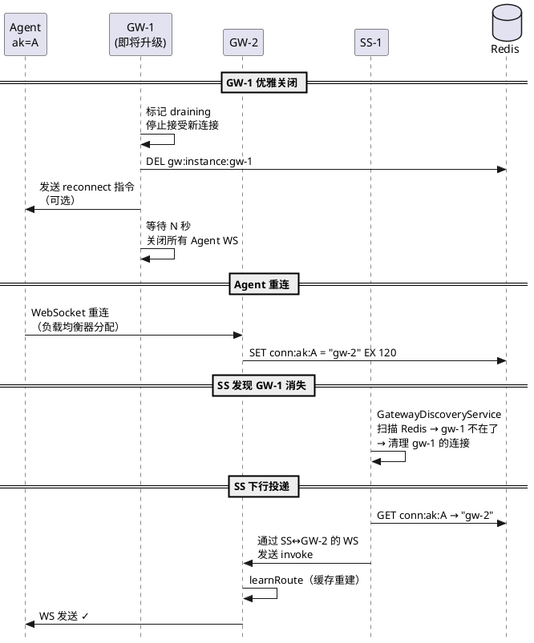

# Gateway 路由架构重设计方案 v3.1

> 最终方案：WebSocket 全连接网格 + 被动路由学习 + 广播降级 + Mesh/Legacy 双策略兼容
>
> v3.1 更新（2026-03-22）：对齐代码实现，修正路由缓存、Redis 操作、发现机制、条件删除、认证等描述

## 一、当前架构问题总结

| #   | 问题                 | 根因                               | 影响                 |
| --- | ------------------ | -------------------------------- | ------------------ |
| 1   | AK→Source 1:1 覆盖   | `gw:agent:source:{ak}` 简单 SET    | 多 Source 并发时上行路由错乱 |
| 2   | Redis pub/sub 不持久化 | 订阅者不在线消息直接丢失                     | Gateway/SS 重启时消息丢失 |
| 3   | 跨实例中继脆弱            | `gw:relay:{instanceId}` pub/sub  | 目标 GW 不在线消息无重试     |
| 4   | Gateway 有状态        | 内存 Map + owner 选举 + 心跳 TTL       | 重启丢状态、竞态窗口         |
| 5   | SS 只连一个 GW         | `GatewayWSClient` 硬编码单 URL       | 该 GW 挂了全断          |
| 6   | source 维度太粗        | 所有 SS 共用 `source="skill-server"` | 无法区分 SS 实例         |
| 7   | 认证依赖本地 DB          | `ak_sk_credential` 表应废弃          | 需改为外部 API          |

## 二、业界方案对标

经调研 14 个项目/产品（详见 `industry-routing-research.md`），业界主流 4 种路由流派：

| 流派 | 代表 | 是否适合 | 原因 |
|------|------|---------|------|
| Redis 查表 + 定向推送 | OpenIM、知乎 | **最合适** | 点对点精确路由 |
| 广播 + 本地过滤 | Centrifugo、Slack | 部分采纳 | 用作 cache miss 降级 |
| 分片路由 | Discord | 不适合 | 适合群组场景 |
| Erlang 集群路由 | WhatsApp | 不适合 | 技术栈不匹配 |

**我们的方案融合了前两种**：正常路径用"查表直推"（OpenIM 模式），cache miss 时降级为"广播过滤"（Centrifugo 模式）。

## 三、新架构设计

### 3.1 整体拓扑



### 3.2 核心设计原则

| 原则 | 说明 |
|------|------|
| **Gateway 只管连接** | 不查路由表、不查 MySQL、不维护 source 映射 |
| **被动学习路由** | GW 从下行 invoke 经过时自动学习 toolSessionId → SS 连接 |
| **广播降级自愈** | Cache miss 时广播到同 source_type 所有 SS，只有 owner 处理 |
| **全连接网格** | 每个 Source 实例连接所有 GW 实例，消息直推无中继 |
| **Mesh/Legacy 双策略** | 新版 SS（带 instanceId）走 Mesh 网格直推，旧版 SS（无 instanceId）走 Legacy Owner 选举 |
| **Kafka 非关键路径** | 仅用于审计/持久化/回放，不在流式热路径上（尚未实现） |
| **Plugin 零改动** | 协议完全不变 |

### 3.3 Mesh/Legacy 双策略（代码实现）

原方案假设所有 SS 都支持 Mesh 模式（带 instanceId 连接全部 GW）。实际实现中，为兼容旧版 SS（不带 instanceId），Gateway 侧引入了策略模式：

**策略接口：`SkillRelayStrategy`**

```java
public interface SkillRelayStrategy {
    String LEGACY = "legacy";
    String MESH = "mesh";
    String STRATEGY_ATTR = "relayStrategy";

    void registerSession(WebSocketSession session);
    void removeSession(WebSocketSession session);
    boolean relayToSkill(GatewayMessage message);
    void handleInvokeFromSkill(WebSocketSession session, GatewayMessage message);
    int getActiveConnectionCount();
}
```

**策略选择（`SkillRelayService.registerSourceSession()`）：**

| SS 握手 payload | 策略 | 行为 |
|----------------|------|------|
| 有 `instanceId` 字段 | **Mesh** | 注册到 `sourceTypeSessions` 连接池，路由缓存+广播降级 |
| 无 `instanceId` 字段 | **Legacy** | 委托 `LegacySkillRelayStrategy`，使用 Owner 心跳 + Rendezvous Hash + Redis 中继 |

**Legacy 策略核心机制（`LegacySkillRelayStrategy`）：**
- `sourceSessions: Map<String, Map<String, WebSocketSession>>` — source → {linkId → session}
- `defaultLinkIds: Map<String, AtomicReference<String>>` — 每个 source 的默认连接选择
- Owner 心跳：每 `owner-heartbeat-interval-seconds`（默认 10s）刷新，TTL `owner-ttl-seconds`（默认 30s）
- Rendezvous Hash：多 GW 实例时选择 owner
- Redis 中继：非 owner GW 通过 `gw:relay:{instanceId}` pub/sub 转发消息

**上行路由优先级（`SkillRelayService.relayToSkill()`）：**
1. 查本地路由缓存（Mesh 连接池）
2. 广播到同 source_type 所有 Mesh SS（cache miss 时）
3. 委托 Legacy 策略（如有 Legacy SS 连接）

### 3.4 组件职责变化表

| 组件 | 当前职责 | 新职责 | 变化 |
|------|---------|--------|------|
| **Gateway** | 连接管理 + 路由决策 + Redis pub/sub 中继 + owner 选举 | 连接管理 + Mesh/Legacy 双策略 + 被动路由缓存 + 直推/广播 | 大幅简化（Mesh 路径） |
| **Source 服务** | 连单个 GW + 通过 WS 收发 | 连所有 GW（Mesh）或连单个 GW（Legacy）+ 查 conn:ak 精确下行 + ownership 检查 | 连接管理增强 |
| **Redis** | pub/sub 中继 + 路由表 + owner 心跳 | conn:ak 注册 + GW 实例注册 + agent:{ak} pub/sub（保留）+ gw:agent:user:{ak}（保留）+ Legacy owner 心跳 | 渐进简化 |
| **MySQL** | Agent 连接记录 + 会话管理 | + session_route 路由表 | 小增 |
| **Kafka** | 无 | 异步审计/持久化（非关键路径，尚未实现） | 新增（可选） |

---

## 四、上行消息流（Agent → Source 服务）

### 4.1 完整流程



### 4.2 Gateway 投递逻辑

```java
// SkillRelayService.relayToSkill() 伪代码
public boolean relayToSkill(GatewayMessage message) {
    String toolSessionId = message.getToolSessionId();

    // 1. 查本地路由缓存
    if (toolSessionId != null) {
        WebSocketSession target = routeCache.get(toolSessionId);
        if (target != null && target.isOpen()) {
            sendToSession(target, message);  // 直推
            return true;
        }
    }

    // 2. 尝试 welinkSessionId 缓存
    String welinkSessionId = message.getWelinkSessionId();
    if (welinkSessionId != null) {
        WebSocketSession target = routeCache.get("w:" + welinkSessionId);
        if (target != null && target.isOpen()) {
            sendToSession(target, message);
            return true;
        }
    }

    // 3. Cache miss → 广播到同 source_type 所有 SS
    String sourceType = resolveSourceType(message);
    Map<String, WebSocketSession> pool = sourceTypeSessions.get(sourceType);
    if (pool == null || pool.isEmpty()) {
        log.warn("No source instances for type: {}", sourceType);
        return false;
    }
    for (WebSocketSession ss : pool.values()) {
        if (ss.isOpen()) {
            sendToSession(ss, message);
        }
    }
    return true;
}
```

### 4.3 Source 服务消费逻辑（广播降级时）

```java
// GatewayMessageRouter.route() 中增加 ownership 检查
public void route(String type, String ak, String userId, JsonNode node) {
    String sessionId = resolveSessionId(type, node);

    // 广播降级时的 ownership 检查
    if (sessionId != null && !sessionRouteService.isMySession(sessionId)) {
        log.debug("Ignoring broadcast message: sessionId={} not owned by this instance", sessionId);
        return;  // 静默忽略，不是我的会话
    }

    // 原有路由逻辑不变
    switch (type) {
        case "tool_event" -> handleToolEvent(sessionId, userId, node);
        // ...
    }
}
```

### 4.4 resolveSourceType 逻辑

Gateway 需要知道上行消息应该广播到哪个 source_type 的连接池。获取方式：

```
优先级 1: message.source（GW 注入，来自下行 invoke 时学到的值）
优先级 2: 路由缓存中 toolSessionId → SS 连接 → 该连接绑定的 source_type
优先级 3: 广播到所有 source_type（最终 fallback，仅极端 cache miss）
```

---

## 五、下行消息流（Source 服务 → Agent）

### 5.1 完整流程



### 5.2 conn:ak 注册表设计

**Redis Key：**

```
Key:    conn:ak:{ak}
Value:  gatewayInstanceId（简单字符串）
TTL:    120s（Agent 心跳每 30s 刷新）
```

**生命周期：**

| 事件 | 操作 | 方法 |
|------|------|------|
| Agent 注册成功 | `SET conn:ak:{ak} {instanceId} EX 120` | `AgentWebSocketHandler.handleRegister()` |
| Agent 心跳 | `EXPIRE conn:ak:{ak} 120` | `AgentWebSocketHandler.handleHeartbeat()` |
| Agent 断开 | 条件删除（仅删本实例注册的） | `AgentWebSocketHandler.afterConnectionClosed()` |

**条件删除逻辑（防止误删重连到其他 GW 的 Agent）：**

使用 Lua 原子脚本实现 CAS 删除，消除 GET+compare+DELETE 之间的 TOCTOU 竞态：

```java
// RedisMessageBroker.conditionalRemoveConnAk() — 实际实现
private static final DefaultRedisScript<Long> CONDITIONAL_DELETE_SCRIPT =
    new DefaultRedisScript<>(
        "if redis.call('GET', KEYS[1]) == ARGV[1] then " +
            "return redis.call('DEL', KEYS[1]) " +
        "else " +
            "return 0 " +
        "end",
        Long.class);

public void conditionalRemoveConnAk(String ak, String expectedInstanceId) {
    redisTemplate.execute(CONDITIONAL_DELETE_SCRIPT,
        List.of("conn:ak:" + ak), expectedInstanceId);
}
```

> 若 `conn:ak:{ak}` 的值不等于 `expectedInstanceId`，说明 Agent 已重连到其他 GW，不删。

### 5.3 Source 服务下行投递

```java
// GatewayRelayService.sendInvokeToGateway() 伪代码
public void sendInvokeToGateway(InvokeCommand command) {
    // 1. 查 Redis 获取 Agent 所在的 GW 实例
    String gwInstanceId = redis.get("conn:ak:" + command.ak());

    if (gwInstanceId != null) {
        // 2. 从连接池找到该 GW 的 WS 连接，精确发送
        boolean sent = gatewayWSClient.sendToGateway(gwInstanceId, buildMessage(command));
        if (sent) return;
        // 发送失败（连接断了）→ fallback 广播
    }

    // 3. Fallback: 广播到所有 GW 连接
    gatewayWSClient.broadcastToAllGateways(buildMessage(command));
}
```

### 5.4 GW 被动路由学习

当 invoke 从 SS 经过 GW 时，GW 自动学习路由：

```java
// SkillWebSocketHandler.handleTextMessage() 中
if (message.isType("invoke")) {
    // 从 payload 提取 toolSessionId
    String toolSessionId = extractToolSessionIdFromPayload(message);
    String welinkSessionId = message.getWelinkSessionId();
    WebSocketSession ssConnection = session;  // 就是发来这条 invoke 的 SS 连接

    skillRelayService.learnRoute(toolSessionId, welinkSessionId, ssConnection);
}
```

```java
// SkillRelayService.learnRoute()
public void learnRoute(String toolSessionId, String welinkSessionId, WebSocketSession ssSession) {
    if (toolSessionId != null && !toolSessionId.isBlank()) {
        routeCache.put(toolSessionId, ssSession);
    }
    if (welinkSessionId != null && !welinkSessionId.isBlank()) {
        routeCache.put("w:" + welinkSessionId, ssSession);
    }
}
```

### 5.5 投递失败的重试与降级

| 场景 | 处理 |
|------|------|
| conn:ak miss（Agent 不在线） | 记录日志，不重试（Agent 不在线消息本来就送不到） |
| conn:ak 指向的 GW 连接断了 | Fallback 广播到所有 GW |
| 广播后所有 GW 都没有该 Agent | 记录日志，Agent 确实不在线 |
| SS 到 GW 的 WS 连接全断 | 等待 `GatewayDiscoveryService` 重建连接 |

---

## 六、路由缓存详解

### 6.1 缓存结构

```java
// GW 侧 SkillRelayService 内部（实际实现）
// toolSessionId → SS 的 WebSocket 连接
// "w:" + welinkSessionId → SS 的 WebSocket 连接
private final Map<String, WebSocketSession> routeCache = new ConcurrentHashMap<>();

// 定时清理（每 5 分钟），驱逐已关闭连接的条目
@Scheduled(fixedDelay = 300_000)
public void evictStaleRouteCache() {
    List<String> staleKeys = new ArrayList<>();
    for (Map.Entry<String, WebSocketSession> entry : routeCache.entrySet()) {
        if (!entry.getValue().isOpen()) {
            staleKeys.add(entry.getKey());
        }
    }
    staleKeys.forEach(routeCache::remove);
}
```

> **设计决策**：使用 ConcurrentHashMap + 定时清理替代 Caffeine，理由：
> 1. 减少外部依赖
> 2. 路由条目生命周期与 SS WebSocket 连接绑定，连接断开时批量清除（`removeSourceSession`），无需 expireAfterAccess
> 3. 定时清理兜底防止内存泄漏（每 5 分钟扫描一次已关闭连接）

### 6.2 缓存写入时机

| 时机 | 写入的 key | 来源 |
|------|-----------|------|
| 下行 invoke(create_session) 经过 GW | `w:{welinkSessionId}` → SS 连接 | invoke 消息的 welinkSessionId |
| 下行 invoke(chat/close/abort/...) 经过 GW | `{toolSessionId}` → SS 连接 | invoke payload 中的 toolSessionId |
| 上行 session_created 经过 GW | `{toolSessionId}` → SS 连接 | session_created 消息的 toolSessionId（通过 welinkSessionId 缓存找到 SS 连接） |

### 6.3 缓存失效

| 场景 | 处理 |
|------|------|
| SS 连接断开 | `removeSourceSession()` 中遍历 routeCache 移除所有指向该连接的条目 |
| 定时清理（每 5 分钟） | `evictStaleRouteCache()` 扫描 routeCache，驱逐 `!session.isOpen()` 的条目 |
| 会话关闭 | 下行 invoke(close_session) 经过时可选主动清除 |
| 全量清除 | `routeCache.clear()` — 仅在异常场景下调用 |

### 6.4 缓存容量估算

```
100 万 Agent × 平均 2 个活跃会话 = 200 万活跃会话
每个会话 2 个缓存条目（toolSessionId + welinkSessionId）= 400 万条

分布在 20 个 GW 实例上 → 每个 GW 约 20 万条
ConcurrentHashMap 无固定上限，但连接断开时批量清除 + 定时清理兜底，
实际内存占用远低于活跃会话峰值

每条约 100 bytes（key 64B + value 引用 36B）→ 20 万条 ≈ 20MB 内存
```

---

## 七、服务发现

### 7.1 GW 实例注册

```
GW 启动时（@PostConstruct register()）：
  SET gw:instance:{instanceId}
      '{"wsUrl":"ws://10.0.1.5:8081/ws/skill","startedAt":"2026-03-21T10:00:00Z","lastHeartbeat":"2026-03-21T10:00:00Z"}'
      EX 30

每 10 秒刷新（@Scheduled refreshHeartbeat()）：
  SET gw:instance:{instanceId}
      '{"wsUrl":"...","startedAt":"...","lastHeartbeat":"<当前时间>"}'
      EX 30
  注意：每次刷新重写完整 JSON（使用 ObjectMapper 序列化），不是仅 EXPIRE

优雅关闭时（@PreDestroy destroy()）：
  DEL gw:instance:{instanceId}
```

### 7.2 Source 服务发现 GW

```java
// GatewayDiscoveryService（SS 侧）— 实际实现
// 使用 Listener 回调模式解耦发现与连接管理

public interface Listener {
    void onGatewayAdded(String instanceId, String wsUrl);
    void onGatewayRemoved(String instanceId);
}

private final Set<String> knownInstanceIds = ConcurrentHashMap.newKeySet();  // 线程安全
private final List<Listener> listeners = new CopyOnWriteArrayList<>();

public void discover() {
    // 1. SCAN Redis（不用 KEYS，避免阻塞）
    Map<String, String> discovered = redisMessageBroker.scanGatewayInstances();
    //   ↑ 内部使用 ScanOptions.scanOptions().match("gw:instance:*").count(100)
    Set<String> discoveredIds = discovered.keySet();

    // 2. 新增的 → 通知 listener
    for (String id : discoveredIds) {
        if (knownInstanceIds.add(id)) {
            String wsUrl = extractWsUrl(discovered.get(id));
            listeners.forEach(l -> l.onGatewayAdded(id, wsUrl));
        }
    }

    // 3. 消失的 → 通知 listener
    Set<String> removed = new HashSet<>(knownInstanceIds);
    removed.removeAll(discoveredIds);
    for (String id : removed) {
        knownInstanceIds.remove(id);
        listeners.forEach(l -> l.onGatewayRemoved(id));
    }
}
```

`GatewayWSClient` 实现 `GatewayDiscoveryService.Listener` 接口，在 `onGatewayAdded` 中建连，`onGatewayRemoved` 中断连。

**Seed 连接兼容**：配置 `skill.gateway.ws-url` 可指定种子 GW URL（用于未注册 `gw:instance:*` 的旧版 GW）。当发现的 GW wsUrl 与种子 URL 匹配时，自动提升种子连接为命名连接，避免重复建连。

### 7.3 SS 实例标识

SS 连接 GW 时，在 auth payload 中传入自身实例 ID 和 source_type：

```json
{
  "token": "sk-intl-9f2a7d3e4b1c",
  "source": "skill-server",
  "instanceId": "ss-az1-pod-2"
}
```

GW 在 handshake 时提取并存入 session attributes，用于：
- 有 `instanceId` → 注册到 Mesh `sourceTypeSessions` 连接池
- 无 `instanceId` → 注册到 Legacy `sourceSessions` 连接池
- 路由缓存关联

**SS 侧连接管理（`GatewayWSClient`）：**
- `gwConnections: ConcurrentHashMap<String, GwConnection>` — 按 instanceId 管理多连接
- 重连使用 `computeIfPresent()` 原子操作避免并发问题
- 指数退避重连：初始 1s（`reconnect-initial-delay-ms`），最大 30s（`reconnect-max-delay-ms`）
- Discovery 触发由 `GatewayWSClient` 实现 `GatewayDiscoveryService.Listener` 接口
- 定时触发：`@Scheduled(fixedDelayString="${skill.gateway.discovery-interval-ms:10000}")`

---

## 八、认证流程改造

> **实现状态：✅ 已实现。** `AkSkAuthService` 已改为五级降级认证架构。
> 外部 API 通过配置 `gateway.auth.identity-api.base-url` 启用；未配置时自动降级到本地 DB。

### 8.0 本地调试开关

配置 `gateway.auth.skip-verification=true` 可跳过全部认证校验（时间窗口、Nonce、外部 API），直接以 AK 作为 userId 放行。

```yaml
gateway:
  auth:
    skip-verification: ${AUTH_SKIP_VERIFICATION:false}  # 生产环境必须为 false
```

> 启动时打印警告日志：`⚠ Auth verification DISABLED`。`ak` 为 null 时仍然拒绝。

### 8.1 外部 API 认证



### 8.2 外部 API 调用

```
POST /appstore/wecodeapi/open/identity/check
Authorization: Bearer {internal-token}

请求体：
{
  "ak": "agent-access-key",
  "timestamp": 1710000000,
  "nonce": 123455,
  "sign": "Base64(HMAC-SHA256)"
}

响应体（成功）：
{
  "code": "200",
  "messageZh": "成功",
  "messageEn": "success",
  "data": {
    "checkResult": true,
    "userId": "x12345677"
  }
}

响应体（失败）：
{
  "code": "401",
  "messageZh": "签名验证失败",
  "data": { "checkResult": false }
}
```

### 8.3 降级策略

| 级别 | 条件 | 行为 | 状态 |
|------|------|------|------|
| L1 | Caffeine 命中 | 信任缓存的 userId（TTL 5min，上限 10000 条） | ✅ 已实现 |
| L2 | Redis 命中 | 信任缓存的 userId，回填 L1（TTL 1h，Key: `auth:identity:{ak}`） | ✅ 已实现 |
| L3 | 外部 API 正常 | 调 API，服务端验签，成功后回填 L1+L2 | ✅ 已实现 |
| L4 | 均未命中 | 拒绝认证 | ✅ 已实现 |

> **设计决策**：
> - 已移除本地 `ak_sk_credential` 表查询，外部 API 是唯一的身份权威来源
> - L1/L2 缓存命中时信任 userId、不再本地验签（签名已在首次 L3 调用时由外部 API 验证）
> - 安全性由时间窗口（±5min）+ Nonce 唯一性 + 缓存 TTL 三重保证
> - L3 外部 API 明确拒绝（`checkResult=false`）时直接拒绝
> - L3 外部 API 不可用（网络/超时）时也直接拒绝（不再降级到本地 DB）
> - 外部 API 未配置（`base-url` 留空）时所有认证请求被拒绝

---

## 九、数据模型

### 9.1 session_route 表（新增，skill_db 库）

```sql
CREATE TABLE session_route (
  id                BIGINT       PRIMARY KEY COMMENT '= welink_session_id（复用 SkillSession 的 Snowflake ID 作为主键）',
  ak                VARCHAR(64)  NOT NULL    COMMENT 'Agent Access Key',
  welink_session_id BIGINT       NOT NULL    COMMENT 'SkillSession.id',
  tool_session_id   VARCHAR(128) NULL        COMMENT 'OpenCode 侧会话 ID（session_created 后回填）',
  source_type       VARCHAR(32)  NOT NULL    COMMENT '来源服务类型: skill-server, bot-platform 等',
  source_instance   VARCHAR(128) NOT NULL    COMMENT '来源实例 ID: ss-az1-pod-2',
  user_id           VARCHAR(128) NOT NULL    COMMENT '会话所有者',
  status            VARCHAR(16)  NOT NULL    DEFAULT 'ACTIVE' COMMENT 'ACTIVE/CLOSED',
  created_at        DATETIME     NOT NULL    DEFAULT CURRENT_TIMESTAMP,
  updated_at        DATETIME     NOT NULL    DEFAULT CURRENT_TIMESTAMP ON UPDATE CURRENT_TIMESTAMP,

  UNIQUE INDEX uk_welink_source (welink_session_id, source_type),
  INDEX idx_tool_session (tool_session_id),
  INDEX idx_ak_status (ak, status),
  INDEX idx_source_instance (source_instance, status)
) ENGINE=InnoDB DEFAULT CHARSET=utf8mb4;
```

### 9.2 与 skill_sessions 的关系

```
skill_sessions: 会话的业务数据（标题、状态、消息等）
session_route:  会话的路由数据（属于哪个 source 的哪个实例）

关系: session_route.welink_session_id = skill_sessions.id (1:1)
区别: skill_sessions 是 Skill Server 内部表，session_route 是路由层新增表
```

**写入时机对比：**

| 事件 | skill_sessions | session_route |
|------|---------------|---------------|
| 创建会话 | INSERT（所有字段） | INSERT（toolSessionId=NULL） |
| session_created 回来 | UPDATE toolSessionId | UPDATE tool_session_id |
| 关闭会话 | UPDATE status=CLOSED | UPDATE status=CLOSED |

### 9.3 Redis Key 设计（新旧对照）

**新增的 Key：**

| Key | Value | TTL | 用途 |
|-----|-------|-----|------|
| `conn:ak:{ak}` | `gatewayInstanceId` (String) | 120s | Agent 在哪个 GW 上 |
| `gw:instance:{id}` | `{"wsUrl":"...","startedAt":"...","lastHeartbeat":"..."}` (JSON) | 30s | GW 实例注册 |
| `auth:identity:{ak}` | `{"userId":"...","level":"L3"}` (JSON) | 3600s | 认证缓存 L2（外部 API 验签后回填） |

**保留的 Key：**

| Key | 用途 | 说明 |
|-----|------|------|
| `agent:{ak}` (pub/sub) | Agent 下行消息投递 | 保留（GW 侧 EventRelayService 仍通过 pub/sub 跨实例投递到 Agent） |
| `gw:agent:user:{ak}` | AK→userId 映射 | 保留（认证外部 API 尚未实现，仍需此映射） |
| `auth:nonce:{nonce}` | Nonce 防重放 | 保留不变 |
| `user-stream:{userId}` (pub/sub) | SS→Miniapp 推送 | Skill Server 内部使用，保留不变 |

**Legacy 策略保留的 Key（标记 @Deprecated，Phase 1.3 清理）：**

| Key | 用途 | 说明 |
|-----|------|------|
| `gw:relay:{instanceId}` (pub/sub) | Legacy 跨实例中继 | 仅旧版 SS（无 instanceId）使用 |
| `gw:source:owner:{ownerKey}` | Legacy owner 心跳 | 仅 LegacySkillRelayStrategy 使用 |
| `gw:source:owners:{source}` (set) | 活跃 owner 集合 | 仅 LegacySkillRelayStrategy 使用 |
| `gw:agent:source:{ak}` | Agent→Source 绑定 | 仅 Legacy 策略使用（Mesh 使用路由缓存替代） |

**已实现的认证缓存 Key：**

| Key | Value | TTL | 说明 |
|-----|-------|-----|------|
| `auth:identity:{ak}` | `{"userId":"...","level":"L3"}` | 3600s | L2 Redis 缓存（L3 外部 API 验签后回填） |

### 9.4 关于 agent:{ak} pub/sub 的说明

**当前状态：仍在使用。**

当前下行路径：SS → WS → GW → `EventRelayService.relayToAgent()` → Redis PUBLISH `agent:{ak}` → GW subscriber → WS → Agent

`agent:{ak}` pub/sub 仍然是 GW 侧 `EventRelayService` 将消息投递到 Agent 的核心机制。即使 SS 通过 `conn:ak` 精确选择了正确的 GW WS 连接，GW 收到消息后仍通过 Redis pub/sub 路由到本地 Agent 连接。

**理论上可以优化为本地直推**（GW 直接查 `agentSessions` Map），但当前实现选择保留 pub/sub 以保持代码简洁和向后兼容。计划在 Phase 2 确认稳定后移除。

---

## 十、1:N Source 精确路由（核心场景）

### 10.1 场景时序图

一个 AK 同时被两个不同的 SS 实例使用（IM 会话在 SS-1，Miniapp 会话在 SS-2）：



### 10.2 路由表生命周期



---

## 十一、容灾与可靠性

### 11.1 SS 滚动升级



### 11.2 GW 滚动升级



### 11.3 SS 扩容

```
1. 新 SS-3 启动
2. GatewayDiscoveryService 扫描 Redis → 发现所有 GW 实例
3. 连接所有 GW（GW-1, GW-2, GW-3）
4. GW 将 SS-3 加入 sourceTypeSessions["skill-server"] 池
5. 新会话创建在 SS-3 → invoke 经过 GW → GW 学到路由
6. 完成，无需人工干预
```

### 11.4 GW 扩容

```
1. 新 GW-4 启动
2. SET gw:instance:gw-4 到 Redis
3. 所有 SS 的 GatewayDiscoveryService 下次扫描时发现 GW-4
4. 各 SS 建立到 GW-4 的 WS 连接
5. 负载均衡器将部分 Agent 分配到 GW-4
6. Agent 连接 GW-4 → conn:ak 更新
7. GW-4 缓存为空 → 广播降级 → 自动学习 → 正常工作
```

### 11.5 Kafka 审计（可选，Phase 3）

```
Gateway 在处理上行消息时：
  1. 直推到目标 SS（主路径，同步）
  2. 异步写 Kafka upstream-events（fire-and-forget，不阻塞）

用途：
  - 事件审计和分析
  - SS 重启后可从 Kafka 回放错过的事件
  - 监控和告警
```

---

## 十二、分阶段实施

### Phase 0（准备）— ✅ 已完成
- session_route 表 DDL（V7 迁移）
- Redis Key 规范定义
- 配置项设计

### Phase 1（Gateway 侧）— ✅ 已完成
- 1.1 ✅ GatewayInstanceRegistry — GW 实例注册到 Redis
- 1.2 ✅ GatewayMessage — 添加 gatewayInstanceId 字段 + withGatewayInstanceId/withoutRoutingContext
- 1.3 ✅ SkillRelayService **重写** — Mesh 多 SS 连接池 + 路由缓存 + 广播降级 + Legacy 策略兼容
- 1.4 ✅ SkillWebSocketHandler — 支持 instanceId + 路由学习
- 1.5 ⚠️ EventRelayService — 保留 agent:{ak} pub/sub（未完全改为直推）
- 1.6 ✅ AgentWebSocketHandler — conn:ak 注册 + Lua 原子条件删除
- 1.7 ⚠️ RedisMessageBroker — 新增 conn:ak/scanGateway 方法，Legacy 方法标记 @Deprecated 但未移除
- 1.8 ✅ AkSkAuthService — 四级认证：L1 Caffeine + L2 Redis + L3 外部 API + L4 拒绝（已移除本地 DB 查表）

### Phase 2（Skill Server 侧）— ✅ 已完成
- 2.1 ✅ GatewayDiscoveryService — SCAN 定时发现 + Listener 回调模式
- 2.2 ✅ GatewayWSClient **重写** — ConcurrentHashMap 连接池 + seed 连接兼容 + computeIfPresent 重连
- 2.3 ✅ SessionRouteService + Repository — session_route CRUD（id=welinkSessionId）
- 2.4 ✅ GatewayRelayService **重写** — 查 conn:ak 精确投递 + broadcastToAllGateways fallback
- 2.5 ✅ GatewayMessageRouter — ownership 检查（isMySession/isMyToolSession）

### Phase 3（可选）— ❌ 未开始
- Kafka 异步审计
- SS 重启回放

### Phase 4（可选）— ❌ 未开始
- Connection Draining
- 消息序号 seq + 断线补齐
- 一致性哈希接入
- ~~外部认证 API + 二级缓存~~ （已在 Phase 1.8 实现）

---

## 十三、代码改动清单

### Gateway 侧 (`ai-gateway/`)

| 文件 | 改动类型 | 状态 | TDD 测试类 |
|------|---------|------|-----------|
| `service/SkillRelayService.java` | **重写** — Mesh 连接池 + 路由缓存 + 广播降级 | ✅ | `SkillRelayServiceTest` |
| `service/SkillRelayStrategy.java` | **新增** — 策略接口 (Mesh/Legacy) | ✅ | — |
| `service/LegacySkillRelayStrategy.java` | **新增** — Legacy 策略 (owner+Rendezvous+relay) | ✅ | `LegacySkillRelayStrategyTest` |
| `service/EventRelayService.java` | 改造 — 保留 pub/sub，新增 conn:ak 绑定 | ⚠️ | `EventRelayServiceTest` |
| `service/RedisMessageBroker.java` | 增强 — 新增 conn:ak/scan 方法，Legacy 方法 @Deprecated | ⚠️ | `RedisMessageBrokerTest` |
| `ws/SkillWebSocketHandler.java` | 改造 — instanceId 解析 + 路由学习 | ✅ | `SkillWebSocketHandlerTest` |
| `ws/AgentWebSocketHandler.java` | 改造 — conn:ak 注册 + Lua 条件删除 | ✅ | `AgentWebSocketHandlerTest` |
| `model/GatewayMessage.java` | 小改 — gatewayInstanceId 字段 | ✅ | `GatewayMessageTest` |
| `service/AkSkAuthService.java` | **重写** — 四级认证 (L1 Caffeine + L2 Redis + L3 外部 API + L4 拒绝) | ✅ | `AkSkAuthServiceTest` |
| `service/IdentityApiClient.java` | **新增** — 外部身份校验 API 客户端 | ✅ | `IdentityApiClientTest` |
| `service/GatewayInstanceRegistry.java` | **新增** | ✅ | `GatewayInstanceRegistryTest` |

### Skill Server 侧 (`skill-server/`)

| 文件 | 改动类型 | 状态 | TDD 测试类 |
|------|---------|------|-----------|
| `ws/GatewayWSClient.java` | **重写** — ConcurrentHashMap 连接池 + seed 兼容 | ✅ | `GatewayWSClientTest` |
| `service/GatewayRelayService.java` | **重写** — conn:ak 精确投递 + broadcast fallback | ✅ | `GatewayRelayServiceTest` |
| `service/GatewayMessageRouter.java` | 改造 — ownership 检查 | ✅ | `GatewayMessageRouterTest` |
| `service/SessionRouteService.java` | **新增** | ✅ | `SessionRouteServiceTest` |
| `service/GatewayDiscoveryService.java` | **新增** — SCAN + Listener 模式 | ✅ | `GatewayDiscoveryServiceTest` |
| `service/RedisMessageBroker.java` | 增强 — 新增 scanGatewayInstances + getConnAk | ✅ | — |
| `repository/SessionRouteRepository.java` | **新增** | ✅ | — |
| `model/SessionRoute.java` | **新增** | ✅ | — |
| `resources/mapper/SessionRouteMapper.xml` | **新增** | ✅ | — |
| `resources/db/migration/V7__session_route.sql` | **新增** | ✅ | — |

### Plugin 侧
**无改动。**

---

## 十四、FAQ

### Q1: 广播降级不会造成消息重复吗？
不会。同一条上行消息广播到 N 个 SS 实例，但只有 owner（`sessionRouteService.isMySession()` 返回 true 的实例）会处理，其他实例静默忽略。

### Q2: 连接数 O(N×M) 会不会太多？
Mesh 模式下：20 GW × 20 SS = 400 条 WebSocket 连接。即使扩展到 50×50 = 2500 条，每条 WS 连接开销约 50KB 内存，2500 条 ≈ 125MB 总开销，完全可接受。
Legacy 模式下：旧版 SS 仍为单连接，不参与 N×M 计算。

### Q3: GW 路由缓存一致性怎么保证？
不需要强一致性。路由缓存是「最终一致」的：
- 缓存正确 → 直推（99%+ 的情况）
- 缓存错误/过期 → 广播降级 → SS ownership 检查保证正确性 → GW 重新学习

### Q4: SS 升级期间会话怎么办？
SS 旧实例优雅关闭前发 draining 信号 → GW 清除该 SS 的缓存。过渡期间上行消息 cache miss → 广播 → 只有活跃的 SS 能 claim ownership。新 SS 启动后连接 GW，新 invoke 经过时缓存重建。

### Q5: Plugin 需要改吗？
不需要。Plugin 仍通过 WebSocket 连接 Gateway，协议完全不变。Gateway 侧的所有改动对 Plugin 透明。

### Q6: 为什么不用 Kafka 做上行？
Kafka partition by AK → 同一 AK 消息被一个 SS 消费 → 但该 AK 的不同会话可能在不同 SS 实例上 → 需要内部转发 → 流式事件用 HTTP/gRPC 转发开销大。全连接网格 + 被动学习方案直接把消息推到正确的 SS，零转发。

### Q7: 为什么不用 HTTP 做下行？
SS 已经和所有 GW 有 WS 连接，直接通过 WS 发送即可。无需引入额外的 HTTP 调用。WS 是双向的，上行和下行共用同一条连接。

### Q8: 新 source_type 如何接入？
1. 部署新服务（如 `bot-platform`）
2. 配置 auth token 和 `source_type`
3. 新服务启动 → 发现所有 GW → 建立 WS 连接（`source_type=bot-platform`，带 `instanceId`）
4. GW 自动将其注册到 Mesh `sourceTypeSessions["bot-platform"]` 池
5. 路由、广播、缓存全部自动生效

### Q9: 为什么需要 Legacy 策略？不能强制所有 SS 升级吗？
滚动升级期间可能存在新旧版 SS 共存的窗口。Legacy 策略确保旧版 SS（不带 instanceId 的握手 payload）仍能正常工作，无需强制同时升级所有 SS 实例。GW 在握手阶段自动判断策略，零配置。

### Q10: 路由缓存用 ConcurrentHashMap 不怕内存泄漏吗？
三重防护：
1. SS 连接断开时批量清除所有指向该连接的缓存条目（`removeSourceSession`）
2. 定时清理（每 5 分钟）驱逐已关闭连接的条目（`evictStaleRouteCache`）
3. 会话正常关闭时 invoke(close_session) 经过时可选主动清除

### Q11: conditionalRemoveConnAk 为什么用 Lua 而不是 GET+DELETE？
GET+compare+DELETE 三步操作存在 TOCTOU（Time-of-check to Time-of-use）竞态：在 GET 和 DELETE 之间，Agent 可能已重连到其他 GW 并更新了 `conn:ak` 的值。Lua 脚本在 Redis 单线程中原子执行，保证 compare-and-delete 的原子性。
