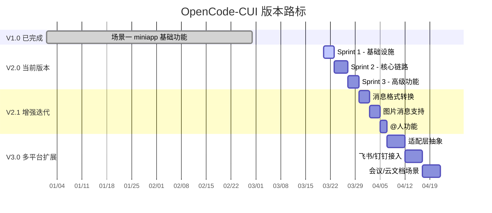

# OpenCode-CUI 版本路标

> 基于 [scope_definition.md](./scope_definition.md)、[architecture_design.md](./architecture_design.md) 和 [detailed_design.md](./detailed_design.md) 产出。

---

## 版本概览



---

## V1.0 — 技能小程序模式（已完成）

> **状态**：✅ 已上线

### 交付内容

| 功能             | 说明                                  |
| ---------------- | ------------------------------------- |
| WS 双向通信      | miniapp ↔ skill-server WebSocket 连接 |
| 会话 CRUD        | 创建/查询/关闭/超时 idle              |
| 消息持久化       | user/assistant/system/tool 全量存储   |
| Gateway 通信     | skill-server ↔ ai-gateway 双向中继    |
| AK 自动解析      | identities/check 接口（部分）         |
| 流式消息广播     | Redis pub/sub → WS push               |
| 群聊发送（手动） | 用户手动触发纯文本 POST 到 IM         |

---

## V2.0 — IM 双向通信（当前版本）

> **状态**：🔧 开发中  
> **预计工期**：10 个工作日  
> **详细计划**：参见 [implementation_plan.md](./implementation_plan.md)

### 核心目标

实现 IM 平台 → skill-server → Agent → IM 平台的完整闭环消息链路，支持群聊和单聊。

### 功能清单

| 功能                  | 说明                                         | Sprint |
| --------------------- | -------------------------------------------- | ------ |
| REST 入站接口         | `POST /api/inbound/messages` 统一接收端点    | S2     |
| Token 认证            | 入站请求 Bearer Token 校验                   | S1     |
| assistantAccount 解析 | assistantAccount → ak + Redis 缓存           | S2     |
| 三元组会话管理        | `domain + session_id + ak` findOrCreate      | S1+S2  |
| IM 出站（双端点）     | 单聊 `app-user-chat` / 群聊 `app-group-chat` | S2     |
| 路由分支              | 按 domain+type 路由到 WS 或 IM               | S2     |
| 群聊上下文注入        | Prompt 模板 + 历史消息组装                   | S3     |
| 持久化策略            | 群聊不持久化，单聊持久化                     | S2     |
| 上下文超限重建        | IM 场景自动重建 + 系统提示                   | S3     |
| DB 三元组改造         | 新增字段 + ENUM→VARCHAR + 数据迁移           | S1     |

### 数据库变更

| 迁移脚本                    | 变更内容                                                                                                                   |
| --------------------------- | -------------------------------------------------------------------------------------------------------------------------- |
| V6__session_chat_triple.sql | 新增 `business_session_domain`/`business_session_type`/`business_session_id`/`assistant_account` + 唯一索引 + ENUM→VARCHAR |

### 新增配置项

```yaml
skill:
  im:
    api-url / token / inbound-token
  assistant:
    resolve-url / cache-ttl-minutes
  context:
    injection-enabled / templates / max-history-messages
  session:
    auto-create-timeout-seconds
```

---

## V2.1 — 消息能力增强（计划中）

> **状态**：📋 计划中  
> **预计工期**：8 个工作日  
> **前置条件**：V2.0 交付

### 功能清单

| 功能                     | 说明                                        | 优先级 |
| ------------------------ | ------------------------------------------- | ------ |
| MessageFormatConverter   | Agent 输出 → IM 格式转换（Markdown→纯文本） | P0     |
| ImOutboundMessage 模型   | 结构化出站消息（含 msgType、imageUrl）      | P0     |
| 图片消息输入             | 接收 IM 图片消息 → Agent 处理               | P1     |
| 图片消息输出             | Agent 图片回复 → IM 图片消息                | P1     |
| @人字段填充              | 群聊回复时填充 IM @mention 字段             | P1     |
| SkillMessage.ContentType | 新增 IMAGE 枚举值                           | P1     |
| V7 迁移脚本              | content_type 扩展（如需 DB 层改动）         | P2     |

### 技术方案要点

- `MessageFormatConverter` 处理 Markdown 去格式化，保持文本可读性
- 图片消息使用 IM 平台的 imageUrl 字段传递
- @人功能需与 IM 平台方确认 @mention API 规格

---

## V3.0 — 多平台扩展（规划中）

> **状态**：📝 规划中  
> **预计工期**：15 个工作日  
> **前置条件**：V2.1 交付

### 核心目标

抽象平台适配层，实现一套核心逻辑接入多个 IM 平台。

### 功能清单

| 功能           | 说明                                         | 优先级 |
| -------------- | -------------------------------------------- | ------ |
| 平台适配器抽象 | `PlatformAdapter` 接口定义入站/出站/认证规范 | P0     |
| 飞书适配器     | 飞书开放 API 对接                            | P1     |
| 钉钉适配器     | 钉钉机器人 API 对接                          | P1     |
| 会议场景       | `domain=meeting` 入站/出站                   | P2     |
| 云文档场景     | `domain=doc` 入站/出站                       | P2     |
| 多租户隔离     | 按 domain 隔离配置和认证                     | P1     |

### 架构设计要点

```
InboundMessage (统一模型)
    ↑
    │ 适配
    ├─ WeLinkAdapter    (V2.0 已有)
    ├─ FeishuAdapter    (V3.0)
    ├─ DingTalkAdapter  (V3.0)
    └─ SlackAdapter     (未来)
    ↓
OutboundMessage (统一模型) → 各平台 Adapter 转换
```

> **三元组设计的前瞻性**：`business_session_domain` 字段使用 VARCHAR 而非 ENUM 存储，  
> V3.0 新增平台时只需添加适配器代码，无需数据库 Schema 变更。

---

## 版本兼容性矩阵

| 版本 | 场景一 miniapp | 场景二 群聊 | 单聊  | 图片  |  @人  | 多平台 |
| ---- | :------------: | :---------: | :---: | :---: | :---: | :----: |
| V1.0 |       ✅        |      ❌      |   ❌   |   ❌   |   ❌   |   ❌    |
| V2.0 |       ✅        |      ✅      |   ✅   |   ❌   |   ❌   |   ❌    |
| V2.1 |       ✅        |      ✅      |   ✅   |   ✅   |   ✅   |   ❌    |
| V3.0 |       ✅        |      ✅      |   ✅   |   ✅   |   ✅   |   ✅    |

---

## 质量门禁

| 版本 | 单元测试覆盖率 |       集成测试        |         性能基线         |
| ---- | :------------: | :-------------------: | :----------------------: |
| V2.0 | ≥ 75% 核心模块 | DB 迁移 + 认证 + 会话 |  入站响应 < 200ms (p95)  |
| V2.1 |     ≥ 80%      |    + 图片/格式转换    |            —             |
| V3.0 |     ≥ 80%      |     + 多平台适配      | 多平台并发 < 500ms (p95) |
